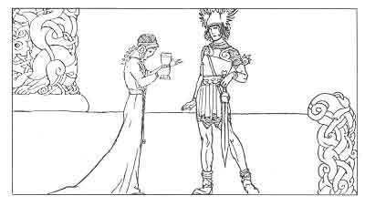

  
[Intangible Textual Heritage](../../../index.md)  [Legends and
Sagas](../../index)  [Iceland](../index)  [Index](index.md) 
[Previous](coo32)  [Next](coo34.md) 

------------------------------------------------------------------------

[Buy this Book at
Amazon.com](https://www.amazon.com/exec/obidos/ASIN/B0025VKZFM/internetsacredte.md)

------------------------------------------------------------------------

  
*The Children of Odin*, by Padraic Colum, \[1920\], at Intangible
Textual Heritage

------------------------------------------------------------------------

p. 250

 

### 7. SIGURD AT THE HOUSE OF THE NIBELUNGS

HE left Hindfell and he came into a kingdom that was ruled over by a
people that were called the Nibelungs as Sigurd's people were called the
Volsungs. Giuki was the name of the King of that land.

Giuki and his Queen and all their sons gave a great welcome to Sigurd
when he came to their hall, for he looked such a one as might win the
name of being the world's greatest hero. And Sigurd went to war beside
the King's sons, Gunnar and Högni, and the three made great names for
themselves, but Sigurd's shone high above the others.

When they came back from that war there were great rejoicings in the
hall of the Nibelungs, and Sigurd's heart

p. 251

was filled with friendship for all the Nibelung race; he had love for
the King's sons, Gunnar and Högni, and with Gunnar and Högni he swore
oaths of brotherhood. Henceforward he and they would be as brethren.
King Giuki had a stepson named Guttorm and he was not bound in the oath
that bound Sigurd and the others in brotherhood.

After the war they had waged Sigurd spent a whole winter in the hall of
the Nibelungs. His heart was full of memories of Brynhild and of
longings to ride to her in the House of Flame and to take her with him
to the kingdom that King Giuki would have given him. But as yet he would
not go back to her, for he had sworn to give his brethren further help.

One day, as he rode by himself, he heard birds talk to each other and he
knew the words they were saying. One said, "There is Sigurd who wears
the wondrous helmet that he took out of Fafnir's hoard." And the other
bird said, "He knows not that by that helmet he can change his shape as
Fafnir changed his shape, and make him look like this creature or that
creature, or this man or that man." And the third bird said, "He knows
not that the helmet can do anything so wonderful for him."

He rode back to the hall of the Nibelungs, and at the supperboard he
told them what he had heard the birds say. He showed them the wondrous
helmet. Also he told them how he had slain Fafnir the Dragon, and of how
he had won the mighty hoard for himself. His two sworn brothers who were
there rejoiced that he had such wondrous possessions.

p. 252

But more precious than the hoard and more wondrous than the helmet was
the memory of Brynhild that he had. But of this he said no word.

Grimhild was the name of the Queen. She was the mother of Gunnar and
Högni and their half-brother Guttorm. And she and the King had one
daughter whose name was Gudrun. Now Grimhild was one of the wisest of
women, and she knew when she looked upon him that Sigurd was the world's
greatest warrior. She would have him belong to the Nibelungs, not only
by the oaths of brotherhood he had sworn with Gunnar and Högni, but by
other ties. And when she heard of the great hoard that was his she had
greater wish and will that he should be one with the Nibelungs. She
looked on the helmet of gold and on the great armring that he wore, and
she made it her heart's purpose that Sigurd should wed with Gudrun, her
daughter. But neither Sigurd nor the maiden Gudrun knew of Grimhild's
resolve.

And the Queen, watching Sigurd closely, knew that he had a remembrance
in his breast that held him from seeing Gudrun's loveliness. She had
knowledge of spells and secret brews (she was of the race of Borghild
whose brew had destroyed Sinfiotli's life) and she knew that she could
make a potion that would destroy the memory Sigurd held.

She mixed the potion. Then one night when there was feasting in the hall
of the Nibelungs, she gave the cup that held the potion into the hands
of Gudrun and bade her carry it to Sigurd.

p. 253

Sigurd took the cup out of the hands of the fair Nibelung maiden and he
drank the potion. When he had drunk it he put the cup down and he stood
amongst the feasters like a man in a dream. And like a man in a dream he
went into his chamber, and for a day and a night afterwards he was
silent and his mind was astray. When he rode out with Gunnar and Högni
they would say to him, "What is it thou hast lost, brother?" Sigurd
could not tell them. But what he had lost was all memory of Brynhild the
Valkyrie in the House of Flame.

He saw Gudrun and it was as though he looked upon her for the first
time. Soft were the long tresses of her hair; soft were her hands. Her
eyes were like woodflowers, and her ways and her speech were gentle. Yet
was she noble in her bearing as became a Princess who would come into a
kingdom. And from the first time she had seen him upon Grani, his proud
horse, and with his golden helmet above his golden hair, Gudrun had
loved Sigurd.

At the season when the wild swans came to the lake Gudrun went down to
watch them build their nests. And while she was there Sigurd rode
through the pines. He saw her, and her beauty made the whole place
change. He stopped his horse and listened to her voice as she sang to
the wild swans, sang the song that Völund made for Alvit, his
swan-bride.

No more was Sigurd's heart empty of memory: it was filled with the
memory of Gudrun as he saw her by the lake when the wild swans were
building their nests. And

p. 254

now he watched her in the hall, sitting with her mother embroidering, or
serving her father or her brothers, and tenderness for the maiden kept
growing in his heart.

A day came when he asked Gunnar and Högni, his sworn brethren, for
Gudrun. They were glad as though a great fortune had befallen them. And
they brought him before Giuki the King, and Grimhild the Queen. It
seemed as if they had cast off all trouble and care and entered into the
prime of their life and power, so greatly did the King and the Queen
rejoice at Sigurd's becoming one with the Nibelungs through his marriage
with Gudrun.

When Gudrun heard that Sigurd had asked for her, she said to the Queen:
"Oh, my mother, your wisdom should have strengthened me to bear such
joy. How can I show him that he is so dear, so dear to me? But I shall
try not to show it, for he might deem that there was no sense in me but
sense to love him. So great a warrior would not care for such love. I
would be with him as a battle-maiden."

Sigurd and Gudrun were wed and all the kingdom that the Nibelungs ruled
over rejoiced. And Queen Grimhild thought that though the effect of the
potion she gave would wear away, his love for Gudrun would ever fill his
heart, and that no other memory would be able to find a place there.

------------------------------------------------------------------------

[Next: 8. How Brynhild was Won for Gunnar](coo34.md)
