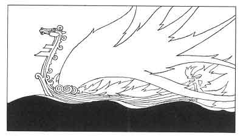

  
[Intangible Textual Heritage](../../../index.md)  [Legends and
Sagas](../../index)  [Iceland](../index)  [Index](index.md) 
[Previous](coo34)  [Next](coo36.md) 

------------------------------------------------------------------------

[Buy this Book at
Amazon.com](https://www.amazon.com/exec/obidos/ASIN/B0025VKZFM/internetsacredte.md)

------------------------------------------------------------------------

  
*The Children of Odin*, by Padraic Colum, \[1920\], at Intangible
Textual Heritage

------------------------------------------------------------------------

p. 260

 

### 9. THE DEATH OF SIGURD

IT happened one day that Brynhild, Gunnar's wife, now a Queen, was with
Sigurd's wife, bathing in a river. Not often they were together.
Brynhild was the haughtiest of women, and often she treated Gudrun with
disdain. Now as they were bathing together, Gudrun, shaking out her
hair, cast some drops upon Brynhild. Brynhild went from Gudrun. And
Sigurd's wife, not knowing that Brynhild had anger against her, went
after her up the stream.

"Why dost thou go so far up the river, Brynhild?" Gudrun asked.

"So that thou mayst not shake thy hair over me," answered Brynhild.

Gudrun stood still while Brynhild went up the river

p. 261

like a creature who was made to be alone. "Why dost thou speak so to me,
sister?" Gudrun cried.

She remembered that from the first Brynhild had been haughty with her,
often speaking to her with harshness and bitterness. She did not know
what cause Brynhild had for this.

It was because Brynhild had seen in Sigurd the one who had ridden
through the fire for the first time, he who had awakened her by breaking
the binding of her breastplate and so drawing out of her flesh the thorn
of the Tree of Sleep. She had given him her love when she awakened on
the world. But he, as she thought, had forgotten her easily, giving his
love to this other maiden. Brynhild, with her Valkyrie's pride, was left
with a mighty anger in her heart.

"Why dost thou speak so to me, Brynhild?" Gudrun asked.

"It would be ill indeed if drops from thy hair fell on one who is so
much above thee, one who is King Gunnar's wife," Brynhild answered.

"Thou art married to a King, but not to one more valorous than my lord,"
Gudrun said.

"Gunnar is more valorous; why dost thou compare Sigurd with him?"
Brynhild said.

"He slew the Dragon Fafnir, and won for himself Fafnir's hoard," said
Gudrun.

"Gunnar rode through the ring of fire. Mayhap thou wilt tell us that
Sigurd did the like," said Brynhild.

"Yea," said Gudrun, now made angry. "It was Sigurd

p. 262

and not Gunnar who rode through the ring of fire. He rode through it in
Gunnar's shape, and he took the ring off thy finger--look, it is now on
mine."

And Gudrun held out her hand on which was Andvari's ring. Then Brynhild
knew, all at once, that what Gudrun said was true. It was Sigurd that
rode through the ring of fire the second as well as the first time. It
was he who had struggled with her, taking the ring off her hand and
claiming her for a bride, not for himself but for another, and out of
disdain.

Falsely had she been won. And she, one of Odin's Valkyries, had been wed
to one who was not the bravest hero in the world, and she to whom
untruth might not come had been deceived. She was silent now, and all
the pride that was in her turned to hatred of Sigurd.

She went to Gunnar, her husband, and she told him that she was so deeply
shamed that she could never be glad in his Hall again; that never would
he see her drinking wine, nor embroidering with golden threads, and
never would he hear her speaking words of kindness. And when she said
this to him she rent the web she was weaving, and she wept aloud so that
all in the hall heard her, and all marveled to hear the proud Queen cry.

Then Sigurd came to her, and he offered in atonement the whole hoard of
Fafnir. And he told her how forgetfulness of her had come upon him, and
he begged her to forgive him for winning her in falseness. But she
answered him: "Too late thou hast come to me, Sigurd. Now I have only a
great anger in my heart."

p. 263

When Gunnar came she told him she would forgive him, and love him as she
had not loved him before, if he would slay Sigurd. But Gunnar would not
slay him, although Brynhild's passion moved him greatly, since Sigurd
was a sworn brother of his.

Then she went to Högni and asked him to slay Sigurd, telling him that
the whole of Fafnir's hoard would belong to the Nibelungs if Sigurd were
slain. But Högni would not slay him, since Sigurd and he were sworn
brothers.

There was one who had not sworn brotherhood with Sigurd. He was Guttorm,
Gunnar's and Högni's half-brother. Brynhild went to Guttorm. He would
not slay Sigurd, but Brynhild found that he was infirm of will and
unsteady of thought. With Guttorm, then, she would work for the slaying
of Sigurd. Her mind was fixed that he and she would no longer be in the
world of men.

She made a dish of madness for Guttorm--serpent's venom and wolf's flesh
mixed--and when he had eaten it Guttorm was crazed. Then did he listen
to Brynhild's words. And she commanded him to go into the chamber where
Sigurd slept and stab him through the body with a sword.

This Guttorm did. But Sigurd, before he gasped out his life, took Gram,
his great sword, and flung it at Guttorm and cut him in twain.

And Brynhild, knowing what deed was done, went without and came to where
Grani, Sigurd's proud horse, was standing. She stayed there with her
arms across Grani's neck, the Valkyrie leaning across the horse that was
born

p. 264

of Odin's horse. And Grani stood listening for some sound. He heard the
cries of Gudrun over Sigurd, and then his heart burst and he died.

They bore Sigurd out of the Hall and Brynhild went beside where they
placed him. She took a sword and put it through her own heart. Thus died
Brynhild who had been made a mortal woman for her disobedience to the
will of Odin, and who was won to be a mortal's wife by a falseness.

They took Sigurd and his horse Grani, and his helmet and his golden
war-gear and they left all on a great painted ship. They could not but
leave Brynhild beside him, Brynhild with her wondrous hair and her stern
and beautiful face. They left the two together and launched the ship on
the sea. And when the ship was on the water they fired it, and Brynhild
once again lay in the flames.

And so Sigurd and Brynhild went together to join Baldur and Nanna in
Hela's habitation.

Gunnar and Högni came to dread the evil that was in the hoard. They took
the gleaming and glittering mass and they brought it to the river along
which, ages before, Hreidmar had his smithy and the Dwarf Andvari his
cave. From a rock in the river they cast the gold and jewels into the
water and the hoard of Andvari sank for ever beneath the waves. Then the
River Maidens had possession again of their treasure. But not for long
were they to guard it and to sing over it, for now the season that was
called the Fimbul Winter was coming over the earth, and Ragnarök, the
Twilight of the Gods, was coming to the Dwellers in Asgard.

------------------------------------------------------------------------

[Next: 10. The Twilight of the Gods](coo36.md)
