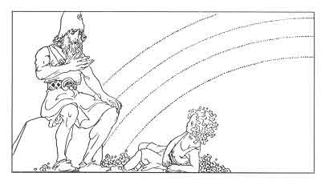

  
[Intangible Textual Heritage](../../../index.md)  [Legends and
Sagas](../../index)  [Iceland](../index.md) 

------------------------------------------------------------------------

[Buy this Book at
Amazon.com](https://www.amazon.com/exec/obidos/ASIN/B0025VKZFM/internetsacredte.md)

------------------------------------------------------------------------

<table width="75%">
<colgroup>
<col style="width: 50%" />
<col style="width: 50%" />
</colgroup>
<tbody>
<tr class="odd">
<td width="50%" data-valign="TOP"> 
Heimdall and Little Hnossa, by Willy Pogany [1920] (Public Domain Image)</td>
<td width="50%" data-valign="CENTER"><h1 id="the-children-of-odin" data-align="CENTER">The Children of Odin</h1>
<h2 id="by-padraic-colum" data-align="CENTER">by Padraic Colum</h2>
<h3 id="illustrated-by-willy-pogany" data-align="CENTER">Illustrated by Willy Pogany</h3>
<h4 id="section" data-align="CENTER">[1920]</h4></td>
</tr>
</tbody>
</table>

------------------------------------------------------------------------

[Contents](#contents)    [Start Reading](coo00.md)    [Page
Index](pageidx)    [Text \[Zipped\]](coo.txt.gz.md)

------------------------------------------------------------------------

|                                                                                                                           |
|---------------------------------------------------------------------------------------------------------------------------|
|  |

This is Padraic Colum's retelling of the Eddas and the Volsung Saga for
young adults. Colum and Pogany also collaborated on [The Adventures of
Odysseus](../../../cla/homer/aoo/index.md), and [The King of Ireland's
Son](../../celt/kis/index.md).

------------------------------------------------------------------------

[Title Page](coo00.md)  
[Contents](coo01.md)  

### Part I. The Dwellers in Asgard

[1. Far Away and Long Ago](coo02.md)  
[2. The Building of the Wall](coo03.md)  
[3. Iduna and Her Apples: How Loki Put the Gods in Danger](coo04.md)  
[4. Sif's Golden Hair: How Loki Wrought Mischief in Asgard](coo05.md)  
[5. How Brock Brought Judgment on Loki](coo06.md)  
[6. How Freya Gained Her Necklace and How Her Loved One was Lost to
Her](coo07.md)  
[7. How Frey Won Gerda, the Giant Maiden, and How He Lost His Magic
Sword](coo08.md)  
[8. Heimdall and Little Hnossa: How All Things Came to Be](coo09.md)  
[9. The All-Father's Forebodings: How He Leaves Asgard](coo10.md)  

### Part II. Odin the Wanderer

[1. Odin Goes to Mimir's Well: His Sacrifice for Wisdom](coo11.md)  
[2. Odin Faces an Evil Man](coo12.md)  
[3. Odin Wins for Men the Magic Mead](coo13.md)  
[4. Odin Tells to Vidar, His Silent Son, the Secret of His
Doings](coo14.md)  
[5. Thor and Loki in the Giants' City](coo15.md)  
[6. How Thor and Loki Befooled Thrym the Giant](coo16.md)  
[7. Aegir's Feast: How Thor Triumphed](coo17.md)  
[8. The Dwarfs Hoard, and the Curse that it Brought](coo18.md)  

### Part III: The Witch's Heart

[1. Foreboding in Asgard](coo19.md)  
[2. Loki the Betrayer](coo20.md)  
[3. Loki Against the Aesir](coo21.md)  
[4. The Valkyrie](coo22.md)  
[5. The Children of Loki](coo23.md)  
[6. Baldur's Doom](coo24.md)  
[7. Loki's Punishment](coo25.md)  

### Part IV. The Sword of the Volsungs and the Twilight of the Gods

[1. Sigurd's Youth](coo26.md)  
[2. The Sword Gram and the Dragon Fafnir](coo27.md)  
[3. The Dragon's Blood](coo28.md)  
[3. The Story of Sigmund and Signy](coo29.md)  
[4. The Story of Sigmund and Sinfiotli](coo30.md)  
[5. The Story of the Vengeance of the Volsungs and of the Death of
Sinfiotli](coo31.md)  
[6. Brynhild in the House of Flame](coo32.md)  
[7. Sigurd at the House of the Nibelungs](coo33.md)  
[8. How Brynhild was Won for Gunnar](coo34.md)  
[9. The Death of Sigurd](coo35.md)  
[10. The Twilight of the Gods](coo36.md)  
