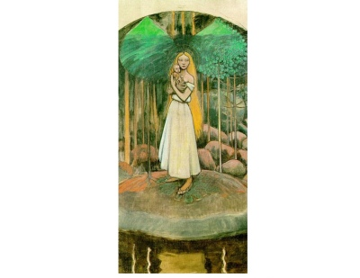

  
[Intangible Textual Heritage](../../index.md)  [Legends and
Sagas](../index.md)   
[Finnish Kalevala](../kvfin/index.md)   

------------------------------------------------------------------------

[Buy this Book at
Amazon.com](https://www.amazon.com/exec/obidos/ASIN/B001W0Z82C/internetsacredte.md)

------------------------------------------------------------------------

<table width="75%">
<colgroup>
<col style="width: 50%" />
<col style="width: 50%" />
</colgroup>
<tbody>
<tr class="odd">
<td width="50%" data-valign="TOP"></td>
<td width="50%" data-valign="CENTER"><h1 id="the-kalevala" data-align="CENTER">The Kalevala</h1>
<h2 id="translated-by-john-martin-crawford" data-align="CENTER">translated by John Martin Crawford</h2>
<h4 id="section" data-align="CENTER">[1888]</h4></td>
</tr>
</tbody>
</table>

------------------------------------------------------------------------

[Contents](#contents)    [Start Reading](kvtitle.md)    [Text
\[Zipped\]](kv.txt.gz.md)

------------------------------------------------------------------------

|                                                                                                                           |
|---------------------------------------------------------------------------------------------------------------------------|
|  |

The Kalevala is the national saga of Finland. Pieced together (and
embellished) by Elias Lönnrot in the late 19th Century, from a
traditional cycle told by rural storytellers, the tales which constitute
the Kalevala show signs of great antiquity.--J. Lelievre

------------------------------------------------------------------------

 [Title Page](kvtitle.md)  
[Contents](kvtoc.md)  
[Preface](kvintro.md)  
[Proem.](kvrune00.md)  
[Rune I. Birth of Wainamoinen.](kvrune01.md)  
[Rune II. Wainamoinen's Sowing.](kvrune02.md)  
[Rune III. Wainamoinen and Youkahainen.](kvrune03.md)  
[Rune IV. The Fate of Aino.](kvrune04.md)  
[Rune V. Wainamoinen's Lamentation.](kvrune05.md)  
[Rune VI. Wainamoinen's Hapless Journey.](kvrune06.md)  
[Rune VII. Wainamoinen's Rescue.](kvrune07.md)  
[Rune VIII. Maiden of the Rainbow.](kvrune08.md)  
[Rune IX. Origin of Iron.](kvrune09.md)  
[Rune X. Ilmarinen Forges the Sampo.](kvrune10.md)  
[Rune XI. Lemminkainen's Lament.](kvrune11.md)  
[Rune XII. Kyllikki's Broken Vow.](kvrune12.md)  
[Rune XIII. Lemminikainen's Second Wooing.](kvrune13.md)  
[Rune XIV. Death of Lemminkainen.](kvrune14.md)  
[Rune XV. Lemminkainen's Restoration.](kvrune15.md)  
[Rune XVI. Wainamoinen's Boat-building.](kvrune16.md)  
[Rune XVII. Wainamoinen Finds the Lost-word.](kvrune17.md)  
[Rune XVIII. The Rival Suitors.](kvrune18.md)  
[Rune XIX. Ilmarinen's Wooing.](kvrune19.md)  
[Rune XX. The Brewing of Beer.](kvrune20.md)  
[Rune XXI. Ilmarinen's Wedding-feast.](kvrune21.md)  
[Rune XXII. The Bride's Farewell.](kvrune22.md)  
[Rune XXIII. Osmotar the Bride-adviser](kvrune23.md)  
[Rune XXIV. The Bride's Farewell.](kvrune24.md)  
[Rune XXV. Wainamoinen's Wedding-songs.](kvrune25.md)  
[Rune XXVI. Origin of the Serpent.](kvrune26.md)  
[Rune XXVII. The Unwelcome Guest.](kvrune27.md)  
[Rune XXVIII. The Mother's Counsel](kvrune28.md)  
[Rune XXIX. The Isle of Refuge.](kvrune29.md)  
[Rune XXX. The Frost-fiend.](kvrune30.md)  
[Rune XXXI. Kullerwoinen Son of Evil.](kvrune31.md)  
[Rune XXXII. Kullervo As A Sheperd.](kvrune32.md)  
[Rune XXXIII. Kullervo and the Cheat-cake.](kvrune33.md)  
[Rune XXXIV. Kullervo Finds His Tribe-folk.](kvrune34.md)  
[Rune XXXV. Kullervo's Evil Deeds.](kvrune35.md)  
[Rune XXXVI. Kullerwoinen's Victory and Death.](kvrune36.md)  
[Rune XXXVII. Ilmarinen's Bride of Gold.](kvrune37.md)  
[Rune XXXVIII. Ilmarinen's Fruitless Wooing.](kvrune38.md)  
[Rune XXXIX. Wainamoinen's Sailing.](kvrune39.md)  
[Rune XL. Birth of the Harp.](kvrune40.md)  
[Rune XLI. Wainamoinen's Harp-songs.](kvrune41.md)  
[Rune XLII. Capture of the Sampo.](kvrune42.md)  
[Rune XLIII. The Sampo Lost In the Sea.](kvrune43.md)  
[Rune XLIV. Birth of the Second Harp.](kvrune44.md)  
[Rune XLV. Birth of the Nine Diseases](kvrune45.md)  
[Rune XLVI. Otso the Honey-eater.](kvrune46.md)  
[Rune XLVII. Louhi Steals Sun, Moon, and Fire.](kvrune47.md)  
[Rune XLVIII. Capture of the Fire-fish.](kvrune48.md)  
[Rune XLIX. Restoration of the Sun and Moon.](kvrune49.md)  
[Rune L. Mariatta--Wainamoinen's Departure.](kvrune50.md)  
[Epilogue](kvepi.md)  
[Glossary](kvgloss.md)  
