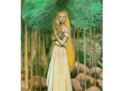

  
[Intangible Textual Heritage](../../index)  [Legends and
Sagas](../index)  [Index](index)   
[Finnish](../kvfin/04)   
[Previous](kvrune03)  [Next](kvrune05) 

------------------------------------------------------------------------

[Buy this Book at
Amazon.com](https://www.amazon.com/exec/obidos/ASIN/B001W0Z82C/internetsacredte)

------------------------------------------------------------------------

  
*The Kalevala*, by John Martin Crawford, \[1888\], at Intangible Textual
Heritage

------------------------------------------------------------------------

# RUNE IV.

# THE FATE OF AINO.

WHEN the night had passed, the maiden,  
Sister fair of Youkahainen,  
Hastened early to the forest,  
Birchen shoots for brooms to gather,  
Went to gather birchen tassels;  
Bound a bundle for her father,  
Bound a birch-broom for her mother,  
Silken tassels for her sister.  
Straightway then she hastened homeward,  
By a foot-path left the forest;  
As she neared the woodland border,  
Lo! the ancient Wainamoinen,  
Quickly spying out the maiden,  
As she left the birchen woodland,  
Trimly dressed in costly raiment,  
And the minstrel thus addressed her:  
"Aino, beauty of the Northland,  
Wear not, lovely maid, for others,  
Only wear for me, sweet maiden,  
Golden cross upon thy bosom,  
Shining pearls upon thy shoulders;  
Bind for me thine auburn tresses,  
Wear for me thy golden braidlets."  
Thus the maiden quickly answered:  
"Not for thee and not for others,  
Hang I from my neck the crosslet,  
Deck my hair with silken ribbons;  
Need no more the many trinkets  
Brought to me by ship or shallop;  
Sooner wear the simplest raiment,  
Feed upon the barley bread-crust,  
Dwell forever with my mother  
In the cabin with my father."

Then she threw the gold cross from her,  
Tore the jewels from her fingers,  
Quickly loosed her shining necklace,  
Quick untied her silken ribbons,  
Cast them all away indignant  
Into forest ferns and flowers.  
Thereupon the maiden, Aino,  
Hastened to her mother's cottage.

At the window sat her father  
Whittling on an oaken ax-helve:  
"Wherefore weepest, beauteous Aino,  
Aino, my beloved daughter?

"Cause enough for weeping, father,  
Good the reasons for my mourning,  
This, the reason for my weeping,  
This, the cause of all my sorrow:  
From my breast I tore the crosslet,  
From my belt, the clasp of copper,  
From my waist, the belt of silver,  
Golden was my pretty crosslet."

Near the door-way sat her brother,  
Carving out a birchen ox-bow:  
"Why art weeping, lovely Aino,  
Aino, my devoted sister?"

"Cause enough for weeping, brother,  
Good the reasons for my mourning  
Therefore come I as thou seest,  
Rings no longer on my fingers,  
On my neck no pretty necklace;  
Golden were the rings thou gavest,  
And the necklace, pearls and silver!"

On the threshold sat her sister,  
Weaving her a golden girdle:  
"Why art weeping, beauteous Aino,  
Aino, my beloved sister?"

"Cause enough for weeping, sister,  
Good the reasons for my sorrow:  
Therefore come I as thou seest,  
On my head no scarlet fillet,  
In my hair no braids of silver,  
On mine arms no purple ribbons,  
Round my neck no shining necklace,  
On my breast no golden crosslet,  
In mine ears no golden ear-rings."

Near the door-way of the dairy,  
Skimming cream, sat Aino's mother.  
"Why art weeping, lovely Aino,  
Aino, my devoted daughter?"  
Thus the sobbing maiden answered;  
"Loving mother, all-forgiving,  
Cause enough for this my weeping,  
Good the reasons for my sorrow,  
Therefore do I weep, dear mother:  
I have been within the forest,  
Brooms to bind and shoots to gather,  
There to pluck some birchen tassels;  
Bound a bundle for my father,  
Bound a second for my mother,  
Bound a third one for my brother,  
For my sister silken tassels.  
Straightway then I hastened homeward,  
By a foot-path left the forest;  
As I reached the woodland border  
Spake Osmoinen from the cornfield,  
Spake the ancient Wainamoinen:  
'Wear not, beauteous maid, for others,  
Only wear for me, sweet maiden,  
On thy breast a golden crosslet,  
Shining pearls upon thy shoulders,  
Bind for me thine auburn tresses,  
Weave for me thy silver braidlets.'  
Then I threw the gold-cross from me,  
Tore the jewels from my fingers,  
Quickly loosed my shining necklace,  
Quick untied my silken ribbons,  
Cast them all away indignant,  
Into forest ferns and flowers.  
Then I thus addressed the singer:  
'Not for thee and not for others,  
Hang I from my neck the crosslet,  
Deck my hair with silken ribbons;  
Need no more the many trinkets,  
Brought to me by ship and shallop;  
Sooner wear the simplest raiment,  
Feed upon the barley bread-crust,  
Dwell forever with my mother  
In the cabin with my father.'"

Thus the gray-haired mother answered  
Aino, her beloved daughter:  
"Weep no more, my lovely maiden,  
Waste no more of thy sweet young-life;  
One year eat thou my sweet butter,  
It will make thee strong and ruddy;  
Eat another year fresh bacon,  
It will make thee tall and queenly;  
Eat a third year only dainties,  
It will make thee fair and lovely.  
Now make haste to yonder hill-top,  
To the store-house on the mountain,  
Open there the large compartment,  
Thou will find it filled with boxes,  
Chests and cases, trunks and boxes;  
Open thou the box, the largest,  
Lift away the gaudy cover,  
Thou will find six golden girdles,  
Seven rainbow-tinted dresses,  
Woven by the Moon's fair daughters,  
Fashioned by the Sun's sweet virgins.  
In my young years once I wandered,  
As a maiden on the mountains,  
In the happy days of childhood,  
Hunting berries in the coppice;  
There by chance I heard the daughters  
Of the Moon as they were weaving;  
There I also heard the daughters  
Of the Sun as they were spinning  
On the red rims of the cloudlets,  
O'er the blue edge of the forest,  
On the border of the pine-wood,  
On a high and distant mountain.  
I approached them, drawing nearer,  
Stole myself within their hearing,  
Then began I to entreat them,  
Thus besought them, gently pleading:  
'Give thy silver, Moon's fair daughters,  
To a poor, but worthy maiden;  
Give thy gold, O Sun's sweet virgins,  
To this maiden, young and needy.'  
Thereupon the Moon's fair daughters  
Gave me silver from their coffers;  
And the Sun's sweet shining virgins  
Gave me gold from their abundance,  
Gold to deck my throbbing temples,  
For my hair the shining silver.  
Then I hastened joyful homeward,  
Richly laden with my treasures,  
Happy to my mother's cottage;  
Wore them one day, than a second,  
Then a third day also wore them,  
Took the gold then from my temples,  
From my hair I took the silver,  
Careful laid them in their boxes,  
Many seasons have they lain there,  
Have not seen them since my childhood.  
Deck thy brow with silken ribbon,  
Trim with gold thy throbbing temples,  
And thy neck with pearly necklace,  
Hang the gold-cross on thy bosom,  
Robe thyself in pure, white linen  
Spun from flax of finest fiber;  
Wear withal the richest short-frock,  
Fasten it with golden girdle;  
On thy feet, put silken stockings,  
With the shoes of finest leather;  
Deck thy hair with golden braidlets,  
Bind it well with threads of silver;  
Trim with rings thy fairy fingers,  
And thy hands with dainty ruffles;  
Come bedecked then to thy chamber,  
Thus return to this thy household,  
To the greeting of thy kindred,  
To the joy of all that know thee,  
Flushed thy cheeks as ruddy berries,  
Coming as thy father's sunbeam,  
Walking beautiful and queenly,  
Far more beautiful than moonlight."

Thus she spake to weeping Aino,  
Thus the mother to her daughter;  
But the maiden, little bearing,  
Does not heed her mother's wishes;  
Straightway hastens to the court-yard,  
There to weep in bitter sorrow,  
All alone to weep in anguish.

Waiting long the wailing Aino  
Thus at last soliloquizes:  
"Unto what can I now liken  
Happy homes and joys of fortune?  
Like the waters in the river,  
Like the waves in yonder lakelet,  
Like the crystal waters flowing.  
Unto what, the biting sorrow  
Of the child of cold misfortune?  
Like the spirit of the sea-duck,  
Like the icicle in winter,  
Water in the well imprisoned.  
Often roamed my mind in childhood,  
When a maiden free and merry,  
Happily through fen and fallow,  
Gamboled on the meads with lambkins,  
Lingered with the ferns and flowers,  
Knowing neither pain nor trouble;  
Now my mind is filled with sorrow,  
Wanders though the bog and stubble,  
Wanders weary through the brambles,  
Roams throughout the dismal forest,  
Till my life is filled with darkness,  
And my spirit white with anguish.  
Better had it been for Aino  
Had she never seen the sunlight,  
Or if born had died an infant,  
Had not lived to be a maiden  
In these days of sin and sorrow,  
Underneath a star so luckless.  
Better had it been for Aino,  
Had she died upon the eighth day  
After seven nights had vanished;  
Needed then but little linen,  
Needed but a little coffin,  
And a grave of smallest measure;  
Mother would have mourned a little,  
Father too perhaps a trifle,  
Sister would have wept the day through,  
Brother might have shed a tear-drop,  
Thus had ended all the mourning."

Thus poor Aino wept and murmured,  
Wept one day, and then a second,  
Wept a third from morn till even,  
When again her mother asked her:  
"Why this weeping, fairest daughter,  
Darling daughter, why this grieving?  
Thus the tearful maiden answered:  
Therefore do I weep and sorrow,  
Wretched maiden all my life long,  
Since poor Aino, thou hast given,  
Since thy daughter thou hast promised  
To the aged Wainamoinen,  
Comfort to his years declining  
Prop to stay him when he totters,  
In the storm a roof above him,  
In his home a cloak around him;  
Better far if thou hadst sent me  
Far below the salt-sea surges,  
To become the whiting's sister,  
And the friend of perch and salmon;  
Better far to ride the billows,  
Swim the sea-foam as a mermaid,  
And the friend of nimble fishes,  
Than to be an old man's solace,  
Prop to stay him when be totters,  
Hand to aid him when he trembles,  
Arm to guide him when he falters,  
Strength to give him when he weakens;  
Better be the whiting's sister  
And the friend of perch and salmon,  
Than an old man's slave and darling."

Ending thus she left her mother,  
Straightway hastened to the mountain?  
To the store-house on the summit,  
Opened there the box the largest,  
From the box six lids she lifted,  
Found therein six golden girdles,  
Silken dresses seven in number.  
Choosing such as pleased her fancy,  
She adorned herself as bidden,  
Robed herself to look her fairest,  
Gold upon her throbbing temples,  
In her hair the shining silver,  
On her shoulders purple ribbons,  
Band of blue around her forehead,  
Golden cross, and rings, and jewels,  
Fitting ornaments to beauty.

Now she leaves her many treasures,  
Leaves the store-house on the mountain,  
Filled with gold and silver trinkets,  
Wanders over field and meadow,  
Over stone-fields waste and barren,  
Wanders on through fen and forest,  
Through the forest vast and cheerless,  
Wanders hither, wanders thither,  
Singing careless as she wanders,  
This her mournful song and echo:  
"Woe is me, my life hard-fated!  
Woe to Aino, broken-hearted!  
Torture racks my heart and temples,  
Yet the sting would not be deeper,  
Nor the pain and anguish greater,  
If beneath this weight of sorrow,  
In my saddened heart's dejection,  
I should yield my life forever,  
Now unhappy, I should perish!  
Lo! the time has come for Aino  
From this cruel world to hasten,  
To the kingdom of Tuoni,  
To the realm of the departed,  
To the isle of the hereafter.  
Weep no more for me, O Father,  
Mother dear, withhold thy censure,  
Lovely sister, dry thine eyelids,  
Do not mourn me, dearest brother,  
When I sink beneath the sea-foam,  
Make my home in salmon-grottoes,  
Make my bed in crystal waters,  
Water-ferns my couch and pillow."

All day long poor Aino wandered,  
All the next day, sad and weary,  
So the third from morn till evening,  
Till the cruel night enwrapped her,  
As she reached the sandy margin,  
Reached the cold and dismal sea-shore,  
Sat upon the rock of sorrow,  
Sat alone in cold and darkness,  
Listened only to the music  
Of the winds and rolling billows,  
Singing all the dirge of Aino.  
All that night the weary maiden  
Wept and wandered on the border  
Through the sand and sea-washed pebbles.

As the day dawns, looking round her,  
She beholds three water-maidens,  
On a headland jutting seaward,  
Water-maidens four in number,  
Sitting on the wave-lashed ledges,  
Swimming now upon the billows,  
Now upon the rocks reposing.  
Quick the weeping maiden, Aino,  
Hastens there to join the mermaids,  
Fairy maidens of the waters.  
Weeping Aino, now disrobing,  
Lays aside with care her garments,  
Hangs her silk robes on the alders,  
Drops her gold-cross on the sea-shore,  
On the aspen hangs her ribbons,  
On the rocks her silken stockings,  
On the grass her shoes of deer-skin,  
In the sand her shining necklace,  
With her rings and other jewels.

Out at sea a goodly distance,  
Stood a rock of rainbow colors,  
Glittering in silver sunlight.  
Toward it springs the hapless maiden,  
Thither swims the lovely Aino,  
Up the standing-stone has clambered,  
Wishing there to rest a moment,  
Rest upon the rock of beauty;  
When upon a sudden swaying  
To and fro among the billows,  
With a crash and roar of waters  
Falls the stone of many colors,  
Falls upon the very bottom  
Of the deep and boundless blue-sea.  
With the stone of rainbow colors,  
Falls the weeping maiden, Aino,  
Clinging to its craggy edges,  
Sinking far below the surface,  
To the bottom of the blue-sea.  
Thus the weeping maiden vanished.  
Thus poor Aino sank and perished,  
Singing as the stone descended,  
Chanting thus as she departed:  
Once to swim I sought the sea-side,  
There to sport among the billows;  
With the stone or many colors  
Sank poor Aino to the bottom  
Of the deep and boundless blue-sea,  
Like a pretty son-bird. perished.  
Never come a-fishing, father,  
To the borders of these waters,  
Never during all thy life-time,  
As thou lovest daughter Aino.

"Mother dear, I sought the sea-side,  
There to sport among the billows;  
With the stone of many colors,  
Sank poor Aino to the bottom  
Of the deep and boundless blue-sea,  
Like a pretty song-bird perished.  
Never mix thy bread, dear mother,  
With the blue-sea's foam and waters,  
Never during all thy life-time,  
As thou lovest daughter Aino.  
Brother dear, I sought the sea-side,  
There to sport among the billows;  
With the stone of many colors  
Sank poor Aino to the bottom  
Of the deep and boundless blue-sea,  
Like a pretty song-bird perished.  
Never bring thy prancing war-horse,  
Never bring thy royal racer,  
Never bring thy steeds to water,  
To the borders of the blue-sea,  
Never during all thy life-time,  
As thou lovest sister Aino.

"Sister dear, I sought the sea-side,  
There to sport among the billows;  
With the stone of many colors  
Sank poor Aino to the bottom  
Of the deep and boundless blue-sea,  
Like a pretty song-bird perished.  
Never come to lave thine eyelids  
In this rolling wave and sea-foam,  
Never during all thy life-time,  
As thou lovest sister Aino.  
All the waters in the blue-sea  
Shall be blood of Aino's body;  
All the fish that swim these waters  
Shall be Aino's flesh forever;  
All the willows on the sea-side  
Shall be Aino's ribs hereafter;  
All the sea-grass on the margin  
Will have grown from Aino's tresses."

Thus at last the maiden vanished,  
Thus the lovely Aino perished.  
Who will tell the cruel story,  
Who will bear the evil tidings  
To the cottage of her mother,  
Once the home of lovely Aino?  
Will the bear repeat the story,  
Tell the tidings to her mother?  
Nay, the bear must not be herald,  
He would slay the herds of cattle.  
Who then tell the cruel story,  
Who will bear the evil tidings  
To the cottage of her father,  
Once the home of lovely Aino?  
Shall the wolf repeat the story,  
Tell the sad news to her father?  
Nay, the wolf must not be herald,  
He would eat the gentle lambkins.

Who then tell the cruel story,  
Who will bear the evil tidings.  
To the cottage of her sister?  
'Will the fox repeat the story  
Tell the tidings to her sister?  
Nay, the fox must not be herald,  
He would eat the ducks and chickens.

Who then tell the cruel story,  
Who will bear the evil tidings  
To the cottage of her brother,  
Once the home of lovely Aino?  
Shall the hare repeat the story,  
Bear the sad news to her brother?  
Yea, the hare shall be the herald,  
Tell to all the cruel story.  
Thus the harmless hare makes answer:  
"I will bear the evil tidings  
To the former home of Aino,  
Tell the story to her kindred."

Swiftly flew the long-eared herald,  
Like the winds be hastened onward,  
Galloped swift as flight of eagles;  
Neck awry he bounded forward  
Till he gained the wished-for cottage,  
Once the home of lovely Aino.  
Silent was the home, and vacant;  
So he hastened to the bath-house,  
Found therein a group of maidens,  
Working each upon a birch-broom.  
Sat the hare upon the threshold,  
And the maidens thus addressed him:  
"Hie e there, Long-legs, or we'll roast thee,  
Hie there, Big-eye, or we'll stew thee,  
Roast thee for our lady's breakfast,  
Stew thee for our master's dinner,  
Make of thee a meal for Aino,  
And her brother, Youkahainen!  
Better therefore thou shouldst gallop  
To thy burrow in the mountains,  
Than be roasted for our dinners."

Then the haughty hare made answer,  
Chanting thus the fate of Aino:  
"Think ye not I journey hither,  
To be roasted in the skillet,  
To be stewed in yonder kettle  
Let fell Lempo fill thy tables!  
I have come with evil tidings,  
Come to tell the cruel story  
Of the flight and death of Aino,  
Sister dear of Youkahainen.  
With the stone of many colors  
Sank poor Aino to the bottom  
Of the deep and boundless waters,  
Like a pretty song-bird perished;  
Hung her ribbons on the aspen,  
Left her gold-cross on the sea-shore,  
Silken robes upon the alders,  
On the rocks her silken stockings,  
On the grass her shoes of deer-skin,  
In the sand her shining necklace,  
In the sand her rings and jewels;  
In the waves, the lovely Aino,  
Sleeping on the very bottom  
Of the deep and boundless blue-sea,  
In the caverns of the salmon,  
There to be the whiting's sister  
And the friend of nimble fishes."

Sadly weeps the ancient mother  
From her blue-eyes bitter tear-drops,  
As in sad and wailing measures,  
Broken-hearted thus she answers:  
"Listen, all ye mothers, listen,  
Learn from me a tale of wisdom:  
Never urge unwilling daughters  
From the dwellings of their fathers,  
To the bridegrooms that they love not,  
Not as I, inhuman mother,  
Drove away my lovely Aino,  
Fairest daughter of the Northland."

Sadly weeps the gray-haired mother,  
And the tears that fall are bitter,  
Flowing down her wrinkled visage,  
Till they trickle on her bosom;  
Then across her heaving bosom,  
Till they reach her garment's border;  
Then adown her silken stockings,  
Till they touch her shoes of deer-skin;  
Then beneath her shoes of deer-skin,  
Flowing on and flowing ever,  
Part to earth as its possession,  
Part to water as its portion.  
As the tear-drops fall and mingle,  
Form they streamlets three in number,  
And their source, the mother's eyelids,  
Streamlets formed from pearly tear-drops,  
Flowing on like little rivers,  
And each streamlet larger growing,  
Soon becomes a rushing torrent  
In each rushing, roaring torrent  
There a cataract is foaming,  
Foaming in the silver sunlight;  
From the cataract's commotion  
Rise three pillared rocks in grandeur;  
From each rock, upon the summit,  
Grow three hillocks clothed in verdure;  
From each hillock, speckled birches,  
Three in number, struggle skyward;  
On the summit of each birch-tree  
Sits a golden cuckoo calling,  
And the three sing, all in concord:  
"Love! O Love! the first one calleth;  
Sings the second, Suitor! Suitor!  
And the third one calls and echoes,  
"Consolation! Consolation!"  
He that "Love! O Love!" is calling,  
Calls three moons and calls unceasing,  
For the love-rejecting maiden  
Sleeping in the deep sea-castles.  
He that "Suitor! Suitor!" singeth,  
Sings six moons and sings unceasing  
For the suitor that forever  
Sings and sues without a hearing.  
He that sadly sings and echoes,  
"Consolation! Consolation!"  
Sings unceasing all his life long  
For the broken-hearted mother  
That must mourn and weep forever.

When the lone and wretched mother  
Heard the sacred cuckoo singing,  
Spake she thus, and sorely weeping:  
"When I hear the cuckoo calling,  
Then my heart is filled with sorrow;  
Tears unlock my heavy eyelids,  
Flow adown my, furrowed visage,  
Tears as large as silver sea pearls;  
Older grow my wearied elbows,  
Weaker ply my aged fingers,  
Wearily, in all its members,  
Does my body shake in palsy,  
When I hear the cuckoo singing,  
Hear the sacred cuckoo calling."

------------------------------------------------------------------------

[Next: Rune V. Wainamoinen's Lamentation.](kvrune05)
