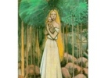

  
[Intangible Textual Heritage](../../index.md)  [Legends and
Sagas](../index)  [Index](index.md)   
[Finnish](../kvfin/10.md)   
[Previous](kvrune09)  [Next](kvrune11.md) 

------------------------------------------------------------------------

[Buy this Book at
Amazon.com](https://www.amazon.com/exec/obidos/ASIN/B001W0Z82C/internetsacredte.md)

------------------------------------------------------------------------

  
*The Kalevala*, by John Martin Crawford, \[1888\], at Intangible Textual
Heritage

------------------------------------------------------------------------

# RUNE X.

# ILMARINEN FORGES THE SAMPO.

WAINAMOINEN, the magician,  
Takes his steed of copper color,  
Hitches quick his fleet-foot courser,  
Puts his racer to the snow-sledge,  
Straightway springs upon the cross-seat,  
Snaps his whip adorned with jewels.  
Like the winds the steed flies onward,  
Like a lightning flash, the racer  
Makes the snow-sledge creak and rattle,  
Makes the highway quickly vanish,  
Dashes on through fen and forest,  
Over hills and through the valleys,  
Over marshes, over mountains,  
Over fertile plains and meadows;  
Journeys one day, then a second,  
So a third from morn till evening,  
Till the third day evening brings him  
To the endless bridge of Osmo,  
To the Osmo-fields and pastures,  
To the plains of Kalevala;  
When the hero spake as follows:  
"May the wolves devour the dreamer,  
Eat the Laplander for dinner,  
May disease destroy the braggart,  
Him who said that I should never  
See again my much-loved home-land,  
Nevermore behold my kindred,  
Never during all my life-time,  
Never while the sunshine brightens,  
Never while the moonlight glimmers  
On the meadows of Wainola,  
On the plains of Kalevala."

Then began old Wainamoinen,  
Ancient bard and famous singer,  
To renew his incantations;  
Sang aloft a wondrous pine-tree,  
Till it pierced the clouds in growing  
With its golden top and branches,  
Till it touched the very heavens,  
Spread its branches in the ether,  
In the ever-shining sunlight.

Now he sings again enchanting,  
Sings the Moon to shine forever  
In the fir-tree's emerald branches;  
In its top he sings the Great Bear.  
Then be quickly journeys homeward,  
Hastens to his golden portals,  
Head awry and visage wrinkled,  
Crooked cap upon his forehead,  
Since as ransom he had promised  
Ilmarinen, magic artist,  
Thus to save his life from torture  
On the distant fields of Northland  
In the dismal Sariola.

When his stallion he had halted  
On the Osmo-field and meadow,  
Quickly rising in his snow-sledge,  
The magician heard one knocking,  
Breaking coal within the smithy,  
Beating with a heavy hammer.  
Wainamoinen, famous minstrel,  
Entering the smithy straightway,  
Found the blacksmith, Ilmarinen,  
Knocking with his copper hammer.  
Ilmarinen spake as follows:  
"Welcome, brother Wainamoinen,  
Old and worthy Wainamoinen!  
Why so long hast thou been absent,  
Where hast thou so long been hiding?"

Wainamoinen then made answer,  
These the words of the magician:  
"Long indeed have I been living,  
Many dreary days have wandered,  
Many cheerless nights have lingered,  
Floating on the cruel ocean,  
Weeping in the fens and woodlands  
Of the never-pleasant Northland,  
In the dismal Sariola;  
With the Laplanders I've wandered,  
With the people filled with witchcraft."

Promptly answers Ilmarinen,  
These the words the blacksmith uses:  
"O thou ancient Wainamoinen,  
Famous and eternal singer,  
Tell me of thy journey northward,  
Of thy wanderings in Lapland,  
Of thy dismal journey homeward."  
Spake the minstrel, Wainamoinen:  
"I have much to tell thee, brother,  
Listen to my wondrous story:  
In the Northland lives a virgin,  
In a village there, a maiden,  
That will not accept a lover,  
That a hero's hand refuses,  
That a wizard's heart disdaineth;  
All of Northland sings her praises,  
Sings her worth and magic beauty,  
Fairest maiden of Pohyola,  
Daughter of the earth and ocean.  
From her temples beams the moonlight,  
From her breast, the gleam of sunshine,  
From her forehead shines the rainbow,  
On her neck, the seven starlets,  
And the Great Bear from her shoulder.

"Ilmarinen, worthy brother,  
Thou the only skilful blacksmith,  
Go and see her wondrous beauty,  
See her gold and silver garments,  
See her robed in finest raiment,  
See her sitting on the rainbow,  
Walking on the clouds of purple.  
Forge for her the magic Sampo,  
Forge the lid in many colors,  
Thy reward shall be the virgin,  
Thou shalt win this bride of beauty;  
Go and bring the lovely maiden  
To thy home in Kalevala."  
Spake the brother, Ilmarinen:  
O thou cunning Wainamoinen,  
Thou hast promised me already  
To the ever-darksome Northland,  
Thy devoted head to ransom,  
Thus to rescue thee from trouble.  
I shall never visit Northland,  
Shall not go to see thy maiden,  
Do not love the Bride of Beauty;  
Never while the moonlight glimmers,  
Shall I go to dreary Pohya,  
To the plains of Sariola,  
Where the people eat each other,  
Sink their heroes in the ocean,  
Not for all the maids of Lapland."  
Spake the brother, Wainamoinen:  
"I can tell thee greater wonders,  
Listen to my wondrous story:  
I have seen the fir-tree blossom,  
Seen its flowers with emerald branches,  
On the Osmo-fields and woodlands;  
In its top, there shines the moonlight,  
And the Bear lives in its branches."  
Ilmarinen thus made answer:  
"I cannot believe thy story,  
Cannot trust thy tale of wonder,  
Till I see the blooming fir-tree,  
With its many emerald branches,  
With its Bear and golden moonlight."  
This is Wainamoinen's answer:  
"Wilt thou not believe my story?  
Come with me and I will show thee  
If my lips speak fact or fiction."  
Quick they journey to discover,  
Haste to view the wondrous fir-tree;  
Wainamoinen leads the journey,  
Ilmarinen closely follows.  
As they near the Osmo-borders,  
Ilmarinen hastens forward  
That be may behold the wonder,  
Spies the Bear Within the fir-top,  
Sitting on its emerald branches,  
Spies the gleam of golden moonlight.  
Spake the ancient Wainamoinen,

These the words the singer uttered:  
Climb this tree, dear Ilmarinen,  
And bring down the golden moonbeams,  
Bring the Moon and Bear down with thee  
From the fir-tree's lofty branches."

Ilmarinen, full consenting,  
Straightway climbed the golden fir-tree,  
High upon the bow of heaven,  
Thence to bring the golden moonbeams,  
Thence to bring the Bear of heaven,  
From the fir-tree's topmost branches.

Thereupon the blooming fir-tree  
Spake these words to Ilmarinen:  
"O thou senseless, thoughtless hero,  
Thou hast neither wit nor instinct;  
Thou dost climb my golden branches,  
Like a thing of little judgment,  
Thus to get my pictured moonbeams,  
Take away my silver starlight,  
Steal my Bear and blooming branches."

Quick as thought old Wainamoinen  
Sang again in magic accents,  
Sang a storm-wind in the heavens,  
Sang the wild winds into fury,  
And the singer spake as follows:  
\`Take, O storm-wind, take the forgeman,  
Carry him within thy vessel,  
Quickly hence, and land the hero  
On the ever-darksome Northland,  
On the dismal Sariola."

Now the storm-wind quickly darkens,  
Quickly piles the air together,  
Makes of air a sailing vessel,  
Takes the blacksmith, Ilmarinen,  
Fleetly from the fir-tree branches,  
Toward the never-pleasant Northland,  
Toward the dismal Sariola.  
Through the air sailed Ilmarinen,  
Fast and far the hero travelled,  
Sweeping onward, sailing northward,  
Riding in the track of storm-winds,  
O'er the Moon, beneath the sunshine,  
On the broad back of the Great Bear,  
Till he neared Pohyola's woodlands,  
Neared the homes of Sariola,  
And alighted undiscovered,  
Was Dot noticed by the hunters,  
Was not scented by the watch-dogs.

Louhi, hostess of Pohyola,  
Ancient, toothless dame of Northland,  
Standing in the open court-yard,  
Thus addresses Ilmarinen,  
As she spies the hero-stranger:  
"Who art thou of ancient heroes,  
Who of all the host of heroes,  
Coming here upon the storm-wind,  
O'er the sledge-path of the ether,  
Scented not by Pohya's watch-dogs?  
This is Ilmarinen's answer:  
"I have surely not come hither  
To be barked at by the watch-dogs,  
At these unfamiliar portals,  
At the gates of Sariola."

Thereupon the Northland hostess  
Asks again the hero-stranger:  
"Hast thou ever been acquainted  
With the blacksmith of Wainola,  
With the hero, Ilmarinen,  
With the skilful smith and artist?  
Long I've waited for his coming,  
Long this one has been expected,  
On the borders of the Northland,  
Here to forge for me the Sampo."  
Spake the hero, Ilmarinen:  
"Well indeed am I acquainted  
With the blacksmith, Ilmarinen,  
I myself am Ilmarinen,  
I, the skilful smith and artist."

Louhi, hostess of the Northland,  
Toothless dame of Sariola,  
Straightway rushes to her dwelling,  
These the words that Louhi utters:  
"Come, thou youngest of my daughters,  
Come, thou fairest of my maidens,  
Dress thyself in finest raiment,  
Deck thy hair with rarest jewels,  
Pearls upon thy swelling bosom,  
On thy neck, a golden necklace,  
Bind thy head with silken ribbons,  
Make thy cheeks look fresh and ruddy,  
And thy visage fair and winsome,  
Since the artist, Ilmarinen,  
Hither comes from Kalevala,  
Here to forge for us the Sampo,  
Hammer us the lid in colors."

Now the daughter of the Northland,  
Honored by the land and water,  
Straightway takes her choicest raiment,  
Takes her dresses rich in beauty,  
Finest of her silken wardrobe,  
Now adjusts her silken fillet,  
On her brow a band of copper,  
Round her waist a golden girdle,  
Round her neck a pearly necklace,  
Shining gold upon her bosom,  
In her hair the threads of silver.  
From her dressing-room she hastens,  
To the hall she bastes and listens,  
Full of beauty, full of joyance,  
Ears erect and eyes bright-beaming,  
Ruddy cheeks and charming visage,  
Waiting for the hero-stranger.

Louhi, hostess of Pohyola,  
Leads the hero, Ilmarinen,  
To her dwelling-rooms in Northland,  
To her home in Sariola,  
Seats him at her well-filled table,  
Gives to him the finest viands,  
Gives him every needed comfort,  
Then addresses him as follows:  
"O thou blacksmith, Ilmarinen,  
Master of the forge and smithy,  
Canst thou forge for me the Sampo,  
Hammer me the lid in colors,  
From the tips of white-swan feathers,  
From the milk of greatest virtue,  
From a single grain of barley,  
From the finest wool of lambkins?  
Thou shalt have my fairest daughter,  
Recompense for this thy service."  
These the words of Ilmarinen:  
"I will forge for thee the Sampo,  
Hammer thee the lid in colors,  
From the tips of white-swan feathers,  
From the milk of greatest virtue,  
From a single grain of barley,  
From the finest wool of lambkins?  
Since I forged the arch of heaven,  
Forged the air a concave cover,  
Ere the earth had a beginning."

Thereupon the magic blacksmith  
Went to forge the wondrous Sampo,  
Went to find a blacksmith's workshop,  
Went to find the tools to work with;  
But he found no place for forging,  
Found no smithy, found no bellows,  
Found no chimney, found no anvil,  
Found no tongs, and found no hammer.

Then the-artist, Ilmarinen.  
Spake these words, soliloquizing:  
"Only women grow discouraged,  
Only knaves leave work unfinished,  
Not the devils, nor the heroes,  
Nor the Gods of greater knowledge."

Then the blacksmith, Ilmarinen,  
Sought a place to build a smithy,  
Sought a place to plant a bellows,  
On the borders of the Northland,  
On the Pohya-hills and meadows;  
Searched one day, and then a second;  
Ere the evening of the third day,  
Came a rock within his vision,  
Came a stone with rainbow-colors.  
There the blacksmith, Ilmarinen,  
Set at work to build his smithy,  
Built a fire and raised a chimney;  
On the next day laid his bellows,  
On the third day built his furnace,  
And began to forge the Sampo.

The eternal magic artist,  
Ancient blacksmith, Ilmarinen,  
First of all the iron-workers,  
Mixed together certain metals,  
Put the mixture in the caldron,  
Laid it deep within the furnace,  
Called the hirelings to the forging.  
Skilfully they work the bellows,  
Tend the fire and add the fuel,  
Three most lovely days of summer,  
Three short nights of bright midsummer,  
Till the rocks begin to blossom,  
In the foot-prints of the workmen,  
From the magic heat and furnace.

On the first day, Ilmarinen  
Downward bent and well examined,  
On the bottom of his furnace,  
Thus to see what might be forming  
From the magic fire and metals.  
From the fire arose a cross-bow,  
"With the brightness of the moonbeams,  
Golden bow with tips of silver;  
On the shaft was shining copper,  
And the bow was strong and wondrous,  
But alas! it was ill-natured,  
Asking for a hero daily,  
Two the heads it asked on feast-days.

Ilmarinen, skilful artist,  
Was not pleased with this creation,  
Broke the bow in many pieces,  
Threw them back within the furnace,  
Kept the workmen at the bellows,  
Tried to forge the magic Sampo.

On the second day, the blacksmith  
Downward bent and well examined,  
On the bottom of the furnace;  
From the fire, a skiff of metals,  
Came a boat of purple color,  
All the ribs were colored golden,  
And the oars were forged from copper;  
Thus the skiff was full of beauty,  
But alas! a thing of evil;  
Forth it rushes into trouble,  
Hastens into every quarrel,  
Hastes without a provocation  
Into every evil combat.

Ilmarinen, metal artist,  
Is not pleased with this creation,  
Breaks the skiff in many fragments,  
Throws them back within the furnace,  
Keeps the workmen at the bellows,  
Thus to forge the magic Sampo.

On the third day, Ilmarinen,  
First of all the metal-workers,  
Downward bent and well examined,  
On the bottom of the furnace;  
There be saw a heifer rising,  
Golden were the horns of Kimmo,  
On her head the Bear of heaven,  
On her brow a disc of sunshine,  
Beautiful the cow of magic;  
But alas! she is ill-tempered,  
Rushes headlong through the forest,  
Rushes through the swamps and meadows,  
Wasting all her milk in running.

Ilmarinen, the magician.  
Is not pleased with this creation,  
Cuts the magic cow in pieces,  
Throws them in the fiery furnace,  
Sets the workmen at the bellows,  
Thus to forge the magic Sampo.

On the fourth day, Ilmarinen  
Downward bent and well examined,  
To the bottom of the furnace;  
There beheld a plow in beauty  
Rising from the fire of metals,  
Golden was the point and plowshare,  
And the beam was forged from copper,  
And the handles, molten silver,  
Beautiful the plow and wondrous;  
But alas! it is ill-mannered,  
Plows up fields of corn and barley,  
Furrows through the richest meadows.

Ilmarinen, metal artist,  
Is not pleased with this creation,  
Quickly breaks the plow in pieces,  
Throws them back within the furnace,  
Lets the winds attend the bellows,  
Lets the storm-winds fire the metals.  
Fiercely vie the winds of heaven,  
East-wind rushing, West-wind roaring,  
South-wind crying, North-wind howling,  
Blow one day and then a second,  
Blow the third from morn till even,  
When the fire leaps through the windows,  
Through the door the sparks fly upward,  
Clouds of smoke arise to heaven;  
With the clouds the black smoke mingles,  
As the storm-winds ply the bellows.

On the third night Ilmarinen,  
Bending low to view his metals,  
On the bottom of the furnace,  
Sees the magic Sampo rising,  
Sees the lid in many colors.  
Quick the artist of Wainola  
Forges with the tongs and anvil,  
Knocking with a heavy hammer,  
Forges skilfully the Sampo;  
On one side the flour is grinding,  
On another salt is making,  
On a third is money forging,  
And the lid is many-colored.  
Well the Sampo grinds when finished,  
To and fro the lid in rocking,  
Grinds one measure at the day-break,  
Grinds a measure fit for eating,  
Grinds a second for the market,  
Grinds a third one for the store-house.

Joyfully the dame of Northland,  
Louhi, hostess of Pohyola,  
Takes away the magic Sampo,  
To the hills of Sariola,  
To the copper-bearing mountains,  
Puts nine locks upon the wonder,  
Makes three strong roots creep around it;  
In the earth they grow nine fathoms,  
One large root beneath the mountain,  
One beneath the sandy sea-bed,  
One beneath the mountain-dwelling.

Modestly pleads Ilmarinen  
For the maiden's willing answer,  
These the words of the magician:  
"Wilt thou come with me, fair maiden,  
Be my wife and queen forever?  
I have forged for thee the Sampo,  
Forged the lid in many colors."

Northland's fair and lovely daughter  
Answers thus the metal-worker:  
"Who will in the coming spring-time,  
Who will in the second summer,  
Guide the cuckoo's song and echo?  
Who will listen to his calling,  
Who will sing with him in autumn,  
Should I go to distant regions,  
Should this cheery maiden vanish  
From the fields of Sariola,  
From Pohyola's fens and forests,  
Where the cuckoo sings and echoes?  
Should I leave my father's dwelling,  
Should my mother's berry vanish,  
Should these mountains lose their cherry,  
Then the cuckoo too would vanish,  
All the birds would leave the forest,  
Leave the summit of the mountain,  
Leave my native fields and woodlands,  
Never shall I, in my life-time,  
Say farewell to maiden freedom,  
Nor to summer cares and labors,  
Lest the harvest be ungarnered,  
Lest the berries be ungathered,  
Lest the song-birds leave the forest,  
Lest the mermaids leave the waters,  
Lest I sing with them no longer."

Ilmarinen, the magician,  
The eternal metal-forger,  
Cap awry and head dejected,  
Disappointed, heavy-hearted,  
Empty-handed, well considers,  
How to reach his distant country,  
Reach his much-loved home and kinded,  
Gain the meadows of Wainola,  
From the never-pleasant Northland,  
From the darksome Sariola.  
Louhi thus addressed the suitor:  
"O thou blacksmith, Ilmarinen,  
Why art thou so heavy-hearted,  
Why thy visage so dejected?  
Hast thou in thy mind to journey  
From the vales and hills of Pohya,  
To the meadows of Wainola,  
To thy home in Kalevala?  
This is Ilmarinen's answer:  
"Thitherward my mind is tending,  
To my home-land let me journey,  
With my kindred let me linger,  
Be at rest in mine own country."

Straightway Louhi, dame of Northland,  
Gave the hero every comfort,  
Gave him food and rarest viands,  
Placed him in a boat of copper,  
In a copper-banded vessel,  
Called the winds to his assistance,  
Made the North-wind guide him homeward.  
Thus the skilful Ilmarinen  
Travels toward his native country,  
On the blue back of the waters,  
Travels one day, then a second,  
Till the third day evening brings him  
To Wainola's peaceful meadows,  
To his home in Kalevala.

Straightway ancient Wainamoinen  
Thus addresses Ilmarinen:  
"O my brother, metal-artist,  
Thou eternal wonder-worker,  
Didst thou forge the magic Sampo,  
Forge the lid in many colors?"

Spake the brother, Ilmarinen,  
These the words the master uttered:  
"Yea, I forged the magic Sampo,  
Forged the lid in many colors;  
To and fro the lid in rocking  
Grinds one measure at the day-dawn,  
Grinds a measure fit for eating,  
Grinds a second for the market,  
Grinds a third one for the store-house.  
Louhi has the wondrous Sampo,  
I have not the Bride of Beauty."

------------------------------------------------------------------------

[Next: Rune XI. Lemminkainen's Lament.](kvrune11.md)
