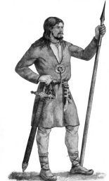
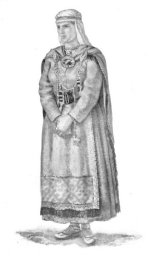

  
[Intangible Textual Heritage](../../index.md)  [Legends and
Sagas](../index)  [Index](index)  [Next](kvtoc.md) 

------------------------------------------------------------------------

[Buy this Book at
Amazon.com](https://www.amazon.com/exec/obidos/ASIN/B001W0Z82C/internetsacredte.md)

------------------------------------------------------------------------

  
*The Kalevala*, by John Martin Crawford, \[1888\], at Intangible Textual
Heritage

------------------------------------------------------------------------

# THE KALEVALA

###### THE

#### EPIC POEM OF FINLAND

#### INTO ENGLISH

###### BY

## JOHN MARTIN CRAWFORD

#### IN TWO VOLUMES

#### CINCINNATI

#### THE ROBERT BLAKE COMPANY

#### Third Edition, 1910

#### \[Copyright 1888\]

###### Scanned at Intangible Textual Heritage, July 2000. John B. Hare, redactor. This text is in the public domain. These files may be used for any non-commercial purpose, provided this notice of attribution is left intact.

TO

Dr. J. D. BUCK

AN ENCOURAGING AND UNSELFISH FRIEND

AND TO

HIS AFFECTIONATE FAMILY

THESE PAGES ARE

GRATEFULLY INSCRIBED

 
[  
Click to enlarge](img/frontkv1.jpg.md)

Frontispiece, volume I

 
[  
Click to enlarge](img/frontkv2.jpg.md)

Frontispiece, volume II

------------------------------------------------------------------------

[Next: Contents](kvtoc.md)
