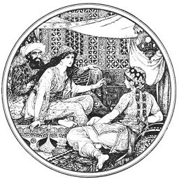

  
[Intangible Textual Heritage](../../index)  [Legends and
Sagas](../index) 

------------------------------------------------------------------------

[Buy this Book at
Amazon.com](https://www.amazon.com/exec/obidos/ASIN/0486222896/internetsacredte)

------------------------------------------------------------------------

<table width="75%">
<colgroup>
<col style="width: 50%" />
<col style="width: 50%" />
</colgroup>
<tbody>
<tr class="odd">
<td width="50%" data-valign="TOP"></td>
<td width="50%" data-valign="CENTER"><h1 id="the-arabian-nights-entertainments" data-align="CENTER">The Arabian Nights' Entertainments</h1>
<h2 id="edited-by-andrew-lang" data-align="CENTER">edited by Andrew Lang</h2>
<h4 id="section" data-align="CENTER">[1898]</h4></td>
</tr>
</tbody>
</table>

------------------------------------------------------------------------

[Contents](#contents)    [Start Reading](title)

------------------------------------------------------------------------

|                                                                                                                           |
|---------------------------------------------------------------------------------------------------------------------------|
|  |

------------------------------------------------------------------------

 [Title Page and Front Matter](title)  
[Preface](tale00)  
[Contents](contents)  
[Illustrations](illu)  
[The Arabian Nights](tale01)  
[The Story of the Merchant and the Genius](tale02)  
[The Story of the First Old Man and of the Hind](tale03)  
[The Story of the Second Old Man, and of the Two Black Dogs](tale04)  
[The Story of the Fisherman](tale05)  
[The Story of the Greek King and the Physician Douban](tale06)  
[The Story of the Husband and the Parrot](tale07)  
[The Story of the Vizir Who Was Punished](tale08)  
[The Story of the Young King of the Black Isles](tale09)  
[Story of the Three Calenders, Sons of Kings, and of Five Ladies of
Bagdad](tale10)  
[The Story of the First Calender, Son of a King](tale11)  
[The Story of the Second Calendar, Son of a King](tale12)  
[The Story of the Envious Man and of Him Who Was Envied](tale13)  
[Story of the Third Calendar, Son of a King](tale14)  
[The Seven Voyages of Sindbad the Sailor](tale15)  
[First Voyage](tale16)  
[Second Voyage](tale17)  
[Third Voyage](tale18)  
[Fourth Voyage](tale19)  
[Fifth Voyage](tale20)  
[Sixth Voyage](tale21)  
[Seventh and Last Voyage](tale22)  
[The Little Hunchback](tale23)  
[Story of the Barber's Fifth Brother](tale24)  
[The Story of the Barber's Sixth Brother](tale25)  
[The Adventures of Prince Camaralzaman and the Princess
Badoura](tale26)  
[Noureddin and the Fair Persian](tale27)  
[Aladdin and the Wonderful Lamp](tale28)  
[The Adventures of Haroun-al-Raschid, Caliph of Bagdad](tale29)  
[Story of the Blind Baba-Abdalla](tale30)  
[The Story of Sidi-Nouman](tale31)  
[Story of Ali Colia, Merchant of Bagdad](tale32)  
[The Enchanted Horse](tale33)  
[The Story of Two Sisters Who Were Jealous of Their Younger
Sister](tale34)  
