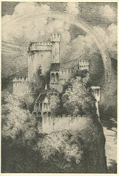

  
[Intangible Textual Heritage](../../index)  [Legends/Sagas](../index.md) 

------------------------------------------------------------------------

[Buy this Book at
Amazon.com](https://www.amazon.com/exec/obidos/ASIN/0486288706/internetsacredte.md)

------------------------------------------------------------------------

<table width="75%">
<colgroup>
<col style="width: 50%" />
<col style="width: 50%" />
</colgroup>
<tbody>
<tr class="odd">
<td width="50%" data-valign="CENTER"> 
</td>
<td width="50%" data-valign="CENTER"><h1 id="hero-tales-and-legends-of-the-rhine" data-align="CENTER">Hero Tales and Legends of the Rhine</h1>
<h2 id="by-lewis-spence" data-align="CENTER">by Lewis Spence</h2>
<h4 id="section" data-align="CENTER">[1915]</h4></td>
</tr>
</tbody>
</table>

------------------------------------------------------------------------

|                                                                                                                           |
|---------------------------------------------------------------------------------------------------------------------------|
|  |

This is Lewis Spence's retelling of the legends and sagas of the Rhine,
particularly the lore of the portion which passes through western
Germany, organized geographically from north to south. Many of these
tales have supernatural or pagan elements, although most are set in the
middle ages, with the crusades, chivalry, knights, damsels in distress
and castles as stock set dressing. Many stories center around desperate
bargains with the devil. One of the best parts of this book is Spence's
discussion of the historical basis of the *Nibelunglied*, its relation
to the Icelandic *Volsung saga*, and other lesser known Mediaeval sagas.

Although Spence's style can be a bit stuffy at times, this collection is
very readable and is still a good introduction for English readers to
the lore of the storied Rhine valley. This etext includes all of the
illustrations (scanned from a first edition), the fold-out map, and the
full index.

------------------------------------------------------------------------

[Title Page and Front Matter](lr00.md)  
[Introduction](lr01.md)  
[Contents](lr02.md)  
[Illustrations](lr03.md)  
[Map](lr04.md)  
[Chapter I: Topographical and Historical](lr05.md)  
[Chapter II. The Rhine in Folklore and Literature](lr06.md)  
[Chapter III. Cleves to the Löwenburg](lr07.md)  
[Chapter IV: Drachenfels To Rheinstein](lr08.md)  
[Chapter V: Falkenburg to Auerbach](lr09.md)  
[Chapter VI: Worms and the Nibelungenlied](lr10.md)  
[Chapter VII: Heidelberg to Säckingen](lr11.md)  
[Glossary and Index](lr12.md)  
