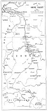
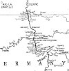

  
[Intangible Textual Heritage](../../index)  [Legends/Sagas](../index) 
[Index](index)  [Previous](lr03)  [Next](lr05) 

------------------------------------------------------------------------

[Buy this Book at
Amazon.com](https://www.amazon.com/exec/obidos/ASIN/0486288706/internetsacredte)

------------------------------------------------------------------------

 

# MAP

[  
Click to enlarge](img/hrmap.jpg)  
Map of the Rhine (188Kb)  

[  
Click to enlarge](img/mapdet.jpg)  
Detail of Map of the Rhine (137 Kb)  

 

The map was originally bound into the back of the book.--JBH

 

------------------------------------------------------------------------

[Next: Chapter I: Topographical and Historical](lr05)

