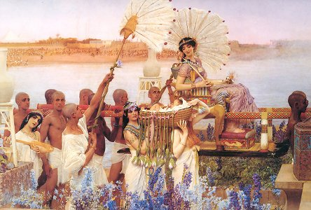

  
[Intangible Textual Heritage](../../index.md)  [Legends and
Sagas](../index.md) 

------------------------------------------------------------------------

[Buy this Book on
Kindle](https://www.amazon.com/exec/obidos/ASIN/B002H9XPY0/internetsacredte.md)

------------------------------------------------------------------------

<table width="75%">
<colgroup>
<col style="width: 50%" />
<col style="width: 50%" />
</colgroup>
<tbody>
<tr class="odd">
<td width="50%" data-valign="TOP"> 
The Finding of Moses, by Lawrence Alma-Tadema [1904] (Public Domain Image)</td>
<td width="50%" data-valign="CENTER"><h1 id="the-myth-of-the-birth-of-the-hero" data-align="CENTER">The Myth of the Birth of the Hero</h1>
<h2 id="by-otto-rank" data-align="CENTER">by Otto Rank</h2>
<h4 id="section" data-align="CENTER">[1914]</h4></td>
</tr>
</tbody>
</table>

------------------------------------------------------------------------

[Contents](#contents)    [Start Reading](mbh00.md)    [Page
Index](pageidx)    [Text \[Zipped\]](mbh.txt.gz.md)

------------------------------------------------------------------------

|                                                                                                                           |
|---------------------------------------------------------------------------------------------------------------------------|
|  |

Otto Rank, (b. 1884, d. 1939), was a brilliant Austrian psychologist who
was part of Sigmund Freud's inner circle. This early monograph by Rank
is a groundbreaking application of the psychoanalytic method to
comparative mythology. At the turn of the 20th century psychologists
were beginning to attempt to unravel the mysteries of the human psyche,
particularly through the medium of classical mythology. This would later
lead to the insights of Jung, Joseph Campbell and others. But one of the
first scholars who explored this convergence was Otto Rank.

One of the most vexing questions of comparative mythology, which will be
more than obvious to even casual readers of this site, are the
cross-cultural similarities in myths, folklore and legends. For
instance, the flood myth, the heroic quest, and particularly birth-tales
of the hero, appear around the world, from Africa to South America. When
this was written the study of mythology was emerging from a period where
attempts to explain this by diffusion or astronomical phenomena had been
exhausted. Rank instead attempted to explain these common motifs in
terms of what he believed to be psychological universals.

In this study Rank looks at a a wide variety of Eurasian hero birth
narratives, including Greek, Roman, Judeo-Christian, Indian, and
Germanic legendary figures. He uses the methodology and vocabulary of
classic Freudian psychoanalysis to do so. The middle part of this book,
where Rank enumerates some of these tales, will be the most useful for
modern readers, as he draws on a wide range of sources, some of them
fairly obscure. In the last part he puts these myths 'on the couch' as
it were, and ties up his thesis very coherently.

In later years, Rank broke with Freud, who had been somewhat of a father
figure to him, ironically fulfilling half of the Oedipus complex about
which they parted ways. He moved to Paris in 1926 where he took clients
such as Henry Miller and Anaïs Nin, who mentions Rank often in her
memoirs.

*Production notes*. This was extracted from the 1959 Vintage reprint of
this text in The Myth of the Birth of the Hero and other Writings. Page
numbers are from that edition. Editorial footnotes and the additional
writings from the 1959 edition were omitted. The rest of the (original)
footnotes were renumbered on a page-by-page basis.

*--J.B. Hare, October 16th, 2006*

------------------------------------------------------------------------

 [Title Page](mbh00.md)  
[I. Introduction](mbh01.md)  

### II. The Circle of Myths

[Sargon](mbh02.md)  
[Moses](mbh03.md)  
[Karna](mbh04.md)  
[Oedipus](mbh05.md)  
[Paris](mbh06.md)  
[Telephus](mbh07.md)  
[Perseus](mbh08.md)  
[Gilgamesh](mbh09.md)  
[Cyrus](mbh10.md)  
[Tristan](mbh11.md)  
[Romulus](mbh12.md)  
[Hercules](mbh13.md)  
[Jesus](mbh14.md)  
[Siegfried](mbh15.md)  
[Lohengrin](mbh16.md)  

 

[III. The Interpretation of the Myths](mbh17.md)  
