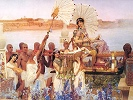

  
[Intangible Textual Heritage](../../index.md)  [Legends and
Sagas](../index)  [Index](index)  [Previous](mbh14)  [Next](mbh16.md) 

------------------------------------------------------------------------

[Buy this Book on
Kindle](https://www.amazon.com/exec/obidos/ASIN/B002H9XPY0/internetsacredte.md)

------------------------------------------------------------------------

  
*The Myth of the Birth of the Hero*, by Otto Rank, \[1914\], at
Intangible Textual Heritage

------------------------------------------------------------------------

#### SIEGFRIED

The old Norse Thidreksaga, as recorded about the year 1250 by an
Icelander, according to oral traditions and ancient songs, relates the
history of the birth and youth of Siegfried. [4](#fn_80.md) King Sigmund of Tarlungaland, on his
return

p. 57

from an expedition, banishes his wife Sisibe, the daughter of King
Nidung of Hispania, who is *accused* by Count Hartvin, whose advances
she has spurned, of having had *illicit relations with a menial*. The
king's counselors advise him to mutilate the innocent queen, instead of
killing her, and Hartvin is ordered to cut out her tongue in the forest,
so as to bring it to the king as a pledge. His companion, Count Hermann,
opposes the execution of the cruel command, and proposes to present the
tongue of a dog to the king. While the two men are engaged in a violent
quarrel, *Sisibe gives birth to a remarkably beautiful boy; she then
took a glass vessel, and after having wrapped the boy in linens, she
placed him in the glass vessel*, which she carefully closed again and
placed beside her. Count Hartvin was conquered in the fight, and in
falling kicked the glass vessel, *so that it fell into the river*. When
the queen saw this she swooned, and died soon afterwards. Hermann went
home, told the king everything, and was banished from the country. *The
glass vessel meantime drifted downstream to the sea*, and it was not
long before the tide turned. *Then the vessel floated onto a rocky
cliff*, and the water ran off so that the place where the vessel was was
perfectly dry. The boy inside had grown somewhat, and when the vessel
struck the rock, it broke, and the child began to cry. The boy's wailing
was heard *by a doe*, which seized him with her lips, and carried him to
her litter, *where she nursed him together with her young*. After the
child had lived twelve months in the den of the doe, he had grown to the
height and strength of other boys four years of age. One day he ran into
the forest, where dwelt the wise and skillful *smith Mimir, who had
lived for nine years in childless wedlock*. He saw the boy, who was
followed by the faithful doe, took him to his home, *and resolved to
bring him up as his own son*. He gave him the name of Siegfried. In
Mimir's home, Siegfried soon attained an enormous stature and strength,
but his wilfulness

p. 58

caused Mimir *to get rid of him*. He sent the youth into the forest,
where it had been arranged that the dragon Begin, Mimir's brother, was
to kill him. But Siegfried conquers the dragon, and kills Mimir. He then
proceeds to Brunhild, who names his parents to him.

Similar to the early history of Siegfried is an Austrasian saga that
tells of the birth and youth of Wolfdietrich. [1](#fn_81.md) His mother is likewise accused of
*unfaithfulness*, and of intercourse with the devil, by a vassal whom
she has repulsed, and who speaks evil of her to the returning king,
Hugdietrich of Constantinople. [2](#fn_82.md)

*The king surrenders the child to the faithful Berchtung, who is to kill
it, but exposes it instead in the forest, near the water*, in the hope
that it will fall in of its own accord and thus find its death. But the
frolicking child remains unhurt, and *even the wild animals*--lions,
bears, and wolves, which come at night to the water--*do not harm it*.
The astonished Berchtung resolves to save the boy, and he *surrenders
him to a gamekeeper* who, together with his wife, raises him and names
him Wolfdietrich. [3](#fn_83.md)

Three later hero epics may also be quoted in this connection: First,
there is the thirteenth-century French saga of Horn, the son of Aluf,
who, after having been exposed on the sea, finally reaches the court of
King Hunlaf; after numerous adventures, he wins the king's daughter,
Rimhilt, for his wife. Secondly, a detail suggestive of Siegfried
appears in the saga of the skillful smith Wieland, who, after avenging
his foully murdered father, floats down the river Weser, artfully
enclosed in the trunk of a tree, and loaded

p. 59

with the tools and treasures of his teachers. Finally, the King Arthur
legend contains the commingling of divine and human paternity, the
exposure, and the early life with a lowly man.

------------------------------------------------------------------------

### Footnotes

[56:1](mbh14.htm#fr_77.md) Very similar traits are
found in the Celtic saga of Habis, as transmitted by Justin. Born as the
illegitimate son of a king's daughter, Habis is persecuted in all sorts
of ways by his royal grandfather, Gargoris, but is always saved by
divine providence, until he is finally recognized by his grandfather and
assumes royal sway. As in the Zoroaster legend, there occurs an entire
series of the most varied methods of persecution. He is at first
exposed, but nursed by wild animals; then he was to be trampled upon by
a herd in a narrow path; then he was cast before hungry beasts, but they
again nursed him; and finally he is thrown into the sea, but is gently
lapped ashore and nursed by a doe, near which he grows up.

[56:2](mbh14.htm#fr_78.md) Compare Spiegel, op.
cit., Vol. I., pp. 688 ff.; also Brodbeck, op. cit.

[56:3](mbh14.htm#fr_79.md) As in the history of
Jesus; compare Luke 2:41-49.

[56:4](mbh15.htm#fr_80.md) Compare August Rassmann:
*Die deutsche Heldensage and ihre Heimat* (Hanover, 1857-8), Vol. II,
pp. 7; for the sources, see Jiriczek: Die deutsche Heldensage, and
Piper's introduction to the volume *Die Nibelungen*, in Kürschner's
*German National Literature*.

[58:1](mbh15.htm#fr_81.md) Compare: *Deutsches
Heldenbuch*, Vol. I, Part III (Berlin, 1871), edited by Amelung and
Jaenicke, which also contains a second version of the Wolfdietrich saga.

[58:2](mbh15.htm#fr_82.md) The motive of
calumniation of the wife by a rejected suitor, in combination with the
exposure and nursing by an animal (doe), forms the nucleus of the story
of Genovefa and her son Schmerzenreich, as told, for example, by the
Grimm brothers: Deutsche Sagen (Berlin, 1818), Vol. II, pp. 280 ff. Here
again the faithless calumniator proposes *to drown the countess and her
child*. For literary and historical orientation, compare L. Zacher: *Die
Historie von der Pfalzgräfin Genovefa* (Koenigsberg, 1860); and B.
Seuffert: *Die Legende von der Pfalzgräfin Genovefa* (Wurzburg, 1877).
Similar legends of wives suspected of infidelity and punished by
exposure are discussed in Chapter xi of my *Inzestmotiv*.

[58:3](mbh15.htm#fr_83.md) The same accentuation of
the animal motif is found in the saga of Schalû, the Hindu wolf-child.
Compare [Jülg](errata.htm#1.md), op. cit.

------------------------------------------------------------------------

[Next: Lohengrin](mbh16.md)
