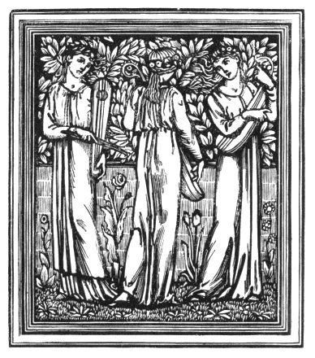
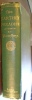
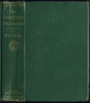
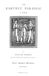

  
[Intangible Textual Heritage](../../../index.md)  [Legends &
Sagas](../../index)  [William Morris](../index)  [Index](index.md) 
[Next](ep101.md) 

------------------------------------------------------------------------

[Buy this Book at
Amazon.com](https://www.amazon.com/exec/obidos/ASIN/0543771660/internetsacredte.md)

------------------------------------------------------------------------

*The Earthly Paradise, (March-August)*, by William Morris, \[1868\], at
Intangible Textual Heritage

------------------------------------------------------------------------

###### THE

# EARTHLY PARADISE

### A POEM.

 

###### BY

## WILLIAM MORRIS,

##### AUTHOR OF THE LIFE AND DEATH OF JASON.

#### Boston: ROBERTS, BROTHERS.

\[1868\]

[  
Click to enlarge](img/ep1photo.jpg.md)  
Photo  

[  
Click to enlarge](img/cover.jpg.md)  
Cover  

[  
Click to enlarge](img/title.jpg.md)  
Title Page  

Scanned at Intangible Textual Heritage, June 2007. This text is in the
public domain in the United States because it was published prior to
January 1st, 1923. These files may be used for any non-commercial
purpose, provided this notice of attribution is left intact in all
copies.

LONDON:  
STRANGEWAYS AND WALDEN, PRINTERS,  
28 Castle St. Leicester Sq.

TO

**MY WIFE**

I DEDICATE THIS BOOK.

------------------------------------------------------------------------

[Next: A Table of Contents](ep101.md)
