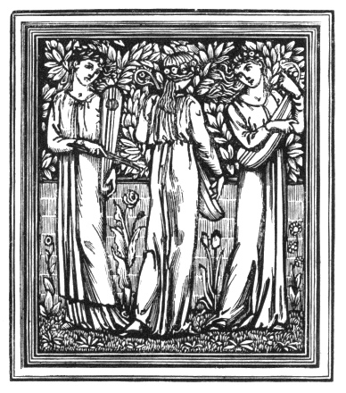

  
[Intangible Textual Heritage](../../../index.md)  [Legends &
Sagas](../../index)  [William Morris](../index)  [Index](index.md) 
[Previous](ep121)  [Next](ep123.md) 

------------------------------------------------------------------------

[Buy this Book at
Amazon.com](https://www.amazon.com/exec/obidos/ASIN/0543771660/internetsacredte.md)

------------------------------------------------------------------------

*The Earthly Paradise, (March-August)*, by William Morris, \[1868\], at
Intangible Textual Heritage

------------------------------------------------------------------------

p. 617

### OGIER THE DANE.

#### ARGUMENT.

WHEN Ogier was born, six fay ladies came to the cradle where he lay, and
gave him various gifts, as to be brave and happy and the like; but the
sixth gave him to he her love when he should have lived long in the
world: so Ogier grew up and became the greatest of knights, and at last,
after many years, fell into the hands of that fay, and with her, as the
story tells, he lives now, though he returned once to the world, as is
shown in the process of this tale.

WITHIN some Danish city by the sea,  
Whose name, changed now, is all unknown to me,  
Great mourning was there one fair summer eve,  
Because the angels, bidden to receive  
The fair Queen's lovely soul in Paradise,  
Had done their bidding, and in royal guise  
Her helpless body, once the prize of love,  
Unable now for fear or hope to move,  
Lay underneath the golden canopy;  
And bowed down by unkingly misery  
The King sat by it, and not far away, p.
618  
Within the chamber a fair man-child lay,  
His mother's bane, the king that was to be,  
Not witting yet of any royalty,  
Harmless and loved, although so new to life.

   Calm the June evening was, no sign of strife  
The clear sky showed, no storm grew round the sun,  
Unhappy that his day of bliss was done;  
Dumb was the sea, and if the beech-wood stirred,  
’Twas with the nestling of the grey-winged bird  
Midst its thick leaves; and though the nightingale  
Her ancient, hapless sorrow must bewail,  
No more of woe there seemed in her song  
Than such as doth to lovers’ words belong,  
Because their love is still unsatisfied.  
   But to the King, on that sweet eventide,  
No earth there seemed, no heaven when earth was gone;  
No help, no God! but lonely pain alone;  
And he, midst unreal shadows, seemed to sit  
Himself the very heart and soul of it.  
But round the cradle of the new-born child  
The nurses now the weary time beguiled  
With stories of the just departed Queen;  
And how, amid the heathen folk first seen,  
She had been won to love and godliness;  
And as they spoke, e’en midst his dull distress,  
An eager whisper now and then would smite  
Upon the King's ear, of some past delight,  
Some once familiar name, and he would raise p.
619  
His weary head, and on the speaker gaze  
Like one about to speak, but soon again  
Would drop his head and be alone with pain,  
Nor think of these; who, silent in their turn,  
Would sit and watch the waxen tapers burn  
Amidst the dusk of the quick-gathering night,  
Until beneath the high stars’ glimmering light,  
The fresh earth lay in colourless repose.  
   So past the night, and now and then one rose  
From out her place to do what might avail  
To still the new-born infant's fretful wail;  
Or through the softly-opened door there came  
Some nurse new waked, who, whispering low the name  
Of her whose turn was come, would take her place;  
Then toward the King would turn about her face  
And to her fellows whisper of the day,  
And tell again of her just past away.

   So passed the night, the moon arose and grew,  
From off the sea a little west-wind blew,  
Rustling the garden-leaves like sudden rain;  
And ere the moon had ’gun to fall again  
The wind grew cold, a change was in the sky,  
And in deep silence did the dawn draw nigh:  
Then from her place a nurse arose to light  
Fresh hallowed lights, for, dying with the night,  
The tapers round about the dead Queen were;  
But the King raised his head and ’gan to stare  
Upon her, as her sweeping gown did glide p.
620  
About the floor, that in the stillness cried  
Beneath her careful feet; and now as she  
Had lit the second candle carefully,  
And on its silver spike a second one  
Was setting, through her body did there run  
A sudden tremor, and the hand was stayed  
That on the dainty painted wax was laid;  
Her eyelids fell down and she seemed to sleep,  
And o’er the staring King began to creep  
Sweet slumber too; the bitter lines of woe  
That drew his weary face did softer grow,  
His eyelids dropped, his arms fell to his side;  
And moveless in their places did abide  
The nursing women, held by some strong spell,  
E’en as they were, and utter silence fell  
Upon the mournful, glimmering chamber fair.  
   But now light footsteps coming up the stair,  
Smote on the deadly stillness, and the sound  
Of silken dresses trailing o’er the ground;  
And heavenly odours through the chamber passed,  
Unlike the scents that rose and lily cast  
Upon the freshness of the dying night;  
Then nigher drew the sound of footsteps light  
Until the door swung open noiselessly—  
A mass of sunlit flowers there seemed to be  
Within the doorway, and but pale and wan  
The flame showed now that serveth mortal man,  
As one by one six seeming ladies passed  
Into the room, and o’er its sorrow cast p.
621  
That thoughtless sense of joy bewildering,  
That kisses youthful hearts amidst of spring;  
Crowned were they, in such glorious raiment clad,  
As yet no merchant of the world has had  
Within his coffers; yet those crowns seemed fair  
Only because they kissed their odorous hair,  
And all that flowery raiment was but blessed  
By those fair bodies that its splendour pressed.  
   Now to the cradle from that glorious band,  
A woman passed, and laid a tender hand  
Upon the babe, and gently drew aside  
The swathings soft that did his body hide;  
And, seeing him so fair and great, she smiled,  
And stooped, and kissed him, saying, "O noble child,  
Have thou a gift from Gloriande this day;  
For to the time when life shall pass away  
From this dear heart, no fear of death or shame,  
No weariness of good shall foul thy name."  
   So saying, to her sisters she returned;  
And one came forth, upon whose brow there burned  
A crown of rubies, and whose heaving breast  
With happy rings a golden hauberk pressed;  
She took the babe, and somewhat frowning said,  
"This gift I give, that till thy limbs are laid  
At rest for ever, to thine honoured life  
There never shall be lacking war and strife,  
That thou a long-enduring name mayst win,  
And by thy deeds, good pardon for thy sin."  
   With that another, who, unseen, meanwhile p.
622  
Had drawn anigh, said with a joyous smile,  
"And this forgotten gift to thee I give,  
That while amidst the turmoil thou dost live,  
Still shalt thou win the game, and unto thee  
Defeat and shame but idle words shall be."  
   Then back they turned, and therewithal, the fourth  
Said, "Take this gift for what it may be worth,  
For that is mine to give; lo, thou shalt be  
Gentle of speech, and in all courtesy  
The first of men: a little gift this is,  
After these promises of fame and bliss."  
   Then toward the babe the fifth fair woman went;  
Grey-eyed she was, and simple, with eyes bent  
Down on the floor, parted her red lips were,  
And o’er her sweet face marvellously fair  
Oft would the colour spread full suddenly;  
Clad in a dainty gown and thin was she,  
For some green summer of the fay-land dight,  
Tripping she went, and laid her fingers light  
Upon the child, and said, "O little one,  
As long as thou shalt look upon the sun  
Shall women long for thee; take heed to this  
And give them what thou canst of love and bliss."  
   Then, blushing for her words, therefrom she past,  
And by the cradle stood the sixth and last,  
The fairest of them all; awhile she gazed  
Down on the child, and then her hand she raised,  
And made the one side of her bosom bare;  
"Ogier," she said, "if this be foul or fair p.
623  
Thou know’st not now, but when thine earthly life  
Is drunk out to the dregs, and war and strife  
Have yielded thee whatever joy they may,  
Thine head upon this bosom shalt thou lay;  
And then, despite of knowledge or of God,  
Will we be glad upon the flowery sod  
Within the happy country where I dwell:  
Ogier, my love that is to be, farewell!"

   She turned, and even as they came they passed  
From out the place, and reached the gate at last  
That oped before their feet, and speedily  
They gained the edges of the murmuring sea,  
And as they stood in silence, gazing there  
Out to the west, they vanished into air,  
I know not how, nor whereto they returned.

   But mixed with twilight in the chamber burned  
The flickering candles, and those dreary folk,  
Unlike to sleepers, from their trance awoke,  
But nought of what had happed meanwhile they knew;  
Through the half-opened casements now there blew  
A sweet fresh air, that of the flowers and sea  
Mingled together, smelt deliciously,  
And from the unseen sun the spreading light  
Began to make the fair June blossoms bright,  
And midst their weary woe uprose the sun,  
And thus has Ogier's noble life begun.

 

p. 624

HOPE is our life, when first our life grows clear;  
Hope and delight, scarce crossed by lines of fear,  
Yet the day comes when fain we would not hope,  
But forasmuch as we with life must cope,  
Struggling with this and that, and who knows why  
Hope will not give us up to certainty,  
But still must bide with us: and with this man,  
Whose life amid such promises began  
   Great things she wrought; but now the time has come  
When he no more on earth may have his home.  
Great things he suffered, great delights he had,  
Unto great kings he gave good deeds for bad;  
He ruled o’er kingdoms where his name no more  
Is had in memory, and on many a shore  
He left his sweat and blood to win a name  
Passing the bounds of earthly creatures’ fame.  
A love he won and lost, a well-loved son  
Whose little day of promise soon was done:  
A tender wife he had, that he must leave  
Before his heart her love could well receive;  
Those promised gifts, that on his careless head  
In those first hours of his fair life were shed  
He took unwitting, and unwitting spent,  
Nor gave himself to grief and discontent  
Because he saw the end a-drawing nigh. p.
625  
   Where is he now? in what land must he die,  
To leave an empty name to us on earth?  
A tale half true, to cast across our mirth  
Some pensive thoughts of life that might have been,  
Where is he now, that all this life has seen?

   Behold, another eve I bid you see  
Than that calm eve of his nativity;  
The sun is setting in the west, the sky  
Is clear and hard, and no clouds come anigh  
The golden orb, but further off they lie,  
Steel-grey and black with edges red as blood,  
And underneath them is the weltering flood  
Of some huge sea, whose tumbling hills, as they  
Turn restless sides about, are black or grey,  
Or green, or glittering with the golden flame;  
The wind has fallen now, but still the same  
The mighty army moves, as if to drown  
This lone, bare rock, whose shear scarped sides of brown  
Cast off the weight of waves in clouds of spray.  
   Alas! what ships upon an evil day  
Bent over to the wind in this ill sea?  
What navy, whose rent bones lie wretchedly  
Beneath these cliffs? a mighty one it was,  
A fearful storm to bring such things to pass.

   This is the loadstone rock; no armament  
Of warring nations, in their madness bent  
Their course this way; no merchant wittingly p.
626  
Has steered his keel unto this luckless sea;  
Upon no shipman's card its name is writ,  
Though worn-out mariners will speak of it  
Within the ingle on the winter's night,  
When all within is warm and safe and bright,  
And the wind howls without: but ’gainst their will  
Are some folk driven here, and then all skill  
Against this evil rock is vain and nought,  
And unto death the shipmen soon are brought;  
For then the keel, as by a giant's hand,  
Is drawn unto that mockery of a land,  
And presently unto its sides doth cleave;  
When if they ’scape swift death, yet none may leave  
The narrow limits of that barren isle,  
And thus are slain by famine in a while  
Mocked, as they say, by night with images  
Of noble castles among gloves of trees,  
By day with sounds of merry minstrelsy.

   The sun sinks now below this hopeless sea,  
The clouds are gone, and all the sky is bright;  
The moon is rising o’er the growing night,  
And by its light may ye behold the bones  
Of generations of these luckless ones  
Scattered about the rock; but nigh the sea  
Sits one alive, who uncomplainingly  
Awaits his death. White-haired is he and old,  
Arrayed in royal raiment, bright with gold,  
But tarnished with the waves and rough salt air; p.
627  
Huge is he, of a noble face and fair,  
As for an ancient man, though toil and eld  
Furrow the cheeks that ladies once beheld  
With melting hearts—Nay, listen, for he speaks!  
   "God, thou hast made me strong! nigh seven weeks  
Have passed since from the wreck we haled our store,  
And five long days well told, have now passed o’er  
Since my last fellow died, with my last bread  
Between his teeth, and yet I am not dead.  
Yea, but for this I had been strong enow  
In some last bloody field my sword to show.  
What matter? soon will all be past and done,  
Where’er I died I must have died alone:  
Yet, Caraheu, a good death had it been  
Dying, thy face above me to have seen,  
And heard my banner flapping in the wind,  
Then, though my memory had not left thy mind,  
Yet hope and fear would not have vexed thee more  
When thou hadst known that everything was o’er;  
But now thou waitest, still expecting me,  
Whose sail shall never speck thy bright blue sea.  
   "And thou, Clarice, the merchants thou mayst call,  
To tell thee tales within thy pictured hall,  
But never shall they tell true tales of me:  
Whatever sails the Kentish hills may see  
Swept by the flood-tide toward thy well-walled town,  
No more on my sails shall they look adown.  
   "Get thee another leader, Charlemaine,  
For thou shalt look to see my shield in vain, p.
628  
When in the fair fields of the Frankish land,  
Thick as the corn they tread, the heathen stand.  
   "What matter? ye shall learn to live your lives;  
Husbands and children, other friends and wives,  
Shall wipe the tablets of your memory clean,  
And all shall be as I had never been.

   "And now, O God, am I alone with Thee;  
A little thing indeed it seems to be  
To give this life up, since it needs must go  
Some time or other; now at last I know  
How foolishly men play upon the earth,  
When unto them a year of life seems worth  
Honour and friends, and these vague hopes and sweet  
That like real things my dying heart do greet,  
Unreal while living on the earth I trod,  
And but myself I knew no other god.  
Behold, I thank Thee that Thou sweet’nest thus,  
This end, that I had thought most piteous,  
If of another I had heard it told."

   What man is this, who weak and worn and old,  
Gives up his life within that dreadful isle,  
And on the fearful coming death can smile?  
Alas! this man so battered and outworn,  
Is none but he, who, on that summer morn,  
Received such promises of glorious life:  
Ogier the Dane this is, to whom all strife  
Was but as wine to stir awhile the blood, p.
629  
To whom all life, however hard, was good  
This is the man, unmatched of heart and limb,  
Ogier the Dane, whose sight has waxed not dim  
For all the years that he on earth has dwelt;  
Ogier the Dane, that never fear has felt,  
Since he knew good from ill; Ogier the Dane,  
The heathen's dread, the evil-doer's bane.

 

 

BRIGHT had the moon grown as his words were done,  
And no more was there memory of the sun  
Within the west, and he grew drowsy now,  
And somewhat smoother was his wrinkled brow  
As thought died out beneath the hand of sleep,  
And o’er his soul forgetfulness did creep,  
Hiding the image of swift-coming death;  
Until as peacefully he drew his breath  
As on that day, past for a hundred years,  
When, midst the nurse's quickly-falling tears,  
He fell asleep to his first lullaby.  
   The night changed as he slept, white clouds and high  
Began about the lonely moon to close;  
And from the dark west a new wind arose,  
And with the sound of heavy-falling waves  
Mingled its pipe about the loadstone caves; p.
630  
But when the twinkling stars were hid away,  
And a faint light and broad, like dawn of day,  
The moon upon that dreary country shed,  
Ogier awoke, and lifting up his head  
And smiling, muttered, "Nay, no more again;  
Rather some pleasure new, some other pain,  
Unthought of both, some other form of strife;"  
For he had waked from dreams of his old life,  
And through St. Omer's archer-guarded gate  
Once more had seemed to pass, and saw the state  
Of that triumphant king; and still, though all  
Seemed changed, and folk by other names did call  
Faces he knew of old, yet none the less  
He seemed the same, and, midst that mightiness,  
Felt his own power, and grew the more athirst  
For coming glory, as of old, when first  
He stood before the face of Charlemaine,  
A helpless hostage with all life to gain.  
   But now, awake, his worn face once more sank  
Between his hands, and, murmuring not, he drank  
The draught of death that must that thirst allay.

   But while he sat and waited for the day  
A sudden light across the bare rock streamed,  
Which at the first he noted not, but deemed  
The moon her fleecy veil had broken through;  
But ruddier indeed this new light grew  
Than were the moon's grey beams, and, therewithal,  
Soft far-off music on his ears did fall; p.
631  
Yet moved he not, but murmured, "This is death,  
An easy thing like this to yield my breath,  
Awake, yet dreaming, with no sounds of fear,  
No dreadful sights to tell me it is near;  
Yea, God, I thank thee!" but with that last word  
It seemed to him that he his own name heard  
Whispered, as though the wind had borne it past;  
With that he gat unto his feet at last,  
But still awhile he stood, with sunken head,  
And in a low and trembling voice he said,  
"Lord, I am ready, whither shall I go?  
I pray thee unto me some token show."  
And, as he said this, round about he turned,  
And in the east beheld a light that burned  
As bright as day; then, though his flesh might fear  
The coming change that he believed so near,  
Yet did his soul rejoice, for now he thought  
Unto the very heaven to be brought:  
And though he felt alive, deemed it might be  
That he in sleep had died full easily.  
   Then toward that light did he begin to go,  
And still those strains he heard, far off and low,  
That grew no louder; still that bright light streamed  
Over the rocks, yet nothing brighter seemed,  
But like the light of some unseen bright flame  
Shone round about, until at last he came  
Unto the dreary islet's other shore,  
And then the minstrelsy he heard no more,  
And softer seemed the strange light unto him; p.
632  
But yet or ever it had grown quite dim,  
Beneath its waning light could he behold  
A mighty palace set about with gold,  
Above green meads and groves of summer trees  
Far-off across the welter of the seas;  
But, as he gazed, it faded from his sight,  
And the grey hidden moon's diffused soft light,  
Which soothly was but darkness to him now,  
His sea-girt island prison did but show.  
   But o’er the sea he still gazed wistfully,  
And said, "Alas! and when will this go by  
And leave my soul in peace? must I still dream  
Of life that once so dear a thing did seem,  
That, when I wake, death may the bitterer be?  
Here will I sit until he come to me,  
And hide mine eyes and think upon my sin,  
That so a little calm I yet may win  
Before I stand within the awful place."  
   Then down he sat and covered up his face,  
Yet therewithal his trouble could not hide,  
Nor waiting thus for death could he abide,  
For, though he knew it not, the yearning pain  
Of hope of life had touched his soul again—  
If he could live awhile, if he could live!  
The mighty being, who once was wont to give  
The gift of life to many a trembling man;  
Who did his own will since his life began;  
Who feared not aught, but strong and great and free  
Still cast aside the thought of what might be; p.
633  
Must all this then be lost, and with no will,  
Powerless and blind, must he some fate fulfil,  
Nor know what he is doing any more?

   Soon he arose and paced along the shore,  
And gazed out seaward for the blessed light;  
But nought he saw except the old sad sight,  
The ceaseless tumbling of the billows grey,  
The white upspringing of the spurts of spray  
Amidst that mass of timbers, the rent bones  
Of the sea-houses of the hapless ones  
Once cast like him upon this deadly isle.  
   He stopped his pacing in a little while,  
And clenched his mighty hands, and set his teeth,  
And gazing at the ruin underneath,  
He swung from off the bare cliff's jagged brow,  
And on some slippery ledge he wavered now,  
Without a hand-hold, and now stoutly clung  
With hands alone, and o’er the welter hung,  
Not caring aught if thus his life should end;  
But safely midst all this did he descend  
The dreadful cliff, and since no beach was there,  
But from the depths the rock rose stark and bare,  
Nor crumbled aught beneath the hammering sea,  
Upon the wrecks he stood unsteadily.

   But now, amid the clamour of the waves,  
And washing to-and-fro of beams and staves,  
Dizzy with hunger, dreamy with distress, p.
634  
And all those days of fear and loneliness,  
The ocean's tumult seemed the battle's roar,  
His heart grew hot, as when in days of yore  
He heard the cymbals clash amid the crowd  
Of dusky faces; now he shouted loud,  
And from crushed beam to beam began to leap,  
And yet his footing somehow did he keep  
Amidst their tossing, and indeed the sea  
Was somewhat sunk upon the island's lee.  
So quickly on from wreck to wreck he passed,  
And reached the outer line of wrecks at last,  
And there a moment stood unsteadily,  
Amid the drift of spray that hurried by,  
And drew Courtain his sword from out its sheath,  
And poised himself to meet the coming death,  
Still looking out to sea; but as he gazed,  
And once or twice his doubtful feet he raised  
To take the final plunge, that heavenly strain  
Over the washing waves he heard again,  
And from the dimness something bright he saw  
Across the waste of waters towards him draw;  
And hidden now, now raised aloft, at last  
Unto his very feet a boat was cast,  
Gilded inside and out, and well arrayed  
With cushions soft; far fitter to have weighed  
From some sweet garden on the shallow Seine,  
Or in a reach of green Thames to have lain,  
Than struggle with that huge confusèd sea;  
But Ogier gazed upon it doubtfully p. 635  
One moment, and then, sheathing Courtain, said,  
"What tales are these about the newly dead  
The heathen told? what matter, let all pass;  
This moment as one dead indeed I was,  
And this must be what I have got to do,  
I yet perchance may light on something new  
Before I die; though yet perchance this keel  
Unto the wondrous mass of charmed steel  
Is drawn as others." With that word he leapt  
Into the boat, and o’er the cushions crept  
From stem to stern, but found no rudder there,  
Nor any oars, nor were the cushions fair  
Made wet by any dashing of the sea.  
   Now while he pondered how these things could be,  
The boat began to move therefrom at last,  
But over him a drowsiness was cast,  
And as o’er tumbling hills the skiff did pass,  
He clean forgot his death and where he was.

   At last he woke up to a sunny day,  
And, looking round, saw that his shallop lay  
Moored at the edge of some fair tideless sea  
Unto an overhanging thick-leaved tree,  
Where in the green waves did the low bank dip  
Its fresh and green grass-covered daisied lip;  
But Ogier looking thence no more could see  
That sad abode of death and misery,  
Nor aught but wide and empty ocean, grey  
With gathering haze, for now it neared midday; p.
636  
Then from the golden cushions did he rise,  
And wondering still if this were Paradise  
He stepped ashore, but drew Courtain his sword  
And muttered therewithal a holy word.  
   Fair was the place, as though amidst of May,  
Nor did the brown birds fear the sunny day,  
For with their quivering song the air was sweet;  
Thick grew the field-flowers underneath his feet,  
And on his head the blossoms down did rain,  
Yet mid these fair things slowly and with pain  
He ’gan to go, yea, even when his foot  
First touched the flowery sod, to his heart's root  
A coldness seemed to strike, and now each limb  
Was growing stiff, his eyes waxed bleared and dim,  
And all his stored-up memory ’gan to fail,  
Nor yet would his once mighty heart avail  
For lamentations o’er his changed lot;  
Yet urged by some desire, he knew not what,  
Along a little path ’twixt hedges sweet,  
Drawn sword in hand, he dragged his faltering feet,  
For what then seemed to him a weary way,  
Whereon his steps he needs must often stay  
And lean upon the mighty well-worn sword  
That in those hands, grown old, for king or lord  
Had small respect in glorious days long past.

   But still he crept along, and at the last  
Came to a gilded wicket, and through this  
Entered a garden fit for utmost bliss, p.
637  
If that might last which needs must soon go by:  
There ’gainst a tree he leaned, and with a sigh  
He said, "O God, a sinner I have been,  
And good it is that I these things have seen  
Before I meet what thou hast set apart  
To cleanse the earthly folly from my heart;  
But who within this garden now can dwell  
Wherein guilt first upon the world befell?"  
   A little further yet he staggered on,  
Till to a fountain-side at last he won,  
O’er which two white-thorns their sweet blossoms shed,  
There he sank down, and laid his weary head  
Beside the mossy roots, and in a while  
He slept, and dreamed himself within the isle;  
That splashing fount the weary sea did seem,  
And in his dream the fair place but a dream;  
But when again to feebleness he woke  
Upon his ears that heavenly music broke,  
Not faint or far as in the isle it was,  
But e’en as though the minstrels now did pass  
Anigh his resting-place; then fallen in doubt,  
E’en as he might, he rose and gazed about,  
Leaning against the hawthorn stem with pain;  
And yet his straining gaze was but in vain,  
Death stole so fast upon him, and no more  
Could he behold the blossoms as before,  
No more the trees seemed rooted to the ground,  
A heavy mist seemed gathering all around,  
And in its heart some bright thing seemed to be, p.
638  
And round his head there breathed deliciously  
Sweet odours, and that music never ceased.  
But as the weight of Death's strong hand increased  
Again he sank adown, and Courtain's noise  
Within the scabbard seemed a farewell voice  
Sent from the world he loved so well of old,  
And all his life was as a story told,  
And as he thought thereof he ’gan to smile  
E’en as a child asleep, but in a while  
It was as though he slept, and sleeping dreamed,  
For in his half-closed eyes a glory gleamed,  
As though from some sweet face and golden hair,  
And on his breast were laid soft hands and fair,  
And a sweet voice was ringing in his ears,  
Broken as if with flow of joyous tears;  
   "Ogier, sweet friend, hast thou not tarried long?  
Alas! thine hundred years of strife and wrong!"  
Then he found voice to say, "Alas! dear Lord,  
Too long, too long; and yet one little word  
Right many a year agone had brought me here."  
Then to his face that face was drawn anear,  
He felt his head raised up and gently laid  
On some kind knee, again the sweet voice said,  
"Nay, Ogier, nay, not yet, not yet, dear friend!  
Who knoweth when our linked life shall end,  
Since thou art come unto mine arms at last,  
And all the turmoil of the world is past?  
Why do I linger ere I see thy face  
As I desired it in that mourning place p.
639  
So many years ago—so many years,  
Thou knewest not thy love and all her fears?"  
   "Alas!" he said, "what mockery is this  
That thou wilt speak to me of earthly bliss?  
No longer can I think upon the earth,  
Have I not done with all its grief and mirth?  
Yes, I was Ogier once, but if my love  
Should come once more my dying heart to move,  
Then must she come from ’neath the milk-white walls  
Whereon to-day the hawthorn blossom falls  
Outside St. Omer's—art thou she? her name  
I could remember once ’mid death and fame  
GIs clean forgotten now; but yesterday,  
Meseems, our son, upon her bosom lay:  
Baldwin the fair—what hast thou done with him  
Since Charlot slew him? Ah, mine eyes wax dim;  
Woman, forbear! wilt thou not let me die?  
Did I forget thee in the days gone by?  
Then let me die, that we may meet again!"

   He tried to move from her, but all in vain,  
For life had well-nigh left him, but withal  
He felt a kiss upon his forehead fall,  
And could not speak; he felt slim fingers fair  
Move to his mighty sword-worn hand, and there,  
Set on some ring, and still he could not speak,  
And once more sleep weighed down his eyelids weak.

 

p. 640

BUT, ah! what land was this he woke unto?  
What joy was this that filled his heart anew?  
Had he then gained the very Paradise?  
Trembling, he durst not at the first arise,  
Although no more he felt the pain of eld,  
Nor durst he raise his eyes that now beheld  
Beside him the white flowers and blades of grass;  
He durst not speak, lest he some monster was.  
   But while he lay and hoped, that gentle voice  
Once more he heard; "Yea, thou mayst well rejoice!  
Thou livest still, my sweet, thou livest still,  
Apart from every earthly fear and ill;  
Wilt thou not love me, who have wrought thee this,  
That I like thee may live in double bliss?"  
   Then Ogier rose up, nowise like to one  
Whose span of earthly life is nigh outrun,  
But as he might have risen in old days  
To see the spears cleave the fresh morning haze;  
But, looking round, he saw no change there was  
In the fair place wherethrough he first did pass,  
Though all, grown clear and joyous to his eyes,  
Now looked no worse than very Paradise;  
Behind him were the thorns, the fountain fair  
Still sent its glittering stream forth into air,  
And by its basin a fair woman stood,  
And as their eyes met his renewèd blood  
Rushed to his face; with unused thoughts and sweet p. 641  
And hurrying hopes, his heart began to beat.  
   The fairest of all creatures did she seem;  
So fresh and delicate you well might deem  
That scarce for eighteen summers had she blessed  
The happy, longing world; yet, for the rest,  
Within her glorious eyes such wisdom dwelt  
A child before her had the wise man felt,  
And with the pleasure of a thousand years  
Her lips were fashioned to move joy or tears  
Among the longing folk where she might dwell,  
To give at last the kiss unspeakable.  
   In such wise was she clad as folk may be,  
Who, for no shame of their humanity,  
For no sad changes of the imperfect year,  
Rather for added beauty, raiment wear;  
For, as the heat-foretelling grey-blue haze  
Veils the green flowery morn of late May-days,  
Her raiment veiled her; where the bands did meet  
That bound the sandals to her dainty feet,  
Gems gleamed; a fresh rose-wreath embraced her head,  
And on her breast there lay a ruby red.  
   So with a supplicating look she turned  
To meet the flame that in his own eyes burned,  
And held out both her white arms lovingly,  
As though to greet him as he drew anigh.  
Stammering he said, "Who art thou? how am I  
So cured of all my evils suddenly,  
That certainly I felt no mightier, when,  
Amid the backward rush of beaten men, p.
642  
About me drooped the axe-torn Oriflamme?  
Alas! I fear that in some dream I am."  
   "Ogier," she said, "draw near, perchance it is  
That such a name God gives unto our bliss;  
I know not, but if thou art such an one  
As I must deem, all days beneath the sun  
That thou hast had, shall be but dreams indeed  
To those that I have given thee at thy need.  
For many years ago beside the sea  
When thou wert born, I plighted troth with thee:  
Come near then, and make mirrors of mine eyes,  
That thou mayst see what these my mysteries  
Have wrought in thee; surely but thirty years,  
Passed amidst joy, thy new-born body bears,  
Nor while thou art with me, and on this shore  
Art still full-fed of love, shalt thou seem more.  
Nay, love, come nigher, and let me take thine hand,  
The hope and fear of many a warring land,  
And I will show thee wherein lies the spell,  
Whereby this happy change upon thee fell."

   Like a shy youth before some royal love,  
Close up to that fair woman did he move,  
And their hands met; yet to his changed voice  
He dared not trust; nay, scarcely could rejoice  
E’en when her balmy breath he ’gan to feel,  
And felt strange sweetness o’er his spirit steal  
As her light raiment, driven by the wind,  
Swept round him, and, bewildered and half-blind, p.
643  
His lips the treasure of her lips did press,  
And round him clung her perfect loveliness.  
   For one sweet moment thus they stood, and then  
She drew herself from out his arms again,  
And panting, lovelier for her love, did stand  
Apart awhile, then took her lover's hand,  
And, in a trembling voice, made haste to say,—  
   "O Ogier, when thou camest here to-day,  
I feared indeed, that in my sport with fate,  
I might have seen thee e’en one day too late,  
Before this ring thy finger should embrace;  
Behold it, love, and thy keen eyes may trace  
Faint figures wrought upon the ruddy gold;  
My father dying gave it me, nor told  
The manner of its making, but I know  
That it can make thee e’en as thou art now  
Despite the laws of God—shrink not from me  
Because I give an impious gift to thee—  
Has not God made me also, who do this?  
But I, who longed to share with thee my bliss,  
Am of the fays, and live their changeless life,  
And, like the gods of old, I see the strife  
That moves the world, unmoved if so I will;  
For we the fruit, that teaches good and ill,  
Have never touched like you of Adam's race;  
And while thou dwellest with me in this place  
Thus shalt thou be—ah, and thou deem’st, indeed,  
That thou shalt gain thereby no happy meed  
Reft of the world's joys? nor canst understand p.
644  
How thou art come into a happy land?—  
Love, in thy world the priests of heaven still sing,  
And tell thee of it many a joyous thing;  
But thinkst thou, bearing the world's joy and pain,  
Thou couldst live there? nay, nay, but born again  
Thou wouldst be happy with the angels’ bliss;  
And so with us no otherwise it is,  
Nor hast thou cast thine old life quite away  
Even as yet, though that shall be to-day.  
   "But for the love and country thou hast won,  
Know thou, that thou art come to Avallon,  
That is both thine and mine; and as for me,  
Morgan le Fay men call me commonly  
Within the world, but fairer names than this  
I have for thee and me, ’twixt kiss and kiss."

   Ah, what was this? and was it all in vain,  
That she had brought him here this life to gain?  
For, ere her speech was done, like one turned blind  
He watched the kisses of the wandering wind  
Within her raiment, or as some one sees  
The very best of well-wrought images  
When he is blind with grief, did he behold  
The wandering tresses of her locks of gold  
Upon her shoulders; and no more he pressed  
The hand that in his own hand lay at rest:  
His eyes, grown dull with changing memories,  
Could make no answer to her glorious eyes:  
Cold waxed his heart, and weary and distraught, p.
645  
With many a cast-by, hateful, dreary thought,  
Unfinished in the old days; and withal  
He needs must think of what might chance to fall  
In this life new-begun; and good and bad  
Tormented him, because as yet he had  
A worldly heart within his frame made new,  
And to the deeds that he was wont to do  
Did his desires still turn. But she a while  
Stood gazing at him with a doubtful smile,  
And let his hand fall down; but suddenly  
Sounded sweet music from some close nearby,  
And then she spoke again: "Come, love, with me,  
That thou thy new life and delights mayst see."  
And gently with that word she led him thence,  
And though upon him now there fell a sense  
Of dreamy and unreal bewilderment,  
As hand in hand through that green place they went,  
Yet therewithal a strain of tender love  
A little yet his restless heart did move.

   So through the whispering trees they came at last  
To where a wondrous house a shadow cast  
Across the flowers, and o’er the daisied grass  
Before it, crowds of lovely folk did pass,  
Playing about in carelessness and mirth,  
Unshadowed by the doubtful deeds of earth;  
And from the midst a band of fair girls came,  
With flowers and music, greeting him by name,.  
And praising him; but ever like a dream p.
646  
He could not break, did all to Ogier seem,  
And he his old world did the more desire,  
For in his heart still burned unquenched the fire,  
That through the world of old so bright did burn:  
Yet was he fain that kindness to return,  
And from the depth of his full heart he sighed.  
   Then toward the house the lovely Queen did guide  
His listless steps, and seemed to take no thought  
Of knitted brow or wandering eyes distraught,  
But still with kind love lighting up her face  
She led him through the door of that fair place,  
While round about them did the damsels press;  
And he was moved by all that loveliness  
As one might be, who, lying half asleep  
In the May morning, notes the light wind sweep  
Over the tulip-beds: no more to him  
Were gleaming eyes, red lips, and bodies slim,  
Amidst that dream, although the first surprise  
Of hurried love wherewith the Queen's sweet eyes  
Had smitten him, still in his heart did stir.

   And so at last he came, led on by her  
Into a hall wherein a fair throne was,  
And hand in hand thereto the twain did pass;  
And there she bade him sit, and when alone  
He took his place upon the double throne,  
She cast herself before him on her knees,  
Embracing his, and greatly did increase  
The shame and love that vexed his troubled heart: p.
647  
But now a line of girls the crowd did part,  
Lovelier than all, and Ogier could behold  
One in their midst who bore a crown of gold  
Within her slender hands and delicate;  
She, drawing nigh, beside the throne did wait  
Until the Queen arose and took the crown,  
Who then to Ogier's lips did stoop adown  
And kissed him, and said, "Ogier, what were worth  
Thy miserable days of strife on earth,  
That on their ashes still thine eyes are turned?"  
   Then, as she spoke these words, his changed heart burned  
With sudden memories, and thereto had he  
Made answer, but she raised up suddenly  
The crown she held and set it on his head,  
"Ogier," she cried, "those troublous days are dead;  
Thou wert dead with them also, but for me;  
Turn unto her who wrought these things for thee!"  
   Then, as he felt her touch, a mighty wave  
Of love swept o’er his soul, as though the grave  
Did really hold his body; from his seat  
He rose to cast himself before her feet;  
But she clung round him, and in close embrace  
The twain were locked amidst that thronging place.

   Thenceforth new life indeed has Ogier won,  
And in the happy land of Avallon  
Quick glide the years o’er his unchanging head;  
There saw he many men the world thought dead,p.
648  
Living like him in sweet forgetfulness  
Of all the troubles that did once oppress  
Their vainly-struggling lives—ah, how can I  
Tell of their joy as though I had been nigh?  
Suffice it that no fear of death they knew,  
That there no talk there was of false or true,  
Of right or wrong, for traitors came not there;  
That everything was bright and soft and fair,  
And yet they wearied not for any change,  
Nor unto them did constancy seem strange.  
Love knew they, but its pain they never had,  
But with each other's joy were they made glad;  
Nor were their lives wasted by hidden fire,  
Nor knew they of the unfulfilled desire  
That turns to ashes all the joys of earth,  
Nor knew they yearning love amidst the dearth  
Of kind and loving hearts to spend it on,  
Nor dreamed of discontent when all was won;  
Nor need they struggle after wealth and fame;  
Still was the calm flow of their lives the same,  
And yet, I say, they wearied not of it—  
So did the promised days by Ogier flit.

 

 

THINK that a hundred years have now passed by,  
Since ye beheld Ogier lie down to die  
Beside the fountain; think that now ye are  
In France, made dangerous with wasting war; p.
649  
In Paris, where about each guarded gate,  
Gathered in knots, the anxious people wait,  
And press around each new-come man to learn  
If Harfleur now the pagan wasters burn,  
Or if the Rouen folk can keep their chain,  
Or Pont de l’Arche unburnt still guards the Seine?  
Or if 'tis true that Andelys succour wants?  
That Vernon's folk are fleeing east to Mantes?  
When will they come? or rather is it true  
That a great band the Constable o’erthrew  
Upon the marshes of the lower Seine,  
And that their long ships, turning back again,  
Caught by the high-raised waters of the bore  
Were driven here and there and cast ashore?  
   Such questions did they ask, and, as fresh men  
Came hurrying in, they asked them o’er again,  
And from scared folk, or fools, or ignorant,  
Still got new lies, or tidings very scant.

   But now amidst these men at last came one,  
A little ere the setting of the sun,  
With two stout men behind him, armed right well,  
Who ever as they rode on, sooth to tell,  
With doubtful eyes upon their master stared,  
Or looked about like troubled men and scared.  
And he they served was noteworthy indeed;  
Of ancient fashion were his arms and weed,  
Rich past the wont of men in those sad times;  
His face was bronzed, as though by burning climes, p. 650  
But lovely as the image of a god  
Carved in the days before on earth Christ trod;  
But solemn were his eyes, and grey as glass,  
And like to ruddy gold his fine hair was;  
A mighty man he was, and taller far  
Than those who on that day must bear the war  
The pagans waged: he by the warders stayed  
Scarce looked on them, but straight their words obeyed  
And showed his pass; then, asked about his name  
And from what city of the world he came,  
Said, that men called him now the Ancient Knight,  
That he was come midst the king's men to fight  
From St. Omer's; and as he spoke, he gazed  
Down on the thronging street as one amazed,  
And answered no more to the questioning  
Of frightened folk of this or that sad thing;  
But, ere he passed on, turned about at last  
And on the wondering guard a strange look cast,  
And said, "St. Mary! do such men as ye  
Fight with the wasters from across the sea?  
Then, certes, are ye lost, however good  
Your hearts may be; not such were those who stood  
Beside the Hammer-bearer years agone."  
   So said he, and as his fair armour shone  
With beauty of a time long passed away,  
So with the music of another day  
His deep voice thrilled the awe-struck, listening folk.

   Yet from the crowd a mocking voice outbroke, p.
651  
That cried, "Be merry, masters, fear ye nought,  
Surely good succour to our side is brought;  
For here is Charlemaine come off his tomb  
To save his faithful city from its doom."  
   "Yea," said another, "this is certain news,  
Surely ye know how all the carvers use  
To carve the dead man's image at the best,  
That guards the place where he may lie at rest;  
Wherefore this living image looks indeed,  
Spite of his ancient tongue and marvellous weed,  
To have but thirty summers."  
                                  At the name  
Of Charlemaine, he turned to whence there came  
The mocking voice, and somewhat knit his brow,  
And seemed as he would speak, but scarce knew how;  
So with a half-sigh soon sank back again  
Into his dream, and shook his well-wrought rein,  
And silently went on upon his way.

   And this was Ogier: on what evil day  
Has he then stumbled, that he needs must come,  
Midst war and ravage, to the ancient home  
Of his desires? did he grow weary then,  
And wish to strive once more with foolish men  
For worthless things? or is fair Avallon  
Sunk in the sea, and all that glory gone?  
   Nay, thus it happed—One day she came to him  
And said, "Ogier, thy name is waxen dim  
Upon the world that thou rememberest not; p.
652  
The heathen men are thick on many a spot  
Thine eyes have seen, and which I love therefore;  
And God will give His wonted help no more.  
Wilt thou, then, help? canst thou have any mind  
To give thy banner once more to the wind?  
Since greater glory thou shalt win for this  
Than erst thou gatheredst ere thou cam’st to bliss:  
For men are dwindled both in heart and frame,  
Nor holds the fair land any such a name  
As thine, when thou wert living midst thy peers;  
The world is worser for these hundred years."  
   From his calm eyes there gleamed a little fire,  
And in his voice was something of desire,  
To see the land where he was used to be,  
As now he answered: "Nay, choose thou for me,  
Thou art the wisest; it is more than well  
Within this peaceful place with thee to dwell:  
Nor ill perchance in that old land to die,  
If, dying, I keep not the memory  
Of this fair life of ours." "Nay, nay," said she,  
"As to thy dying, that shall never be,  
Whiles that thou keepst my ring—and now, behold,  
I take from thee thy charmed crown of gold,  
And thou wilt be the Ogier that thou wast  
Ere on the loadstone rock thy ship was cast  
Yet thou shalt have thy youthful body still,  
And I will guard thy life from every ill."

   So was it done, and Ogier, armed right well, p.
653  
Sleeping, was borne away by some strong spell,  
And set upon the Flemish coast; and thence  
Turned to St. Omer's, with a doubtful sense  
Of being in some wild dream, the while he knew  
That great delight forgotten was his due,  
That all which there might hap was of small worth.  
   So on he went, and sometimes unto mirth  
Did his attire move the country-folk,  
But oftener when strange speeches from him broke  
Concerning men and things for long years dead,  
He filled the listeners with great awe and dread;  
For in such wild times as these people were  
Are men soon moved to wonder and to fear.

   Now through the streets of Paris did he ride,  
And at a certain hostel did abide  
Throughout that night, and ere he went next day  
He saw a book that on a table lay,  
And opening it ’gan read in lazy mood:  
But long before it in that place he stood,  
Noting nought else; for it did chronicle  
The deeds of men of old he knew right well,  
When they were living in the flesh with him:  
Yea, his own deeds he saw, grown strange and dim  
Already, and true stories mixed with lies,  
Until, with many thronging memories  
Of those old days, his heart was so oppressed,  
He ’gan to wish that he might lie at rest,  
Forgetting all things: for indeed by this p.
654  
Little remembrance had he of the bliss  
That wrapped his soul in peaceful Avallon.

   But his changed life he needs must carry on;  
For ye shall know the Queen was gathering men  
To send unto the good King, who as then  
In Rouen lay, beset by many a band  
Of those who carried terror through the land,  
And still by messengers for help he prayed:  
Therefore a mighty muster was being made,  
Of weak and strong, and brave and timorous,  
Before the Queen anigh her royal house.  
So thither on this morn did Ogier turn,  
Some certain news about the war to learn;  
And when he came at last into the square,  
And saw the ancient palace great and fair  
Rise up before him as in other days,  
And in the merry morn the bright sun's rays  
Glittering on gathering helms and moving spears,  
He ’gan to feel as in the long-past years,  
And his heart stirred within him. Now the Queen  
Came from within, right royally beseen,  
And took her seat beneath a canopy,  
With lords and captains of the war anigh;  
And as she came a mighty shout arose,  
And round about began the knights to close,  
Their oath of fealty there to swear anew,  
And learn what service they had got to do.  
But so it was, that some their shouts must stay p.
655  
To gaze at Ogier as he took his way  
Through the thronged place; and quickly too he gat  
Unto the place whereas the Lady sat,  
For men gave place unto him, fearing him:  
For not alone was he most huge of limb,  
And dangerous, but something in his face,  
As his calm eyes looked o’er the crowded place,  
Struck men with awe; and in the ancient days,  
When men might hope alive on gods to gaze,  
They would have thought, 'the Gods yet love our town,  
And from the heavens have sent a great one down.'  
   Withal unto the throne he came so near,  
That he the Queen's sweet measured voice could hear;  
And swiftly now within him wrought the change  
That first he felt amid those faces strange;  
And his heart burned to taste the hurrying life  
With such desires, such changing sweetness rife.  
Ana yet, indeed, how should he live alone,  
Who in the old past days such friends had known?  
Then he began to think of Caraheu,  
Of Bellicent the fair, and once more knew  
The bitter pain of rent and ended love.  
But while with hope and vain regret he strove,  
He found none ’twixt him and the Queen's high-seat,  
And, stepping forth, he knelt before her feet  
And took her hand to swear, as was the way  
Of doing fealty in that ancient day,  
And raised his eyes to hers; as fair was she  
As any woman of the world might be, p. 656  
Full-limbed and tall, dark-haired, from her deep eyes,  
The snare of fools, the ruin of the wise,  
Love looked unchecked; and now her dainty hand,  
The well-knit holder of the golden wand,  
Trembled in his, she cast her eyes adown,  
And her sweet brow was knitted to a frown,  
As he, the taker of such oaths of yore,  
Now unto her all due obedience swore,  
Yet gave himself no name; and now the Queen,  
Awed by his voice as other folk had been,  
Yet felt a trembling hope within her rise  
Too sweet to think of, and with love's surprise  
Her cheek grew pale; she said, "Thy style and name  
Thou tellest not, nor what land of thy fame  
Is glad; for, certes, some land must be glad,  
That in its bounds her house thy mother had."  
   "Lady," he said, "from what far land I come  
I well might tell thee, but another home.  
Have I long dwelt in, and its name have I  
Forgotten now, forgotten utterly  
Who were my fellows, and what deeds they did;  
Therefore, indeed, shall my first name be hid  
And my first country; call me on this day  
The Ancient Knight, and let me go my way."  
He rose withal, for she her fingers fair  
Had drawn aback, and on him ’gan to stare  
As one afeard; for something terrible  
Was in his speech, and that she knew right well,  
Who ’gan to love him, and to fear that she, p.
657  
Shut out by some strange deadly mystery,  
Should never gain from him an equal love;  
Yet, as from her high-seat he ’gan to move,  
She said, "O Ancient Knight, come presently,  
When we have done this muster, unto me,  
And thou shalt have thy charge and due command  
For freeing from our foes this wretched land!"  
   Then Ogier made his reverence and went,  
And somewhat could perceive of her intent;  
For in his heart life grew, and love with life  
Grew, and therewith, twixt love and fame, was strife.  
   But, as he slowly gat him from the square,  
Gazing at all the people gathered there,  
A squire of the Queen's behind him came,  
And breathless, called him by his new-coined name,  
And bade him turn because the Queen now bade,  
Since by the muster long she might be stayed,  
That to the palace he should bring him straight,  
Midst sport and play her coming back to wait;  
Then Ogier turned, nought loath, and with him went,  
And to a postern-gate his steps he bent,  
That Ogier knew right well in days of old;  
Worn was it now, and the bright hues and gold  
Upon the shields above, with lapse of days,  
Were faded much: but now did Ogier gaze  
Upon the garden where he walked of yore,  
Holding the hands that he should see no more;  
For all was changed except the palace fair,  
That Charlemaine's own eyes had seen built there p.
658  
Ere Ogier knew him; there the squire did lead  
The Ancient Knight, who still took little heed  
Of all the things that by the way he said,  
For all his thoughts were on the days long dead.  
   There in the painted hall he sat again,  
And ’neath the pictured eyes of Charlemaine  
He ate and drank, and felt it like a dream;  
And midst his growing longings yet might deem  
That he from sleep should wake up presently  
In some fair city on the Syrian sea,  
Or on the brown rocks of the loadstone isle.  
But fain to be alone, within a while  
He gat him to the garden, and there passed  
By wondering squires and damsels, till at last,  
Far from the merry folk who needs must play,  
If on the world were coming its last day,  
He sat him down, and through his mind there ran  
Faint thoughts of that day, when, outworn and wan,  
He lay down by the fountain-side to die.  
But when he strove to gain clear memory  
Of what had happed since on the isle he lay  
Waiting for death, a hopeless castaway,  
Thought, failing him, would rather bring again  
His life among the peers of Charlemaine,  
And vex his soul with hapless memories;  
Until at last, worn out by thought of these,  
And hopeless striving to find what was true,  
And pondering on the deeds he had to do  
Ere he returned, whereto he could not tell, p.
659  
Sweet sleep upon his wearied spirit fell.  
And on the afternoon of that fair day,  
Forgetting all, beneath the trees he lay.

   Meanwhile the Queen, affairs of state being done,  
Went through the gardens with one dame alone  
Seeking for Ogier, whom at last she found  
Laid sleeping on the daisy-sprinkled ground,  
Dreaming, I know not what, of other days.  
Then on him for a while the Queen did gaze,  
Drawing sweet poison from the lovely sight,  
Then to her fellow turned, "The Ancient Knight—  
What means he by this word of his?" she said;  
"He were well mated with some lovely maid  
just pondering on the late-heard name of love."  
   "Softly, my lady, he begins to move,"  
Her fellow said, a woman old and grey;  
"Look now, his arms are of another day;  
None know him or his deeds; thy squire just said  
He asked about the state of men long dead;  
I fear what he may be; look, seest thou not  
That ring that on one finger he has got,  
Where figures strange upon the gold are wrought:  
God grant that he from hell has not been brought  
For our confusion, in this doleful war,  
Who surely in enough of trouble are  
Without such help;" then the Queen turned aside  
Awhile, her drawn and troubled face to hide,  
For lurking dread this speech within her stirred; p.
660  
But yet she said, "Thou sayest a foolish word,  
This man is come against our enemies  
To fight for us." Then down upon her knees  
Fell the old woman by the sleeping knight,  
And from his hand she drew with fingers light  
The wondrous ring, and scarce again could rise  
Ere ’neath the trembling Queen's bewildered eyes  
The change began; his golden hair turned white,  
His smooth cheek wrinkled, and his breathing light  
Was turned to troublous struggling for his breath,  
And on his shrunk lips lay the hand of death;  
And, scarce less pale than he, the trembling Queen  
Stood thinking on the beauty she had seen  
And longed for but a little while ago,  
Yet with her terror still her love did grow,  
And she began to weep as though she saw  
Her beauty e’en to such an ending draw.  
And ’neath her tears waking he oped his eyes,  
And strove to speak, but nought but gasping sighs  
His lips could utter; then he tried to reach  
His hand to them, as though he would beseech  
The gift of what was his: but all the while  
The crone gazed on them with an evil smile,  
Then holding toward the Queen that wondrous ring,  
She said, "Why weep’st thou? having this fair thing,  
Thou, losing nought the beauty that thou hast,  
May’st watch the vainly struggling world go past,  
Thyself unchanged." The Queen put forth her hand  
And took the ring, and there awhile did stand p.
661  
And strove to think of it, but still in her  
Such all-absorbing longings love did stir,  
So young she was, of death she could not think,  
Or what a cup eld gives to man to drink;  
Yet on her finger had she set the ring  
When now the life that hitherto did cling  
To Ogier's heart seemed fading quite away,  
And scarcely breathing with shut eyes he lay.  
Then, kneeling down, she murmured piteously,  
"Ah, wilt thou love me if I give it thee,  
And thou grow’st young again? what should I do  
If with the eyes thou thus shalt gain anew  
Thou shouldst look scorn on me?" But with that word  
The hedge behind her, by the west wind stirred  
Cast fear into her heart of some one nigh,  
And therewith on his finger hastily  
She set the ring, then rose and stood apart  
A little way, and in her doubtful heart  
With love and fear was mixed desire of life.  
   But standing so, a look with great scorn rife  
The elder woman, turning, cast on her,  
Pointing to Ogier, who began to stir;  
She looked, and all she erst saw now did seem  
To have been nothing but a hideous dream,  
As fair and young he rose from off the ground  
And cast a dazed and puzzled look around,  
Like one just waked from sleep in some strange place;  
But soon his grave eyes rested on her face,  
And turned yet graver seeing her so pale, p.
662  
And that her eyes were pregnant with some tale  
Of love and fear; she ’neath his eyes the while  
Forced her pale lips to semblance of a smile,  
And said, "O Ancient Knight, thou sleepest then?  
While through this poor land range the heathen men,  
Unmet of any but my King and Lord:  
Nay, let us see the deeds of thine old sword."  
   "Queen," said he, "bid me then unto this work,  
And certes I behind no wall would lurk,  
Nor send for succour, while a scanty folk  
Still followed after me to break the yoke:  
I pray thee grace for sleeping, and were fain  
That I might rather never sleep again  
Then have such wretched dreams as I e’en now  
Have waked from."  
                       Lovelier she seemed to grow  
Unto him as he spoke; fresh colour came  
Into her face, as though for some sweet shame,  
While she with tearful eyes beheld him so,  
That somewhat even must his burnt cheek glow,  
His heart beat faster. But again she said,  
"Nay, will dreams burden such a mighty head?  
Then may I too have pardon for a dream;  
Last night in sleep I saw thee, who didst seem  
To be the King of France; and thou and I  
Were sitting at some great festivity  
Within the many-peopled gold-hung place."  
   The blush of shame was gone as on his face  
She gazed, and saw him read her meaning clear p.
663  
And knew that no cold words she had to fear,  
But rather that for softer speech he yearned.  
Therefore, with love alone her smooth cheek burned;  
Her parted lips were hungry for his kiss,  
She trembled at the near approaching bliss;  
   Nathless, she checked her love a little while,  
Because she felt the old dame's curious smile  
Upon her, and she said, "O Ancient Knight,  
If I then read my last night's dream aright,  
Thou art come here our very help to be,  
Perchance to give my husband back to me;  
Come then, if thou this land art fain to save,  
And show the wisdom thou must surely have  
Unto my council; I will give thee then  
What charge I may among my valiant men;  
And certes thou wilt do so well herein,  
That, ere long, something greater shalt thou win:  
Come, then, deliverer of my throne and land,  
And let me touch for once thy mighty hand  
With these weak fingers."  
                             As she spoke, she met  
His eager hand, and all things did forget  
But for one moment, for too wise were they  
To cast the coming years of joy away;  
Then with her other hand her gown she raised  
And led him thence, and o’er her shoulder gazed  
At her old follower with a doubtful smile,  
As though to say, "Be wise, I know thy guile!"  
   But slowly she behind the lovers walked, p.
664  
Muttering, "So be it! thou shalt not be balked  
Of thy desire; be merry! I am wise,  
Nor will I rob thee of thy Paradise  
For any other than myself; and thou  
May'st even happen to have had enow  
Of this new love, before I get the ring,  
And I may work for thee no evil thing."

   Now ye shall know that the old chronicle,  
Wherein I read all this, doth duly tell  
Of all the gallant deeds that Ogier did,  
There may ye read them; nor let me be chid  
If I therefore say little of these things,  
Because the thought of Avallon still clings  
Unto my heart, and scarcely can I bear  
To think of that long, dragging, useless year,  
Through which, with dulled and glimmering memory,  
Ogier was grown content to live and die  
Like other men; but this I have to say,  
That in the council chamber on that day  
The Old Knight showed his wisdom well enow,  
While fainter still with love the Queen did grow  
Hearing his words, beholding his grey eyes  
Flashing with fire of warlike memories;  
Yea, at the last he seemed so wise indeed  
That she could give him now the charge, to lead  
One wing of the great army that set out  
From Paris’ gates, midst many a wavering shout,  
Midst trembling prayers, and unchecked wails and tears, p. 665  
And slender hopes and unresisted fears.

   Now ere he went, upon his bed he lay,  
Newly awakened at the dawn of day,  
Gathering perplexed thoughts of many a thing,  
When, midst the carol that the birds did sing  
Unto the coming of the hopeful sun,  
He heard a sudden lovesome song begun  
’Twixt two young voices in the garden green,  
That seemed indeed the farewell of the Queen.

SONG.

HÆC.

   *In the white-flowered hawthorn brake,  
Love, be merry for my sake;  
Twine the blossoms in my. hair,  
Kiss me where I am most fair—  
Kiss me, love! for who knoweth  
What thing cometh after death?*

ILLE.

   *Nay, the garlanded gold hair  
Hides thee where thou art most fair;  
Hides the rose-tinged hills of snow—  
Ah, sweet love, I have thee now!  
Kiss me, love! for who knoweth  
What thing cometh after death?*

p. 666

HÆC.

*   Shall we weep for a dead day,  
Or set Sorrow in our way?  
Hidden by my golden hair,  
Wilt thou weep that sweet days wear?  
Kiss me, love! for who knoweth  
What thing cometh after death?*

ILLE.

*Weep, O Love, the days that flit,  
   Now, while I can feel thy breath;  
Then may I remember it  
   Sad and old, and near my death.  
Kiss me, love! for who knoweth  
What thing cometh after death?*

Soothed by the pleasure that the music brought  
And sweet desire, and vague and dreamy thought  
Of happiness it seemed to promise him,  
He lay and listened till his eyes grew dim,  
And o’er him ’gan forgetfulness to creep  
Till in the growing light he lay asleep,  
Nor woke until the clanging trumpet-blast  
Had summoned him all thought away to cast:  
Yet one more joy of love indeed he had  
Ere with the battle's noise he was made glad;  
For, as on that May morning forth they rode  
And passed before the Queen's most fair abode, p.
667  
There at a window was she waiting them  
In fair attire with gold in every hem,  
And as the Ancient Knight beneath her passed  
A wreath of flowering white-thorn down she cast,  
And looked farewell to him, and forth he set  
Thinking of all the pleasure he should get  
From love and war, forgetting Avallon  
And all that lovely life so lightly won;  
Yea, now indeed the earthly life o’erpast  
Ere on the loadstone rock his ship was cast  
Was waxing dim, nor yet at all he learned  
To ’scape the fire that erst his heart had burned.  
And he forgat his deeds, forgat his fame,  
Forgat the letters of his ancient name  
As one waked fully shall forget a dream,  
That once to him a wondrous tale did seem.

   Now I, though writing here no chronicle  
E’en as I said, must nathless shortly tell  
That, ere the army Rouen's gates could gain  
By a broad arrow had the King been slain,  
And helpless now the wretched country lay  
Beneath the yoke, until the glorious day  
When Ogier fell at last upon the foe,  
And scattered them as helplessly as though  
They had been beaten men without a name:  
So when to Paris town once more he came  
Few folk the memory of the King did keep  
Within their hearts, and if the folk did weep p.
668  
At his returning, ’twas for joy indeed  
That such a man had risen at their need  
To work for them so great deliverance,  
And loud they called on him for King of France.

   But if the Queen's heart were the more a-flame  
For all that she had heard of his great fame,  
I know not; rather with some hidden dread  
Of coming fate, she heard her lord was dead,  
And her false dream seemed coming true at last,  
For the clear sky of love seemed overcast  
With clouds of God's great judgments, and the fear  
Of hate and final parting drawing near.  
   So now when he before her throne did stand  
Amidst the throng as saviour of the land,  
And she her eyes to his kind eyes did raise,  
And there before all her own love must praise;  
Then did she fall a-weeping, and folk said,  
"See, how she sorrows for the newly dead!  
Amidst our joy she needs must think of him;  
Let be, full surely shall her grief wax dim  
And she shall wed again."  
                              So passed the year,  
While Ogier set himself the land to clear  
Of broken remnants of the heathen men,  
And at the last, when May-time came again,  
Must he be crowned King of the twice-saved land,  
And at the altar take the fair Queen's hand  
And wed her for his own. And now by this p.
669  
Had he forgotten clean the woe and bliss  
Of his old life, and still was he made glad  
As other men; and hopes and fears he had  
As others, and bethought him not at all  
Of what strange days upon him yet should fall  
When he should live and these again be dead.

   Now drew the time round when he should be wed,  
And in his palace on his bed he lay  
Upon the dawning of the very day:  
’Twixt, sleep and waking was he, and could hear  
E’en at that hour, through the bright morn and clear,  
The hammering of the folk who toiled to make  
Some well-wrought stages for the pageant's sake,  
Though hardly yet the sparrows had begun  
To twitter o’er the coming of the sun,  
Nor through the palace did a creature move.  
   There in the sweet entanglement of love  
Midst languid thoughts of greater bliss he lay,  
Remembering no more of that other day  
Than the hot noon remembereth of the night,  
Than summer thinketh of the winter white.  
   In that sweet hour he heard a voice that cried,  
"Ogier, Ogier!" then, opening his eyes wide,  
And rising on his elbow, gazed around,  
And strange to him and empty was the sound  
Of his own name; "Whom callest thou?" he said,  
For I, the man who lies upon this bed,  
Am Charles of France, and shall be King to-day, p.
670  
But in a year that now is past away  
The Ancient Knight they called me: who is this,  
Thou tallest Ogier, then, what deeds are his?  
And who art thou?" But at that word a sigh,  
As of one grieved, came from some place anigh  
His bed-side, and a soft voice spake again,  
"This Ogier once was great amongst great men;  
To Italy a helpless hostage led;  
He saved the King when the false Lombard fled,  
Bore forth the Oriflamme and gained the day;  
Charlot he brought back, whom men led away,  
And fought a day-long fight with Caraheu.  
The ravager of Rome his right hand slew;  
Nor did he fear the might of Charlemaine,  
Who for a dreary year beset in vain  
—His lonely castle; yet at last caught then,  
And shut in hold, needs must he come again  
To give an unhoped great deliverance  
Unto the burdened helpless land of France:  
Denmark he gained thereafter, and he wore  
The crown of England drawn from trouble sore;  
At Tyre then he reigned, and Babylon  
With mighty deeds he from the foemen won;  
And when scarce aught could give him greater fame,  
He left the world still thinking on his name.  
   "These things did Ogier, and these things didst thou,  
Nor will I call thee by a new name now  
Since I have spoken words of love to thee—  
Ogier, Ogier, dost thou remember me, p. 671  
E’en if thou hast no thought of that past time  
Before thou camest to our happy clime?"

   As this was said, his mazed eyes saw indeed  
A lovely woman clad in dainty weed  
Beside his bed, and many a thought was stirred  
Within his heart by that last plaintive word,  
Though nought he said, but waited what should come.  
"Love," said she, "I am here to bring thee home;  
Well hast thou done all that thou cam’st to do,  
And if thou bidest here, for something new  
Will folk begin to cry, and all thy fame  
Shall then avail thee but for greater blame;  
Thy love shall cease to love thee, and the earth  
Thou lovest now shall be of little worth  
While still thou keepest life, abhorring it.  
Behold, in men's lives that so quickly flit  
Thus is it, how then shall it be with thee,  
Who some faint image of eternity  
Hast gained through me?—alas, thou heedest not!  
On all these changing things thine heart is hot—  
Take then this gift that I have brought from far,  
And then may’st thou remember what we are;  
The lover and the loved from long ago."  
   He trembled, and more memory seemed to grow  
Within his heart as he beheld her stand,  
Holding a glittering crown in her right hand:  
"Ogier," she said, "arise and do on thee  
The emblems of thy worldly sovereignty, p.
672  
For we must pass o’er many a sea this morn."  
   He rose, and in the glittering tunic worn  
By Charlemaine he clad himself, and took  
The ivory hand, that Charlemaine once shook  
Over the people's head in days of old;  
Then on his feet he set the shoes of gold,  
And o’er his shoulders threw the mantle fair,  
And set the gold crown on his golden hair:  
Then on the royal chair he sat him down,  
As though he deemed the elders of the town  
Should come to audience; and in all he seemed  
To do these things e’en as a man who dreamed.

   And now adown the Seine the golden sun  
Shone out, as toward him drew that lovely one  
And took from off his head the royal crown,  
And, smiling, on the pillow laid it down  
And said, "Lie there, O crown of Charlemaine,  
Worn by a mighty man, and worn in vain,  
Because he died, and all the things he did  
Were changed before his face by earth was hid;  
A better crown I have for my love's head,  
Whereby he yet shall live, when all are dead  
His hand has helped." Then on his head she set  
The wondrous crown, and said, "Forget, forget!  
Forget these weary things, for thou hast much  
Of happiness to think of."  
                              At that touch  
He rose, a happy light gleamed in his eyes; p.
673  
And smitten by the rush of memories,  
He stammered out, "O love! how came we here?  
What do we in this land of Death and Fear?  
Have I not been from thee a weary while?  
Let us return—I dreamed about the isle;  
I dreamed of other years of strife and pain,  
Of new years full of struggles long and vain."  
   She took him by the hand and said, "Come, love,  
I am not changed;" and therewith did they move  
Unto the door, and through the sleeping place  
Swiftly they went, and still was Ogier's face  
Turned on her beauty, and no thought was his  
Except the dear returning of his bliss.  
   But at the threshold of the palace-gate  
That opened to them, she awhile did wait,  
And turned her eyes unto the rippling Seine  
And said, "O love, behold it once again!"  
He turned, and gazed upon the city grey  
Smit by the gold of that sweet morn of May;  
He heard faint noises as of wakening folk  
As on their heads his day of glory broke;  
He heard the changing rush of the swift stream  
Against the bridge-piers. All was grown a dream,  
His work was over, his reward was come,  
Why should he loiter longer from his home?

   A little while she watched him silently,  
Then beckoned him to follow with a sigh,  
And, raising up the raiment from her feet, p.
674  
Across the threshold stepped into the street;  
One moment on the twain the low sun shone,  
And then the place was void, and they were gone  
How I know not; but this I know indeed,  
That in whatso great trouble or sore need  
The land of France since that fair day has been,  
No more the sword of Ogier has she seen.

 

p. 675

SUCH was the tale he told of Avallon,  
E’en such an one as in days past had won  
His youthful heart to think upon the quest;  
But to those old hearts nigh in reach of rest,  
Not much to be desired now it seemed—  
Perchance the heart that of such things had dreamed  
Had found no words in this death-laden tongue  
We speak on earth, wherewith they might be sung;  
Perchance the changing years that changed his heart  
E’en in the words of that old tale had part,  
Changing its sweet to bitter, to despair  
The foolish hope that once had glittered there—  
Or think, that in some bay of that far home  
They then had sat, and watched the green waves come  
Up to their feet with many promises;  
Or the light wind midst blossom-laden trees,  
In the sweet Spring had weighted many a word  
Of no worth now, and many a hope had stirred  
Long dead for ever.  
                       Howsoe’er that be  
Among strange folk they now sat quietly,  
As though that tale with them had nought to do,  
As though its hopes and fears were something new. p.
676  
   But though, indeed, the outworn, dwindled band  
Hail no tears left for that once longed-for land,  
The very wind must moan for their decay,  
And from the sky, grown dull, and low, and grey,  
Cold tears must fall upon the lonely field,  
That such fair golden hopes erewhile did yield;  
And on the blackening woods, wherein the doves  
Sat silent now, forgetful of their loves.  
Yet, since a little life at least was left,  
They were not yet of every joy bereft,  
For long ago was past the agony,  
Midst which they found that they indeed must die;  
And now well nigh as much their pain was past  
As though death's veil already had been cast  
Over their heads—so, midst some little mirth,  
They watched the dark night hide the gloomy earth.

p. 677

 

p. 678

 

 

 

 

LONDON:  
STRANGEWAYS AND WALDEN, PRINTERS,  
Castle St. Leicester Sq.

 

 

 

 

------------------------------------------------------------------------

[Next: End Matter](ep123.md)
