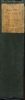
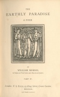

  
[Intangible Textual Heritage](../../../index.md)  [Legends &
Sagas](../../index)  [William Morris](../index)  [Index](index.md) 
[Next](ep301.md) 

------------------------------------------------------------------------

[Buy this Book at
Amazon.com](https://www.amazon.com/exec/obidos/ASIN/1402184662/internetsacredte.md)

------------------------------------------------------------------------

*The Earthly Paradise, (December-February)*, by William Morris,
\[1870\], at Intangible Textual Heritage

------------------------------------------------------------------------

###### THE

# EARTHLY PARADISE

##### A POEM.

 

###### BY

### WILLIAM MORRIS,

###### AUTHOR OF THE LIFE AND DEATH OF JASON.

#### PART IV.

#### *London:* F. S. ELLIS, 33 *King Street, Covent Garden*.

#### MDCCCLXX.

#### \[1870\]

Scanned at Intangible Textual Heritage, July 2007. Proofed and formatted
by John Bruno Hare, July 2007. This text is in the public domain in the
United States because it was published prior to January 1st, 1923. These
files may be used for any non-commercial use provided this notice of
attribution is left intact in all copies.

[  
Click to enlarge](img/spine.jpg.md)  
Spine  

[  
Click to enlarge](img/title.jpg.md)  
Title Page  

**LONDON:  
STRANGEWAYS AND WALDEN, PRINTERS,  
Castle St. Leicester Sq.**

------------------------------------------------------------------------

[Next: Contents](ep301.md)
