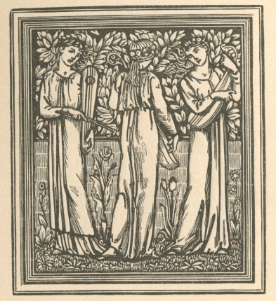

  
[Intangible Textual Heritage](../../../index.md)  [Legends &
Sagas](../../index)  [William Morris](../index)  [Index](index.md) 
[Previous](ep312.md) 

------------------------------------------------------------------------

[Buy this Book at
Amazon.com](https://www.amazon.com/exec/obidos/ASIN/1402184662/internetsacredte.md)

------------------------------------------------------------------------

*The Earthly Paradise, (December-February)*, by William Morris,
\[1870\], at Intangible Textual Heritage

------------------------------------------------------------------------

p. 444 p. 445

\[This is an alternate title page for the first volume, which was
inserted at the end of the last volume.—JBH\]

THE

EARTHLY PARADISE

A POEM.

 

BY

WILLIAM MORRIS,

AUTHOR OF THE LIFE AND DEATH OF JASON.

PARTS I. & II.

London: F. S. ELLIS, 33 King Street, Covent Garden.

MDCCCLXX\.

\[*All Rights reserved*.\]

p. a1

\[The following publisher advertisements followed the text of the poem
in the original book. They are reproduced here for completeness—JBH.\]

F. S. ELLIS'S PUBLICATIONS.

\_\_\_\_\_\_\_\_\_\_\_\_\_\_\_\_

MR. ROSSETTI'S POEMS.

Fourth Edition.

*Now Ready, crown 8vo. in an ornamental binding, designed by the T
Author. Price* 12*s*.

POEMS. BY DANTE GABRIEL ROSSETTI.

\_\_\_\_\_\_\_\_\_\_\_\_\_\_\_\_

OPINIONS OF THE PRESS.

**Academy**.

'This book, so eagerly looked for by those who know the author by his
great works in painting, has now been given to the public; nor is it
easy to exaggerate the value and importance of that gift, for the book
is complete and satisfactory from end to end; and in spite of the
intimate connexion between one art and another, it is certainly to be
wondered at that a master in the supremely difficult art of painting
should have qualities which enable him to deal with the other supremely
difficult one of poetry, and to do this not only with the utmost depth
of feeling and thought, but also with the most complete and unfaltering
mastery over its material; that he should find in its limitations and
special conditions, not stumbling-blocks or fetters, but just so many
pleasures, so much whetting of invention and imagination. In no poems is
the spontaneous and habitual interpenetration of matter and manner,
which is the essence of poetry, more complete than in these

In speaking of a book where the poems are so singularly equal in merit
as this, it has been scarcely possible to do more than name the most
important, and several even must remain unnamed; but it is something of
a satisfaction to finish with the mentioning the "Song of the Bower," so
full of passion and melody, and more like a song to be sung than any
modern piece I know. To conclude, I think these lyrics, with all their
other merits, the most complete of their time; no difficulty is avoided
in them, no subject is treated vaguely, languidly, or heartlessly; as
there is no commonplace or second-hand left in them to be atoned for by
beauty of execution, so no thought is allowed to overshadow that beauty
of art which compels a real poet to speak in verse and not in prose. Nor
do I know what lyrics of any time are to be called great, if we are to
deny that title to these.'

**Fortnightly Review**.

'There are no poems of the class (songs and sonnets) in English—I doubt
if there be any even in Dante's Italian—so rich at once and pure. Their
golden affluence of images and jewel-coloured words never once disguises
the firm outline, the justice and chastity of form.

p. a2

ROSSETTI'S POEMS.—*Opinions of the Press continued*.

No nakedness could be more harmonious, more consummate in its fleshly
sculpture, than the imperial array and ornament of this august poetry. .
There has been no work of the same pitch attempted since Dante sealed up
his youth in the sacred leaves of the "Vita Nuova;" and this poem of his
name-child and translator is a more various and mature work of kindred
genius and spirit . . . . . . . . The whole work ("Jenny") is worthy to
fill its place for ever as one of the most perfect and memorable poems
of an age or generation. It deals with deep and common things; with the
present hour and with all time; with that which is of the instant among
us, and that which has a message for all souls of men. There is just the
same life-blood and breath of poetic interest in this episode of a
London street and lodging as in the song of "Troy Town," and the song of
"Eden Bower;" just as much and no jot more. These two songs are the
masterpieces of Mr. Rossetti's magnificent lyric faculty . . . . . . .
Among English-speaking poets of his age I know of none who can
reasonably be said to have given higher proof of the highest qualities
than Mr. Rossetti, if the qualities we rate highest in poetry be
imagination, passion, thought, harmony, and variety of singing power. .
. . . . If he have not the full effluence of romance, or the keen
passion of human science, that give power on this hand to Morris, and on
that to Browning, his work has form and voice, shapeliness and
sweetness, unknown to the great analyst; it has weight and heat, gravity
and intensity, wanting to the less serious and ardent work of the latest
master of romance.'

**The Athenæum**.

'To the public in general this volume will announce a new poet. To a
small, but influential circle of thinkers, its publication will be only
the formal evidence of powers and accomplishments long since recognised.
. . . . . . Mr. Rossetti's genius, which delights to track emotion and
thought to their furthest retreats, and to grasp their most delicate and
evanescent traits, leads him occasionally into the vague and obscure;
but his excellencies, uncramped by the hard limitations of theory, have
their rise in those universal sources from which alone great poetry is
derived. His book evinces imagination, passion, vivid reality of
picture, and, as may be inferred from what we have said, special
subtlety in seizing the half-elusive suggestions of thought and feeling;
but it has nothing which proclaims the apostle of any one-sided, and
therefore temporary creed. . . .

'Of "Sister Helen," which displays the lyrical and dramatic faculties in
their fusion, it would be difficult to speak too highly. The story is
mediæval; in accordance with the arts of magic accepted at the time, a
young girl, who has lost love and honour, slowly burns away the waxen
effigy of her betrayer, in the faith that his life will waste and expire
with the melting wax. The vengeance of the implacable girl, contrasted
with the curiosity, deepening into terror, of her boy-brother (who
reports to her the prayer for mercy sent by the victim), and the

p. a3

chorus of awe and lamentation which seems to wail round the lattice, es
if the wind had been charged with a human cry, compose a picture the
tragic elevation of which cannot easily be surpassed  The reader must
take these examples as pledges that throughout the series he will meet
with beauty as rare and suggestion as fine as we have instanced. We
would direct him specially to a song, entitled, "The Woodspurge," which
intervenes between the sonnets. We have no further space for comment or
quotation; but we shall have written to little purpose if there be any
poem in the volume to which our readers will not eagerly resort.'

**Pall Mall Gazette**.

'Here is a volume of poetry upon which to congratulate the public and
the author; one of those volumes, coming so seldom and so welcome to the
cultivated reader, that are found at a first glance to promise the
delight of a new poetical experience. There is no mistaking the savour
of a book of strong and new poetry of a really high kind; no confounding
it wilt the milder effluence that greets us from a hundred current books
of poetry, in various degrees praiseworthy, or hopeful, or accomplished;
and we may say at once that it is the former and rarer savour that is
assuredly in the present case to be discerned. . . . . . . . There
remains a section of Mr. Rossetti's work which is perhaps most of all
characteristic of his peculiar genius, and which to those having most
sympathy with that genius will be especially stirring and delightful,
while to the general reader its contents are likely to remain to a
certain degree problematical and difficult. The last hundred pages of
the volume are occupied principally with sonnets, its last division of
all proclaiming the double artistic profession of the author by the
heading "Sonnets for Pictures, and other Sonnets." . . . . . . . . The
peculiar combination of exquisiteness with pregnancy, which is the note
of Mr. Rossetti's poetical diction, enables him to put a great deal into
a small space; and when one of these majestic and melodious sonnets
seems obscure, as it will seem at first, the reader will almost always
find, if he perseveres, that this is the obscurity not of emptiness or
confusion, but of closeness and concentration.'

**New Monthly Magazine**.

'These poems are imbued with a philosophy of no such narrow scope as
immortalises vistas and hollows, but with one which, serious and
far-reaching, engenders, if the phrase be not inappropriate, a wide
mental perspective within its moral horizon. The poetry is never
trifling, it blows none of those aëri-typed bubbles which please the
feminine even less than the effeminate mind, but is ever earnest. It
bears the mark of suffering (without which, alas! how poor is human
experience), but it is not the personal sorrow which is set forth, at
least not until it has been cast in the universal mould. and brought out
as a fitting study for all who under affliction need strength, under
trial, resignation.'

p. a4

MR. MORRIS'S WORKS.

THE EARTHLY PARADISE.

A Poem in Four Parts.

(SPRING, SUMMER, AUTUMN, AND WINTER.)

*Now complete in 4 Vols. crown 8vo. cl. price £2; or separately*—

PARTS I. and II. (Spring and Summer) 16*s*.

PART III. (Autumn) 12*s*.

PART IV. (Winter) 12*s*.

These volumes contain Twenty-five Tales in Verse, viz.:

 

PARTS I. AND II.

|                            |                             |
|----------------------------|-----------------------------|
| THE WANDERERS.             | THE LOVE OF ALCESTIS.       |
| ATALANTA'S RACE.           | THE LADY OF THE LAND.       |
| THE MAN BORN TO BE KING.   | THE SON OF CROESUS.         |
| THE DOOM OF KING ACRISIUS. | THE WATCHING OF THE FALCON. |
| THE PROUD KING.            |                             |
| CUPID AND PSYCHE.          | PYGMALION AND THE IMAGE.    |
| THE WRITING ON THE IMAGE.  | OGIER THE DANE.             |

PART III.

|                                                |                                  |
|------------------------------------------------|----------------------------------|
| THE DEATH OF PARIS.                            | THE MAN WHO NEVER LAUGHED AGAIN. |
| THE LAND EAST OF THE SUN AND WEST OF THE MOON. | THE STORY OF RHODOPE.            |
| ACONTIUS AND CYDIPPE.                          | THE LOVERS OF GUDRUN.            |

PART IV.

|                          |                          |
|--------------------------|--------------------------|
| THE GOLDEN APPLES.       | THE RING GIVEN TO VENUS. |
| THE FOSTERING OF ASLAUG. | BELLEROPHON IN LYCIA.    |
| BELLEROPHON AT ARGOS.    | THE HILL OF VENUS.       |

N. B.—*Purchasers of Parts I. and II. in 1 vol. (as originally issued)
will find a new title page for that volume in Part IV*.

p. a5

*Fifth Edition. Crown* 8*vo. cloth, price* 8*s*.

THE

LIFE AND DEATH OF JASON.

A Poem, in Seventeen Books.

By WILLIAM MORRIS, Author of 'The Earthly Paradise.'

\_\_\_\_\_\_\_\_\_\_\_\_\_\_\_\_

NOTICES OF MR. MORRIS'S WORKS.

**Times**.

'Morris's "Jason" is in the purest, simplest, most idiomatic English,
full of freshness, full of life, vivid in landscape, vivid in human
action—worth reading at the cost of many leisure hours, even to a busy
man.

'We must own that the minute attention Mr. Morris bestows on scenic
details he also applies to the various phases of human emotion, and
ofttimes he fills the eyes with sudden sorrowless tears of sympathy with
some homely trouble aptly rendered, or elevates our thoughts with themes
charming in their pure simplicity, and strong with deep pathos.'

**Saturday Review**.

'A thorough purity of thought and language characterises Mr. Morris, . .
and "The Earthly Paradise" is thereby adapted for conveying to our wives
and daughters a refined, though not diluted, version of those wonderful
creations of Greek fancy which the rougher sex alone is permitted to
imbibe at first hand. Yet in achieving this purification, Mr. Morris has
not imparted tameness into his versions. The impress of familiarity with
classic fable is stamped on his pages, and echoes of the Greek are
wafted to us from afar both delicately and imperceptibly. . . . Suffice
it to say, that we have enjoyed such a thorough treat in this, in every
sense, rare volume, that we heartily commend it to our readers.

'OF PART III.—Those who found the charm of Mr. Morris's first volume so
rare and novel that they were fain to sigh when the last page was
finished, may now congratulate themselves upon the publication of a
third part. Nor will they, in what is now presented to them, deem that
aught of this charm is diminished through the circumstance that style
and manner are no longer novel.'

**The Athenæum**.

'It may be doubted whether any poet of our day equals Mr. Morris in
enabling his readers to see the objects which are presented to him. It
is certain, however, that this power has never been displayed on so
large a scale by any contemporary. A word or two should be said on the
brief descriptions of the months, and upon the musings of the wanderers,
both of which intervene between the respective stories. Of these the
former afford relief, by fresh and graphic glimpses, of the passing
seasons, and the latter are written in a sweet and pensive vein, which,
after the stir and interest of the narrative portion, floats to the ear
like music caught from sea in the momentary lull of the billows.'

p. a6

NOTICES OF MR. MORRIS'S WORKS.—*Continued*.

THE EARTHLY PARADISE.

OF PART III.—'A volume which, in its treatment of human motives and
feelings, displays, we think, higher qualities than the writer has yet
exhibited, and which in its painting of external scenes has that
admirable fusion of the real and ideal which we have praised
heretofore.'

**Pall Mall Gazette**.

The book must be read by any one who wishes to know what it is like; and
few will read it without recognising its author for a poet who has
struck a new vein, and who preferring his art above popularity, has
achieved a work which will yet be popular wherever true poetry is
understood.

OF PART III: 'In the noble story of "Gudrun" this (dramatic) power is
well sustained throughout, and in versifying this Saga, Mr. Morris has
added a genuine and pathetic vitality to the characters of the
ill-starred heroine of Olaf and Oswif, Kiartan and Bodli, Ingibiorg and
Refna. This poem, taken altogether, the most ambitious that Mr. Morris
has yet produced, is well worth a careful analysis, which, however, we
have no space to give it.'

\_\_\_\_\_\_\_\_\_\_\_\_\_\_\_\_\_\_\_\_\_\_\_\_\_\_\_\_

*Crown* 8*vo. cloth, price* 8*s.*

THE STORY OF GRETTIR THE STRONG.

Translated from the Icelandic of the Grettis Saga (one of the most
remarkable prose works of ancient Icelandic Literature),

By W. MORRIS AND E. MAGNÚSSON.

\_\_\_\_\_\_\_\_\_\_\_\_\_\_\_\_\_\_\_\_\_\_\_

**The Guardian**.

'We have only lately been made aware of the treasures of poetry which
lie hid in Icelandic literature. . . These are Homeric in their force
and truth and simplicity; and they have the advantage to English readers
of setting forth a form of life which, in spite of its rudeness and
fierceness, is much more intelligible and akin to our own notions than
that of the warriors on the plains of Troy. The "Story of Grettir the
Strong" is an excellent sample of these. . . . . . All sorts of wild and
romantic adventures intervene; and the homely northern life, with its
farming and fighting and feasting, and its singular respect, in the
midst of all its violence, for recognised law, comes out with wonderful
distinctness. The Saga has, moreover, enjoyed the great advantage of
having a poet for its translator. Under the skilful hands of Mr. William
Morris the vigour and directness of the original has not been allowed to
evaporate.'

**Saturday Review**.

'The translator's work has been admirably done; the English may fairly
be called faultless; and it is no slight satisfaction to read a book in
which everything is expressed in the fittest phrase, and in which we
feel no temptation to stake any verbal changes.'

p. a7

*Now ready, crown* 8*vo. in an ornamental binding designed for the
Author, price* 12*s*.

THE STORY OF THE VOLSUNGS AND NIBLUNGS.

With Songs translated from the Elder Edda.

By WILLIAM MORRIS and E. MAGNÚSSON.

\_\_\_\_\_\_\_\_\_\_\_\_\_\_\_\_\_\_\_\_\_

**The Athenæum**.

'The name of the author of "Jason" and "The Earthly Paradise" is in
itself enough to draw our eyes with respect and expectation to this
book. It is the first English translation of a famous Icelandic Saga or
heroic romance, the original prose of which was composed, probably, in
the twelfth century, from floating traditions and from songs and
fragments of songs. . . . . . . This "Volsunga Saga" is the Icelandic
version of the famous story, which has been called the Iliad of Northern
Europe Every student of popular legendary lore will find this faithful
and fine translation highly valuable, and it is, moreover, a thing to be
grateful for as a permanent accession to English literature. . . . . . .
To conclude a notice which our space will not allow us to enlarge, we
trust this strange old story, in its present dress, will find readers.
The English, although we should say too elaborately and obtrusively
archaic, is, on the whole, noble and pure—a marvel in these hasty days
of novel and newspaper.'

**Pall Mall Gazette**.

'A work like this entitles its authors to a place of honour among those
labouring at that revival of the past, which is the great intellectual
task of our time. . . . . . . It is in the central incident of
Brynhild's wrath and Sigurd's murder that the real greatness of the work
lies. A real human sentiment finds in this place an utterance signally
impressive—the sentiment of blind despair, the bitterness burning into
rage, that arise out of the relations of a man and woman loving one
another, but with the life of each fatally given where love is not. . .
. . . . In the rendering of these poems (of which others are fine,
although this is the finest) our authors have been distinctly felicitous
with their short and unrhymed anapœstic metre, into which they have
succeeded in throwing an amount of fire and modulation such as would
scarcely have been looked for.'

'So draw ye mend and hearken, English folk,  
   Unto the best tale pity ever wrought!  
 Of how from dark to dark bright Sigurd broke:  
   Of Brynhild's glorious soul with love distraught;  
   Of Gundrun's weary wandering unto nought,  
 Of utter love defeated utterly;  
 Of grief too strong to give Love time to die!'  
  
                                 From the *Prologue in Verse*, by Mr.
Morris.

p. 8

8*vo. cloth gilt, 10*s*. 6*d.

THE VOIAGE AND TRAVAILE OF

SIR JOHN MAUNDEVILE, KT.

A.D. 1322-46.

Which Treateth of the Way to Hierusalem; and of the Marvayles of Inde,
with other Ilands and Countryes.

Illustrated with 72 most curious Wood Engravings. Originally Printed in
English by Richard Pynson.

NOW REPRINTED, WITH AN INTRODUCTION, NOTES, AND A GLOSSARY.

By J. O. HALLIWELL, Esq.

'Wherever English, in its early, robust, manly form, is read, Sir John
Maundevile is admired. His humble piety, his solemn reverence for the
holy places which he visited, his simple faith in all he heard, his
acute observation of what he actually saw, his self-sacrifice, his
devotion, his credulity, his firm faith, his long endurance, appear in
almost every page, and make his volume not only the earliest, but one of
the noblest of its class.'

Now ready, crown 8vo. cloth, price 7s. 6d.

\_\_\_\_\_\_\_\_\_\_\_\_\_\_\_\_\_\_\_\_\_\_\_\_\_

'COMMONPLACE:' A TALE OF TO-DAY,

AND OTHER STORIES.

By CHRISTINA G. ROSSETTI, Author of 'Goblin Market.'

**The Athenæum**.

'Miss Rossetti's volume of tales appears most opportunely. Many of the
readers of "Lothair" are at this time longing for some more homely
fiction with which to refresh their jaded faculties after the perusal of
Mr. Disraeli's somewhat tawdry romance. To all such persons we recommend
"Commonplace." Nothing could be more striking than the contrast. While
"Lothair" abounds in startling incidents, to which Mr. Disraeli in vain
attempts to give an air of reality by frequent allusion to the events of
the day, and to the personal characteristics of individuals, Miss
Rossetti contrives out of the most ordinary incidents of commonplace
life to produce a realistic fiction more absorbing in its interest than
any sensational novel. The book, as a whole, is sufficient to establish
Miss Rossetti's claim to a place in the list of successful female
writers of fiction. We sincerely hope that it will not be long before
she produces another volume of tales in the sane style.'

**Literary Churchman**.

'The stories entirely belie the name which stands as title to the
volume. They are altogether the reverse of commonplace, being graceful
and delicately worked-out tales of a very refined and superior order.
One of them, "Hero," is a charming fairy-tale on the old subject of the
vanity of human wishes. Another, "The Waves of this Troublesome World,"
is full of true and natural pathos. Altogether we can heartily recommend
it to our friends.'

\_\_\_\_\_\_\_\_\_\_\_\_\_\_\_\_\_\_\_\_\_\_

LONDON:

F. S. ELLIS, 33 KING STREET, COVENT GARDEN.

 
