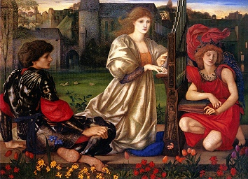

  
[Intangible Textual Heritage](../../../index)  [Legends &
Sagas](../../index)  [William Morris](../index) 

------------------------------------------------------------------------

[Buy this Book at
Amazon.com](https://www.amazon.com/exec/obidos/ASIN/1402184662/internetsacredte)

------------------------------------------------------------------------

<table width="75%">
<colgroup>
<col style="width: 50%" />
<col style="width: 50%" />
</colgroup>
<tbody>
<tr class="odd">
<td width="50%" data-valign="TOP"></td>
<td width="50%" data-valign="CENTER"><h1 id="the-earthly-paradise" data-align="CENTER">The Earthly Paradise</h1>
<h5 id="december-february" data-align="CENTER">December-February</h5>
<h2 id="by-william-morris" data-align="CENTER">by William Morris</h2>
<h4 id="section" data-align="CENTER">[1870]</h4></td>
</tr>
</tbody>
</table>

------------------------------------------------------------------------

[Contents](#contents)    [Start Reading](ep300)

------------------------------------------------------------------------

[March-August](../ep1/index) \|  [September-November](../ep2/index) \| 
**December-February**

------------------------------------------------------------------------

|                                                                                                                           |
|---------------------------------------------------------------------------------------------------------------------------|
|  |

This is the third part of a three part etext of William Morris'
epic-length poem, The Earthly Paradise. In this section Morris weaves
more tales from Northern and Classical mythology; including the tale of
Hercules and the Golden Apples; Aslaug, the daughter of Sigurd and
Brynhild; the myth of Bellerophon; and two tales of the Goddess Venus.

Confusingly, this is actually part IV of the original edition (the first
volume was conidered part I and II).

------------------------------------------------------------------------

 [Title Page](ep300)  
[Contents](ep301)  

### December

[Introduction](ep302)  
[The Golden Apples](ep303)  
[The Fostering of Aslaug](ep304)  

### January

[Introduction](ep305)  
[Bellerophon at Argos](ep306)  
[The Ring Given to Venus](ep307)  

### February

[Introduction](ep308)  
[Bellerophon in Lycia](ep309)  
[The Hill of Venus](ep310)  

 

[Epilogue](ep311)  
[L’Envoi](ep312)  
[Advertisements and End Matter](ep313)  
