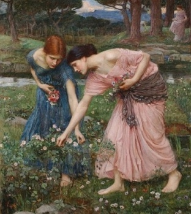

  
[Intangible Textual Heritage](../../../index.md)  [Legends and
Sagas](../../index)  [William Morris](../index.md) 

------------------------------------------------------------------------

<table width="75%">
<colgroup>
<col style="width: 50%" />
<col style="width: 50%" />
</colgroup>
<tbody>
<tr class="odd">
<td width="50%" data-valign="TOP"></td>
<td width="50%" data-valign="CENTER"><h1 id="the-roots-of-the-mountains" data-align="CENTER">The Roots of the Mountains</h1>
<h2 id="by-william-morris" data-align="CENTER">by William Morris</h2>
<h4 id="section" data-align="CENTER">[1889]</h4></td>
</tr>
</tbody>
</table>

------------------------------------------------------------------------

[Contents](#contents)    [Start Reading](rotm00.md)    [Text
\[Zipped\]](rotm.txt.gz.md)

------------------------------------------------------------------------

This is one of William Morris' fantasy novels set in a fairy-tale
Icelandic setting. The quest of Face-of-god, told in the voice of the
sagas, will satisfy any modern fantasy reader.

------------------------------------------------------------------------

 [Title Page](rotm00.md)  
[Contents](rotm01.md)  
[Chapter I. Of Burgstead and its Folk and its Neighbours](rotm02.md)  
[Chapter II. Of Face-of-god and his Kindred](rotm03.md)  
[Chapter III. They Talk of Divers Matters in the Hall](rotm04.md)  
[Chapter IV. Face-of-god Fareth to the Wood Again](rotm05.md)  
[Chapter V. Face-of-god Falls in with Menfolk on the Mountain](rotm06.md)  
[Chapter VI. Of Face-of-god and those Mountain-Dwellers](rotm07.md)  
[Chapter VII. Face-of-god Talketh with the Friend on the
Mountain](rotm08.md)  
[Chapter VIII. Face-of-god Cometh Home Again to Burgstead](rotm09.md)  
[Chapter IX. Those Brethren Fare to the Yewwood with the
Bride](rotm10.md)  
[Chapter X. New Tidings in the Dale](rotm11.md)  
[Chapter XI. Men Make Oath at Burgstead on the Holy Boar](rotm12.md)  
[Chapter XII. Stone-Face Telleth Concerning the Wood-Wights](rotm13.md)  
[Chapter XIII. They Fare to the Hunting of the Elk](rotm14.md)  
[Chapter XIV. Concerning Face-of-god and the Mountain](rotm15.md)  
[Chapter XV. Murder Amongst the Folk of the Woodlanders](rotm16.md)  
[Chapter XVI. The Bride Speaketh with Face-of-god](rotm17.md)  
[Chapter XVI. The Token Cometh from the Mountain](rotm18.md)  
[Chapter XVIII. Face-of-god Talketh with the Friend in Shadowy
Vale](rotm19.md)  
[Chapter XIX. The Fair Woman Telleth Face-of-god of her
Kindred](rotm20.md)  
[Chapter XX. Those Two Together Hold the Ring of the
Earth-God](rotm21.md)  
[Chapter XXI. Face-of-god Looketh on the Dusky Men](rotm22.md)  
[Chapter XXII. Face-of-god Cometh Home to Burgstead](rotm23.md)  
[Chapter XXIII. Talk in the Hall of the House of the Face](rotm24.md)  
[Chapter XXIV. Face-of-god Giveth that Token to the Bride](rotm25.md)  
[Chapter XXV. Of the Gate-Thing at Burgstead](rotm26.md)  
[Chapter XXVI. The Ending of the Gate-Thing](rotm27.md)  
[Chapter XXVII. Face-of-god Leadeth a Band Through the Wood](rotm28.md)  
[Chapter XXVIII. The Men of Burgdale Meet the Runaways](rotm29.md)  
[Chapter XXIX. They Bring the Runaways to Burgstead](rotm30.md)  
[Chapter XXX. Hall-Face Goeth Toward Rose-Dale](rotm31.md)  
[Chapter XXXI. Of The Weapon-Show of the Men of Burgdale and Their
Neighbours](rotm32.md)  
[Chapter XXXII. The Men of Shadowy Vale Come to the Spring Market at
Burgstead](rotm33.md)  
[Chapter XXXIII. The Alderman Gives Gifts to Them of Shadowy
Vale](rotm34.md)  
[Chapter XXXIV. The Chieftains Take Counsel in the Hall of the
Face](rotm35.md)  
[Chapter XXXV. Face-of-god Talketh with the Sun-Beam](rotm36.md)  
[Chapter XXXVI. Folk-Might Speaketh with the Bride](rotm37.md)  
[Chapter XXXVII. Of the Folk-Mote of the Dalesmen, the Shepherd-Folk,
and the Woodland Carles: the Banner of the Wolf Displayed](rotm38.md)  
[Chapter XXXVIII. Of the Great Folk-Mote: Atonements Given, and Men Made
Sackless](rotm39.md)  
[Chapter XXXIX. Of the Great Folk-Mote: Men Take Rede of the War-Faring,
the Fellowship, and the War-Leader. Folk-Might Telleth Whence His People
Came. The Folk-Mote Sundered.](rotm40.md)  
[Chapter XL. Of the Hosting in Shadowy Vale](rotm41.md)  
[Chapter XLI. The Host Departeth From Shadowy Vale: The First Day's
Journey](rotm42.md)  
[Chapter XLII. The Host Cometh to the Edges of Silver-Dale](rotm43.md)  
[Chapter XLIII. Face-of-god Looketh on Silver-Dale: the Bowmen's
Battle](rotm44.md)  
[Chapter XLIV. Of the Onslaught of the Men of the Steer, the Bridge, and
the Bull](rotm45.md)  
[Chapter XLV. Of Face-of-god's Onslaught](rotm46.md)  
[Chapter XLVI. Men Meet in the Market of Silver-Stead](rotm47.md)  
[Chapter XLVII. The Kindreds Win the Mote-House](rotm48.md)  
[Chapter XLVIII. Men Sing in the Mote-House](rotm49.md)  
[Chapter XLIX. Dallach Fareth to Rose-Dale: Crow Telleth of his Errand:
the Kindreds Eat Their Meat in Silver-Dale](rotm50.md)  
[Chapter L. Folk-might Seeth the Bride and Speaketh with her](rotm51.md)  
[Chapter LI. The Dead Borne to Bale: The Mote-House
Re-Hallowed](rotm52.md)  
[Chapter LII. Of the New Beginning of Good Days in
Silver-Dale](rotm53.md)  
[Chapter LIII. Of the Word Which Hall-ward of the Steer had for
Folk-might](rotm54.md)  
[Chapter LIV. Tidings of Dallach: A Folk-Mote in Silver-Dale](rotm55.md)  
[Chapter LV. Departure from Silver-Dale](rotm56.md)  
[Chapter LVI. Talk Upon the Wild-Wood Way](rotm57.md)  
[Chapter LVII. How the Host Came Home Again](rotm58.md)  
[Chapter LVIII. How The Maiden Ward was Held in Burgdale](rotm59.md)  
[Chapter LIX. The Behest of Face-of-god to the Bride Accomplished: a
Mote-Stead Appointed for the Three Folks, to Wit, the Men of Burgdale,
the Shepherds, and the Children of the Wolf](rotm60.md)  
