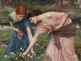

  
[Intangible Textual Heritage](../../../index)  [Legends and
Sagas](../../index)  [William Morris](../index)  [Index](index) 
[Next](rotm01) 

------------------------------------------------------------------------

  
*The Roots of the Mountains*, by William Morris, \[1889\], at Intangible
Textual Heritage

------------------------------------------------------------------------

THE ROOTS OF THE MOUNTAINS

WHEREIN IS TOLD SOMEWHAT OF THE LIVES OF THE MEN OF BURGDALE THEIR
FRIENDS THEIR NEIGHBOURS THEIR FOEMEN AND THEIR FELLOWS IN ARMS

BY WILLIAM MORRIS

London: Longmans, Green

\[1889\]

Whiles carried o'er the iron road,  
We hurry by some fair abode;  
The garden bright amidst the hay,  
The yellow wain upon the way,  
The dining men, the wind that sweeps  
Light locks from off the sun-sweet heaps -  
The gable grey, the hoary roof,  
Here now--and now so far aloof.  
How sorely then we long to stay  
And midst its sweetness wear the day,  
And 'neath its changing shadows sit,  
And feel ourselves a part of it.  
Such rest, such stay, I strove to win  
With these same leaves that lie herein.

------------------------------------------------------------------------

[Next: Contents](rotm01)

