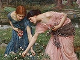

  
[Intangible Textual Heritage](../../../index)  [Legends and
Sagas](../../index)  [William Morris](../index)  [Index](index) 
[Previous](rotm00)  [Next](rotm02) 

------------------------------------------------------------------------

  
*The Roots of the Mountains*, by William Morris, \[1889\], at Intangible
Textual Heritage

------------------------------------------------------------------------

[Chapter I. Of Burgstead and its Folk and its
Neighbours](rotm02.htm#an_f01)

[Chapter II. Of Face-of-god and his Kindred](rotm03.htm#an_f02)

[Chapter III. They Talk of Divers Matters in the
Hall](rotm04.htm#an_f03)

[Chapter IV. Face-of-god Fareth to the Wood Again](rotm05.htm#an_f04)

[Chapter V. Face-of-god Falls in with Menfolk on the
Mountain](rotm06.htm#an_f05)

[Chapter VI. Of Face-of-god and those
Mountain-Dwellers](rotm07.htm#an_f06)

[Chapter VII. Face-of-god Talketh with the Friend on the
Mountain](rotm08.htm#an_f07)

[Chapter VIII. Face-of-god Cometh Home Again to
Burgstead](rotm09.htm#an_f08)

[Chapter IX. Those Brethren Fare to the Yewwood with the
Bride](rotm10.htm#an_f09)

[Chapter X. New Tidings in the Dale](rotm11.htm#an_f10)

[Chapter XI. Men Make Oath at Burgstead on the Holy
Boar](rotm12.htm#an_f11)

[Chapter XII. Stone-Face Telleth Concerning the
Wood-Wights](rotm13.htm#an_f12)

[Chapter XIII. They Fare to the Hunting of the Elk](rotm14.htm#an_f13)

[Chapter XIV. Concerning Face-of-god and the
Mountain](rotm15.htm#an_f14)

[Chapter XV. Murder Amongst the Folk of the
Woodlanders](rotm16.htm#an_f15)

[Chapter XVI. The Bride Speaketh with Face-of-god](rotm17.htm#an_f16)

[Chapter XVI. The Token Cometh from the Mountain](rotm18.htm#an_f17)

[Chapter XVIII. Face-of-god Talketh with the Friend in Shadowy
Vale](rotm19.htm#an_f18)

[Chapter XIX. The Fair Woman Telleth Face-of-god of her
Kindred](rotm20.htm#an_f19)

[Chapter XX. Those Two Together Hold the Ring of the
Earth-God](rotm21.htm#an_f20)

[Chapter XXI. Face-of-god Looketh on the Dusky Men](rotm22.htm#an_f21)

[Chapter XXII. Face-of-god Cometh Home to Burgstead](rotm23.htm#an_f22)

[Chapter XXIII. Talk in the Hall of the House of the
Face](rotm24.htm#an_f23)

[Chapter XXIV. Face-of-god Giveth that Token to the
Bride](rotm25.htm#an_f24)

[Chapter XXV. Of the Gate-Thing at Burgstead](rotm26.htm#an_f25)

[Chapter XXVI. The Ending of the Gate-Thing](rotm27.htm#an_f26)

[Chapter XXVII. Face-of-god Leadeth a Band Through the
Wood](rotm28.htm#an_f27)

[Chapter XXVIII. The Men of Burgdale Meet the
Runaways](rotm29.htm#an_f28)

[Chapter XXIX. They Bring the Runaways to Burgstead](rotm30.htm#an_f29)

[Chapter XXX. Hall-Face Goeth Toward Rose-Dale](rotm31.htm#an_f30)

[Chapter XXXI. Of The Weapon-Show of the Men of Burgdale and Their
Neighbours](rotm32.htm#an_f31)

[Chapter XXXII. The Men of Shadowy Vale Come to the Spring Market at
Burgstead](rotm33.htm#an_f32)

[Chapter XXXIII. The Alderman Gives Gifts to Them of Shadowy
Vale](rotm34.htm#an_f33)

[Chapter XXXIV. The Chieftains Take Counsel in the Hall of the
Face](rotm35.htm#an_f34)

[Chapter XXXV. Face-of-god Talketh with the Sun-Beam](rotm36.htm#an_f35)

[Chapter XXXVI. Folk-Might Speaketh with the Bride](rotm37.htm#an_f36)

[Chapter XXXVII. Of the Folk-Mote of the Dalesmen, the Shepherd-Folk,
and the Woodland Carles: the Banner of the Wolf
Displayed](rotm38.htm#an_f37)

[Chapter XXXVIII. Of the Great Folk-Mote: Atonements Given, and Men Made
Sackless](rotm39.htm#an_f38)

[Chapter XXXIX. Of the Great Folk-Mote: Men Take Rede of the War-Faring,
the Fellowship, and the War-Leader. Folk-Might Telleth Whence His People
Came. The Folk-Mote Sundered.](rotm40.htm#an_f39)

[Chapter XL. Of the Hosting in Shadowy Vale](rotm41.htm#an_f40)

[Chapter XLI. The Host Departeth From Shadowy Vale: The First Day's
Journey](rotm42.htm#an_f41)

[Chapter XLII. The Host Cometh to the Edges of
Silver-Dale](rotm43.htm#an_f42)

[Chapter XLIII. Face-of-god Looketh on Silver-Dale: the Bowmen's
Battle](rotm44.htm#an_f43)

[Chapter XLIV. Of the Onslaught of the Men of the Steer, the Bridge, and
the Bull](rotm45.htm#an_f44)

[Chapter XLV. Of Face-of-god's Onslaught](rotm46.htm#an_f45)

[Chapter XLVI. Men Meet in the Market of
Silver-Stead](rotm47.htm#an_f46)

[Chapter XLVII. The Kindreds Win the Mote-House](rotm48.htm#an_f47)

[Chapter XLVIII. Men Sing in the Mote-House](rotm49.htm#an_f48)

[Chapter XLIX. Dallach Fareth to Rose-Dale: Crow Telleth of his Errand:
the Kindreds Eat Their Meat in Silver-Dale](rotm50.htm#an_f49)

[Chapter L. Folk-might Seeth the Bride and Speaketh with
her](rotm51.htm#an_f50)

[Chapter LI. The Dead Borne to Bale: The Mote-House
Re-Hallowed](rotm52.htm#an_f51)

[Chapter LII. Of the New Beginning of Good Days in
Silver-Dale](rotm53.htm#an_f52)

[Chapter LIII. Of the Word Which Hall-ward of the Steer had for
Folk-might](rotm54.htm#an_f53)

[Chapter LIV. Tidings of Dallach: A Folk-Mote in
Silver-Dale](rotm55.htm#an_f54)

[Chapter LV. Departure from Silver-Dale](rotm56.htm#an_f55)

[Chapter LVI. Talk Upon the Wild-Wood Way](rotm57.htm#an_f56)

[Chapter LVII. How the Host Came Home Again](rotm58.htm#an_f57)

[Chapter LVIII. How The Maiden Ward was Held in
Burgdale](rotm59.htm#an_f58)

[Chapter LIX. The Behest of Face-of-god to the Bride Accomplished: a
Mote-Stead Appointed for the Three Folks, to Wit, the Men of Burgdale,
the Shepherds, and the Children of the Wolf](rotm60.htm#an_f59)

------------------------------------------------------------------------

[Next: Chapter I. Of Burgstead and its Folk and its Neighbours](rotm02)

