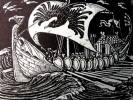

  
[Intangible Textual Heritage](../../../index.md)  [Legends and
Sagas](../../index)  [William Morris](../index)  [Index](index.md) 
[Previous](sglt00)  [Next](sglt02.md) 

------------------------------------------------------------------------

  
*The Story of the Glittering Plain*, by William Morris, \[1891\], at
Intangible Textual Heritage

------------------------------------------------------------------------

CONTENTS

[Chapter I. Of Those Three Who Came to the House of the
Raven](sglt02.htm#an_f01.md)

[Chapter II. Evil Tidings Come to Hand at Cleveland](sglt03.htm#an_f02.md)

[Chapter III. The Warriors of the Raven Search the
Seas](sglt04.htm#an_f03.md)

[Chapter IV. Now Hallblithe Taketh the Sea](sglt05.htm#an_f04.md)

[Chapter V. They Come unto the Isle of Ransom](sglt06.htm#an_f05.md)

[Chapter VI. Of A Dwelling of Man on the Isle of
Ransom](sglt07.htm#an_f06.md)

[Chapter VII. A Feast in the Isle of Ransom](sglt08.htm#an_f07.md)

[Chapter VIII. Hallblithe Taketh Ship Again Away from the Isle of
Ransom](sglt09.htm#an_f08.md)

[Chapter IX. They Come to the Land of the Glittering
Plain](sglt10.htm#an_f09.md)

[Chapter X. They Hold Converse with Folk of the Glittering
Plain](sglt11.htm#an_f10.md)

[Chapter XI. The Sea-Eagle Reneweth His Life](sglt12.htm#an_f11.md)

[Chapter XII. They Look on the King of the Glittering
Plain](sglt13.htm#an_f12.md)

[Chapter XIII. Hallblithe Beholdeth the Woman who Loveth
Him](sglt14.htm#an_f13.md)

[Chapter XIV. Hallblithe has Speech with the King
Again](sglt15.htm#an_f14.md)

[Chapter XV. Yet Hallblithe Speaketh with the King](sglt16.htm#an_f15.md)

[Chapter XVI. Those Three Go Their Ways to the Edge of the Glittering
Plain](sglt17.htm#an_f16.md)

[Chapter XVII. Hallblithe Amongst the Mountains](sglt18.htm#an_f17.md)

[Chapter XVIII. Hallblithe Dwelleth in the Wood
Alone](sglt19.htm#an_f18.md)

[Chapter XIX. Hallblithe Builds Him A Skiff](sglt20.htm#an_f19.md)

[Chapter XX. So Now Saileth Hallblithe Away From the Glittering
Plain](sglt21.htm#an_f20.md)

[Chapter XXI. Of the Fight of the Champions in the Hall of the
Ravagers](sglt22.htm#an_f21.md)

[Chapter XXII. They go from the Isle of Ransom and Come to Cleveland by
the Sea](sglt23.htm#an_f22.md)

------------------------------------------------------------------------

[Next: Chapter I. Of Those Three Who Came to the House of the
Raven](sglt02.md)

