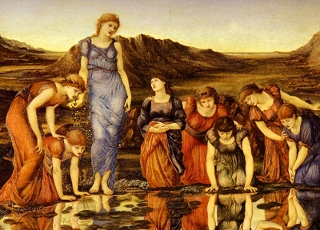

  
[Intangible Textual Heritage](../../../index.md)  [Legends and
Sagas](../../index)  [William Morris](../index.md) 

------------------------------------------------------------------------

<table width="75%">
<colgroup>
<col style="width: 50%" />
<col style="width: 50%" />
</colgroup>
<tbody>
<tr class="odd">
<td width="50%" data-valign="TOP"> 
</td>
<td width="50%" data-valign="CENTER"><h1 id="the-sundering-flood" data-align="CENTER">The Sundering Flood</h1>
<h2 id="by-william-morris" data-align="CENTER">by William Morris</h2>
<h4 id="section" data-align="CENTER">[1897]</h4></td>
</tr>
</tbody>
</table>

------------------------------------------------------------------------

[Contents](#contents)    [Start Reading](sunf00.md)    [Text
\[Zipped\]](sunf.txt.gz.md)

------------------------------------------------------------------------

The Sundering Flood was William Morris' last work of fiction, the ending
dictated on his death bed to his daughter May. It tells the story of two
lovers, Osberne Wulfgrimson, and Elfhild, who live in a medieval fantasy
world. Separated by a massive river, the Sundering Flood, Elfhild
disappears during a raid by pirates. Osberne takes up his magical sword
Boardcleaver, and helps overthrow the raiders. He finally locates
Elfhild, who was hidden in the Wood Masterless with a healing woman.
They return to Wethermel, Osberne's home, and all live happily.

------------------------------------------------------------------------

 [Title Page](sunf00.md)  
[Contents](sunf01.md)  
[Map](sunf02.md)  
[Chapter I. Of a River Called the Sundering Flood, and of the Folk that
Dwelt Thereby](sunf03.md)  
[Chapter II. Of Wethermel and the Child Osberne](sunf04.md)  
[Chapter III. Wolves Harry the Flock](sunf05.md)  
[Chapter IV. Surly John Falls Out with the Goodman](sunf06.md)  
[Chapter V. Osberne Slays the Wolves](sunf07.md)  
[Chapter VI. They Fare to the Cloven Mote](sunf08.md)  
[Chapter VII. Of a Newcomer, and His Gift to Osberne](sunf09.md)  
[Chapter VIII. The Goodman Gets a New Hired Man](sunf10.md)  
[Chapter IX. The Bight of the Cloven Knoll](sunf11.md)  
[Chapter X. Osberne and Elfhild Hold Converse Together](sunf12.md)  
[Chapter XI. Osberne Shoots a Gift Across the Flood](sunf13.md)  
[Chapter XII. Of a Guest Called Waywearer](sunf14.md)  
[Chapter XIII. Steelhead Gives Osberne the Sword Boardcleaver](sunf15.md)  
[Chapter XIV. The Gifts of Steelhead](sunf16.md)  
[Chapter XV. Surly John Brings a Guest to Wethermel](sunf17.md)  
[Chapter XVI. Hardcastle Would Seize Wethermel](sunf18.md)  
[Chapter XVII. The Slaying of Hardcastle](sunf19.md)  
[Chapter XVIII. Elfhild Hears of the Slaying](sunf20.md)  
[Chapter XIX. The Winter Passes and Elfhild Tells of the Death of Her
Kinswoman](sunf21.md)  
[Chapter XX. Osberne Fares to Eastcheaping and Brings Gifts for
Elfhild](sunf22.md)  
[Chapter XXI. Warriors from Eastcheaping Ride into the Dale](sunf23.md)  
[Chapter XXII. Osberne Takes Leave of Elfhild](sunf24.md)  
[Chapter XXIII. Osberne Is Chosen Captain of the Dalesmen](sunf25.md)  
[Chapter XXIV. A Skirmish with the Baron of Deepdale in the
Marshes](sunf26.md)  
[Chapter XXV. Stephen Tells of an Adventure in the Camp of the
Foemen](sunf27.md)  
[Chapter XXVI. They Bring the Baron into Eastcheaping](sunf28.md)  
[Chapter XXVII. They Parley from the Walls](sunf29.md)  
[Chapter XXVIII. The Baron of Deepdale Makes Peace](sunf30.md)  
[Chapter XXIX. Osberne and His Men Return to Wethermel](sunf31.md)  
[Chapter XXX. Osberne Goes to the Trysting-Place](sunf32.md)  
[Chapter XXXI. They Meet Through Autumn and Winter](sunf33.md)  
[Chapter XXXII. Foemen Among the West Dalers](sunf34.md)  
[Chapter XXXIII. Osberne Seeks Tidings of Elfhild](sunf35.md)  
[Chapter XXXIV. Osberne Sorrows for the Loss of Elfhild](sunf36.md)  
[Chapter XXXV. Osberne Seeks Counsel of Steelhead](sunf37.md)  
[Chapter XXXVI. The Staves which Osberne Taught to the
Dalesmen](sunf38.md)  
[Chapter XXXVII. Osberne Takes Leave of Wethermel](sunf39.md)  
[Chapter XXXVIII. Osberne Parts from Stephen the Eater](sunf40.md)  
[Chapter XXXIX. Osberne Gets Him a New Master](sunf41.md)  
[Chapter XL. Osberne Rides with Sir Godrick](sunf42.md)  
[Chapter XLI. They Joust with the Knight of the Fish](sunf43.md)  
[Chapter XLII. They Deliver the Thorp-Dwellers from the Black
Skinners](sunf44.md)  
[Chapter XLIII. They Come to the Edge of the Wood Masterless](sunf45.md)  
[Chapter XLIV. They Reach Longshaw and Osberne Gets Him a New
Name](sunf46.md)  
[Chapter XLV. The Red Lad Scatters the Host of the Barons](sunf47.md)  
[Chapter XLVI. Osberne Enters the City of the Sundering Flood](sunf48.md)  
[Chapter XLVII. The Battle in the Square](sunf49.md)  
[Chapter XLVIII. Sir Godrick Is Chosen Burgreve of the City](sunf50.md)  
[Chapter XLIX. Of the City King and the Outland King](sunf51.md)  
[Chapter L. The Red Lad Speaks Privily with Sir Godrick](sunf52.md)  
[Chapter LI. Osberne is Beguiled by Felons](sunf53.md)  
[Chapter LII. The Meeting of Osberne and Elfhild](sunf54.md)  
[Chapter LIII. Strangers Come to Wethermel](sunf55.md)  
[Chapter LIV. The Carline Beginneth Her Tale](sunf56.md)  
[Chapter LV. The Blue Knight Buys the Maiden of the Chapman](sunf57.md)  
[Chapter LVI. The Blue Knight Talks with the Maiden by the
Way](sunf58.md)  
[Chapter LVII. They Come to Brookside](sunf59.md)  
[Chapter LVIII. Peaceful Days in the Castle of Brookside](sunf60.md)  
[Chapter LIX. Tidings of Longshaw and of the Hosting of the Barons'
League](sunf61.md)  
[Chapter LX. The Blue Knight Gathers Men and Departs from
Brookside](sunf62.md)  
[Chapter LXI. The Maiden and the Carline Flee to the Grey
Sisters](sunf63.md)  
[Chapter LXII. They Fall in with Three Chapmen](sunf64.md)  
[Chapter LXIII. They Escape from the Chapmen by the Carline's
Wizardry](sunf65.md)  
[Chapter LXIV. The Carline Endeth Her Tale](sunf66.md)  
[Chapter LXV. Osberne and Elfhild Make Themselves Known to Their
People](sunf67.md)  
[Chapter LXVI. The Lip of the Sundering Flood](sunf68.md)  
[Chapter LXVII. A Friend at Need](sunf69.md)  
[Chapter LXVIII. The Knight of Longshaw Gathereth Force](sunf70.md)  
