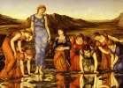

  
[Intangible Textual Heritage](../../../index)  [Legends and
Sagas](../../index)  [William Morris](../index)  [Index](index) 
[Previous](sunf37)  [Next](sunf39) 

------------------------------------------------------------------------

  
*The Sundering Flood*, by William Morris, \[1897\], at Intangible
Textual Heritage

------------------------------------------------------------------------

Chapter XXXVI. The Staves which Osberne Taught to the Dalesmen

Now all folk at Wethermel when they looked upon Osberne's face deemed
that he was bettering of the drearihood which had weighed on him ever
since the battle with the strong-thieves, and of that bettering they
were right glad, for they were wont to have much joy of his fellowship.
Came on therewith the Midsummer Feast of the Cloven Mote, which, as
aforesaid, was the greatest of all the feasts of the Dalesmen, and
Osberne was there with a countenance of good cheer no worser than the
best. Now at this feast not only did they do in the heedfullest and
solemnest wise all that belonged to Midsummer, as the Trundling of the
Fiery Wheel, and the Kindling of the Bale, and the Leaping through the
Fire; but also before noon, and ere these plays were begun, was high
mass sung in the goodliest fashion in each of the two churches of
Allhallows for the good rest of them who had fallen manfully in battle
with the thieves. And last of all, when the summer night was as dark as
it would be before the dawn, and the folk of the two sides were all
ranged each in a line on their own shore of the river, they sang these
staves from side to side across the Sundering Flood, the Westdalers
beginning, and then the Eastdalers taking it up:

    Tis Summer and night,  
    Little dusk and long light,  
    Little loss and much gain  
    When the day must needs wane,  
    Little bitter, much sweet  
    From the weed to the wheat;  
    Little moan, mickle praise  
    Of the Midsummer days,  
  When the love of the sleeping sun lieth along  
  And broodeth the acres abiding the song.

    Were the spring to come o'er  
    And again as before,  
    What then would ye crave  
    From the summer to have?  
    Sweeter grass would ye pray,  
    And more lea-lading hay?  
    For more wheat would ye cry,  
    Thicker swathe of the rye?  
  Stouter sons would ye ask for, and daughters more dear?  
  Well-willers more trusty than them ye have here?

    O the wheat is yet green  
    But full fair beseen,  
    And the rye groweth tall  
    By the turfen wall.  
    Thick and sweet was the hay  
    On the lealand that lay;  
    Dear daughters had we,  
    Sons goodly to see,  
  And of all the well-willers ere trusted for true  
  The least have ye failed us to deal and to do.

    What then is this,  
    That the summer's bliss  
    Somewhat ye fail  
    In your treasure's tale?  
    What then have ye lost,  
    And what call ye the cost  
    Of the months of life  
    Since winter's strife?  
  For unseldom the summer sun curseth the Dale  
  With the tears thrust aback and the unuttered wail.

    Forsooth o'er-well  
    The tale may we tell:  
    Tis the spear and the sword  
    And the House of the Sward.  
    The bright and the best  
    Have gone to their rest,  
    And our eyes are blind  
    Their eyes to find.  
  In mead and house wend we because they were stayed,  
  And we stand up because in the earth they were laid.

    Would ye call them aback  
    Then, to look on your lack?

    Nay, we would that their tale  
    From our hearts ne'er should fail.

    This then maketh you sad,  
    That such dear death they had?

    This night are we sad  
    For the joy that we had,  
    And their memory's beginning  
    Great grief would be winning.  
    But while weareth away,  
    And e'en woe waxeth gay.  
    In fair words is it told,  
    Weighed e'en as fine gold;  
    Sweet as wind of the south  
    Grows the speech in the mouth.  
  And from father to son speeds the tale of the true,  
  Of the brave that forbore that the brethren might do.

When this was sung then each man went home to his house. But it is said
that these staves were made by Osberne, and that he taught them to the
Western men as well as to the Eastern.

------------------------------------------------------------------------

[Next: Chapter XXXVII. Osberne Takes Leave of Wethermel](sunf39)

