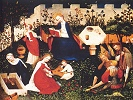

  
[Intangible Textual Heritage](../../../index)  [Legends and
Sagas](../../index)  [William Morris](../index)  [Index](index) 
[Previous](thol00)  [Next](thol02) 

------------------------------------------------------------------------

  
*The Hollow Land*, by William Morris, \[1856\], at Intangible Textual
Heritage

------------------------------------------------------------------------

CONTENTS

[Struggling in the World](thol02.htm#an_f01)

[Failing in the World](thol03.htm#an_f02)

[Fytte the Second](thol04.htm#an_f03)

[Fytte the Third](thol05.htm#an_f04)

------------------------------------------------------------------------

[Next: Struggling in the World](thol02)

