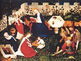

  
[Intangible Textual Heritage](../../../index.md)  [Legends and
Sagas](../../index)  [William Morris](../index)  [Index](index.md) 
[Previous](thol04.md) 

------------------------------------------------------------------------

  
*The Hollow Land*, by William Morris, \[1856\], at Intangible Textual
Heritage

------------------------------------------------------------------------

FYTTE THE THIRD

And I was waked by some one singing; I felt very happy; I felt young
again; I had fair delicate raiment on, my sword was gone, and my armour;
I tried to think where I was, and could not for my happiness; I tried to
listen to the words of the song. Nothing, only an old echo in my ears,
only all manner of strange scenes from my wretched past life before my
eyes in a dim, far-off manner: then at last, slowly, without effort, I
heard what she sang.

   "Christ keep the Hollow Land  
   All the summer-tide;  
   Still we cannot understand  
   Where the waters glide;

   Only dimly seeing them  
   Coldly slipping through  
   Many green-lipp'd cavern mouths.  
   Where the hills are blue."

"Then," she said, "come now and look for it, love, a hollow city in the
Hollow Land."

I kissed Margaret, and we went.

Through the golden streets under the purple shadows of the houses we
went, and the slow fanning backward and forward of the many-coloured
banners cooled us: we two alone: there was no one with us. No soul will
ever be able to tell what we said, how we looked.

At last we came to a fair palace, cloistered off in the old time, before
the city grew golden from the din and hubbub of traffic; those who dwelt
there in the old ungolden times had had their own joys, their own
sorrows, apart from the joys and sorrows of the multitude: so, in like
manner, was it now cloistered off from the eager leaning and brotherhood
of the golden dwellings: so now it had its own gaiety, its own
solemnity, apart from theirs; unchanged, and changeable, were its marble
walls, whatever else changed about it.

We stopped before the gates and trembled, and clasped each other closer;
for there among the marble leafage and tendrils that were round and
under and over the archway that held the golden valves were wrought two
figures of a man and woman winged and garlanded, whose raiment flashed
with stars; and their faces were like faces we had seen or half seen in
some dream long and long and long ago so that we trembled with awe and
delight; and turned, and seeing Margaret, saw that her face was that
face seen or half seen long and long and long ago; and in the shining of
her eyes I saw that other face, seen in that way and no other long and
long and long ago—my face.

And then we walked together toward the golden gates, and opened them,
and no man gainsaid us.

And before us lay a great space of flowers.

 

 

 
