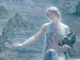

  
[Intangible Textual Heritage](../../../index)  [Legends and
Sagas](../../index)  [William Morris](../index)  [Index](index) 
[Previous](thow00)  [Next](thow02) 

------------------------------------------------------------------------

  
*The House of the Wolfings*, by William Morris, \[1889\], at Intangible
Textual Heritage

------------------------------------------------------------------------

CONTENTS

[Chapter I—The Dwellings of Mid-Mark](thow02.htm#an_f01)

[Chapter II—The Flitting of the War-Arrow](thow03.htm#an_f02)

[Chapter III—Thiodolf Talketh with the Wood-Sun](thow04.htm#an_f03)

[Chapter Iv—The House Fareth to the War](thow05.htm#an_f04)

[Chapter V—Concerning the Hall-Sun](thow06.htm#an_f05)

[Chapter VI—They Talk on the Way to the Folk-Thing](thow07.htm#an_f06)

[Chapter VII—They Gather to the Folk-Mote](thow08.htm#an_f07)

[Chapter VIII—The Folk-Mote of the Markmen](thow09.htm#an_f08)

[Chapter IX—The Ancient Man of the Daylings](thow10.htm#an_f09)

[Chapter X—That Carline Cometh to the Roof of the
Wolfings](thow11.htm#an_f10)

[Chapter XI—The Hall-Sun Speaketh](thow12.htm#an_f11)

[Chapter XII—Tidings of the Battle in Mirkwood](thow13.htm#an_f12)

[Chapter XIII—The Hall-Sun Saith Another Word](thow14.htm#an_f13)

[Chapter XIV—The Hall-Sun is Careful Concerning the Passes of the
Wood](thow15.htm#an_f14)

[Chapter XV—They Hear Tell of the Battle on the
Ridge](thow16.htm#an_f15)

[Chapter XVI—How the Dwarf-Wrought Hauberk Was Brought Away From the
Hall of the Daylings](thow17.htm#an_f16)

[Chapter XVII—The Wood-Sun Speaketh With Thiodolf](thow18.htm#an_f17)

[Chapter XVIII—Tidings Brought to the Wain-Burg](thow19.htm#an_f18)

[Chapter XIX—Those Messengers Come to Thiodolf](thow20.htm#an_f19)

[Chapter XX—Otter and His Folk Come into Mid-Mark](thow21.htm#an_f20)

[Chapter XXI—They Bicker About the Ford](thow22.htm#an_f21)

[Chapter XXII—Otter Falls on Against his Will](thow23.htm#an_f22)

[Chapter XXIII—Thiodolf Meeteth the Romans in the Wolfing
Meadow](thow24.htm#an_f23)

[Chapter XXIV—The Goths are Overthrown by the Romans](thow25.htm#an_f24)

[Chapter XXV—The Host of the Markmen Cometh into the
Wild-Wood](thow26.htm#an_f25)

[Chapter XXVI—Thiodolf Talketh with the Wood-Sun](thow27.htm#an_f26)

[Chapter XXVII—They Wend to the Morning Battle](thow28.htm#an_f27)

[Chapter XXVIII—Of the Storm of Dawning](thow29.htm#an_f28)

[Chapter XXI—Of Thiodolf's Storm](thow30.htm#an_f29)

[Chapter XXX—Thiodolf is Borne out of the Hall and Otter is Laid Beside
Him](thow31.htm#an_f30)

[Chapter XXXI—Old Asmund Speaketh Over the War-Dukes: the Dead are Laid
in Mound](thow32.htm#an_f31)

------------------------------------------------------------------------

[Next: Chapter I—The Dwellings of Mid-Mark](thow02)

