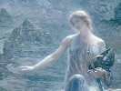

  
[Intangible Textual Heritage](../../../index.md)  [Legends and
Sagas](../../index)  [William Morris](../index)  [Index](index.md) 
[Previous](thow31.md) 

------------------------------------------------------------------------

  
*The House of the Wolfings*, by William Morris, \[1889\], at Intangible
Textual Heritage

------------------------------------------------------------------------

CHAPTER XXXI—OLD ASMUND SPEAKETH OVER THE WAR-DUKES: THE DEAD ARE LAID
IN MOUND

Now while all looked on, he went to the place where lay the bodies of
the War-dukes, and looked down on the face of Otter and said:

   "O Otter, there thou liest! and thou that I knew of old,  
   When my beard began to whiten, as the best of the keen and the
bold,  
   And thou wert as my youngest brother, and thou didst lead my sons  
   When we fared forth over the mountains to meet the arrowy Huns,  
   And I smiled to see thee teaching the lore that I learned thee
erst.  
   O Otter, dost thou remember how the Goth-folk came by the worst,  
   And with thee in mine arms I waded the wide shaft-harrowed flood  
   That lapped the feet of the mountains with its water blent with
blood;  
   And how in the hollow places of the mountains hidden away  
   We abode the kindreds' coming as the wet night bideth day?  
   Dost thou remember, Otter, how many a joy we had,  
   How many a grief remembered has made our high-tide glad?  
   O fellow of the hall-glee!  O fellow of the field!  
   Why then hast thou departed and left me under shield?  
   I the ancient, I the childless, while yet in the Laxing hall  
   Are thy brother's sons abiding and their children on thee call.

   "O kindreds of the people! the soul that dwelt herein,  
   This goodly way-worn body, was keen for you to win  
   Good days and long endurance.  Who knoweth of his deed  
   What things for you it hath fashioned from the flame of the fire of
need?  
   But of this at least well wot we, that forth from your hearts it
came  
   And back to your hearts returneth for the seed of thriving and
fame.  
   In the ground wherein ye lay it, the body of this man,  
   No deed of his abideth, no glory that he wan,  
   But evermore the Markmen shall bear his deeds o'er earth,  
   With the joy of the deeds that are coming, the garland of his worth."

He was silent a little as he stood looking down on Otter's face with
grievous sorrow, for all that his words were stout.  For indeed, as he
had said, Otter had been his battle-fellow and his hall-fellow, though
he was much younger than Asmund; and they had been standing foot to foot
in that battle wherein old Asmund's sons were slain by his side.

After a while he turned slowly from looking at Otter to gaze upon
Thiodolf, and his body trembled as he looked, and he opened his mouth to
speak; but no word came from it; and he sat down upon the edge of the
bier, and the tears began to gush out of his old eyes, and he wept
aloud. Then they that saw him wondered; for all knew the stoutness of
his heart, and how he had borne more burdens than that of eld, and had
not cowered down under them.  But at last he arose again, and stood
firmly on his feet, and faced the folk-mote, and in a voice more like
the voice of a man in his prime than of an old man, he sang:

      "Wild the storm is abroad  
      Of the edge of the sword!  
      Far on runneth the path  
      Of the war-stride of wrath!  
      The Gods hearken and hear  
      The long rumour of fear  
      From the meadows beneath  
      Running fierce o'er the heath,  
   Till it beats round their dwelling-place builded aloof  
   And at last all up-swelling breaks wild o'er their roof,  
   And quencheth their laughter and crieth on all,  
   As it rolleth round rafter and beam of the Hall,  
   Like the speech of the thunder-cloud tangled on high,  
   When the mountain-halls sunder as dread goeth by.

      "So they throw the door wide  
      Of the Hall where they bide,  
      And to murmuring song  
      Turns that voice of the wrong,  
      And the Gods wait a-gaze  
      For that Wearer of Ways:  
      For they know he hath gone  
      A long journey alone.  
   Now his feet are they hearkening, and now is he come,  
   With his battle-wounds darkening the door of his home,  
   Unbyrnied, unshielded, and lonely he stands,  
   And the sword that he wielded is gone from his hands—  
   Hands outstretched and bearing no spoil of the fight,  
   As speechless, unfearing, he stands in their sight.

      "War-father gleams  
      Where the white light streams  
      Round kings of old  
      All red with gold,  
      And the Gods of the name  
      With joy aflame.  
      All the ancient of men  
      Grown glorious again:  
   Till the Slains-father crieth aloud at the last:  
   'Here is one that belieth no hope of the past!  
   No weapon, no treasure of earth doth he bear,  
   No gift for the pleasure of Godhome to share;  
   But life his hand bringeth, well cherished, most sweet;  
   And hark! the Hall singeth the Folk-wolf to greet!'

      "As the rain of May  
      On earth's happiest day,  
      So the fair flowers fall  
      On the sun-bright Hall  
      As the Gods rise up  
      With the greeting-cup,  
      And the welcoming crowd  
      Falls to murmur aloud.  
   Then the God of Earth speaketh; sweet-worded he saith,  
   'Lo, the Sun ever seeketh Life fashioned of death;  
   And to-day as he turneth the wide world about  
   On Wolf-stead he yearneth; for there without doubt  
   Dwells the death-fashioned story, the flower of all fame.  
   Come hither new Glory, come Crown of the Name!'"

All men's hearts rose high as he sang, and when he had ended arose the
clang of sword and shield and went ringing down the meadow, and the
mighty shout of the Markmen's joy rent the heavens: for in sooth at that
moment they saw Thiodolf, their champion, sitting among the Gods on his
golden chair, sweet savours around him, and sweet sound of singing, and
he himself bright-faced and merry as no man on earth had seen him, for
as joyous a man as he was.

But when the sound of their exultation sank down, the Hall-Sun spake
again:

   "Now wendeth the sun westward, and weary grows the Earth  
   Of all the long day's doings in sorrow and in mirth;  
   And as the great sun waneth, so doth my candle wane,  
   And its flickering flame desireth to rest and die again.  
   Therefore across the meadows wend we aback once more  
   To the holy Roof of the Wolfings, the shrine of peace and war.  
   And these that once have loved us, these warriors images,  
   Shall sit amidst our feasting, and see, as the Father sees  
   The works that men-folk fashion and the rest of toiling hands,  
   When his eyes look down from the mountains and the heavens above all
lands,  
   And up from the flowery meadows and the rolling deeps of the sea.  
   There then at the feast with our champions familiar shall we be  
   As oft we are with the Godfolk, when in story-rhymes and lays  
   We laugh as we tell of their laughter, and their deeds of other days.

   "Come then, ye sons of the kindreds who hither bore these twain!  
   Take up their beds of glory, and fare we home again,  
   And feast as men delivered from toil unmeet to bear,  
   Who through the night are looking to the dawn-tide fresh and fair  
   And the morn and the noon to follow, and the eve and its morrow
morn,  
   All the life of our deliv'rance and the fair days yet unborn."

 

So she spoke, and a murmur arose as those valiant men came forth again.
But lo, now were they dight in fresh and fair raiment and gleaming
war-array.  For while all this was a-doing and a-saying, they had gotten
them by the Hall-Sun's bidding unto the wains of their Houses, and had
arrayed them from the store therein.

So now they took up the biers, and the Hall-Sun led them, and they went
over the meadow before the throng of the kindreds, who followed them
duly ordered, each House about its banner; and when they were come
through the garth which the Romans had made to the Man's-door of the
Hall, there were the women of the House freshly attired, who cast
flowers on the living men of the host, and on the dead War-dukes, while
they wept for pity of them.  So went the freemen of the Houses into the
Hall, following the Hall-Sun, and the bearers of the War-dukes; but the
banners abode without in the garth made by the Romans; and the thralls
arrayed a feast for themselves about the wains of the kindreds in the
open place before their cots and the smithying booths and the byres.

And as the Hall-Sun went into the Hall, she thrust down the candle
against the threshold of the Man's-door, and so quenched it.

Long were the kindreds entering, and when they were under the Roof of
the Wolfings, they looked and beheld Thiodolf set in his chair once
more, and Otter set beside him; and the chiefs and leaders of the House
took their places on the dais, those to whom it was due, and the
Hall-Sun sat under the wondrous Lamp her namesake.

Now was the glooming falling upon the earth; but the Hall was bright
within even as the Hall-Sun had promised.  Therein was set forth the
Treasure of the Wolfings; fair cloths were hung on the walls, goodly
broidered garments on the pillars: goodly brazen cauldrons and
fair-carven chests were set down in nooks where men could see them well,
and vessels of gold and silver were set all up and down the tables of
the feast.  The pillars also were wreathed with flowers, and flowers
hung garlanded from the walls over the precious hangings; sweet gums and
spices were burning in fair-wrought censers of brass, and so many
candles were alight under the Roof, that scarce had it looked more
ablaze when the Romans had litten the faggots therein for its burning
amidst the hurry of the Morning Battle.

There then they fell to feasting, hallowing in the high-tide of their
return with victory in their hands: and the dead corpses of Thiodolf and
Otter, clad in precious glistering raiment, looked down on them from the
High-seat, and the kindreds worshipped them and were glad; and they
drank the Cup to them before any others, were they Gods or men.

But before the feast was hallowed in, came Ali the son of Grey up to the
High-seat, bearing something in his hand: and lo! it was Throng-plough,
which he had sought all over the field where the Markmen had been
overcome by the Romans, and had found it at last.  All men saw him how
he held it in his hand now as he went up to the Hall-Sun and spake to
her. But she kissed the lad on the forehead, and took Throng-plough, and
wound the peace-strings round him and laid him on the board before
Thiodolf; and then she spake softly as if to herself, yet so that some
heard her:

"O father, no more shalt thou draw Throng-plough from the sheath till
the battle is pitched in the last field of fight, and the sons of the
fruitful Earth and the sons of Day meet Swart and his children at last,
when the change of the World is at hand.  Maybe I shall be with thee
then: but now and in meanwhile, farewell, O mighty hand of my father!"

Thus then the Houses of the Mark held their High-tide of Returning under
the Wolfing Roof with none to blame them or make them afraid: and the
moon rose and the summer night wore on towards dawn, and within the Roof
and without was there feasting and singing and harping and the voice of
abundant joyance: for without the Roof feasted the thralls and the
strangers, and the Roman war-captives.

But on the morrow the kindreds laid their dead men in mound betwixt the
Great Roof and the Wild-wood.  In one mound they laid them with the War-
dukes in their midst, and Arinbiorn by Otter's right side; and Thiodolf
bore Throng-plough to mound with him.

But a little way from the mound of their own dead, toward the south they
laid the Romans, a great company, with their Captain in the midst: and
they heaped a long mound over them not right high; so that as years
wore, and the feet of men and beasts trod it down, it seemed a mere
swelling of the earth not made by men's hands; and belike men knew not
how many bones of valiant men lay beneath; yet it had a name which
endured for long, to wit, the Battle-toft.

But the mound whereunder the Markmen were laid was called Thiodolf's
Howe for many generations of men, and many are the tales told of him;
for men were loth to lose him and forget him: and in the latter days men
deemed of him that he sits in that Howe not dead but sleeping, with
Throng-plough laid before him on the board; and that when the sons of
the Goths are at their sorest need and the falcons cease to sit on the
ridge of the Great Roof of the Wolfings, he will wake and come forth
from the Howe for their helping.  But none have dared to break open that
Howe and behold what is therein.

But that swelling of the meadow where the Goths had their overthrow at
the hands of the Romans, and Thiodolf fell to earth unwounded, got a
name also, and was called the Swooning Knowe; and it kept that name long
after men had forgotten wherefore it was so called.

Now when all this was done, and the warriors of the kindreds were
departed each to his own stead, the Wolfings gathered in wheat-harvest,
and set themselves to make good all that the Romans had undone; and they
cleansed and mended their Great Roof and made it fairer than before, and
took from it all signs of the burning, save that they left the charring
and marks of the flames on one tie-beam, the second from the dais, for a
token of the past tidings.  Also when Harvest was over the Wolfings, the
Beamings, the Galtings, and the Elkings, set to work with the Bearings
to rebuild their Great Roof and the other dwellings and booths which the
Romans had burned; and right fair was that house.

But the Wolfings throve in field and fold, and they begat children who
grew up to be mighty men and deft of hand, and the House grew more
glorious year by year.

The tale tells not that the Romans ever fell on the Mark again; for
about this time they began to stay the spreading of their dominion, or
even to draw in its boundaries somewhat.

AND THIS IS ALL THAT THE TALE HAS TO TELL CONCERNING THE HOUSE OF THE
WOLFINGS AND THE KINDREDS OF THE MARK.

 

 

 
