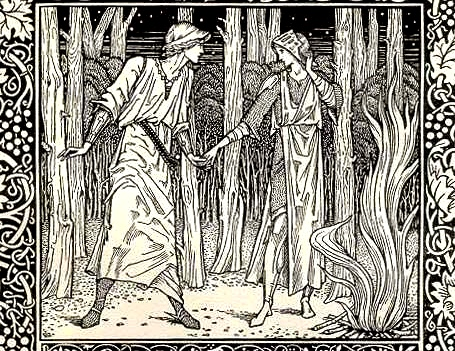

  
[Intangible Textual Heritage](../../../index)  [Legends and
Sagas](../../index)  [William Morris](../index) 

------------------------------------------------------------------------

<table width="75%">
<colgroup>
<col style="width: 50%" />
<col style="width: 50%" />
</colgroup>
<tbody>
<tr class="odd">
<td width="50%" data-valign="TOP"></td>
<td width="50%" data-valign="CENTER"><h1 id="the-well-at-the-worlds-end" data-align="CENTER">The Well at the World's End</h1>
<h2 id="by-william-morris" data-align="CENTER">by William Morris</h2>
<h4 id="section" data-align="CENTER">[1896]</h4></td>
</tr>
</tbody>
</table>

------------------------------------------------------------------------

[Contents](#contents)    [Start Reading](wwe000)    [Text
\[Zipped\]](wwe.txt.gz)

------------------------------------------------------------------------

The Well at World's End was one of William Morris' fantasy novels. Set
in a medival fantasy setting, the hero, Ralph of Upmeads, a minor son of
a minor king, sets out in search of the Well at World's End. This well
grants near-immortality and a heightened sense of destiny. Ralph meets a
mysterious woman who has found the well, however, she is killed. A
second woman named Ursula helps Ralph find the well. The book is a
classic journey 'there and back again' which will keep lovers of Tolkien
and C.S. Lewis happy.

------------------------------------------------------------------------

 [Title Page](wwe000)  
[Contents](wwe001)  

### Book One: The Road Unto Love

[Chapter 1: The Sundering of the Ways](wwe002)  
[Chapter 2: Ralph Goeth Back Home to the High House](wwe003)  
[Chapter 3: Ralph Cometh to the Cheaping-Town](wwe004)  
[Chapter 4: Ralph Rideth the Downs](wwe005)  
[Chapter 5: Ralph Cometh to Higham-on-the-Way](wwe006)  
[Chapter 6: Ralph Goeth His Ways From the Abbey of St. Mary at
Higham](wwe007)  
[Chapter 7: The Maiden of Bourton Abbas](wwe008)  
[Chapter 8: Ralph Cometh to the Wood Perilous. An Adventure
Therein](wwe009)  
[Chapter 9: Another Adventure in the Wood Perilous](wwe010)  
[Chapter 10: A Meeting and a Parting in the Wood Perilous](wwe011)  
[Chapter 11: Now Must Ralph Ride For It](wwe012)  
[Chapter 12: Ralph Entereth Into the Burg of the Four Friths](wwe013)  
[Chapter 13: The Streets of the Burg of the Four Friths](wwe014)  
[Chapter 14: What Ralph Heard of the Matters of the Burg of the Four
Friths](wwe015)  
[Chapter 15: How Ralph Departed From the Burg of the Four
Friths](wwe016)  
[Chapter 16: Ralph Rideth the Wood Perilous Again](wwe017)  
[Chapter 17: Ralph Cometh to the House of Abundance](wwe018)  
[Chapter 18: Of Ralph in the Castle of Abundance](wwe019)  
[Chapter 19: Ralph Readeth in a Book Concerning the Well at the World's
End](wwe020)  
[Chapter 20: Ralph Meeteth a Man in the Wood](wwe021)  
[Chapter 21: Ralph Weareth Away Three Days Uneasily](wwe022)  
[Chapter 22: An Adventure in the Wood](wwe023)  
[Chapter 23: The Leechcraft of the Lady](wwe024)  
[Chapter 24: Supper and Slumber in the Woodland Hall](wwe025)  

### Book Two: The Road Unto Trouble

[Chapter 1: Ralph Meets With Love in the Wilderness](wwe026)  
[Chapter 2: They Break Their Fast in the Wildwood](wwe027)  
[Chapter 3: The Lady Telleth Ralph of the Past Days of Her
Life](wwe028)  
[Chapter 4: The Lady Tells of Her Deliverance](wwe029)  
[Chapter 5: Yet More of the Lady's Story](wwe030)  
[Chapter 6: The Lady Tells Somewhat of Her Doings After She Left the
Wilderness](wwe031)  
[Chapter 7: The Lady Tells of the Strife and Trouble That Befell After
Her Coming to the Country of the King's Son](wwe032)  
[Chapter 8: The Lady Maketh an End of Her Tale](wwe033)  
[Chapter 9: They Go On Their Way Once More](wwe034)  
[Chapter 10: Of the Desert-House and the Chamber of Love in the
Wilderness](wwe035)  
[Chapter 11: Ralph Cometh Out of the Wilderness](wwe036)  
[Chapter 12: Ralph Falleth in With Friends and Rideth to
Whitwall](wwe037)  
[Chapter 13: Richard Talketh With Ralph Concerning the Well at the
World's End. Concerning Swevenham](wwe038)  
[Chapter 14: Ralph Falleth in With Another Old Friend](wwe039)  
[Chapter 15: Ralph Dreams a Dream Or Sees a Vision](wwe040)  
[Chapter 16: Of the Tales of Swevenham](wwe041)  
[Chapter 17: Richard Bringeth Tidings of Departing](wwe042)  
[Chapter 18: Ralph Departeth From Whitwall With the Fellowship of
Clement Chapman](wwe043)  
[Chapter 19: Master Clement Tells Ralph Concerning the Lands Whereunto
They Were Riding](wwe044)  
[Chapter 20: They Come to the Mid-Mountain Guest-House](wwe045)  
[Chapter 21: A Battle in the Mountains](wwe046)  
[Chapter 22: Ralph Talks With Bull Shockhead](wwe047)  
[Chapter 23: Of the Town of Cheaping Knowe](wwe048)  
[Chapter 24: Ralph Heareth More Tidings of the Damsel](wwe049)  
[Chapter 25: The Fellowship Comes to Whiteness](wwe050)  
[Chapter 26: They Ride the Mountains Toward Goldburg](wwe051)  
[Chapter 27: Clement Tells of Goldburg](wwe052)  
[Chapter 28: Now They Come to Goldburg](wwe053)  
[Chapter 29: Of Goldburg and the Queen Thereof](wwe054)  
[Chapter 30: Ralph Hath Hope of Tidings Concerning the Well at the
World's End](wwe055)  
[Chapter 31: The Beginning of the Road to Utterbol](wwe056)  
[Chapter 32: Ralph Happens on Evil Days](wwe057)  
[Chapter 33: Ralph is Brought on the Road Towards Utterbol](wwe058)  
[Chapter 34: The Lord of Utterbol Will Wot of Ralph's Might and
Minstrelsy](wwe059)  
[Chapter 35: Ralph Cometh To the Vale of the Tower](wwe060)  
[Chapter 36: The Talk of Two Women Concerning Ralph](wwe061)  
[Chapter 37: How Ralph Justed With the Aliens](wwe062)  
[Chapter 38: A Friend Gives Ralph Warning](wwe063)  
[Chapter 39: The Lord of Utterbol Makes Ralph a Free Man](wwe064)  
[Chapter 40: They Ride Toward Utterness From Out of Vale
Turris](wwe065)  
[Chapter 41: Redhead Keeps Tryst](wwe066)  

### Book Three: The Road To The Well At World's End

[Chapter 1: An Adventure in the Wood Under the Mountains](wwe067)  
[Chapter 2: Ralph Rides the Wood Under the Mountains](wwe068)  
[Chapter 3: Ralph Meeteth With Another Adventure in the Wood Under the
Mountain](wwe069)  
[Chapter 4: They Ride the Wood Under the Mountains](wwe070)  
[Chapter 5: They Come on the Sage of Swevenham](wwe071)  
[Chapter 6: Those Two Are Learned Lore by the Sage of
Swevenham](wwe072)  
[Chapter 7: An Adventure by the Way](wwe073)  
[Chapter 8: They Come to the Sea of Molten Rocks](wwe074)  
[Chapter 9: They Come Forth From the Rock-Sea](wwe075)  
[Chapter 10: They Come to the Gate of the Mountains](wwe076)  
[Chapter 11: They Come to the Vale of Sweet Chestnuts](wwe077)  
[Chapter 12: Winter Amidst of the Mountains](wwe078)  
[Chapter 13: Of Ursula and the Bear](wwe079)  
[Chapter 14: Now Come the Messengers of the Innocent Folk](wwe080)  
[Chapter 15: They Come to the Land of the Innocent Folk](wwe081)  
[Chapter 16: They Come to the House of the Sorceress](wwe082)  
[Chapter 17: They Come Through the Woodland to the Thirsty
Desert](wwe083)  
[Chapter 18: They Come to the Dry Tree](wwe084)  
[Chapter 19: They Come Out of the Thirsty Desert](wwe085)  
[Chapter 20: They Come to the Ocean Sea](wwe086)  
[Chapter 21: Now They Drink of the Well at the World's End](wwe087)  
[Chapter 22: Now They Have Drunk and Are Glad](wwe088)  

### Book Four: The Road Home

[Chapter 1: Ralph and Ursula Come Back Again Through the Great
Mountains](wwe089)  
[Chapter 2: They Hear New Tidings of Utterbol](wwe090)  
[Chapter 3: They Winter With the Sage; and Thereafter Come Again to Vale
Turris](wwe091)  
[Chapter 4: A Feast in the Red Pavilion](wwe092)  
[Chapter 5: Bull Telleth of His Winning of the Lordship of
Utterbol](wwe093)  
[Chapter 6: They Ride From Vale Turris.  Redhead Tells of
Agatha](wwe094)  
[Chapter 7: Of Their Riding the Waste, and of a Battle
Thereon](wwe095)  
[Chapter 8: Of Goldburg Again, and the Queen Thereof](wwe096)  
[Chapter 9: They Come to Cheaping Knowe Once More.  Of the King
Thereof](wwe097)  
[Chapter 10: An Adventure on the Way to the Mountains](wwe098)  
[Chapter 11: They Come Through the Mountains Into the Plain](wwe099)  
[Chapter 12: The Roads Sunder Again](wwe100)  
[Chapter 13: They Come to Whitwall Again](wwe101)  
[Chapter 14: They Ride Away From Whitwall](wwe102)  
[Chapter 15: A Strange Meeting in the Wilderness](wwe103)  
[Chapter 16: They Come to the Castle of Abundance Once More](wwe104)  
[Chapter 17: They Fall in With That Hermit](wwe105)  
[Chapter 18: A Change of Days in the Burg of the Four Friths](wwe106)  
[Chapter 19: Ralph Sees Hampton and the Scaur](wwe107)  
[Chapter 20: They Come to the Gate of Higham By the Way](wwe108)  
[Chapter 21: Talk Between Those Two Brethren](wwe109)  
[Chapter 22: An Old Acquaintance Comes From the Down Country to See
Ralph](wwe110)  
[Chapter 23: They Ride to Bear Castle](wwe111)  
[Chapter 24: The Folkmote of the Shepherds](wwe112)  
[Chapter 25: They Come to Wulstead](wwe113)  
[Chapter 26: Ralph Sees His Father and Mother Again](wwe114)  
[Chapter 27: Ralph Holds Converse With Katherine His Gossip](wwe115)  
[Chapter 28: Dame Katherine Tells of the Pair of Beads, and Whence She
Had Them](wwe116)  
[Chapter 29: They Go Down to Battle in Upmeads](wwe117)  
[Chapter 30: Ralph Brings His Father and Mother to Upmeads](wwe118)  
[Chapter 31: Ralph Brings Ursula Home to the High House](wwe119)  
[Chapter 32: Yet a Few Words Concerning Ralph of Upmeads](wwe120)  
