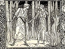

  
[Intangible Textual Heritage](../../../index)  [Legends and
Sagas](../../index)  [William Morris](../index)  [Index](index) 
[Previous](wwe080)  [Next](wwe082) 

------------------------------------------------------------------------

  
*The Well at the World's End*, by William Morris, \[1896\], at
Intangible Textual Heritage

------------------------------------------------------------------------

CHAPTER 15

They Come to the Land of the Innocent Folk

When it was morning they speedily gat them ready for the road, whereas
they had little to take with them; so they departed joyously, howbeit
both Ralph and Ursula felt rather love than loathing for their winter
abode.  The day was yet young when they went their ways. Their horses
and all their gear were a great wonder to the young men, for they had
seen no such beasts before:  but the elder said that once in his young
days he had led a man to the Well who was riding a horse and was clad in
knightly array.

So they went by ways which were nowise dreadful, though they were void
of men-folk, and in three days' time they were come out of the
mountains, and in three more the said mountains were to behold but a
cloud behind them, and the land was grown goodly, with fair valleys and
little hills, though still they saw no men, and forsooth they went
leisurely, for oxen are but slow-going nags. But when they were gone
eight days from the Valley of Sweet-chestnuts, they came across a flock
of uncouth-looking sheep on a green hill-side, and four folk shepherding
them, two carles to wit, and two queans, like to their way-leaders, but
scarce so goodly, and ruder of raiment. These men greeted them kindly,
and yet with more worship than fellowship, and they marvelled
exceedingly at their horses and weapons. Thence they passed on, and the
next day came into a wide valley, well-grassed and watered, and wooded
here and there; moreover there were cots scattered about it.  There and
thenceforth they met men a many, both carles and queans, and sheep and
neat in plenty, and they passed by garths wherein the young corn was
waxing, and vineyards on the hillsides, where the vines were beginning
to grow green. The land seemed as goodly as might be, and all the folk
they met were kind, if somewhat over reverent.

On the evening of that day they came into the town of that folk, which
was but simple, wholly unfenced for war, and the houses but low, and not
great.  Yet was there naught of filth or famine, nor any poverty or
misery; and the people were merry-faced and well-liking, and clad goodly
after their fashion in white woollen cloth or frieze. All the people of
the town were come forth to meet them, for runners had gone before them,
and they stood on either side of the way murmuring greetings, and with
their heads bent low in reverence.

Thus rode Ralph and Ursula up to the door of the Temple, or Mote-house,
or Guest-house, for it was all these, a house great, and as fair as they
knew how to make it. Before the door thereof were standing the elders of
the Folk; and when they drew rein, the eldest and most reverend of these
came forth and spake in a cheerful voice, yet solemnly: "Welcome and
thrice welcome to the Seekers after length of days and happy times, and
the loving-kindness of the Folks of the Earth!"

Then all the elders gathered about them, and bade them light down and be
at rest amongst them, and they made much of them and brought them into
the Mote-house, where-in were both women and men fair and stately, and
the men took Ralph by the hand and the women Ursula, and brought them
into chambers where they bathed them and did off their wayfaring
raiment, and clad them in white woollen gowns of web exceeding fine, and
fragrant withal. Then they crowned them with flowers, and led them back
into the hall, whereas now was much folk gathered, and they set them
down on a dais as though they had been kings, or rather gods; and when
they beheld them there so fair and lovely, they cried out for joy of
them, and bade them hail oft and oft.

There then were they feasted by that kind folk, and when meat was done
certain youths and maidens fell to singing songs very sweetly; and the
words of the songs were simple and harmless, and concerning the fairness
of the earth and the happy loves of the creatures that dwell therein.

Thereafter as the night aged, they were shown to a sleeping chamber,
which albeit not richly decked, or plenished with precious things, was
most dainty clean, and sweet smelling, and strewn with flowers, so that
the night was sweet to them in a chamber of love.

------------------------------------------------------------------------

[Next: Chapter 16: They Come to the House of the Sorceress](wwe082)

