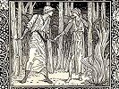

  
[Intangible Textual Heritage](../../../index)  [Legends and
Sagas](../../index)  [William Morris](../index)  [Index](index) 
[Previous](wwe088)  [Next](wwe090) 

------------------------------------------------------------------------

  
*The Well at the World's End*, by William Morris, \[1896\], at
Intangible Textual Heritage

------------------------------------------------------------------------

BOOK FOUR

The Road Home

CHAPTER 1

Ralph and Ursula Come Back Again Through the Great Mountains

On the morrow morning they armed them and took to their horses and
departed from that pleasant place and climbed the mountain without
weariness, and made provision of meat and drink for the Dry Desert, and
so entered it, and journeyed happily with naught evil befalling them
till they came back to the House of the Sorceress; and of the Desert
they made little, and the wood was pleasant to them after the drought of
the Desert.

But at the said House they saw those kind people, and they saw in their
eager eyes as in a glass how they had been bettered by their drinking of
the Well, and the Elder said to them: "Dear friends, there is no need to
ask you whether ye have achieved your quest; for ye, who before were
lovely, are now become as the very Gods who rule the world. And now
methinks we have to pray you but one thing, to wit that ye will not be
overmuch of Gods, but will be kind and lowly with them that needs must
worship you."

They laughed on him for kindness' sake, and kissed and embraced the old
man, and they thanked them all for their helping, and they abode with
them for a whole day in good-will and love, and thereafter the carle,
who was the son of the Elder, with his wife, bade farewell to his
kinsmen, and led Ralph and Ursula back through the wood and over the
desert to the town of the Innocent Folk. The said Folk received them in
all joy and triumph, and would have them abide there the winter over. 
But they prayed leave to depart, because their hearts were sore for
their own land and their kindred. So they abode there but two days, and
on the third day were led away by a half score of men gaily apparelled
after their manner, and having with them many sumpter-beasts with
provision for the road. With this fellowship they came safely and with
little pain unto Chestnut Vale, where they abode but one night, though
to Ralph and Ursula the place was sweet for the memory of their loving
sojourn there.

They would have taken leave of the Innocent Folk in the said vale, but
those others must needs go with them a little further, and would not
leave them till they were come to the jaws of the pass which led to the
Rock of the Fighting Man. Further than that indeed they would not, or
durst not go; and those huge mountains they called the Wall of Strife,
even as they on the other side called them the Wall of the World.

So the twain took leave of their friends there, and howbeit that they
had drunk of the Well at the World's End, yet were their hearts grieved
at the parting.  The kind folk left with them abundant provision for the
remnant of the road, and a sumpter-ox to bear it; so they were in no
doubt of their livelihood.  Moreover, though the turn of autumn was come
again and winter was at hand, yet the weather was fair and calm, and
their journey through the dreary pass was as light as it might be to any
men.

------------------------------------------------------------------------

[Next: Chapter 2: They Hear New Tidings of Utterbol](wwe090)

