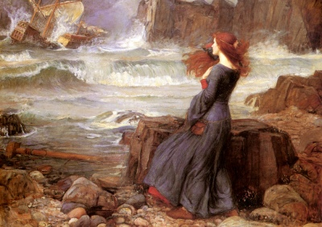

  
[Intangible Textual Heritage](../../../index.md)  [Legends and
Sagas](../../index)  [William Morris](../index.md) 

------------------------------------------------------------------------

<table width="75%">
<colgroup>
<col style="width: 50%" />
<col style="width: 50%" />
</colgroup>
<tbody>
<tr class="odd">
<td width="50%" data-valign="TOP"></td>
<td width="50%" data-valign="CENTER"><h1 id="the-water-of-the-wondrous-isles" data-align="CENTER">The Water of the Wondrous Isles</h1>
<h2 id="by-william-morris" data-align="CENTER">by William Morris</h2>
<h4 id="section" data-align="CENTER">[1897]</h4></td>
</tr>
</tbody>
</table>

------------------------------------------------------------------------

[Contents](#contents)    [Start Reading](wwi000.md)    [Text
\[Zipped\]](wwi.txt.gz.md)

------------------------------------------------------------------------

This fantasy novel by William Morris is one of the first to have a
central female character. The heroine, Birdalone, abducted and raised by
a witch in the wood of Evilshaw, escapes her captivity with the
assistance of a good witch. Habundia. Birdalone encounters three maidens
held prisoner by another witch, and the quest to unite the maidens with
their knightly lovers rounds out the tale.

------------------------------------------------------------------------

 [Title Page](wwi000.md)  
[Contents](wwi001.md)  

### The First Part: Of The House Of Captivity

[Chapter I. Catch At Utterhay](wwi002.md)  
[Chapter II. Now Shall Be Told of the House by the Water-Side](wwi003.md)  
[Chapter III. Of Skin-Changing](wwi004.md)  
[Chapter IV. Of the Waxing of the Stolen Child](wwi005.md)  
[Chapter V. Of Birdalone, and How She is Grown Into
Maidenhood](wwi006.md)  
[Chapter VI. Herein Is Told of Birdalone's Raiment](wwi007.md)  
[Chapter VII. Birdalone Hath an Adventure in the Wood](wwi008.md)  
[Chapter VIII. Of Birdalone and the Witch-Wife](wwi009.md)  
[Chapter IX. Of Birdalone's Swimming](wwi010.md)  
[Chapter X. Birdalone Comes on New Tidings](wwi011.md)  
[Chapter XI. Of Birdalone's Guilt and the Chastisement
Thereof](wwi012.md)  
[Chapter XII. The Words of the Witch-Wife to Birdalone](wwi013.md)  
[Chapter XIII. Birdalone Meeteth the Wood-Woman Again](wwi014.md)  
[Chapter XIV. Of Birdalone's Fishing](wwi015.md)  
[Chapter XV. Birdalone Weareth Her Serpent-Ring](wwi016.md)  
[Chapter XVI. Birdalone Meeteth Habundia Again; and Learneth Her First
Wisdom of Her](wwi017.md)  
[Chapter XVII. The Passing of the Year into Winter](wwi018.md)  
[Chapter XVIII. Of Spring-Tide and the Mind of Birdalone](wwi019.md)  
[Chapter XIX. They Bid Farewell, Birdalone and the
Wood-Mother](wwi020.md)  
[Chapter XX. Of Birdalone and the Sending Boat](wwi021.md)  

### The Second Part: Of the Wondrous Isles

[Chapter I. The First Isle](wwi022.md)  
[Chapter II. Birdalone Falleth in with New Friends](wwi023.md)  
[Chapter III. Birdalone is Brought Before the Witch-Wife's
Sister](wwi024.md)  
[Chapter IV. Of The Witch's Prison in the Wailing-Tower](wwi025.md)  
[Chapter V. They Feast in the Witch's Prison](wwi026.md)  
[Chapter VI. Atra Tells of How They Three Came Unto the Isle of Increase
Unsought](wwi027.md)  
[Chapter VII. The Three Damsels Take Birdalone out of the Witch's
Prison](wwi028.md)  
[Chapter VIII. In What Wise Birdalone Was Clad, and How She Went Her
Ways From the Isle of Increase Unsought](wwi029.md)  
[Chapter IX. How Birdalone Came to the Isle of the Young and the
Old](wwi030.md)  
[Chapter X. Birdalone Comes to the Isle of the Queens](wwi031.md)  
[Chapter XI. And Now She Comes to the Isle of the Kings](wwi032.md)  
[Chapter XII. Of Birdalone, How She Came Unto the Isle of
Nothing](wwi033.md)  

### The Third Part: Of the Castle of the Quest

[Chapter I. Birdalone Comes to the Castle of the Quest](wwi034.md)  
[Chapter II. Of Birdalone, and How She Rested the Night Through in a
Bower Without the Castle of the Quest](wwi035.md)  
[Chapter III. How Birdalone Dight Her For Meeting the Champions of the
Quest](wwi036.md)  
[Chapter IV. And Now She Meets the Champions](wwi037.md)  
[Chapter V. Birdalone Has True Tokens From the Champions of the
Quest](wwi038.md)  
[Chapter VI. How The Champions Would Do Birdalone to be Clad Anew in the
Castle of the Quest](wwi039.md)  
[Chapter VII. Of Birdalone, How She Told the Champions All Her
Tale](wwi040.md)  
[Chapter VIII. In The Meanwhile of the Departing of the Champions, They
Would Pleasure Birdalone With Feats of Arms and Games of
Prowess](wwi041.md)  
[Chapter IX. Birdalone Cometh Before the Champions In Her New
Array](wwi042.md)  
[Chapter X. The Champions Go Their Ways in the Sending Boat](wwi043.md)  

### The Fourth Part: Of the Days of Abiding

[Chapter I. Of Birdalone's Grief; and of Leonard the Chaplain](wwi044.md)  
[Chapter II. Birdalone Learneth Lore of the Priest. Ten Days of Waiting
Wear](wwi045.md)  
[Chapter III. Now Would Birdalone Ride Abroad](wwi046.md)  
[Chapter IV. Of Birdalone's Faring Abroad](wwi047.md)  
[Chapter V. Sir Aymeris Showeth Birdalone the Mountains Afar
Off](wwi048.md)  
[Chapter VI. Birdalone Heareth Tell Tales of the Black Valley of the
Greywethers](wwi049.md)  
[Chapter VII. Birdalone Beguileth the Priest to Help Her to
Outgoing](wwi050.md)  
[Chapter VIII. Birdalone Fares On Her Adventure](wwi051.md)  
[Chapter IX. Birdalone Comes to the Black Valley](wwi052.md)  
[Chapter X. How Birdalone Fell In With a Man in the Black Valley of the
Greywethers](wwi053.md)  
[Chapter XI. Birdalone is Led Up the Black Valley](wwi054.md)  
[Chapter XII. How Those Twain Get Them From out of the Black Valley of
the Greywethers](wwi055.md)  
[Chapter XIII. Now They Rest For the Night in the Strait Pass](wwi056.md)  
[Chapter XIV. The Black Knight Tells the Truth of Himself](wwi057.md)  
[Chapter XV. The Black Knight Brings Birdalone to the Bower in the
Dale](wwi058.md)  
[Chapter XVI. Yet a Day and a Night They Tarry in the Dale](wwi059.md)  

### The Fifth Part: The Tale of the Quest's Ending

[Chapter I. Of Sir Leonard's Trouble and the Coming of the
Quest](wwi060.md)  
[Chapter II. Now Ask They of Birdalone, and Sir Leonard
Speaks](wwi061.md)  
[Chapter III. How They Follow the Slot of Birdalone and the Black
Knight](wwi062.md)  
[Chapter IV. Of The Slaying of Friend and Foe](wwi063.md)  
[Chapter V. They Come Home to the Castle of the Quest](wwi064.md)  
[Chapter VI. Of The Talk Betwixt Birdalone and Viridis](wwi065.md)  
[Chapter VII. Birdalone Telleth The tale of Her Wandering Up the Valley
of the Greywethers](wwi066.md)  
[Chapter VIII. Atra and Birdalone Talk Together While the Lords Sit at
the Murder-Council](wwi067.md)  
[Chapter IX. Hugh Tells The Story of the Quest's Ending.](wwi068.md)  
[Chapter X. How It Fared With the Three Ladies After the Escape of
Birdalone](wwi069.md)  
[Chapter XI. Birdalone and the Black Squire Talk Together in the Hall of
the Castle.](wwi070.md)  
[Chapter XII. The Knights and Their Fellows Betake Them to the
Assaulting of the Red Hold](wwi071.md)  
[Chapter XIII. Birdalone Bethinks Her to Fulfil the Promise Made Unto
Atra](wwi072.md)  
[Chapter XIV. Birdalone Leaves the Castle of the Quest](wwi073.md)  

### The Sixth Part: The Days of Absence

[Chapter I. Birdalone Rides to Greenford and There Takes Leave of Arnold
and His Men](wwi074.md)  
[Chapter II. Of Birdalone and Her Fellowship, Their Faring Over the
Downland](wwi075.md)  
[Chapter III. They Come to the City of the Five Crafts, and Birdalone
Meets With the Poor-Wife](wwi076.md)  
[Chapter IV. Of The Love of Gerard's Sons and of Jacobus for
Birdalone](wwi077.md)  
[Chapter V. Of The Death of Audrey, Mother To Birdalone. She is Warned
in a Dream to Seek the Black Squire, and is Minded to Depart the City of
the Five Crafts, and Seek Again the Castle of the Quest](wwi078.md)  
[Chapter VI. Of The Sundering of Birdalone From Gerard and his
Sons](wwi079.md)  
[Chapter VII. Birdalone Cometh to Greenford, and Hears of the Wasting of
the Castle of the Quest](wwi080.md)  
[Chapter VIII. Birdalone Cometh to the Castle of the Quest, Heareth the
Tale Thereof From Leonard, and Departeth Thence by the Sending
Boat](wwi081.md)  
[Chapter IX. Birdalone Findeth the Isle of Nothing Greatly Bettered, and
is Kindly Entreated There](wwi082.md)  
[Chapter X. Of Birdalone's Flitting From the Isle of Nothing](wwi083.md)  
[Chapter XI. Coming to the Isle of Kings Birdalone Findeth There A Score
and Two of Fair Damsels Who Would Fain Have Her Company](wwi084.md)  
[Chapter XII. Birdalone Cometh Again to the Isle of Queens, and Findeth
a Perilous Adventure Therein](wwi085.md)  
[Chapter XIII. Coming to the Isle of the Young and the Old, Birdalone
Findeth It Peopled With Children](wwi086.md)  
[Chapter XIV. The Sending Boat Disappeareth From the Isle of Increase
Unsought, and Birdalone Seeketh to Escape Thence By Swimming](wwi087.md)  
[Chapter XV. Birdalone Lacketh Little of Drowning, but Cometh Latterly
to the Green Eyot](wwi088.md)  
[Chapter XVI. Birdalone Findeth Her Witch-Mistress Dead](wwi089.md)  
[Chapter XVII. Birdalone Layeth to Earth the Body of the Witch, and
Findeth the Sending Boat Broken Up](wwi090.md)  
[Chapter XVIII. The Wood-Mother Cometh to Birdalone and Heareth Her
Story](wwi091.md)  
[Chapter XIX. Habundia Hideth Birdalone's Nakedness With Faery
Raiment](wwi092.md)  
[Chapter XX. Birdalone Telleth Habundia of Her Love For Arthur, and
Getteth From Her Promise of Help Therein](wwi093.md)  
[Chapter XXI. How The Wood-Wife Entered the Cot, and a Wonder That
Befell Thereon](wwi094.md)  
[Chapter XXII. Birdalone Wendeth the Wildwood in Fellowship With
Habundia](wwi095.md)  
[Chapter XXIII. The Wood-Wife Bringeth Birdalone to the Sight of Arthur
in the Wildwood](wwi096.md)  
[Chapter XXIV. The Wood-Mother Changeth Her Form to That of a Woman
Stricken in Years](wwi097.md)  
[Chapter XXV. The Wood-Wife Healeth and Tendeth the Black
Squire](wwi098.md)  
[Chapter XXVI. The Black Squire Telleth the Wood-Wife of His Doings
Since Birdalone Went From the Castle of the Quest](wwi099.md)  
[Chapter XXVII. Sir Arthur Cometh to the House Under the Wood](wwi100.md)  
[Chapter XXVIII. Fair Days in the House of Love](wwi101.md)  
[Chapter XXIX. Those Twain Will Seek the Wisdom of the
Wood-Wife](wwi102.md)  
[Chapter XXX. They Have Speech With Habundia Concerning the Green Knight
and his Fellows](wwi103.md)  
[Chapter XXXI. Habundia Cometh with Tidings of Those Dear
Friends](wwi104.md)  
[Chapter XXXII. Of The Fight in the Forest and the Rescue of Those
Friends From the Men of the Red Company](wwi105.md)  
[Chapter XXXIII. Viridis Telleth the Tale of Their Seeking](wwi106.md)  

### The Seventh Part: The Days of Returning

[Chapter I. Sir Hugh Asketh Birdalone Where She Would Have the Abode of
Their Fellowship to Be](wwi107.md)  
[Chapter II. Birdalone Taketh Counsel With Her Wood-Mother Concerning
the Matter of Sir Hugh](wwi108.md)  
[Chapter III. Of The Journeying Through the Forest of Evilshaw Unto the
Town of Utterhay](wwi109.md)  
[Chapter IV. Of the Abiding in Utterhay in Love and
Contentment](wwi110.md)  
