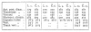
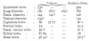
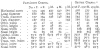

  
[Intangible Textual Heritage](../../index.md)  [Legends and
Sagas](../index)  [Index](index)  [Previous](ms106)  [Next](ms108.md) 

------------------------------------------------------------------------

  
*Magic Songs of the West Finns, Vol. I*, by John Abercromby, \[1898\],
at Intangible Textual Heritage

------------------------------------------------------------------------

p. 53

### CHAPTER II

### THE NEOLITHIC AGE IN FINLAND

By a brief study of the archæology of
Finland and the north centre of Russia, we may form an idea when man
first came into these northern climes, and make more or less
well-founded conjectures as to his manner of life and civilisation, as
well as the quarter of the compass from which he proceeded. The north of
Russia must have been habitable for a long time before man thought it
worth while to try his fortunes in the wintry land, for traces of the
mammoth have been found in almost every part of European Russia, from
north to south and from east to west. Yet no handiwork of man is found
associated with the tusks of *Elephas primigenius* in any part where it
is likely that Finns have ever resided. It is true the late Count Uvárov
believed he had discovered flint implements of palæolithic type with
tusks of the mammoth at Karačárovo, near Múrom, but the antiquity of the
flint implements has been disputed, and the presence of sherds of
pottery clearly relegates the find to the neolithic period. The history
of man in the north and centre of Russia begins with the neolithic age,
when he had learnt to grind and polish his stone implements, though he
often neglected to do so. As illustrations of archæological objects
would be somewhat out of place in a work of this sort, I have

p. 54

referred, whenever possible, to the well-known and very useful atlas of
Mr. J. R. Aspelin, *Antiquités du nord finno-ougrien*, under the shorter
form of Asp. No.

Perhaps the earliest type of stone implement found in Finland is a
crowbar-shaped tool, a foot or two long, the point alone of which is
usually ground smooth. This simple tool, supposed to have been used for
boring holes in ice, is found in greatest abundance just above and below
the arctic circle on the banks of the Kemi, on the shores of Lake Kemi,
and even further northwards. In smaller numbers it is met with across
the centre of Finland, in Karelia and Olónets, but not in the south-west
of Finland, nor in Sweden and Norway (Asp. No. 28, 29). Another hacking
instrument, sometimes as much as 17 in. long by 2½ in. wide, with one
side carefully ground flat, the back rounded like a keelless boat, and
the two ends terminating in a point (Asp. No. 34) or a short straight
edge, seems to have had its focus of manufacture in Olónets. Thence it
spread in no great numbers westwards, though not so far as Satakunta or
to the south-west corner of Finland, and northwards without reaching
lat. 64° N. Examples have also been found near the mouth of the Volkhov
in the great Ladogan find, and there is a broken specimen in the
University Museum at Kazan from the district of Uržum (Viátka). In a
variety of this instrument, found in Olónets, the upper flat surface is
concave (Asp. No. 32, 33). A flat, wedge-shaped axe of oblong section,
made of the native stone of the country, and of the same type as one
widely distributed in the centre and south of Sweden, in the south of
Norway, and the north of Germany, is also found in the Grand Duchy (Asp.
No. 17, 19). It occurs in greatest profusion in the south-west

p. 55

corner of the country; it does not extend so far north as lat. 64° N.,
or further east than the western shore of Lake Ladoga, occurring there
in only trifling quantities. A longer axe, generally of quadrangular but
also of oval section, is also thinly distributed over much the same
area, though reaching eastwards into Olónets (Asp. No. 31). Some of the
chisels are of almost triangular section, and are mainly confined to
Karelia and Olónets; they are not found in Scandinavia or on the Baltic
coast. Chisels no doubt were mainly used for cutting wood, though they
could serve for other purposes, for stone chisels were still used not
many years ago by the Lapps, in the parish of Kuusamo (Kemi), for
removing the hair from the moistened hides of reindeer. [1](#fn_46.md) Of gouges there are two types. The first
has a flat face, in which the groove is made at one end, and the short
sides and back are rounded. With the exception of the extreme south-west
corner, such gouges are common over the whole of Finland up to the
Arctic Circle, but most of all in Karelia and Häme or Tavastland. They
are also common enough in the governments of Kazán and Viátka; and one
from Anánino, near Elábuga, in the University Museum at Kazán, may serve
in dating some of these instruments. The other type has a flat back,
does not taper, and the short sides are also flat and parallel. It is
chiefly confined to Central Finland, and hardly touches Karelia (Asp.
No. 47, 48).

The most interesting archæological objects, however, are the perforated,
boat-shaped hammer-axes of the same general forms, though with slight
differences, as those known in Sweden (Asp. No. 64, 65). More than a
hundred are recorded, and their distribution is worthy of

p. 56

notice. They occur only in the south-west angle of the Grand Duchy, and
are not found east of a line drawn from about the mouth of the Kymmene,
on the south coast, to Ny Karleby, on the west coast. [1](#fn_47.md) A couple of flint daggers with neat
serrated ridges along the haft, of well-known Scandinavian type (Asp.
No. 57), have likewise been found in the south-west of Finland. As there
is no flint in the country, they must have been imported from Sweden.
Like the boat-shaped hammer-axes, they belong to the fourth or latest
period of the neolithic age, according to the classification of Mr. O.
Montelius.

Very different from the perforated hammer-axe of Southwest Finland is a
rude perforated instrument, pointed at both ends, the body of which may
be lozenge-shaped, or more or less elongated, but is always provided
with a pivot-like protuberance, on each side of the hole, at right
angles to the long diameter (Asp. No. 66–70). It has its chief
development in Olónets, but it has also been found in Bothnia and in
Satakunta, where both the lozenge and the narrow type occur. A
lozenge-shaped axe or double pick, but without the lateral pivots, was
found near the village of Volósovo near Múrom. [2](#fn_48.md) Not unconnected with these are the
perforated picks of various forms, including that of the lozenge, but
all terminating in the head of an animal. Five are known from Olónets,
one from Karelia, and two from the government of Archangel, of which one
came from as far north as the district of Mezen (Asp. 71, 73–76) [3](#fn_49.md) Though these instruments certainly belong
to a stone age, it is very probable, as Mr. J. R. Aspelin supposes, that
they are imitated from bronze weapons of the later

p. 57

bronze period, such as are found on the Lower Kama. Stone lance- and
arrow-heads have also been found in small numbers, chiefly in Bothnia
and Häme.

The art of pottery was also practised in the later stone age. At
Hankasalmi, east of Jyväskylä, in the heart of Finland, were discovered
by Dr. Heikel in 1894 several large fragments of an urn which he found
possible to reunite, and so to restore in part the original vessel. In
diameter it was about 15 inches, and the bottom was evidently round. It
was ornamented with several alternate bands of holes in three rows and
diagonally arranged punch-marks, made with a square-toothed, comb-like
instrument, and the inner edge of the rim, which was bevelled, was
adorned with similar punch-marks. In the neighbourhood of Lake Uleå
ornamented clay vessels, partly finished, partly incomplete, were found
with stone chisels, and at least two clay moulds for celts of East
Russian and Siberian type. The ornament on the sherds consisted of rows
of impressed points and diagonal punctured grooves, a very
characteristic ornament often observed in the neolithic pottery from the
mouth of the Volkhov, from Olónets, the Valdai, and the Oká. Sherds have
also been discovered elsewhere, in the parish of Virdois north of
Tammerfors, near Lake Kynsivesi in Häme, and in some profusion on the
Vuoksi river. [1](#fn_50.md)

From the above *résumé* several important deductions can be drawn with
more or less probability. It is evident that during the stone period,
which lasted to all intents and purposes to the beginning of the
Christian era, Finland was inhabited by two, if not three, distinct
peoples. Which of these first appeared upon the scene it is impossible
to conjecture. Finnish archæologists are unanimous in believing

p. 58

that the south-west part of the country, where the flat wedge-shaped
axes and the boat-shaped hammer-axes are found, was inhabited by a
Scandinavian people that arrived there from Sweden. According to Mr. O.
Montelius, the beginning of the Bronze Age in Sweden may be dated about
1700 B.C., and these hammer-axes belong to the period immediately
previous. But as doubtless they were in use for a long time after the
introduction of bronze, the first appearance of the Swedish colonists
might be placed about 1500 B.C. Yet as the wedge-shaped axes are of a
still older type, the hardy adventurers may have found their way to the
coast of Finland at a still earlier date. The second people are
generally supposed to have been the ancestors of the Lapps. But as the
Ladogan people at the mouth of the Volkhov were certainly not Lapps, and
the hacking instrument with a back like a keelless boat was known to
them, and has not been found very far to the north, it seems likely that
some of their tribes made at least hunting expeditions and fishing
excursions to the fishy lakes and rivers of Finland.

#### NEOLITHIC MAN ON THE SHORES OF LAKE LADOGA AND EASTWARDS.

As no crania of neolithic man are known in Finland, it is fortunate that
several have been brought to light in a region so near at hand as the
south shore of Lake Ladoga. In 1878, while digging the new Siás canal
from the mouth of the Volkhov eastwards to the river Siás, 10 crania, 8
portions of skeletons, numerous bones of animals, and many specimens of
human industry, were uncovered. The majority of these lay on the level
of the bottom of the

p. 59

  [  
Click to enlarge](img/tab07.jpg.md)  
TABLE VII.  

p. 60

canal, in a thin bed of alluvial peat overlying a thin layer of red
clay, itself overlaid by about ten feet of stratified sand and peat,
which was again covered by seven feet of blown sand. The depth at which
these human remains were found is therefore very considerable.

The crania have been described and figured by the late Professor
Bogdanov, some of whose measurements are reproduced on Table VII. [1](#fn_51.md) Prehistoric Ladogan man was distinguished
by the thickness of the walls of the skull in male crania; by small
development of the forehead and by small-headedness. The femoral bones
were also of small dimensions, but the attachments of the muscles show
that his muscular system generally, especially in the upper part of the
body, was well developed. Though Bogdanov found indubitable traces of
relationship between the Ladogan crania and those of the *Kurgan* type
of Central Russia, yet in his opinion the former belonged to a type that
was neither Slav, nor Finnish, nor Mongol. [2](#fn_52.md)

Comparing the Ladogan dolichocephals with those on Tables II. and III.,
we find their indices agree best with the Čeremisian dolichocephals,
though the latter have a longer and broader head, the height being
nearly the same. In actual size these small Ladogan skulls come very
near those of three Permian women, though the indices work out
differently. Taking next the sub-dolichocephalous Ladogans, we again
find an agreement, but still more close, with the indices of the
sub-dolichocephalous Čeremis and with a single Permian man, though in
all respects the Ladogans have a much smaller head—about the same size,
in fact, as that of sub-dolichocephalous Permian women. Though we have
only 10 Ladogan and Čeremisian

p. 61

crania to compare, yet taking into consideration the difference of size
between the two sets, and that they are separated in time by fully three
thousand years, it is remarkable that four pairs should be found that
are not so very dissimilar.

  [  
Click to enlarge](img/06100.jpg.md)

As I am not an anthropologist myself, it must be left to experts to
decide whether a sufficient case has been made out for connecting these
two series of crania—though, of course, it is not contended that the
Ladogans were Čeremis, but merely that the latter are partly descended
from the same stock as the former, though, with lapse of time and
crossing, it may be, with other stocks, they have gradually acquired a
longer and broader skull.

When prehistoric man lived on the south shore of Lake Ladoga, the dense
forests and the broad swamps that hemmed it in to the south were better
stocked with game than is now the case. *Bos latifrons*, bison, elk,
reindeer, wild boar, beaver, and the tiny sable, tenanted the region.
The two former are nearly extinct species, the others have disappeared
into remoter districts; the northern limit of the wild boar, which grew
to a large size, is now five degrees further south. Of dogs there were
two breeds, a larger and a smaller; the former might have been used for
draught,

p. 62

the latter for purposes of the chase—though it should be mentioned that
Count Uvárov doubted whether the dog was domesticated and was not used
only as an article of food. Though seals are still found in the lake,
they are small compared with the prehistoric *phocæ*. To find the
puffin, which formerly frequented the solitudes of Ladoga, we must go to
the extreme north of Norway. The climate, on the whole, must have been
rather milder than now, for the predominant hard wood was the oak, which
grew to a large size; at present it does not thrive so far north, but
remains scrubby and stunted. As beavers live on hard wood, and elks
prefer the foliage of such trees, the forests must have been largely
composed of deciduous trees such as the oak, maple, willow, poplar, and
alder.

The objects of human industry made of bone are more than twice as
numerous as those of stone, though this was usually a kind of slate, and
not difficult to work. There is no flint in the vicinity. Of bone and
horn the Ladogans made lance- and arrow-heads, daggers, knives,
scrapers, shovels, hooks (1), harpoons, needles, awls, and ornaments. Of
stone they made scrapers, carefully ground axes, short flat-sided
chisels with parallel sides of various types, that show symmetry and
signs of care in their manufacture, gouges, wedges, mallets, whetstones,
awls, knives, and ornaments. Some of the bones show clear traces of
sawing, which was probably effected by a stone wedge with the assistance
of coarse quartz sand and water. That these tools were well fitted for
their purpose is shown by a dug-out canoe of oak, which must have given
some trouble to hew, and by heads and outlines of animals carved in
bone.

p. 63

From the illustrations given by Inostrantsev, it is not very easy to say
how far the Ladogan objects agree with those found in Finland, though
the chisels, with straight short sides, and some of the gouges, seem
tolerably similar in both regions, as well as the hacking instrument
mentioned above. Some of the carved work is specially deserving of
notice, as it may be supposed to possess a distinct ethnological value.
One piece, Fig. 1, represents what is supposed to be the silhouette of a
seal, carved in bone, with short strokes upon the surface to represent
the fur. The eye is formed by a hole of suspension, and the plaque may
have been worn as an amulet to bring luck to the bearer. The next, Fig.
2, is the muzzle of a dog or a bear carved at the end of a bone-scraper;
the illustration, unfortunately, is not very distinct, but is
interesting as the precursor of the stone picks with animal heads. Fig.
3 was compared by Inostrantsev to the handle of a dagger, but it was
afterwards recognised by Dr. Tischler as 'the figure of a man, without a
shadow of a doubt.' He considered these Ladogan carvings as belonging to
the same category as the sculptured figures in bone and amber from East
Prussia and Galicia, and regarded them as the beginning of plastic art
in the north and east of Europe. [1](#fn_53.md) If
this view is correct, it militates against the theory that the Ladogans
were not a European people in the ordinary usage of the word; but I see
very little likeness between the amber carving of East Prussia and the
bone carving of Ladoga. The main likeness lies in this, that the human
figures in both regions have a hole of suspension under each armpit,
though the Prussian examples have sometimes another pair of holes on the
level of the wrist, but never

p. 64

is the head rendered as it is in the Ladogan figure. The carving of the
human figures and of two horses’ heads in amber is coarse, rude work,
clumsy in the last degree, without a shadow of skill or taste in design
or execution. The art and technique of the Cracow figure is on a par
with that of East Prussia. The firm, clear outlines of the Ladogan
carving, the careful handling of the fur on the seal, and the general
symmetry of Fig. 3, point to qualities that the amber-cutters never
possessed. That Fig. 3 is intended for a human figure seems to me
doubtful, for if the double row of vertical dots is taken to represent
the separation of the arms and legs, how are the diagonals that connect
these, and the vertical line through the centre of the neck, to be
explained?

The pottery was coarse, thick, uneven in thickness, and the clay was
often mixed with pounded granite or mussel-shells. The size of the
vessels was considerable, for the largest must have had a diameter of
22½ inches at the top and the smallest 13 inches, but the idea of
attaching a handle to a clay pot had not yet occurred. Only about ten
per cent. of the sherds were ornamented, which probably means that the
lower part of the vessel was left undecorated. The ornamentation
consisted of single and double rows of holes, arranged horizontally; of
diagonal rows of punch-marks; of parallel grooves; and of combinations
of these elements. We have already seen that the Ladogan pottery has a
great resemblance to that of Finland.

No date can be assigned to the Ladogan station, though it is certainly
very ancient, and is prior to the introduction of perforated axes and
hammers.

p. 65

#### THE STATION OF KOLOMTSỊ.

More than one hundred miles to the south, at Kolomtsị, on the right bank
of the Volkhov where it issues from Lake Ilmen, Mr. Peredolsky found
abundant traces of prehistoric man. Though he considers the station to
belong to the palæolithic age, there is no doubt it is neolithic.
Several crushed and broken skulls were found, eight of which he was able
to restore, with the result that seven proved to be dolichocephalous and
one brachycephalous. Unfortunately no details are given. The bed of dark
earth in which the crania lay was about 5 feet thick, and rested partly
on a glacial deposit, partly on blue clay. This bed was itself covered
by a stratum of brick-clay about 6½ feet thick, and above it came layers
of sand and vegetable earth from 3 to 4 inches thick. In his opinion the
remains of man and his industry present an evident resemblance to what
was found at the Ladogan station. They were evidently of the same
primitive tribe, and their crania show features of likeness with those
from the *Kurgans* of Novgorod, and generally of Western and Southern
Russia. But here again details are wanting. Like the Ladogans, they had
a taste for carving. One piece of bone was carved into the head of a
bird; another represented the head of a man with a pointed chin, a very
long nose, and a head-dress in shape like a fez. The clay of the pottery
was mixed with gravel, bits of quartz, and broken shells, and was often
ornamented. One design is the same as on a Ladogan sherd; another is
found on sherds from Lake Onega. The bottom of the pots was either round
or flat. The implements consisted of knives, scrapers, flat wedge-shaped
axes, hammers, straight and concave saws, arrow-heads of various types

p. 66

with and without a tang, and awls of flint; axes, chisels, arrow-heads,
and whetstones of schist; lance- and arrowheads, awls, harpoons, hooks,
gouges, and small axes of bone. Small pieces of cornelian, jade, agate,
etc., with traces of having been used by man, must have been brought
from a distance. Perforated teeth of the bear, lynx, and other carnivoræ
were worn as ornaments or amulets. [1](#fn_54.md)

#### FINDS IN OLÓNETS.

More than two hundred miles east of the Volkhov, on the south-east shore
of Lake Onega, on Lakes Tud, Kumbas, Lač, and other places in the
south-eastern part of the government of Olónets, numerous articles of
human industry, some perhaps earlier, some certainly later than the
Ladogan station, have been brought to light. They were found in recent
deposits of peat formed on the site of dried-up lakes, or in sand and
clay on the shores of existing lakes and river valleys. No human remains
were ever found with or near them. As flint is found on the east side of
Lake Onega the arrow-heads were made of that mineral.

These weapons are very abundant, and of various types, very generally
lancet- or almond-shaped; they show various degrees of skill from very
coarse to very fine workmanship. The knives and scrapers are also of
flint. Other instruments, such as axes, hammers, chisels, and gouges
were made usually of hard clay slate, or of diorite, greenstone, or
quartzite. The axes were often flat with the two faces ground and the
short sides also ground flat, others were of nearly triangular section,
like those in Finland and at Kartašikha on the Volga, in the government
of Kazan.

p. 67

\[paragraph continues\] Some of the gouges
are characteristic of Olónets and Finland, and one very narrow type is
met with at Kartašikha. At the Ladogan station no instruments perforated
to receive a handle were discovered, but on the Kinema river, and a few
other places in Olónets, a few polished and perforated axe hammers and
round hammers were found belonging to a later time. Poliakov states that
two instruments—the material is not mentioned—have been found in
Olónets, one ornamented with the head of an elk, the other with the head
of a bear in relief. He gives references, to which I am unable to refer,
but I suspect these instruments are of the same class and material as
the picks ornamented with animal heads, already mentioned at [p.
56](#page_56.md) as having been found in Olónets.

The clay of which the pottery was made was largely mixed with sand, and
at Lake Tud they strengthened the mass by the addition of some strong
fibrous mineral which toughened it, so that the pattern is scarcely
visible on such vessels. As none were ever found entire, their original
shape cannot be determined. The exterior of the pots was decorated with
diagonal, parallel rows of squarish impressions made with a comb-like
instrument. Sometimes these bands were separated by a belt of small
pit-holes from two to five deep. At other times the impressed lines or
furrows took the form of a zigzag round the rim of the vessel. In
character this style of ornament greatly resembles what is found in
Finland and at the Ladogan station. Only one bone instrument seems to
have been found, a lance-head 6 inches long, that was picked up at the
mouth of the river Kinema. An indication of the age of some of these
finds is given by the fact that at the mouth of the Tikhmangia, which
falls into Lake Lač, not far from sherds

p. 68

of pottery, broken bones of beavers, elks, reindeer, birds, and fish,
were also found the bones of a seal, of a breed as large as a Greenland
seal. Hence when neolithic man lived on the banks of the river there
must have been large seals in that lake, which, though united by the
river Onega with the White Sea, is more than 180 miles distant from it
as the crow flies, and the lake must have been larger and deeper than is
now the case. [1](#fn_55.md)

#### THE VALLEY OF THE OKÁ

Several stations of the neolithic age are known in the valley of the
Oká, on both sides the river, above and below the historic town of
Múrom. The most important and richest of all is that of Volósovo on the
right bank of the river, some five or six miles to the east of Múrom,
which lies on the left bank. The station lies on a ridge of white blown
sand of sufficient altitude to protect the inhabitants from the spring
floods which cover the level ground between the ridge and the Oká to a
considerable height. A few years ago the ridge was covered with
fir-trees, and in front of it runs a brook, so that at ail times the
inhabitants could get water, fish, and mussels without much trouble. On
removing the white sand is found a stratum of black sand up to 3½ feet
thick, in which an immense number of stone implements have been
discovered. On the ridge, but at a little distance to the south of the
great area where these objects of neolithic man lay, the late Count
Uvárov found five graves and several sepulchral urns.

The bodies lay east-south-east, and west-north-west, and the head was
turned so that the left cheek was supported

  [  
Click to enlarge](img/06800.jpg.md)  
THE NEOLITHIC STATION AND SAND-DUNES OF VOLOSOVO.  

*To face page* 68.

p. 69

by the palm of the right hand. The depth of the graves was from 1.20 to
1.30 m., and the skeletons lay in a bed of wood ashes. On this layer, at
the place where the head lay, was placed a clay urn filled to the brim
with the burnt bones of animals and surrounded also with burnt bones of
like nature. In the centre of the bones in the urn was laid a flint
arrow-head of beautiful workmanship. The graves were filled up to the
level of the ground, and there was nothing on the surface to betray
their presence below. No trace of human handiwork was to be found in the
immediate vicinity of the graves, but nevertheless they are probably
neolithic.

Three crania, two of them very imperfect, were measured by Bogdánov, who
compared them with three from the government of Smolensk, and found
points of likeness between them. But below I have compared the complete
skull with a male Permian skull, in which the points of likeness are
much greater;—

  [  
Click to enlarge](img/06900.jpg.md)  [1](#fn_56)  [2](#fn_57.md)

So far as I can offer an opinion, the Volósovan population contained a
sub-brachycephalous element that has analogies in the existing Permian
Finns; of the other

p. 70

element nothing definite can be said, though it seems to have had a
tendency towards dolichocephaly.

Sherds of pottery are extremely numerous, and can still be picked up in
quantities. As all fragments show a curved surface, they were certainly
more or less globular, and some of considerable size, the diameter of
the largest being about 18 inches in diameter and the smallest 1¼
inches. But none were found intact save the sepulchral urns, which are
very small, almost without ornament, and flat-bottomed. In size and
shape, though ruder in manufacture, one of these urns resembles somewhat
two sepulchral urns from a much later neolithic station near Kazán,
where again the great difference between sepulchral and household
pottery is also observable. [1](#fn_58.md) Before
being used the clay was mixed with gravel, broken shells, and feathers.
The walls of the vessels were thick, but unequal in thickness; the top
was always wide, and the lip seems sometimes to have turned a little
inwards or was slightly everted. No ears or handles were attached, for
these means of lifting or suspending were replaced by holes through
which a cord was run, but this only in the case of the larger vessels.
When finished, the bowl was burnt, but only incompletely. The decoration
presents considerable variety of design, combined with a certain
regularity and symmetry; in many ways it recalls that of Olónets. There
is no trace of the cord ornament as at the Ladogan station and the
neolithic stations on the Central Volga; nor of simple or concentric
circles and semicircles like the neolithic pottery of the amber coast in
East Prussia, where the amber figures referred to by Dr. Tischler were
discovered. The axes were wedge-shaped, made of diorite,

p. 71

and were usually very carefully polished, the chipped and unground
specimens, of which there were many, being merely unfinished. The
largest was 9½ inches long, and in section ellipsoidal. Hammer-axes
perforated to receive a handle were very rare, and the hole was
unskilfully bored. Besides boring they also knew how to saw stones, for
some of the flat, schiefer pendants were evidently produced by such
means. The flint arrow-heads were very numerous, and sometimes of
beautiful finish; the chief forms being oval, lancet-shaped, rhomboidal,
and tanged: a few were triangular, or with a notch at the base. Out of
about thirty flint saws one was semicircular.

Of particular interest are silhouettes of men, birds, and animals
chipped out of a piece of flint. I reproduce four from the drawings of
Mr. Kudriavtsev; Figs. 4 and 5 are human figures; another, almost the
same as Fig. 4, and also from Volósovo, is figured by Count
Uvárov; [1](#fn_59.md) Fig. 6 represents a goose,
and Fig. 7 might be a boar or a badger; Fig. 8 is a modern Vogul idol of
wood in the Museum at Ekatrinburg, which may be compared with Fig. 4.
The practice of chipping flattish pieces of flint into something
approaching an animal shape is not confined by any means to the valley
of the Oká. Far to the north, near the mouth of the Zolotitsa, which
falls into the White Sea some hundred miles north of Archangel, there
was a neolithic workshop for the manufacture of flint implements, and
among the small saws, knives, and arrow-heads there was found the
silhouette of a seal in flint, now in the Historical Museum at Moscow.
And two flint outlines are figured by the Count Uvárov, the actual
finding-place of which is unknown, though they were bought in the
government of

p. 72

\[paragraph continues\] Kazán. [1](#fn_60.md) One has a large thick neck and head, a
short thick body, four short legs, and a broad tail. It might be taken
for the skin of an animal, such as a beaver, dried and stretched. What
the other represents I cannot even hazard a guess, though it is
doubtless an animal form. The Volósovans also carved in bone. Mr.
Kudriavtsev has in his collection the head of a swan in full relief,
carved at the end of a long bone, the rest of which was left untouched.
Another piece represents the head of a duck; a third a very small fish
with a small hole of suspension through the tail. As it is difficult to
believe that neolithic man in a low state of civilisation, when it is
not certain that even the dog was domesticated, should take the trouble
to hew out of flint and bone representations of men and animals merely
to satisfy his artistic and creative instincts and faculties, some other
reason must be sought for. It is more consonant with the extreme
laziness of uncivilised man to suppose that he had a practical object in
view, that the human and animal figures served as household gods or as
personal amulets to secure luck when fishing or hunting.

Bone implements, such as awls of bird- or fish-bone, harpoons barbed on
one side only, axes, knives, fish-hooks—though some of these were of
flint made in two parts and tied together—and perforated teeth, were
very numerous, though bone arrow-heads were rare. Besides fish-hooks
they must also have had nets, as the impression of one has been found on
a sherd of pottery. The commonest animal bones found were those of the
martin, fox, hare, wild boar, and beaver; less common were the remains
of the badger, wolf, bear, elk, wild ox, otter, reindeer, and dog. In
fact,

p. 73

canine bones were only found once, and then as an entire skeleton that
resembled the smaller Ladogan dog. This makes it doubtful whether the
dog was domesticated at all. [1](#fn_61.md)

A good many miles down the Oká from Múrom is the station of Plekhánov
Bor. The people lived largely on mussels; in fact, no animal bones were
found there at all. But the identity of the ceramic ornament with that
at Volósovo shows that people of the same tribe lived at both places
synchronously. [2](#fn_62.md)

#### THE VALLEY OF THE VOLGA.

On the left bank of the Volga from Kazán to a little south of the inflow
of the Kama several neolithic stations are known, eight of them not very
far from Kazán itself. Neolithic instruments, pottery, and animal bones
are also found in considerable abundance above Kazán, but on the right
bank near the mouth of the Sviága. Most of the implements are of flint,
which is very plentiful, but a few are of eocene sandstone, which is not
found in the government of Kazán, but might be obtained by descending
the Volga to the Singilei river in the adjoining government of Simbirsk.
Either the stone or the ready-made instruments must, therefore, have
been imported, and these it should be noted are of excellent work and
beautifully ground. In places the sherds are extremely numerous; near
Novo Mordovo, in the district of Spassk, they are spread over an area of
about eighty-one acres, where they can be collected by the bushel. The
clay was generally mixed with comminuted fresh-water shells, small
stones, feathers, and at

p. 74

\[paragraph continues\] Novo Mordovo with
mica; in place of mica, talc is found in the neolithic pottery from
Galkina near the mouth of the Čusovaya and from Turbina on the right
bank of the Káma nearly opposite, as well as in numerous sherds from the
district of Ekaterinburg beyond the Ural chain. [1](#fn_63.md) After completion the vessels were either
left unbaked or the burning was incomplete. The decoration is endlessly
varied, very complicated at times, and consists of different
combinations of linear ornament. It is generally placed below the rim,
and never covers the whole height of the vessel; the inner surface is
seldom decorated. A curious but very rare method of adornment was to
impress the clay with a small spiral shell, probably that of a snail,
and thus form horizontal bands of spiral depressions, separated by
horizontal lines of small dots. This novel mode of decoration is also
found on neolithic sherds from Lešvina, a mile and a half above the
junction of the Čusovaya with the Káma. [2](#fn_64.md) The cord ornament was also used as at
Lešvina and beyond the Urals. No handles were used, but sometimes a
vessel could be suspended by means of two large round holes placed
opposite each other. The bottom was always flat, and, with one
exception, never rounded. The commonest implements were scrapers,
knives, axes, chisels, mallets, spear- and arrow-heads; the scarcest
were picks, awls, saws, and hammers. The arrowheads were of various
types—leaf-shaped, lancet-shaped, rhomboidal, tanged, and triangular,
the latter being very rare. Some of the arrow-heads are so tiny—from 8
mm. (½ inch) to 10 mm. long—that Professor Vịsotski supposes they would
have been useless unless poisoned. [3](#fn_65.md)

p. 75

Practically nothing is known of the people who left these traces of
their presence behind them. For although at two places interments have
been brought to light that are supposed to belong to the neolithic
period, the human remains were so shattered that almost nothing can be
learnt from them. Near the village of Novo Mordovo was found the
skeleton of a woman who had been laid with her head to the north and her
feet to the south; near her right wrist lay the upper shell of a
tortoise, on the inside of which were traces of red colour. The skull
was round-headed, and showed marks of a primitive type. At the station
of Great Bugór, near Kazán, traces of three interments were found, but
so destroyed that only fragments of two skeletons and the funeral urns
could be recovered. The bodies had been buried at a depth of about three
feet, and had been placed on their backs with the head to the west and
feet to the east, and in each grave was a small urn. There was nothing
above ground to indicate the presence of graves. At this station, as
well as flint implements, there were found bones of the domestic horse,
cow, sheep, and swine, also of the elk; at two other stations bones of
the horse, cow, and swine; at Tabaevo, near the junction of the Kama,
those of the horse, bull, and swine. [1](#fn_66.md)
The fact that neolithic man had now become acquainted with the most
important domestic animals shows that these stations belong to a latish
period. It is unfortunate, however, that we have no particulars about
these animal bones, as something might be learnt from them. At present
we have no clue as to whence the animals originally came, whether from
the south or from the east. It would be instructive to know whether the
Volgan horse of those days

p. 76

was at all like the horse the remains of which have been found in many
places in the east part of the government of Perm, beyond the Urals,
sometimes as deep as ten feet and more below the surface, and which are
now preserved in the Museum at Ekaterinburg. But as no vestiges of the
domestic sheep or pig have been found in that region, it seems likely
that the domestic animals came from the south or south-east.

#### THE GOVERNMENT OF VIÁTKA.

As flint of good quality is nowhere found in masses, the inhabitants
made use of an inferior kind of whitish, clayey flint or chert, but
never turned to use the erratic blocks which occur in the northern half
of the province. In fact, the extreme north of it does not seem to have
been inhabited at all, for no stone implements of any sort or kind have
as yet been found along the course of the Viátka above Slobodsk, or on
its upper tributaries, the Velíkaya, the Letka, and the Kobra. Very few
too are known from the valley of the Čeptsa, and these are chiefly
wedges and nuclei. On the other hand, on the upper course of the Kama,
where it flows through the province, finds of flint implements are so
numerous as to induce Mr. Ivanov to believe the district was thickly
inhabited during the neolithic period. The west of the province too was
not without its inhabitants. A few arrow-heads of triangular and
quadrangular section, and considerable quantities of knives, scrapers,
and nuclei, have been unearthed at the mouth of the Moloma and higher up
its course near the village of Okátievo, as well as at several places on
the upper and central course of the Yum, and the central

p. 77

course of the Pižma, into which the Yum falls. On the central course of
the Viátka a few finds have also been made, which increase at its
junction with the Kilmez and further southwards. At none of the
above-mentioned places and districts have any polished stone implements
been brought to light. They are not however unknown in the province; in
the southerly districts of Uržum and Yaransk a considerable number of
polished flint and stone axes, wedges, chisels, and gouges have been
discovered. At Orišut near Ernur, close to the boundary between the
governments of Viátka and Kazán, was a workshop, the most typical
instrument of which was a stone chisel with one side flat or slightly
convex, while the opposite side had three faces like certain bronze
celts, which are in Mr. Spitsịn's opinion the prototypes of these stone
chisels. Along the right bank of the Central Kama, where it forms the
southern boundary of the province, isolated finds of polished stone
implements have also been made. But the only station is at the mouth of
the Toima, not far from Elábuga, over which in later times accumulated
the great cemetery of Anánino, so that Mr. Spitsịn believes that many of
the stone implements said to have come from the graves at Anánino really
belong to the underlying neolithic station. Here have been found flint
arrowheads, a fragment of a stone chisel of the Orišut type, bones, and
sherds of pottery. The pottery is of two sorts: one is of thick yellow
clay, the other of black clay, often mixed with bits of shells, for
vessels of smaller dimensions. [1](#fn_67.md) These
sherds seem to be the only examples of neolithic pottery in the whole
province, and from this it may almost be concluded that there were no
real permanent settlements

p. 78

in it during the earlier neolithic age, though it was traversed by
hunters, who made flint implements of the simplest kind as occasion
required.

#### THE GOVERNMENT OF PERM.

Up to the present the finds of the neolithic stage in the Upper Kama
have been very few, leading us to suppose that the population was very
scanty. In fact, settlements that can be exclusively attributed to this
age have not been discovered. The flint and other stone implements are
of local stone, and the workmanship is often very good. Beginning from
the north, on the banks of the little river Velva, a left-hand tributary
of the Kama in the district of Solikamsk, there have been found at
various places scrapers, flakes, some of which are slightly toothed and
could be used as a knife or a saw, nuclei, a well-made, tanged
arrow-head, two spear-heads, a well-polished flat axe tapering towards
the butt-end, a well-polished net-sinker, a gouge with a flat face in
which the groove was made and with a rounded back. From the description
it seems to resemble a type common in the Volga district of the last
section, and is also found at Anánino near Elábuga, on the Kama; lastly
a chisel of quadrangular section, the upper end of which is worked round
like a handle 2 cm. long and 2 cm. wide. Further south near Šárdin on
the Inva, a westerly tributary of the Kama, were found a leaf-shaped
arrow- or spear-head, 9 cm. long, with a notch at the base, and another
of similar shape, but smaller, and with a flat truncated base. Its long
edges were distinctly toothed. In the valley of the Obva a bone harpoon,
stuck into a log of wood, which probably belongs

p. 79

to this period, was washed up from the bed of the river by the spring
floods. It had four barbs on one side and a fifth reversed on the
opposite side to facilitate attachment to a handle. In the same valley
was also found a heavy stone hammer, weighing eight lbs., near one end
of which was a shallow transverse groove running round the body of the
hammer, the better to fasten it to a forked handle. From Ust Gareva,
further south, comes a perforated axe-hammer of serpentine. At Lešvina,
on the right bank of the Čusovaya, near its junction with the Kama, were
found three arrow-heads, one of them leaf-shaped and greatly resembling
another from the station of Kartašikha (Kazán) on the Volga; flint
flakes with a serrated edge to serve as a saw; a broken, polished, flat
axe, and a flat roundish hand-mallet with a hollow on each flat side to
allow the stone to be held easier. It is very like a similar tool from
Great Bugór near Kazán.

About thirty sherds of earthenware were ornamented with different
patterns. From their small degree of curvature some must have belonged
to large vessels; others of thinner clay were more curved, and probably
belonged to vessels more or less spherical. But it is impossible to say
what the shape of the bottom might have been. The patterns ran in zones
parallel to the rim, and were produced with a stamp toothed like a comb.
The cord-pattern was also in use, and less often the ornament consisted
of a row of holes; on two sherds it consisted of diagonal impressions of
a small spiral object, evidently the shell of a snail. Not far off is
the prehistoric fort (*gorodíšče*) of Galkina, in which a nucleus,
splinters, and a net-sinker were found. At no great distance outside
were flint flakes and a couple of arrow-heads,

p. 80

one of bone, and not differing from those found in the so-called Čudish
'ossiferous areas' that are generally to be dated from the eighth to the
eleventh centuries. The sherds of pottery differ in material and pattern
from those at Lešvina, and were partly baked. The last settlement is at
Turbina, on the right bank of the Kama, nearly opposite the inflow of
the Čusovaya. It belongs, at any rate in part, to a late period. Here
were found a scraper, a narrow chisel, merely formed by chipping and
fragments of glass beads with an inside layer of gold-leaf, like those
found in large quantities in the ossiferous areas on the Obva, at
Gliadénova near Perm, and the north side of the Caucasus. The sherds of
pottery resemble those from Galkina both in material and pattern.
Generally the clay was unmixed with foreign substances, but one sherd
contained largish pieces of talc, which had probably been brought from
the other side of the Ural chain. [1](#fn_68.md)

#### NEOLITHIC PERIOD IN THE BALTIC PROVINCES.

In the north of Esthonia, about two miles inland from the Gulf of Kunda,
and about 180 miles west of the mouth of the Volkhov, remains of human
industry were found in excavating the marl beds that once formed the
bottom of what was formerly a lake. The harpoons, barbed on one side
only, the spear- and arrow-heads, the daggers, knives, scrapers, and
chisels, are all of bone, generally that of the elk. With the exception
of one well-chipped flint arrowhead and a knife, no bone implements were
discovered. But small, narrow flakes of flint were inserted into grooves
cut into the sides of bone arrows, and were firmly cemented

p. 81

with a preparation of pitch. Similar weapons are known from Lake Šigir
in the district of Ekaterinburg (Perm), in East Prussia, Denmark, and
the south of Sweden. The almost total absence of flint is easily
accounted for. It is not found in beds anywhere in the Baltic provinces,
save on the east shore of Lake Burtneek, and even there in no great
quantity. No pottery or personal ornaments were unearthed, but this may
be explained by the fact that all the objects lay from 100 to 200 yards
from the shore, and were lost either in the water or on the ice.
Reindeer still roamed in the neighbourhood as well as the bison and the
elk, but no trace was found of the dog. Grewingk calculated for these
finds an age of only 1650 years, which would place them in the third
century of the present era. [1](#fn_69.md) But
little confidence can be placed in calculations founded on the rate at
which deposits accumulate under water, and he himself believed that the
date must be increased.

About 140 miles in a bee-line to the south-south-west of Kunda, on the
left bank of the Salis, where it issues from Lake Burtneek, is
Rinnekaln. In connection with the crania exhumed there this station has
already been mentioned. Comparatively few fishing implements and weapons
were found. The spear-heads and daggers of bone were of coarser make
than at Kunda; the harpoons were smaller, with only one or two barbs on
one or both sides. Stone implements and arrow-heads were in
inconsiderable quantities, the more remarkable as a flint workshop is
known to exist near Sveineck on the opposite side of the lake. The
coarse, gritty pottery, the clay of which was mixed with broken
mussel-shells, was either not baked,

p. 82

or but slightly. In form the vessels were probably more or less
cylindrical, and seem sometimes to have been furnished with a lid; but
apparently they had no handles, neck, or feet, and were of considerable
dimensions. The ornament had some variety of design. It consisted of
double and triple horizontal rows of holes alternating with diagonal
lines of prick-marks; of short incisions at intervals, made sometimes
with the finger-nail, and distributed either over the whole surface or
in zones round the vessel. Decoration was also applied to the inner side
of the rim, as at Hankasalmi. Grewingk remarks that the design is much
more varied than at Ladoga, and resembles what has been found at
Volósovo. Needles were made of bird-bone, chiefly of the swan. Carving
in bone was practised with a skill and talent superior to that of the
Ladogans, and the figures were either in full relief at the end of a
long bone or silhouettes incised out of a flat plaque. Among the former
are the head and neck of swans and geese, which remind one of Volósovan
work, and the heads of a bear and an elk carved at the end of a bone, as
at the Ladogan station. Among the latter are two silhouettes of birds,
one of which has two holes of attachment. Some of the bone arrow-heads
are of a very peculiar make. The upper part consists of a sharp-pointed
cone, to which is attached a stalk of lesser diameter than the base, and
somewhat flattened. In the other type the pointed cone projects from a
four-sided base rather larger than the base of the cone, and this
quadrangular base gradually reduces in size till it passes into a short
flat stalk. The only analogies for such arrowheads, so far as I know,
are found in the sub-district of the Upper Isset in the district of
Ekaterinburg. One quite like the first is in the University Museum of
Kazán, but

p. 83

came from the Upper Isset. In the Museum at Ekaterinburg there is
another like it, but with a long stalk; others are more like the second
type, but the upper cone rises from a reversed cone, which passes into a
long thin stalk of circular section, which gradually becomes flattened.
Wooden arrow-heads shaped like a double cone are still used by Ostiak
children. [1](#fn_70.md) Several pieces of amber,
one of them bored with a hole, were lying in the shell-mound; the usual
ornament, however, seems to have been the perforated teeth of animals
strung on a string. Grewingk considered the station at Rinnekaln to be
younger than that at Kunda, as no reindeer-bones were found at the
former, the presumption being that the animal was extinct in Livland
when the shell-mound was formed. [2](#fn_71.md)
During one period of the neolithic period the reindeer seem to have
ranged as far south as the district of Preusisch Eylau, or about lat.
54.30° N.

Considering the great area of the Baltic Provinces, the neolithic age is
not very strongly represented. The chisels so common in Finland are
rare; gouges, knives, spear- and arrow-heads are almost wanting. The
infrequence of spear-and arrow-heads is doubtless owing to the rarity of
flint, and the few well-formed lance-heads and daggers of such material
were probably imported. Nearly all the axes are perforated for a shaft,
and number about five hundred, of which about twenty are boat-shaped.
The latter may have been imported from the south-west of Finland or from
Sweden. Virchow believes the majority of the polished stone implements
in the Baltic provinces belong to the Iron Period, for they are
sometimes found in the same

p. 84

grave with bronze and iron as late as the younger Period of Iron. The
distribution of stone tools and weapons over the three provinces is far
from uniform. With the exception of the islands of Oesel and Mohn, few
finds have been made in Esthonia. They become more numerous in Livland,
especially on the banks of the Dvina, but are more plentiful in Kurland,
especially in the central and eastern districts. With regard to their
type, Mr. J. R. Aspelin considers that the stone implements of the older
and newer periods in the Baltic provinces so resemble those from
Lithuania, Vitebsk, Kovno, Grodno, and Minsk, that they can scarcely be
distinguished. [1](#fn_72.md)

Though the evidence is scanty, there seems reason to believe that in the
earlier part of the neolithic age the Baltic Provinces were uninhabited,
at least permanently. No one had thought it worth while to peg out
tribal claims to any part of them; they formed a sort of No Man's Land
into which short-headed men from the east or long-headed men from the
south could make temporary hunting or fishing excursions, but they did
not come to stay.

#### GENERAL CONCLUSIONS.

The results, then, of a survey of the archæology of Northern and North
Central Russia from the Gulf of Finland to the foot of the Ural chain
may be summed up as follows. Along the lower course of the Oká dwelt a
people whose pottery, sculpture, and methods of art connect them with
tribes inhabiting what is now the government of Olónets, the west coast
of the White Sea, part of Finland, the course

p. 85

of the Volkhov, the north coast of Esthonia, and Lake Burtneek in
Livland. But though the civilisation of this huge region is practically
the same, it covers a great space in time. It is difficult for us, who
live in an age of new discoveries of the most extraordinary kind, and of
great social changes, to realise that bodies of men can live century
after century, millennium after millennium, without any sensible change
in their mode of life. But it is so. Uncultivated human nature is so
constituted that having once accommodated itself to circumstances, and
shaken down into a groove, it is content to rub on as best it can, and
to pass on the heritage of life to another generation without further
thought. Isolated as the tribes were that inhabited Central Russia,
empires might and did rise and fall without their knowledge; nations
might and did pass along the great natural highway of the steppe that
fringes the Black Sea, but no echo of the event reached the solitudes of
Central Russia. It is not surprising, then, that we must believe that a
long interval existed between the first settlement of Volósovo and the
temporary station at Lake Burtneek, just as a great space of time must
be imagined between the former and the stations on the Volga below
Kazán. In the south-west of Finland we seem to have a Scandinavian
people that could hardly have arrived later than 1500 B.C., a period
when bronze was already known in Scandinavia and Central Europe. The
Ladogan station may be quite as ancient, while the settlements on the
Oká have all the appearance of being considerably older. About 500 B.C.
is perhaps not too early to set the animal-headed picks of Olónets and
Mezen. As perforated stone implements seem unknown at Rinnekaln this
station is older than that date; while the

p. 86

station at Kunda is still older than the last, but less ancient than
that on the south shore of Lake Ladoga. The stations on the Volga, and
certainly some in the Upper valley of the Kama, are very much later than
that at Volósovo. The Volgan pottery differs from that found on the Oká
and further west; it seems to have more affinity with the ceramic
products of the Kama valley, and the people of the Volga may have been
somewhat different from those on the Oká and to the west of it. It is
not unlikely that the domestic animals came from the steppe to the north
and north-east of the Caspian, and with them would naturally come the
owners, who might belong to different, though not absolutely alien,
tribes. Though the civilisation and arts of the fishers and hunters on
the Oká, as well as to the north and to the west of it, were at such a
low stage that they were almost the same everywhere, the aborigines were
not all of the same stock: some were long-headed, others short-headed.
Yet considering the antiquity of man on the globe, an amalgamation of
stocks could have taken place ages before any tribes took possession of
any part of Eastern Europe. What language or languages, if more than
one, these aborigines spoke it is impossible to say, though no doubt it
belonged to the agglutinating class, and if there were several they had
much in common. That some of the direct descendants of these people,
both the long-headed and the short-headed, still exist among the Eastern
Finns, I have tried to make highly probable. That both stocks originally
issued from Asia seems almost certain, though we cannot prick off on the
map the course of their migrations by pointing to a succession of
archæological finds.

p. 87

#### THE BRONZE AGE IN FINLAND.

The belief that a Scandinavian population existed in the south-west of
Finland in neolithic times is strengthened by finding objects of the
Bronze Age in that part of the country, though they are few in number.
With the exception of two useful ornaments, all of them are weapons,
consisting of five swords, seven daggers, one lance-head, two knives,
six palstaves, eight socketed celts, two spectacle fibulæ, all of
bronze, and one large copper arrow-head. As all are quite Swedish in
character, and no moulds have been found, they must have been imported
from Sweden. The only apparent exceptions are three swords of Central
European type, but as these types are also known in Sweden, the weapons
were probably brought to Finland by way of Scandinavia. Nearly all the
objects came from the southwest corner of Finland, including the Åland
Islands; from near the lower course of the river Kumo; from the lower
course of the river Kyro in the district of Vasa; or between Viborg and
the west coast of Lake Ladoga. All were found south of lat. 64° N., save
the large copper arrow-head, which was picked up as far north as about
lat. 69.30° N., only about a couple of dozen miles south of the Varanger
Fjord. Nearly a third of these bronzes were found in cairn graves. Using
the classification of Mr. O. Montelius, twelve of the weapons belong to
his second period (1450–1250 B.C.); one socketed celt to the third
period (1250–1050); four socketed celts to the fourth period (1050–850);
and the remainder, including the spectacle fibulæ, to the fifth period
(850–650). It is evident, then, that there existed an intermittent
communication between

p. 88

\[paragraph continues\] Finland and Sweden
for several centuries, and it is to be noted that all the weapons of the
second period, with one exception, came from the Aland Islands or from
the extreme south-west angle of the country, from what is called Proper
Finland. But these importations are not the only reasons for believing
the south-west of Finland to have been settled by a Scandinavian people.
Hundreds of cairn graves are found in a broad belt along the coast of
the gulfs of Bothnia and Finland, in the islands of the southern and
south-western coast, and in the Aland Islands. In smaller numbers they
occur along the shores of lakes in the interior. The correspondence in
external form, and partly in the internal structure, of these cairn
graves in Finland and Sweden, especially in Uppland, is very striking.
The cairns are found singly, in groups, or in a long row; they vary in
size and height, the diameter ranging from 20 feet to 81 feet, and the
height from 3 feet to 10 feet. In internal structure there are also
differences. Many are disposed round a tall upright central stone, quite
the same as in Uppland, Sweden, where the arrangement is characteristic
of the Bronze Age. Others contain one or more kists of flagstones or of
largish angular stones. Cineration was practised as a rule, if not
always. At least, no skeletons have been found in any exploration
conducted in a scientific manner, though in 1896 some peasants reported
that on removing eighteen cairns preparatory to ploughing, two kists
were laid bare containing unburnt human skeletons. In opening cairns
unburnt bones of domestic and wild animals have often been met with, but
unfortunately they have never been sufficiently examined. Not nearly all
the cairns, however, are to be attributed to the Bronze Age, for a
number of finds prove

p. 89

that such sepulchres were still used in the older Iron Age. [1](#fn_73.md)

As in neolithic times we found stone implements of certainly two
distinct peoples, occupying on the whole different areas of Finland, so
in the Bronze Age we find a few implements of a totally different type
from anything in Scandinavia. They consist of two socketed celts with a
socket of quadrangular or hexagonal section of Uralian or Siberian type,
and at least four moulds, whole or fragmentary, for casting celts of
similar type. Beginning from the north, one mould, resembling the type
of celts from Anánino, was found almost on the Polar Circle, in the
parish of Upper Torneå; half of another about half-way down the Uleå;
and fragments of at least two moulds for celts, together with fragments
of three other moulds, stone implements, flint flakes, sherds of
pottery, and traces of fireplaces, were discovered near Lake Uleå. One
celt comes from Lucksele on the Umeå in Swedish Lapmark (Asp. No. 158),
and another from the parish of Laukas in the government of Wasa, in the
very centre of the country. But this last and most southerly example is
much less characteristically Uralian or Siberian than any of the
others. [2](#fn_74.md)

#### THE BRONZE AGE IN NORTHERN RUSSIA.

Though in Russia, as in Finland, there was no Bronze Age, strictly
speaking, yet a few objects of this period have been discovered there,
of which it is right to take notice.

p. 90

There were found on the banks of the Pinega, not far from the White Sea,
two socketed bronze battle-axes, ornamented with the head of a dragon at
the hammer end, and at the end of the socket the head of a bird,
probably an eagle, with its head turned in an opposite direction from
that of the dragon (Asp. No. 240, 241). Though extremely alike, these
weapons are not exactly the same. Another, hardly differing from No.
241, now in the collection of Count Uvárov, came from Elábuga, [1](#fn_75.md) where a fine socketed bronze pick, one end
terminating in a boar's head (Asp. No. 242), was also found. In form
none of these weapons, so far as I know, are quite like any that have
been found in Siberia. But a head not unlike the dragon's is to be seen
on a carved piece of wood from a grave of the early Iron Age in the
Altai, [2](#fn_76.md) also on the handle of a knife
from Baikalova on the Yenisei, and the ears are similarly treated on a
double head forming the loop of a pendant, also from the district of
Minussinsk. [3](#fn_77.md)

Not far from the village of Fatiánovo, about twenty-four miles north of
Yaroslav, on the Volga, an ancient settlement and cemetery were
uncovered, where all the implements were of stone, though the presence
of a green stain of oxide of copper, a piece of bronze wire, a round
copper disk, and three pieces of glass, show that it did not belong to
the genuine neolithic age. The skeletons lay on their backs on a layer
of ashes; at the head and feet were urns, generally placed mouth
downwards. On investigation it turned out that the copper disk, which
was thinner in the

p. 91

middle and thicker at the rim, and about the size of a thick halfpenny,
contained a core of iron, and that the copper was alloyed with 1.90 per
cent. of lead. The copper wire seemed to have been hammered out without
preparatory fusion, and then curled into a loop and passed through a
bear's tooth (Asp. No. 132). Grinding and polishing stone had reached a
high degree of development. Most of the perforated hammer-axes have a
cutting edge that curves under in such a way that it terminates much
nearer the axis of the hole than the upper angle (Asp. No. 97, 98). In
form and decoration the pottery is very different from any that has
hitherto been described. The urns have no handles or holes for
suspension, and are generally globular, with a short neck of less
diameter than across the centre of the greatest swell, and an everted
lip. The largest found entire was 5.5 in. high, but some fragments must
have belonged to much larger vessels. The decoration is confined to the
upper part of the vessel, and consists of horizontal rows of short
diagonal strokes, each row at a different angle from the one above and
below it; of short vertical strokes in horizontal rows; rows of
dog-tooth or of short crossed lines; sometimes the lines are made with a
comb-like punch. The skulls were measured by Bogdanov, who remarked that
as regards dimensions the Fatiánovan crania are nearer the long-headed
*Kurgan* type than the small heads of the Ladogan station. The vertical
diameter could only be measured in three instances, and these show a
platycephalous skull. These crania are not essentially different from
the long skulls in the Merian graves, though they do not belong to the
type he considers Merian. [1](#fn_78.md)

p. 92

In consequence of the platycephaly of the Fatiánovan crania I have
compared them with three Ostiak crania measured by Dr. Sommier. The
second female skull

  [  
Click to enlarge](img/09200.jpg.md)  [1](#fn_79.md)

seems to be very like the female Ostiak skull, save that the latter is
platyrhine and mesoseme, while the former is mesorhine and megaseme. But
as the oscillations of orbital and nasal indices in a given group of
crania are generally very considerable, too great stress need not be
laid on these differences. The first Ostiak male skull is the only
orthocephalous example in the twelve measured by Sommier, their average
height being 127 mm. and the vertical index 67.5; the average height of
the female skull is 122 mm. and the vertical index is the same as in the
male skull. On the whole, then, there seems to be a kinship between the
two sets of crania. The pottery is certainly not European. In form, and
even in ornament, these small globular pots resemble the small globular
pots found by Mr. Heikel in excavating *Kurgans* on the river Tobol and
at the old fort of Čuvaš, close to Tobolsk, just

p. 93

below the junction with the Irtịš, [1](#fn_80.md)
though these latter belong to a much later time than the pots from
Fatiánovo. The district in which they were found is very near the Ostiak
country still, and in former days the Ostiaks probably occupied it. The
peculiar form of the cutting edge of the axe-hammers mentioned above was
also noticed on an example or two from a prehistoric fort on the Sar in
the same government of Yaroslav; another came from the district of
Riečitsk (Minsk); [2](#fn_81.md) from Insarsk
(Penza); [3](#fn_82.md) from Yaransk
(Viátka); [3](#fn_82.md) from Laišebsk
(Kazán); [3](#fn_82.md) and from Bobruisk
(Mogilev), [4](#fn_83.md) though this last differs
from the others in the rapid slope backwards of the cutting edge from
its upper angle. The backward curve of the cutting edge is also
characteristic of the battle-axes of the copper period in Hungary [5](#fn_84.md) and of the axes from Koban in the
Caucasus. [6](#fn_85.md) The presence of an Ugrian
people resembling the modern Ostiaks so far to the west in Russia at so
early a date, before the end of the last era, has hardly been suspected
hitherto; at least any belief of the sort was based on more or less
doubtful etymologies of place-names, but now it seems to me fairly well
established both on craniological and archæological grounds.

About eighty miles due east of Fatiánovo, near the town of Galič, in the
adjacent government of Kostroma, there were found in a clay pot six
objects of pure copper of non-European types. They consist of a human
figure (Fig. 11); a human mask surmounted by what looks like a flat
disk,

p. 94

on which are reclining two animals with their heads turned outwards
(Fig. 9); a knife with a handle ending in the head of a reptile, the
grip being *à jour* and ornamented with horizontal and diagonal
incisions; a long-backed, smooth, long-headed animal with a short tail,
short legs, an open mouth and hollow inside (Asp. No. 299–303); a long,
solid bead; a bracelet of round wire pointed at the ends and not closed;
and an axe of a type found in several places in Eastern Russia. The
human figure is ithyphallic, with arms bent and the hands meeting in
front of the body; the knees are also bent and separated, being united
at the feet by a cross bar. The head is large, the chin rather pointed
and beardless, the mouth somewhat open, the eyes staring to the front,
and the general expression is saturnine. The ears are projecting and
pointed; on the top of the head lies what looks like a circular disk or
a broad fillet, and from the centre of this, and on each side of the
head, above the ears, issue projections shaped somewhat like the head of
an axe.

A figure very similar to the above was found somewhere in the government
of Perm, whether on the west or east side of the Urals is equally
unknown (Fig. 12) (Asp. No. 304). The attitude is the same, the hands
meeting in front of the body, the legs separated, the knees bent and the
feet united by a transverse bar as in the last. The head is also large,
with a pointed beardless chin; the mouth is also somewhat open, but the
eyes seem to be shown by two lense-shaped holes. The ears are more like
projecting knobs. The head is also surmounted by what looks like a flat
disk or a fillet, out of which spring three broad ray-like projections,
as well as on each side of the head above the eyes, at the point of each
shoulder, and from the outside of

p. 95

each upper arm about half-way down. It is of ruder and probably later
work than the figure from near Galič, but it belongs to the same type,
and no doubt was made by people of common origin, probably Ugrian, like
those we seem to have found at Fatiánovo. A head-dress, the lower part
of which resembles that of the two figures and the human mask, is also
found on a semi-human-headed bird-god from a grave in the government of
Tomsk (Fig. 10). Very similar representations of birds with a human
face, sometimes with a full-length human figure on the breast of the
bird, are far from uncommon in the government of Perm, where they are
attributed to the Čudes. These bird-idols have been well discussed in
great detail by Mr. Teploúkhov.

In the government of Perm no settlement has been found belonging to the
period of Bronze; only a few objects have been found, several of which
are of copper, and none of them come from places north of the Obva, or
about lat. 58° 30´ N. The only remarkable piece is a large, slightly
curved bronze knife, the haft of which terminates in figures of three
mountain sheep (Fig. 13). It belongs to a Yenisean type, and as it was
found at Turbina, nearly opposite the inflow of the Čusovaya, it may
have been imported by way of that river. The other objects are mostly of
rude work and of local manufacture. [1](#fn_86.md)

#### THE BRONZE AGE IN THE BALTIC PROVINCES.

Strictly speaking there was no age of Bronze in the Baltic Provinces,
for there was no metal in the country from which it could be made. But
the nine objects assigned

p. 96

to this period are interesting, in so far that they prove the country
was visited by foreigners several centuries before the present era, and
at various times. All the objects, consisting of a flanged celt, a
palstaff, a socketed celt, two lance-heads, a tutulus, a spiral, and two
massive arm-rings, were found near the coast, including the islands of
Oesel and Mohn, or on the Dvina. Not all of them are of Scandinavian
type. The flanged celt, with a cutting edge like a cheese-knife, from
Altona on the Dvina (Asp. No. 401), is exactly like one from the
Kurische Nehrung, and like another from Schillingen in the district of
Tilsit. This, the palstaff of Swedish type from the island of Oesel
(Asp. No. 399), the eared and socketed celt from Tuckum in Kurland, and
perhaps the tutulus from Thula in Esthonia, belong to the second period
of Montelius. The others are later, and perhaps the two massive
arm-rings do not belong to the Bronze Period at all. From the rarity of
bronze objects in the Baltic Provinces, as well as in East Prussia,
though in a less degree, it is evident the stream of material
civilisation, that flowed from south to north and fertilised Scandinavia
to such a wonderful degree, left the north-east of Europe to all intents
and purposes untouched. The little that found its way into the Baltic
Provinces seems to have come for the most part from Scandinavia. [1](#fn_87.md)

#### THE TRANSITION FROM BRONZE TO IRON.

In Finland, the Baltic Provinces, and Central Russia west of the
longitude of Kazan, there are no cemeteries in which we can trace a
distinct passage from the use of

p. 97

bronze to the use of iron. But eastwards, in that part of the valley of
the Kama which forms the southern boundary of the government of Viátka,
the case is otherwise. Near the old mouth of the Toima, where it fell
into the Kama a little below the town of Elábuga, is the cemetery of
Anánino, the approximate date of which is placed by Mr. Aspelin in the
fourth century B.C. Here objects both of bronze and iron are found
together, and, what is most important, with hardly an exception the
types of the iron weapons and instruments are simply continuations of
the older bronze forms. As we have seen above, the cemetery seems to
overlie or, at any rate, to be in very close juxtaposition with, a still
older neolithic settlement. Externally the site presented the appearance
of an irregularly-shaped ridge of no great height or size, lying east
and west, and without any indication that there were graves below;
though the surface seems to have been strewn with flat slabs, on some of
which human figures and inscriptions were carved. The first excavations
were unfortunately executed in the most haphazard manner by persons
ignorant of archæology and of the vast importance of the finds. In 1859
Mr. Alabin commenced operations by unearthing about fifty skeletons,
most of them lying in groups of two and three. With four exceptions all
had been laid with the head to the south, and only six were inhumed,
while the others had undergone incomplete cremation. Traces of the
action of fire on some of the objects showed that the deceased had been
cremated with his clothes, weapons, and ornaments upon him. By the side
of the male skeletons was placed a knife and a bronze socketed celt or a
spearhead, on the breast arrow-heads; with women were deposited
necklaces, beads, and other ornaments. Some had

p. 98

bronze, others iron weapons, and the knife was usually at the left side,
while the celt lay near the right hand. In the poorer graves only a
knife and some clay vessels were found. In 1881 excavations were
resumed, when an untouched sepulchre was opened containing ten
skeletons, by the side of which were objects of stone, bronze, iron, and
even silver, but no detailed account of the find has as yet been
published. [1](#fn_88.md) The bronze axes and
picks, the bronze and iron daggers, the bronze socketed celts and
arrow-heads, the bronze and iron snaffles, the bronze scabbard-tips, and
the small iron rather sickle-shaped knives, have all a Siberian facies,
and all or most of them can be matched by types or examples from the
valley of the Yenisei. Bronze buttons, ornamented almost as in Fig. 14,
are also found at Koban, at the north end of the pass of Dariel (Fig.
15). The pottery is made of a black, rather compact clay, often with an
admixture of comminuted shells. The vessels are bowl-shaped, with a
rounded bottom, and the ornament is disposed below the rim. The
decoration is given by a row of small holes at intervals; by several
rows of short gashes; by a zone of punch-marks alternately vertical and
horizontal; by parallel lines of fine prick-marks arranged in zigzags or
horizontally. On one small bowl, however, in the University Museum at
Kazán, below the cord pattern and a row of small holes that run under
the rim, is a row of quadrupeds, perhaps horses, with their heads to the
right. The form of the animals is rendered by lines that imitate the
cord pattern, and in shape the animals are perfectly geometrical, as if
they had been copied from a piece of embroidery. The head is triangular,
connected by two

p. 99

vertical lines with a parallelogram, which represents the body, and the
whole is supported by four vertical lines to represent the legs. The
tail is formed by a vertical prolongation of the hindmost leg. A few
bone arrowheads and flint implements seem also to have been found in the
graves. Two partly polished whitish flint gouges, now in the University
Museum at Kazán, are quite like others from the neolithic settlements on
the Volga below Kazán, but there appears to be a doubt whether they may
not belong to the older neolithic station that underlay the cemetery.

So far as metallic objects are concerned, the finds at Anánino still
stand alone in the valley of the Kama, but along that portion of the
river that fringes the southern boundary of the government of Viátka,
and up the Viátka river as far as the junction of the Pižma, there is a
series of prehistoric forts, where the instruments and ornaments are
almost entirely of bone, which, in Mr. Spitsịn's opinion, belong to the
same civilisation as that of Anánino, and approximately to the sane
period. The inhabitants of these forts seem to have been chiefly
hunters, though they were partly pastoral, and from the immense
accumulation of bones within the forts these are distinguished by the
term 'ossiferous' forts. The commonest bones are those of the reindeer,
elk, horse, bear, and beaver; less frequent are those of the pig, horned
cattle, hare, otter, fox, wolf, martin, sheep, dog, of birds and fish.
Though by far the greater number of archæological objects, such as
battle-hammers, arrow-heads, knives, knife-handles, spoons, awls,
fish-hooks, needles, combs, beads, and playthings, were of bone, yet
bronze, copper, and iron were not unknown. Six bronze, earless, socketed
celts, one of Anánino type, and most of

p. 100

them devoid of ornament were found; also several iron knives and awls of
quadrangular section, but only one arrow-head and one lance-head of that
metal. Part of a mould for a celt and crucibles of clay show that
metallurgy was understood, though little practised from dearth of metal;
for there are no indications that the copper mines in the government of
Viátka were worked in prehistoric times. Bone arrow-heads were in great
abundance; the commonest were of quadrangular or triangular section with
a short stem. Fish-hooks were not uncommon, but harpoons were rare, and
of different forms. Spoons and combs were also rare, but the latter were
always decorated. For ornament they used bear's teeth, small
knuckle-bones, perforated bone beads, as well as beads of bronze, glass,
and, at one place, of nephrite. The carving in bone is very skilfully
executed, and is even artistic. For decorating a knife-handle or other
object the favourite animal head was that of the elk, though also of the
bear, fox, boar, horse, and even of the dragon. In the forts along the
river Viátka objects of stone were few in number, and chiefly confined
to flint arrow-heads, but the forts along the Kama were much richer in
this respect, and yielded a considerable number of wedge-shaped axes and
chisels of the Orišut type. Yet no flint scrapers, knives, or nuclei
were found, showing that the genuine neolithic civilisation was a thing
of the past. In Mr. Spitsịn's opinion, the stone chisels, the bone
battle-hammers, the bone arrow-heads, especially those of triangular
section, and the bone awls, are simply reproductions in bone of bronze
prototypes, more especially of Anánino type. Be this as it may, it
cannot be denied that one of the perforated stone disks or whorls, on
which an animal is carved (Fig. 18) bears a wonderful likeness to the
bronze

p. 101

cheek of a bit from Anánino (Fig. 19) (Asp. No. 474). Yet the pottery
from the forts is very unlike what is found at Anánino; the former is
large, strong, resonant when struck, and coarse as regards ornament,
while the latter is fine, fragile, and often provided with a complicated
and ingenious design. The vessels found in the forts have a round
bottom, a mouth like a caldron, with a diameter of from 3½ feet to 2
feet, though there were also smaller vessels, the smallest of which had
a diameter of only 2½ inches. The ornament on the large vessels was
usually made with a six-cogged punch; the cord pattern was rarely used,
and was sometimes accompanied by small circles. Mr. Spitsịn gives no
illustrations of these designs, but probably the small circles are the
same as are sometimes found on the pottery of the so-called Čudish forts
in the upper part of the Čeptsa valley, where they have a diameter of
from 6 to 7 mm., and seem to be formed by hand with a pointed tool.
Small circles of similar dimensions, but formed by small dots, are to be
seen on a sherd from Kudimkor, in the district of Solikamsk, Perm. But
otherwise no antiquities of 'Čudish' type are found in the ossiferous
forts, showing that they belong to an earlier period, [1](#fn_89.md) that approximately corresponds with the
older Iron Age in Finland and the Baltic Provinces, though it may have
begun rather earlier.

#### THE EARLIER IRON AGE IN FINLAND.

In the earlier Iron Age of Europe, what is known as the Hallstadt and La
Tène periods, extending from about 800 B.C. to about the end of the last
era, though fairly well

p. 102

represented in Denmark and Scandinavia, scarcely touched East Prussia,
and never penetrated into the Baltic Provinces or into Finland. Except
in Finland, it was not till after the beginning of the present era that
these outlying countries began to be regularly visited by traders, who
bartered arms and ornaments for the products of the country, which must
have mainly consisted in furs and pelts. By means of this trade these
remote regions were ultimately won over to a completely European
civilisation. The oldest objects of the Iron Age are three bronze
neck-rings from the village of Panelia in the government of Åbo. Similar
rings are known in Uppland, Oland, Gotland, and also in Denmark. In
Sweden they belong to the beginning of the Age of Iron (500–300
B.C.). [1](#fn_90.md) Then there is a gap till the
beginning of the Christian era.

In J. R. Aspelin's opinion the population whose cairn graves are found
in the south-west of Finland must be considered a branch of the
contemporary inhabitants of Sweden. [2](#fn_91.md)
The oldest relics of the Iron Age in Finland are so similar to those of
the Iron Age in Scandinavia before 700 A.D. that it is impossible to
explain the fact otherwise than by a Gothic settlement. For no people
can borrow a completely foreign civilisation without modifying the forms
in some way or other in conformity with their own peculiar genius. These
forms may be improved upon, or they may become deteriorated, but they
cannot remain exactly the same. [3](#fn_92.md) It
was formerly believed that from about the seventh to the middle of the
ninth century a gap existed in the archæological record, for there were
no finds to connect the older with the totally new types of the later
Iron Age. This barren interval was explained

p. 103

by supposing that a great change had taken place in the population; that
the old Scandinavian population had migrated and their place had been
taken by the ancestors of the existing Finns, who now entered the
country for the first time. But Mr. Hackman, writing in 1897, and well
conversant with the unceasing discoveries of new archæological material
in Finland, says that a study of the antiquities of the Iron Age shows
us a continual local development, and therefore no break that might be
referred to a sudden and tumultuous immigration of a foreign people. We
can only prove in the later finds a gradual weakening of Scandinavian
characteristics. Yet the finds of the latest heathen period still
exhibit a Scandinavian influence. The immigration of the Finns can
therefore have only taken place slowly in the course of several
centuries. The old Scandinavian culture that existed since the Stone and
Bronze Ages was therefore not abruptly broken and replaced by a new
civilisation. Archæologically speaking, the Finns have far rather
appropriated in part the forms of the first and then further developed
them during continual contact with Scandinavian neighbours. [1](#fn_93.md)

#### THE EARLIER IRON AGE IN THE BALTIC PROVINCES.

Here, as in Finland, Roman coins from Augustus to the year 364 A.D.
occasionally assist the archæologist in approximately dating some of the
finds. No more money is found till the eighth century, when Arabic coins
between 725 and 1011 A.D. begin to make their appearance. These are
followed by Anglo-Saxon coins from 802 to 1040; by Byzantine coins from
868 to 1014; and by German money

p. 104

struck at Utrecht, Cologne, Trêves, Strasburg, etc., dating from 823 to
1180. For the most part the Roman coins were found in places near the
coast, as at Reval, at Werder opposite the Isle of Mohn, in the islands
of Mohn, Oesel, and Filsund, at Dreimannsdorf north of the Salis, at the
mouth of the Dvina, at Hasau, Kapseden, Grobin, and Libau; or along the
banks of the larger rivers that served as water-ways into the interior,
as at Kabbina on the Lower Embach, near Treyden on the Livlandish Aa, at
Riga, at Lennewaden on the Dvina, and at Bornsmünde on the Kurlandish
Aa. [1](#fn_94.md)

In Esthonia, the most northerly of the Provinces, the archæological
record of the first Iron Period, dating from about 100 to 600 A.D. is
still lamentably incomplete, the entire western half of it being
practically a blank sheet. But in the north-east corner of the province
four interesting finds have been made at Malla, Türpsal, Kuckers, and
Türsel; at Facht, a few miles east of Reval; at Ottenküll in the east
centre, and at Waetz in the south centre. All these finds, save the one
from Malla, came from ancient cemeteries. According to Dr. Hausmann,
Director of the Museum at Dorpat, the cemetery at Kuckers belongs to the
second century, and perhaps partly to the third; Ottenküll to the
second; Türpsal was used from the second to the fifth century; the
greater part of the find at Malla belongs to the third and fourth
centuries, [2](#fn_95.md) and Türsel also begins
about the third century.

As considerable ethnological importance is attached to the manner in
which a people disposes of its dead and constructs its graves, it is
necessary to give a brief account of one or two of the burial-places.
For it must be premised that only the one at Türpsal has been explored
and

p. 105

recorded with anything like scientific accuracy. The burial-place found
here was in a low natural mound, running east and west, about 40 yards
long, 12 yards wide, and close to the high-road from Reval to Narva. On
removing the upper layer of soil were disclosed three areas, marked off
by large blocks of granite. The easterly compartment was oblong, the
central one was of irregular form, but approximated a narrow oblong
figure, and was the smaller of the three; the westerly area was also of
irregular form, the north side being considerably longer than the south
side, so that the long sides, running north and south, were not
parallel. The eastern compartment measured 19 feet 6 inches long by 9
feet 9 inches wide, and all three were paved with blocks of stone.
Between the three compartments were borders of gravel about 3 feet 3
inches wide, containing no sepulchral remains.

In the western and central compartments the dead were buried at no great
depth, almost without any accompanying ornaments, sometimes singly,
sometimes piled one on the top of the other. Over them was laid a
pavement of large stones. In the eastern and probably later area there
were no skeletons, but between the stones of the pavement ornaments and
numerous bones and teeth of young and old were scattered in confusion.
Most of these had not been cremated, though a few burnt bones were found
among them. In the case of two skeletons in the western and central
compartments it was possible to observe that they had been laid with the
head to the south and the feet to the north, and that one of them, a
robust man of about thirty years of age, only measured 4 feet 10½ inches
in height. The skulls, unfortunately, were all crushed. [1](#fn_96.md)

p. 106

The cemetery of Türsel, about sixteen miles west of Narva, and less than
a mile from the coast, lies by the side of the highway from Narva to
Reval. It consisted of an oval stone heap, lying east and west, about 50
feet long by 20 feet wide and 3 feet high, overgrown with turf. The area
over which the mound was raised seems first to have been paved with
stones, for between them were found cremated human remains, as well as
the ornaments and other objects they had used when alive. The outline of
the cemetery appears to have been marked by a row of stones, and two
rows of stones running north and south divided it into
compartments. [1](#fn_97.md) From an archæological
point of view the finds from the two contiguous cemeteries of Türpsal
and Kuckers are closely related, though also distinguished by
well-marked differences; so too those of Türsel and Malla. The most
interesting fact connected with Kuckers and Türpsal is the geographical
distribution of some of the fibulæ found there. Most of them are absent
from contemporary grave-finds in Livland and Kurland, are hardly known
in Sweden, but were common in the Roman provinces north of the Alps in
the first century, are plentiful in the island of Bornholm, and not
infrequent in West Prussia. Again, one fibula from Türpsal is not known
elsewhere in the Baltic Provinces, nor apparently in East Prussia, but
analogies are to be found for it at Darzau in Hannover. So too object
No. 6 in Table VIII., [2](#fn_98.md) a bangle of
thick bronze wire, thicker in the middle, terminating in round knobs,
ranging as far south as Auzeem in Livland, only recurs at Rondsen, near
Graudentz in West Prussia, in a grave of the second century. And a
semicircular knife or razor from Türpsal,

p. 107

though the only one known in the Baltic Provinces, is common in Prussian
graves. [1](#fn_99.md) This has suggested the idea
that some of the objects found near the north coast of Esthonia were
imported by a sea route from the south-west part of the Baltic as early
as the second century. That this is not impossible will be touched upon
in a subsequent chapter. But some of the articles may have come by land
from the south. In Table VIII. it will be seen that object No. 1, a hook
fibula of the earliest type known in the Baltic Provinces, is found at
several intermediate stations in Livland, as well as at Santen in
Kurland. In the Museums at Königsberg and Dantzig I have noticed several
of the same type, with the same ornamentation on the arch, only
differing in having the upper end of the fibula undecorated and more
splayed at the top—the foot, according to the quaint but erroneous
terminology of the late Dr. Tischler,—from Kainsvikus (Insterburg),
Holländerie (Wehlau), from three places in Samland, and from Kleschkau
near Dantzig. They are also found elsewhere in East Prussia.

None of the graves in the province show any signs of transition from a
stone to an iron age. Of course it is possible that future exploration
may introduce us to graves in which stone weapons are also present, but
so far as the evidence as yet goes the change seems to have been made by
totally discarding the old order and plunging headlong into the new
civilisation with all the fervour of new converts. The presence of the
tooth of a sheep and a pig at Türpsal shows that these domestic animals
were bred in the country, no doubt before the introduction of iron; and
the fibula, apart from a shred or two of cloth from Malla,

p. 108

are enough to prove that the natives wore woollen clothes, and that the
women could spin, weave, and sew. Pottery was little used; only a very
few sherds, one piece ornamented with very shallow irregular lines, were
picked up at Türsel, but not elsewhere. The chief objects deposited with
the dead were ornaments: fibulæ of diverse forms, finger-rings in
abundance, neck- and arm-rings of different patterns and sizes for
children and adults, but pendants and glass beads were few in number.
The traders that brought them had probably parted with most of their
stock before getting so far north. Arms and tools of iron were rare. At
Kuckers there were only knives of simple form, but at Türpsal, Türsel,
and Ottenküll, besides these, were one or two lance-heads and celts, a
semicircular knife or razor, an awl and a needle of iron, but no axes.
Perhaps the stone axe was still in use, though none was deposited with
the dead. About the fifth century arms were more abundant; at Haakhof,
nearly half way between Türsel and Kunda, a hoard of that period was
discovered, buried about a foot below the surface. It consisted of
forty-eight socketed lance-heads, twenty-two sickle-shaped knives, with
short, bent tangs, nine celts, two axes, and a fragment of a
double-edged sword. So, even as late as the fifth century, the iron axe
seems to have been far from common.

From Dr. Hausmann's Catalogue of the Archæological Congress, held at
Riga in 1896, I have compiled Table VIII. to give an idea of the
distribution over the three provinces of various types of fibulæ, neck-
and finger-rings, arm-rings or bangles, large pins, etc., ranging in
date from about the second to the fifth or sixth century. From this it
appears that out of twenty-one objects from finds in Esthonia, five are
confined to that province, sixteen pass the modern

  [  
Click to enlarge](img/tab08.jpg.md)  
TABLE VIII.  

p. 109

frontier, though two of these do not go far beyond it; only two reach
the south of Livland, and only two cross over into Kurland. In Livland,
out of thirty-nine objects, seventeen are confined to the province,
sixteen are likewise common to Esthonia, and only eight also occur in
Kurland. But in Table VIII. both the objects No. 18, 20, one of which
stops at Vellakravand and the other at Dahlen, after skipping Kurland,
reappear at Oberhof in East Prussia, in the district of Memel. And the
pendant No. 26, which stops short at Ayakar, crops up with very slight
change at Heydenkrug in East Prussia, but north of the Niemen. Lastly,
in Kurland, out of twelve objects, four are peculiar to the province,
seven also belong to Livland, and only two to Esthonia. Hence we find
from the very beginning of the new Iron Age civilisation certain
provincial differences in the ornamental objects used in the three
provinces, and that the connection between Esthonia and Livland was
closer than between Livland and Kurland. As there are no iron ores in
the Baltic Provinces, and none nearer than in the government of Vilna,
all the earlier objects of iron or bronze, now alloyed with zinc and
lead, must have been imported from abroad. After a time the natives
learnt to work in metal on their own account, but before they began to
do so objects of the second century that are special to one
province—such as Table VIII. Nos. 8, 9, 10, 11,—can only be accounted
for on the supposition either that they came from quite different trade
centres, or from the same centre on different occasions separated by a
few years.

In Livland the sepulchral arrangements are not quite the same as in
Esthonia. Lying mainly in the north and centre of the province, there
are cemeteries from 80 feet to

p. 110

\[paragraph continues\] 325 feet long,
running east and west, surrounded by a low wall of dry stones, and
divided into a good many compartments by parallel rows of stones,
running north and south, that were successively added as occasion
required. [1](#fn_100.md) The cremated remains,
and the objects damaged by fire that accompanied them, seem sometimes to
have been paved over with stones, over which was heaped a low cairn from
4 feet to 5 feet high. Grewingk termed these 'ship-graves,' under the
mistaken impression that the external form of these burial-places had
the form of a hull, and that the shorter transverse rows were intended
to represent rowing benches. More accurate measurements and more exact
plans have now shown that he was mistaken, and archæologists have
therefore abandoned the term. They are now termed stone row-graves with
cremation, and stone settings with cremation. No cinerary urns are found
in these cemeteries, though there are sometimes sherds of pottery. An
exception to this mode of burial is known at Auzeem (Gr. Roop), where a
kist grave was opened containing merely an amber button.

In Kurland there are again differences, In the northwest corner of the
province, not far from the coast of the Gulf of Riga, at Musching,
Widser, and Nogallen (parish of Erwahlen) there are cairns about 60 feet
long, 18 feet broad, and from 1 to 4 feet high, running north-west and
south-east, and known to the natives as *Vella laiva*, or Devil's Ships.
When some of them were explored by Professor Grewingk they were found to
contain small kists about 10 inches square, in each of which stood a
cinerary urn containing ashes and fragments of charred human bones. The
only object found with them lay in an urn at Widser, and was supposed

p. 111

to be a metallic blade about a finger in length. But it is now lost, and
doubts are thrown upon its existence at all. [1](#fn_101.md) At New Selburg mention is also made of a
kist grave, covered with a large stone, in which stood eighteen cinerary
urns containing burnt bones, while at Santen (Kandau district) the
uncremated skeleton lay on the level of the ground in the direction from
west to east under a mound from 5 feet to 6 feet high, and each body had
a grave to itself. [2](#fn_102.md) But on the
whole our knowledge of sepulchral arrangements in Kurland is very
uncertain and incomplete. It is certain that graves were sometimes
surrounded or covered over with stones, and though cremation is proved
at some places, such as Kapseden and Schlagunen, yet on the whole
inhumation under mounds, such as are found at Herbergen, Renneberg,
Selburg, and Sonnaxt, seems to have prevailed in the province. [3](#fn_103.md) So too further south, in the district of
Memel, in the great cemeteries of Oberhof and Schernen, inhumation was
practised in the first five centuries of the Christian era. But here the
cemeteries present a network of stone circles and compartments,
sometimes touching each other, and with the enclosed areas unpaved,
wherein they differ from the cemeteries in Samland, in which the areas
are paved with stones. All these places of burial are flat fields
without any mound to mark the presence of a grave.

It has already been noticed that very little pottery was used in
Esthonia. The same remark applies not only to Livland and Kurland, the
urns at Kapseden and Musching being a rare exception, but also to the
cemetery of Oberhof on the north side of the Niemen. It is quite
otherwise in the rest of East Prussia south of that river;

p. 112

there large, well-made urns of many diverse shapes are of constant
occurrence in the graves of the first four or five centuries of the
present era.

From about 600 to 800 A.D. there is almost a gap in the archæological
record of the Baltic Provinces, just as in East Prussia, though in each
of the three provinces there are common places of burial in which
objects of the earlier and later period are found. For instance, the
cemetery of Türsel in Esthonia was used for many centuries. Subsequent
excavations to those already mentioned showed that cremation, which
prevailed in the older period, was gradually replaced by inhumation, and
coincident with this there was a change, of course, in the character of
the objects deposited with the dead. Mr. Viskovatov, who conducted the
excavation, came to the conclusion that Türsel was used as late as the
thirteenth, perhaps down to the fifteenth century, [1](#fn_104.md) though we have seen that it originated
in the third century. It is possible, however, that the place was not
used quite uninterruptedly for ten or more centuries as a place of
burial, for the area over which it extends is of small size. The stone
row-grave with cremation at Waetz has also furnished objects belonging
to both periods. [2](#fn_105.md)

In North Livland, in the part inhabited by Finns in the twelfth century,
there are likewise cemeteries with a mixed inventory of old and new. The
northern part of the great cairn grave at Pajus showed two or three
distinct stone rows, and within them were objects dating from about the
third to the fifth century. The larger remaining sepulchral area was
surrounded by a very strong dry wall of large stones, and within it no
transverse rows could be traced. This enclosed space was afterwards
heaped over with stones.

p. 113

\[paragraph continues\] Though a few
articles of the older period were found here, the great majority of them
belonged to the later period. At Allats-Kivi there is a large stone-row
cemetery with cremation, the long axis of which lies east and west,
while most of the transverse rows run north and south. Between these lay
many bones, most of them showing marks of fire. But here there were few
objects of the older time; all the other numerous ornaments, etc.,
belonged to the newer period. This cemetery is of great interest, as it
is the latest known of its class. Close beside this cemetery lay
another, belonging entirely to the later period (700–1200 A.D.), in
which one or more bodies were laid uncremated in a shallow grave over
which a mound was raised. One male skeleton lay with the head to the
north and the feet to the south, another was orientated from west to
east. [1](#fn_106.md) Two skulls from this
cemetery have already been spoken of at [p. 47](ms106.htm#page_47.md), and
shown to be far removed from the Finnish type. Although Dr. Hausmann
attributes this cemetery positively to the Ests, it seems to me somewhat
doubtful, not only on account of the skulls, but also of the mode of
burial, which resembles that found on undoubted Lettish territory, such
as at Ludsen in the government of Vitebsk and in Kurland.

Transition finds which seem to point to uninterrupted occupation in
Lettish Livland have been found at Kaipen and Kajenhof, both in the
district of Sissegal, at Ronneburg Strante, Odensee, and Odsen, as well
as at Jasmuiša and Ludsen in the government of Vitebsk, which formed
part of Livland till 1660. In Kurland, too, they are known in several
places, such as Preekuln, Autz, Ilen, Fockenhof, Schlagunen, Alt Raden,
Zeemalden, and Selburg. At all

p. 114

these places, so far as is known, the mode of burial was inhumation,
which helps to connect them with the older graves, where a similar
method of interment was practised. [1](#fn_107.md)

It is unnecessary to pursue the subject further, for during the later
period there were certainly Finns in the Baltic Provinces. The problem
to be solved is, When did they arrive? and does the archæology of this
region for the first five centuries of the present era lead us to
suppose they made their first appearance during that interval of time or
subsequently? Grewingk attributed to Goths and Scandinavians the *Vella
laiva* at Musching and the thirty or more 'ship-graves' in Esthonia and
Livland. But as the 'ship-grave' theory was founded on inexact plans and
preconceived ideas, apart from the fact that the Scandinavian
'ship-graves' belong to much later time, his arguments fall to the
ground. Mr. O. Montelius and J. R. Aspelin believe the Baltic Provinces
to have been solely inhabited by a Gothic or Teutonic people till about
the year 400 A.D., because on the whole the types of the archæological
objects found in these Provinces are also known on Teutonic soil.
Professor Hausmann considers this theory unproved, and Dr. Kharuzin is
inclined to believe some of the graves in Esthonia belonged to an
Esthonian (Finnish) people. It is clear, however, that, in a
non-metalliferous country, when a new civilisation that includes the use
of metals is introduced, the natives for a long time must depend on
strangers for every metallic object they possess, for it would not be in
the interest of strange traders to teach the natives the art of
metallurgy. As from a study of archæological objects alone we cannot
solve the question, we must next take

p. 115

into consideration the modes of burial that prevailed in various parts
of the Provinces. Comparing the description given above of the cairn
graves in Finland, that lasted through the Bronze into the Iron Age, and
were constructed by a Scandinavian people, with the description of the
compartment graves at Türpsal and Türsel in Esthonia, we find little in
common, and many important differences. But the structure of the graves
in North Livland does not seem to differ much from those in Esthonia,
and the method prevalent in Livland can be traced as far south as
Ronneburg to the east and Auzeem to the west. A line drawn between these
two places is only about twenty miles south of the boundary between the
Esthonians and the Letts about the year 1250. An inspection, too, of
Table VIII. shows there was considerably more intercourse between
Esthonia and Livland north of this line than between the northern and
southern halves of the latter province. Unfortunately little or nothing
seems to be known of the mode of sepulchre south of this line till we
reach Kurland, though the single kist grave at Auzeem points to a very
different type from that which exists in the northern half of Livland.
Though contemporary, the mound graves with inhumation in Kurland are
evidently of a very different character from the compartment graves in
Esthonia and the northern half of Livland. We seem then to be in the
presence of two distinct peoples, that divided the Baltic Provinces
nearly equally between them. And what is more, they seem tranquilly to
have remained there from the beginning of the Christian era till the
present time. For the passage from the older to the younger Iron Age
brought with it no change of sepulchral construction at Allats-Kivi,
while at Türsel,

p. 116

\[paragraph continues\] Waets, and Pajus
the old places of interment were used in the younger period. In Kurland,
too, there are transition finds that seem to attest that no alteration
had taken place in the native population. With regard to this province,
and perhaps the south of Livland, it seems highly probable that the
population was of Letto-Lithuanian stock, as is now the case. With
regard to the northern half of the Provinces, the population was
probably Finnish—at any rate in part. Though this view is entirely
opposed to that held by Finnish historians and archæologists of the
highest repute, it does not seem to me impossible, when we remember
that, if Dr. Virchow is correct, there were Finns at Rinnekaln, though
only temporarily, in the neolithic age, at a time to which we have found
reason to assign a date earlier than 500 B.C. The main objection to this
theory is that nothing attributable to the earlier Iron Age has been
found east of the Narva, though Finns were probably living near the head
of the Gulf of Finland all the time. But it may be there was an
uninhabited tract for a considerable distance east of the Narva, which
prevented trade articles from being distributed in that direction. And
at any rate, in the future, finds of this period may be brought to
light. That a Finnish people were not the earliest settlers in this
region was shown in the last chapter, and also that from their practice
of carrying off the women and children there must have been in every
clan a certain percentage of Finnish-speaking lads and grown-up girls
that had no Finnish blood in their veins at all. A practice of this kind
carried on for generations, till the whole non-Finnish people had been
absorbed, would work immense changes on the craniology of the invaders.
The Finns that first entered the province

p. 117

probably filtered in silently and imperceptibly in small parties round
both ends of Lake Peipus, the country being so spacious and thinly
populated that they could live in many parts of it without even
attracting the attention of the original inhabitants. But in course of
time, when their numbers increased, they began to attack the earlier
settlers, and eventually supplanted them altogether. If, as I believe
probable, the population of the northern half of the Baltic Provinces
was partly, perhaps predominantly, Finnish in the second century A.D.,
the first appearance of the Finns must be placed earlier. Corroboration
of this view will be found in a subsequent chapter.

#### THE EARLIER IRON AGE IN EASTERN RUSSIA.

So far as our present knowledge extends, traces of the early Iron Age in
that part of Russia proper where we have found remains of a neolithic,
and bronze or copper period, are very scanty. Isolated specimens may
have been discovered here and there, but no cemetery, no great hoard of
objects. At Mokšansk and Saransk, in the government of Penza, Roman
coins of the first two centuries have been dug up at various times,
showing that the inhabitants, who may possibly have been Mordvins, were
not quite out of touch with the outer world. With Roman money no doubt
other products of civilisation found their way into the country. But on
the whole the huge region stretching diagonally from the head of the
Gulf of Finland to the great bend of the Volga seems to have been
destitute of iron, or nearly so, till introduced by a trade that may
have arisen about the seventh or eighth century, which flourished
vigorously in the ninth and tenth centuries, and was

p. 118

directed along the Volga from Bolgari westwards to the head of the Gulf
of Finland. Before this time the Finnish population that lived between
these two geographical points were probably in a transition state, such
as we have found on the river Viátka and on a portion of the Kama. We
may suppose that mainly they still employed instruments of stone and
bone, though they were glad to acquire at rare intervals articles of
copper and iron from more advanced Eastern neighbours, for they had not
yet learned to extract iron directly from the ore. The find at Diákovo,
near Moscow, already referred to, belongs perhaps to this period. That
iron was known earlier on the Kama than elsewhere in Northern and
Central Russia we have already seen. So it is not surprising that on the
same river, though a good deal higher up, and on the opposite bank, is
the only station of the earlier Iron Age as yet known in the centre and
east of Russia in Europe. It is situated close to the hamlet of
Gliadénova, some fifteen miles west of Perm. Within the ditch and
rampart of a prehistoric or Čudish fort constructed on a projecting
tongue of high ground with precipitous slopes on all sides but one, the
northern slope being formed by the ancient bank of the Kama, now some
two miles to the north, is an open space, covering about 270 square
metres, thickly covered with ashes and burnt animal bones.

During the excavations conducted by Mr. Novokreščennịkh in 1896 and 1897
about 23,000 objects were brought to light. They were found at no great
depth, amid fragments of bone and the ashes of burnt wood. The site
seems to have been a place of sacrifice, and the objects discovered may
have been votive offerings; they were of gold, bronze, iron, flint,
bone, and included innumerable glass

  [  
Click to enlarge](img/11800.jpg.md)  
THE EXCAVATIONS AT GLIADÉNOVA: MK. NOVOKREŠČENNỊKH IN MIDDLE DISTANCE.  

  [  
Click to enlarge](img/11801.jpg.md)  
GLIADÉNOVA WITH THE KAMA IN THE DISTANCE LOOKING NORTH.  

p. 119

beads. The most interesting discovery consisted in two Indo-Bactrian
coins. One is of Kadphises I., whose reign is placed in the last half of
the century preceding the Christian era, the other is of later date, but
they allow the finds to be placed in the second or third century A.D.
The gold objects were only three in number, the last found being a small
ear-ring. The bronze ear-rings were generally of thin wire. In one of
them the pendant is of wire coiled into a slightly truncated cone (Fig.
16). Most of the bronze objects are of the rudest possible art,
consisting of human and animal figures, or representations of birds,
snakes, and bees cut out of sheet bronze. Those in cast bronze are
greatly superior. Sometimes the figure of two human figures, or of an
animal, is given in low relief on a round flat disk of bronze provided
with a ring of suspension. The best of the cast objects is the head of a
beardless man (Fig. 17) with a singular head-dress and two—one is broken
off—depending bands, ornamented with horizontal grooves at intervals.
Were it not for the horizontal direction of the grooves one might be
tempted to take them for two plaits of hair, such as are given in a
ruder form in Fig. 20. Formerly the Ostiaks and Voguls wore their hair
in two tails, men as well as women. There are also several good
castings, such as Fig. 22, representing the head and shoulders of a bear
in high relief, enclosed in a frame with a cord pattern running round
the outer edge. These figures are of various dimensions, and some have a
ring of suspension. One of these, in which none of the metal is cut
through, resembles, as indeed they all do in general type, a bear's head
and shoulders, figured by Aspelin, No. 569, also from Perm. The
conventional mode of showing the muscles of the forearm and

p. 120

hind-quarters of a bear (Fig. 24) is also found in two later and still
more conventionalised Permian examples figured by Aspelin, No. 551, 552,
both from the Pečóra. The best of the representations of birds,
generally with a human face on its breast, are also cast. The horned owl
(Fig. 23) with a human face on its breast, the single bird (Fig. 26),
and the double birds (Fig. 27), all belong to the same general type as
the single-headed birds (Asp. No. 529–531) from the district of Perm and
from the Pečora, the two-headed bird (Teploúkhov, (1) Fig. 3) from the
district of Čerdin (Perm), and Fig. 10 from Tomsk. Fig. 28, though
difficult to make out, when complete may have represented a
triple-headed bird, though the head on the right is more like that of an
animal—with a human face between its two legs, and two clawed feet. Mr.
Teploúkhov also figures a three-headed bird with a human face between
its legs, and taloned feet, which was found in the district of Čerdin.
Fig. 25 is the upper part of a water-bird in full relief, and resembles
a form that is not unusual in the Čudish antiquities of a much later
time. Other bird-forms cut out of sheet bronze might stand for the
prototypes from which highly debased forms such as Aspelin No. 588–590
originally sprang. There are several representations of men on horseback
(Fig. 30), but all of very rude workmanship; the bar that unites the
feet of the horse is noteworthy, as it recalls the bar that unites the
feet of the human statuettes from Galič and the government of Perm
(Figs. 11 and 12). Sometimes the rider is shown sitting sideways, as in
Fig. 31, though here the animal is not a horse, and the rider has a boss
on his chest in the form of a coiled snake. One of the large circular
disks with a ring of suspension represents a human figure

p. 121

with his hair in two thick plaits, like two ropes, on each side of his
head, holding in his arms a large fish and standing on a quadruped of
very uncertain species. In one instance two detached human figures, cast
in full relief, are enclosed in a frame slightly arched at the top. The
human figures cut out of sheet bronze are very rude, *e.g.* Fig. 21;
sometimes they are in pairs of a man and woman; sometimes singly, when
the phallus is occasionally a salient feature. In the same material are
silhouettes of bears, horses, elks without horns, nondescript animals,
snakes coiled and in other positions, birds and bees or large flies.
Other objects of bronze are arrow-heads; flat buttons of various sizes
with loop underneath; double buttons coupled by a short bar, each boss
of the button being surrounded by a cord pattern in relief (Fig. 29);
round metal disks about an inch in diameter with a hole in the centre,
and occasionally ornamented with a few incised lines (Fig. 33) or a rude
human figure. One ornament is a circular disk with seven small rings
distributed round its circumference (Fig. 32). Flat bronze ribbons
rolled into spiral cylinders an inch or more long were also destined for
ornament.

The iron objects were arrow-heads, some with three flanges, and very
small iron knives with a straightish back, a blade that curved slightly
inwards, and a short tang. Similar knives are found at Čmi, near
Vladikavkas, and they closely resemble a type very common at a later
period in the government of Perm, as well as at Bolgari and Biliársk.
The large and small glass beads, containing a film of gold leaf, are
quite like those from the Čudish finds of a later period in the
government of Perm, and have also been met with at Kombulta and Digori
on the

p. 122

north side of the Caucasus. The bone arrow-heads are of types found in
other parts of the government.

Comminuted shells were generally, if not always, mixed with the clay of
which vessels were made. The pieces found entire are of small size, with
a round bottom, no handle, and generally have but little decoration,
which is disposed horizontally below the rim. In one or two instances
the rim forms a wavy line, as is also the case in an example from the
neolithic station of Great Bugór near Kazán. The ornament consists of a
row of short diagonal or curved incisions in pairs; or of small oval
depressions to the right and left of an imaginary line, like small
leaves issuing from a stalk, as on a sherd from the neolithic station of
Novo Mordovo near the site of Old Bolgari; or of a couple of rows of
small triangular depressions at intervals; or of rows of shallow, nearly
parallel lines; or of a couple of rows of bold zigzags made with a
pointed instrument, etc. In the opinion of Mr. Novokréščennịkh, the site
he excavated was a Čudish place of sacrifice, and the Čudes were
probably Voguls. A statement made by Dr. B. Munkácsi with regard to the
modern Voguls seems to throw light on the numerous small and rude
representations of animal forms, cut out of thin bronze leaf, it may be
on the spur of the moment. He says that when the will of the gods is
once known through a Shaman it must be executed at once. 'The offering I
demand in the evening do not postpone till morning; the offering I
demand in the morning do not postpone till evening,' is the exhortation
of the gods in the invocation songs of the Shamans. If the rapid
fulfilment is impossible, a figure of the animal to be sacrificed
(horse, reindeer) is cut out of a piece of birch bark and

p. 123

placed near the idol as an I.O.U., and destroyed when the vow is
fulfilled. [1](#fn_108.md) Why these promises to
pay, if such they were, were not destroyed at Gliadénova, can be
explained by supposing that the vows were often made before going on a
dangerous journey or raid, and that many of those that had made vows
lost their lives and were thus unable to fulfil their promise.

Most of the metallic objects enumerated or described above are of local
manufacture, but now it becomes necessary to notice briefly a series of
silver vessels and coins, all of which were imported from a great
distance during the fifth, sixth, and seventh centuries, and are found
solely in the government of Perm. The silver vessels, some sixty in
number, consisting of large dishes, bowls, ewers, chargers, etc., are
for the most part specimens of Persian art during the Sassanide dynasty.
A very few are of late Greek or of Græco-Roman work, somewhat earlier
than the Persian. The former can be dated in some measure by the
Sassanide coins struck in the reigns of seven kings from Yezdegerd I.
(397–417) to Chosroes II. (590–628), the last of the dynasty. Though it
is unknown in what spot most of the vessels were found, in some
instances the places are ascertained, and it is well to enumerate them,
as it is an important point of history to determine, if possible, the
routes by which they were brought within reach of the natives of the
province. Beginning from the south, silver coins have been found near
Šestakova in the district of Krasnoufímsk; silver vessels near Kliúčị in
the above district; silver vessels and coins near Vereino in the
sub-district of Čusovsk on the Čusovaya; coins near Kovina, sub-district
of Ust

p. 124

\[paragraph continues\] Gáreva in the
district of Perm; coins from the sub-district of Sludsk in the district
of Perm; coins from the sub-district of Filatovsk in the district of
Perm; a silver dish from the sub-district of Roždestvensk in the
district of Solikamsk; silver vessels from the sub-district of Kuvinsk
in the above district; coins from the sub-district of Kočebsk in the
district of Čerdịn; coins near Glazov in the government of Viátka, a
district that was formerly occupied by Čudes. The commerce that brought
these precious commodities from Persia to Perm was interrupted for a
time by the fall of the Sassanide dynasty, but was afterwards resumed by
the victorious Arabs, and lasted for four centuries longer. This last
fact is only mentioned because if the Arab trade-route can be
ascertained the older Persian route was probably the same. Mr.
Teploukhov, from whom I have taken the information with regard to the
finds of Sassanide treasures in the province of Perm, considers it
probable that in the ninth and tenth centuries the merchandise of the
Arabs was chiefly transported by water across the Caspian and up the
Volga, but that in the eighth century, when this route was partly in the
hands of the Khozars, they most likely used a road that actually existed
to the east of the Caspian. Starting from the Amu Daria it skirted the
Sea of Aral, passed through Ust Urt, the Kirgiz steppe, and then through
the country of the Baškirs to Bolgari. By this caravan route arrived Ibn
Fozlan with a mission to the king of the Bolgars in 922; and Abu Ahmed
Andalusi, speaking of mammoth tusks, says they were brought from Bolgari
to Khwaresm (Khiva), whither caravans constantly arrived from the above
town. Mr. J. R. Aspelin, who was the first to call attention to the
route by which such a number of objects

p. 125

of Persian art found their way to Perm, believes that the prehistoric
trade-route from Persia to the Upper Kama led, not by the Volga, but
along the Irtịš, that is to say through South-western Siberia. But Mr.
Teploúkhov opines it is more probable the Persian wares came by the same
caravan route, leading from the south of the Sea of Aral to the
north-west, which was afterwards used by the Arabs. Starting somewhere
near the Sea of Aral, it led through Ust Urt and the Kirgiz steppe, then
went west to the Urals through the land of the Baškirs, keeping along
the northern course of the Biélaya and up the valley of its tributary
the Ufá. The find of Sassanide vessels at Kliučị, in the district of
Krasnoufímsk, where other Čudish antiquities are not found, evidently
points to the latter direction. [1](#fn_109.md)
From the last-named locality it was not far to the Silva, which falls
into the Čusovaya at no great distance from the confluence of the latter
with the Kama.

------------------------------------------------------------------------

### Footnotes

[55:1](ms107.htm#fr_46) Montelius, (2.md) p. 197.

[56:1](ms107.htm#fr_47.md) Nyman, pp. 303–337.

[56:2](ms107.htm#fr_48.md) Uvárov, vol. ii. Pl. 25,
No. 369.

[56:3](ms107.htm#fr_49.md) *Ibid*., vol. ii. Pl.
34, No. 4736.

[57:1](ms107.htm#fr_50) Heikel, (1.md) p. 131, Fig.
16; Hackman, pp. 368, 369.

[60:1](ms107.htm#fr_51.md) Inostrantsev, pp. 105,
106.

[60:2](ms107.htm#fr_52.md) *Ibid*. pp. 221–223; pp.
128, 237.

[63:1](ms107.htm#fr_53.md) Tischler, p. 116.

[66:1](ms107.htm#fr_54.md) Peredolsky, pp. 139–144.

[68:1](ms107.htm#fr_55) Poliakov, (1.md) pp. 340,
364, 367, 368; (2) pp, 32, 35, 35, 19, 10.

[69:1](ms107.htm#fr_56.md) Uvárov, pp. 299, 300,
309.

[69:2](ms107.htm#fr_57) Maliev, (1.md) Appendix,
skull No. 1.

[70:1](ms107.htm#fr_58.md) Uvárov, vol. ii, Pl. 16,
No. 4053–4.

[71:1](ms107.htm#fr_59.md) Uvárov, vol. ii. Pl. 14
A, described vol. i. p. 324.

[72:1](ms107.htm#fr_60.md) Uvárov, vol. ii. PI. 14
C D.

[73:1](ms107.htm#fr_61.md) Kudriavtsev, pp.
234–255; Uvárov, pp. 314, 322.

[73:2](ms107.htm#fr_62.md) Uvárov, pp. 329, 318.

[74:1](ms107.htm#fr_63) Teploúkhov, (1.md) p. 24.

[74:2](ms107.htm#fr_64) Teploúkhov, (1.md) p. 15.

[74:3](ms107.htm#fr_65.md) Stukenberg i Visotski,
pp. 10, 13, 15, 18, 28, 37.

[75:1](ms107.htm#fr_66.md) Stukenberg i Visotski,
pp. 53, 54, 56, 6s, 72.

[77:1](ms107.htm#fr_67.md) Spitsịn, pp. 11–23.

[80:1](ms107.htm#fr_68) Teploúkhov, (1.md) pp.
5–26.

[81:1](ms107.htm#fr_69) Grewingk, (1.md) pp. 1–36.

[83:1](ms107.htm#fr_70) Martin, (2.md) p. 10, Fig.
5–13.

[83:2](ms107.htm#fr_71) Grewingk, (1.md) pp. 36,
37: Virchow, (1) pp. 398–433; Kharuzin, pp. 100–103.

[84:1](ms107.htm#fr_72) Aspelin, (3.md) p. 6;
Grewingk, (4) pp. 92–96.

[89:1](ms107.htm#fr_73.md) Hackman, pp. 355–359,
361–364, 400.

[89:2](ms107.htm#fr_74.md) *Ibid*. pp. 367, 368,
394–399.

[90:1](ms107.htm#fr_75.md) Uvárov, Katalog, Fig.
90, opp. p. 80.

[90:2](ms107.htm#fr_76.md) Radloff, vol. ii. Tafel
9, No. 1.

[90:3](ms107.htm#fr_77.md) Martin, Pl. 15, No. 20;
Pl. 30, No. 11.

[91:1](ms107.htm#fr_78.md) Uvárov, pp. 399–411,
416–419.

[92:1](ms107.htm#fr_79) Sommier, (1.md) pp. 90–93.

[93:1](ms107.htm#fr_80.md) Cf. Uvárow, Pl. 28,
figs. 322, 315, 316, with Heikel, Pl. xxvii, No. 11, 12; Pl. v. No. 6,
10.

[93:2](ms107.htm#fr_81.md) Uvárov, Pl. 40, No.
5078.

[93:3](ms107.htm#fr_84.md) In the University Museum
at Kazán.

[93:4](ms107.htm#fr_85.md) Historical Museum,
Moscow, Zala 2, Škaf 9, No. 340.

[93:5](ms107.htm#fr_86.md) Fr. von Pulszky, *Die
Kupferzeit in Ungarn*, pp. 404–406.

[93:6](ms107.htm#fr_87.md) E. Chantre, *Recherches
antropol. dans le Caucase*, vol. ii. Pl. i. ii. iii.

[95:1](ms107.htm#fr_88) Tepoúkhov, (1.md) pp.
26–29.

[96:1](ms107.htm#fr_89) Hausmann, (2.md) pp. xii,
xiii.

[98:1](ms107.htm#fr_90.md) Spitsịn, pp. 26–30.

[101:1](ms107.htm#fr_91.md) Spitsịn, pp. 41–47.

[102:1](ms107.htm#fr_92.md) Hackman, pp. 402–404.

[102:2](ms107.htm#fr_93) Aspelin, (1.md) p. 355.

[102:3](ms107.htm#fr_94) Aspelin, (3.md) p. 140.

[103:1](ms107.htm#fr_95.md) Hackman, pp. 366, 367.

[104:1](ms107.htm#fr_96) Grewingk, (4.md) map;
Kharuzin, p. 94.

[104:2](ms107.htm#fr_97) Hausmann, (1.md) pp. 48,
53.

[105:1](ms107.htm#fr_98) Hausmann, (1.md) pp. 3–7.

[106:1](ms107.htm#fr_99) Grewingk, (2.md) pp. 9,
10.

[106:2](ms107.htm#fr_100.md) Opp. p. 110.

[107:1](ms107.htm#fr_101) Hausmann, (1.md) pp.
25–29, 35, 39.

[110:1](ms107.htm#fr_102) Hausmann, (2.md) p. xix.

[111:1](ms107.htm#fr_103) Grewingk, (4.md) pp.
2–27.

[111:2](ms107.htm#fr_104.md) Kharuzin, pp. 154,
159.

[111:3](ms107.htm#fr_105) Hausmann, (2.md) p. xix.

[112:1](ms107.htm#fr_106.md) Kharuzin, pp. 149,
175.

[112:2](ms107.htm#fr_107) Hausmann, (2.md) p.
lxiii.

[113:1](ms107.htm#fr_108) Hausmann, (2.md) pp.
lxi, lxii.

[114:1](ms107.htm#fr_109) Hausmann, (2.md) pp.
xlvii, xlviii, xxv.

[123:1](ms107.htm#fr_110) Munkácsi, (1.md) p. 68.

[125:1](ms107.htm#fr_111) Teploukhov, (2.md) pp.
5–25, 39–42.

------------------------------------------------------------------------

[Next: Chapter III. Historical Notices of Classical Authors](ms108.md)

