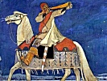

  
[Intangible Textual Heritage](../../index)  [Legends and
Sagas](../index)  [Index](index)  [Previous](ms107)  [Next](ms109) 

------------------------------------------------------------------------

  
*Magic Songs of the West Finns, Vol. I*, by John Abercromby, \[1898\],
at Intangible Textual Heritage

------------------------------------------------------------------------

p. 126

### CHAPTER III

### HISTORICAL NOTICES OF CLASSICAL AUTHORS

As the sections on the earlier Iron Age
in Russia have brought us down to historic times in the south of Europe,
it is well, before proceeding to sketch the prehistoric history of the
Finnish peoples, so far as it can be deduced from the culture-words in
their vocabularies, to see what light the brief notices of classical and
post-classical authors throw upon the huge territory in which we are
interested, or upon its inhabitants. Herodotus, about the middle of the
fifth century B.C., is the earliest writer that deals with any part of
Russia, but as his knowledge was almost entirely confined to the north
coast of the Euxine, he is of no great assistance. Indeed, it would be
quite out of place to mention him at all here, were it not for the fact
that several writers, including so well known and good a scholar as W.
Tomaschek, identify several nations named by Herodotus with different
Finnish peoples. For instance, the Budini are often identified with the
Votiaks, who call themselves Ud-murt. W. Tomaschek does so, brings them
as far south as Sarátov, and supposes they extended northwards as far as
the lower course of the Kama and the Biélaya, eastwards to the Urals and
westwards to the Sura. Yet, except in the passage in which Herodotus
assigns the

p. 127

\[paragraph continues\] Budini a
geographical position three hundred geographical miles north of the
Sauromatæ and east of the Don, the context of the other places in which
they are mentioned all point to a more westerly position, somewhere near
the upper waters of the Dniester or the Bug, where Ptolemy locates the
Bodini. The father of history expressly states the Budini dwelt in a
densely wooded country, though in his time, just as now, from Saratov
northwards and westwards the country for a great distance must have been
very bare of timber. Along the banks of streams, and where the subsoil
was damp, trees doubtless flourished, but it is well known that the
'black earth' districts were never covered with primeval forest. On
these two grounds it seems to me doubtful if the Budini lived east of
the Don at all. To connect the vocable Budini either with Votiak or
Ud-mort seems questionable for several reasons. First, we do not know
that this was the name they applied to themselves. Secondly, there is no
assignable cause for dropping the *b*, which itself is an impossible
initial sound in original Finnish. Thirdly, an original Permian dental,
unless supported by another consonant, seems to fall out or turns into
*l*: e.g. *ki* = F. *käte*-; *ku* = F. *kete*-; *ma*, *mu* = F. *mete*-;
*va*, *vu* = F. *vete*-; *ku-nị* = F. *kuto-a*; *s´ulem* = F. *sydame*-,
etc.

W. Tomaschek also connects the name Thyssagetæ with the Čusovaya, and
identifies the people with the Voguls. The identification is ingeniously
worked out, though hardly convincing, while to explain the four rivers
that flowed through their territory into the Mæotis he has to do great
violence to the text he is trying to elucidate. Nor can I find
sufficient ground for believing that the Melanchlainæ were Čeremis and
that the Cannibals were Mordvins, for

p. 128

both these nations seem to have lived too far south to be connected with
any Finnish people. [1](#fn_110)

The next authority is Ptolemy, who wrote about the middle of the second
century A.D., but sometimes incorporated into his geography information
of considerably earlier date. By this time the interior of Russia must
have been partly explored. The geographical position of the sources of
the Volga or Rha, a name still preserved by the Mordvins, and of the Don
are given, as well as the points where they make a sharp, protracted
bend, and the course of the Kama is also laid down. If, as seems
probable, Ptolemy has taken the source of the Mologa for that of the
Volga, his longitude is nearly right, though the latitude is a full
degree too far north. But the point where the Kama falls into the Volga
is 2½° too far west, and over 3° too far north, while the length he
assigns to the Kama falls short of its real length, though it may reach
to the confluence of the Čusovaya. The length of the Don is also too
short, though the lower course below the bend is fairly exact. The neck
where the Don and the Volga approach nearest each other was known,
though it was placed fully 7° too far north and about 2½° too far west.
The mouth of the Volga is fairly accurate as regards longitude, but a
full degree too far north, while the mouth of the Don is about 2½° too
far west, and fully 7° too far north.

At the bend made by the Don were the Perierbidi, who were a great
people; above them Ptolemy names three others; above them Royal
Sarmatians, Modocæ, and Horse-eating Sarmatians, and north of these the
Hyperborean Sarmatians. All these tribes, including the most northerly,
are expressly said to be a pastoral people, so that, starting

p. 129

from the bend of the Don northwards, they could not have extended beyond
the Volga, and, if the information is correct, some of these tribes
roamed over a region where Mordvins are now found. Whether any of them
are ancestors of the Mordvins is a question that cannot be answered,
though it does not seem impossible. Near the supposed source of the
Kama, but really about the confluence of the Čusovaya, were the Robosci,
and to them perhaps belonged the objects of stone and copper that have
been found near its mouth ([p. 79](ms107.htm#page_79)), as well as the
place near Gliadénova where they sacrificed to their gods. East of the
Volga, but south of the Kama, were the Lice-eaters, the Materi, and the
district Nesiotis.

Although nothing definite can be learnt from a perusal of the ethnic
names of Ptolemy, we have the assurance that the Don, the Volga, and the
Kama were known for the greater part of their respective lengths by the
middle of the second century, and possibly earlier. That means they had
been traversed by persons of sufficient intelligence to measure roughly
the length of the rivers on which they were travelling, and to note down
the names of the nomadic tribes that lived on the banks. Along the Volga
the notebook seems not to have been used after reaching the Old, for
pastoral tribes, owing to the forests, could hardly have pastured large
herds west of that river. The left bank of the Volga appears to have
been imperfectly known, which may mean that all the stopping-places were
on the right or high bank. Along the banks of the Kama, which must have
been thickly wooded, no notice is taken of the inhabitants, not even of
the people who buried their dead in the cemetery at Anánino, till we
reach the supposed source of the river. East of the Urals Ptolemy knew
of no rivers

p. 130

that drain into the Siberian Ocean, a sufficient proof that his
knowledge did not extend much beyond the 55th parallel of north
latitude, and that no caravan route could have existed in the time of
Herodotus that led up the valley of the Kama, across the Urals and up
the Irtịš, as W. Tomaschek maintains. [1](#fn_111)

As nothing was known of Central Russia, taking Moscow as a centre and
describing a circle with a radius of at least two hundred miles, it is
more convenient to leave Ptolemy for a while and hear what Tacitus at
the end of the first century has to relate about the Æstii and the
Fenni. He places the Æstii, or Aistii, on the coast to the right of the
Suevian Ocean, by which we have to understand somewhere on the east side
of the Vistula, for his descriptive geography is hazy in the extreme. In
dress and manners they resembled the Suevi, but they cultivated the
earth with a patience that was hardly consistent with the natural
laziness of Germans. They searched the sea for amber, which they termed
*glēsum*, and were the only people that gathered it. Being possessed of
little iron, their favourite weapon was the club. They worshipped the
mother of the gods, and in war placed the greatest reliance on carrying
about with them the figure of a wild boar; by doing so they were
perfectly secure. With regard to their language it had more affinity
with that of Britain.

In this brief account there are certainly discrepancies. In one breath
the Æstii are classed with Germans, in another their language is said to
resemble rather that of Britain, while the only word quoted is a genuine
Teutonic vocable. In the next section, however, Tacitus hesitates
whether to collocate the Venedi and the Fenni with Germans

p. 131

or Sarmatians, though he finally arrives at the conclusion that the
former must be ascribed to Germany, since they had settled habitations,
knew the use of shields, and travelled on foot, while the Sarmatians
lived on horseback or in wagons. His classification of ethnic groups was
based therefore more on ethnography than on language. But if the
introduction of the word *glēsum* was made through inadvertence, as
might well be the case, the substantial fact remains that the language
of the Æstii and the Suevi differed more than dialectically; it
belonged, in fact, to a different group. Tacitus further mentions in
order from north to south the Fenni, the Venedi, and the Peucini without
defining exactly their geographical position, though all must certainly
be placed to the east of the Vistula. The Venedi led a wandering life
and supported themselves by plunder, but at the same time they had
settled abodes, used shields, and travelled on foot, not on horseback
like the Sarmatians. The Fenni were extremely ferocious, poor, and
dirty; they possessed no weapons, save bows and arrows tipped with bone,
no horses, and no fixed abode. They slept on the ground, lived partly on
herbs, and dressed in the skins of wild animals. As Tacitus hesitated
whether to class the Fenni among the Germans or not, there may be some
exaggeration in his picture of them, and it does not correspond with
what we have reason to believe was the civilisation of the Finns at the
beginning of the present era.

To Ptolemy the Vistula was the boundary between Germany and Sarmatia. He
places the Venedic Gulf east of the mouths of the Vistula, and continues
the coast in an easterly and north-easterly direction for several
hundred miles. Along this stretch of sea coast he mentions four

p. 132

rivers—the Khronos, Rhubon (Rhudon), Turuntos, and Khesinos (Khersinos,
Khesynos). In contradistinction to the rivers west of the Vistula, most
of which bear names that recall the ancient designations, none of these
four can now be recognised. This circumstance might arise either from a
complete migration of the older population, which was succeeded by
another that renamed the rivers, or from the information that Ptolemy
used having been obtained from a foreign, perhaps a German, source. To
the watershed, lying 800 to 900 feet above the sea, from which these
rivers descended, the Greek geographer and his successors gave several
names; east of the Vistula it was termed the Venedic Hills; further
east, but on the same parallel, it bore the name of Bodinon, and still
further east, of Alaunon; 2½ degrees north and a little to the east came
the hills called Rhipaia. According to Marcian of Heracleia the Khronos
was the smallest of the four rivers, and both it and the Rhudon
debouched into the Venedic Gulf, but the first rose in the Venedic Hills
and the other in the hill Alanos (Alaunos). The two other rivers had
their rise in the Rhipaian Hills. Smaller tribes near the Vistula and
south of the Venedai were the Guthones, then the Phinnoi, then the
Sulones. East of these, and also south of the Venedai, were the
Galindai, Sudinoi, and Stavanoi. It has been suggested that the names
Galindai, Sudinoi are perhaps preserved in the old Prussian districts of
Galindia and Sudovia, the first lying west, the other north-east, of the
Spirding See, though Ptolemy seems to place them south of the watershed.
On the coast adjoining the Venedic Gulf were the Veltai, north of them
the Ossioi (Hosioi), and north of all the Carbones. East of the latter
were the Karestai and Saloi, south of them the

p. 133

\[paragraph continues\] Agathursoi.
Marcian makes the remark that the Agathosoi (Agathursoi) were a
Sarmatian people in Europe that lived on the Khesynos.

As the longitude of the mouth of the Vistula given by Ptolemy is only a
little east of the true longitude, it may be the result of an astronomic
observation; but he places its latitude more than a degree and a half
too far north. Every point on his map east of this river is extremely
doubtful, for when his data are protracted to scale on a modern map his
furthest point falls to the west of the north end of Lake Onega. As this
point was supposed to be in the same latitude as Thule, which Ptolemy
placed three degrees of latitude too far north, it must be lowered by
that amount and set on the both parallel, which runs through the head of
the Gulf of Finland. And as the base point at the mouth of the Vistula
is too far north, another degree or so must be subtracted, which places
the furthest known point somewhere on the north-west coast of Esthonia.
That Ptolemy's knowledge should have extended so far north, if not
further, is corroborated by the archæological objects found in Esthonia,
some of which had evidently been brought there by a maritime route.
Between the furthest point on the Esthonian coast and the Vistula the
four rivers above mentioned must be sought. As the Khronos was the
smallest of the four, and rose in the Venedic Hills, it might be the
Pregel, which at various times has been known as the Pregora, Lipza,
Lipsa, and Skarra; the Rhubōn, which also fell into the Venedic Gulf,
must be the Niemen, Lith. Nemōnas; the Turuntos is very difficult to
identify, but I suppose it to be the Windau, Lith. Venta, though it does
not rise anywhere near the Rhipaian Hills; the Khersinos is probably the
Dvina.

p. 134

The Venedai occupied the south coast of the Gulf of Dantzig as far,
perhaps, as the Niemen, a territory that in historic times belonged to
the Old Prussians, a people of Lithuanian stock. The Veltai, who came
next, may have been on the coast of Kurland, the Ossioi in Livland, and
the Carbones in Esthonia. The only evidence we have regarding the
nationality of the tribes hereabouts is of a negative nature, the chance
remark that the Agathyrsi on the Khesynos (Dvina?) were a Sarmatian
people implying at any rate that they were not Germans. Of course it is
astonishing to find such well-known ethnical names as Agathyrsi and
Aorsi, who came next below them, so far to the north, but a probable
explanation is that local names resembling these in form have been
transmuted into the above by a rash and thoughtless scribe. As the
Agathyrsi were not on the coast, they may have lived about the Drissa, a
northern affluent of the Dvina, and the four tribes mentioned by Ptolemy
as occupying the country between the Agathyrsi and the Rhipaian Hills,
in which the Khersinos or Khesynos took its rise, were possibly cantoned
along its banks. If that is so the Dvina was navigated in boats that may
have been taken as far as the site of Bielị in the government of
Smolensk, where navigation begins, and some, if not all, of the
inhabitants of the valley were Sarmatians.

If Ptolemy is to be credited, most, if not all, of the inhabitants of
East Prussia in the middle of the second century were Slavs, for he
calls them Venedai, or Wends. As he omits the Æstii he probably included
them among the Venedai, who are expressly stated to have been a very
great people. South of these, and presumably south of the Venedic Hills,
he sets Guthones, who are generally

p. 135

taken to be Goths, and whose position would therefore be in the north of
Poland. South of them were the Phinnoi. Zeuss did not accept the
Ptolemian account; he assumed that the name of Venedic Gulf was an
entire misnomer, placed the Guthones on the coast instead of the
Venedai, and affirmed it was impossible Ptolemy could have located the
Phinnoi in their true position. [1](#fn_112) If
by these we have to understand Lapps or Finns, it may certainly be
granted that they never permanently lived near the right bank of the
Vistula, and this position does not quite tally with that assigned to
them by Tacitus. His Peucini inhabited the region north of the
Carpathians, what is now Galicia; north of them were plundering Venedi,
who may be placed in Volhynia, and north of them were the Fenni, in what
is now the government of Minsk. Both authorities place the latter people
in the same latitude, or nearly so, but Ptolemy sets them about two
degrees further west. Although it is difficult to believe that any
Western Finns ever resided permanently so far to the west and south as
the government of Minsk, and although their civilisation in the second
century A.D. was very different from that portrayed by Tacitus, it is
not impossible to suppose that they made hunting or predatory excursions
in that direction. To judge from the practice of modern Zịrians and
Samoyedes, a hunting or trading expedition to a place several hundred
miles distant from their headquarters is no great matter; and the
former, even in winter, travel very lightly attired, with no more
property than can be placed on a light sledge and dragged along by its
owner. At certain seasons, when wild fowl were in abundance, the Pinsk
marshes may have presented great attractions, and they were well within

p. 136

reach of Finns near the sources of the Volga, the Valda Hills, and other
places where they can with certainty be postulated. On these excursions
all the members of a large family or small clan would not take part;
some would be left behind to look after the few horses and cattle they
possessed, to protect the huts, and till the ground. As iron was
scarcely known, at any rate was very rare, the arrow-heads were tipped
with bone. Supposing, as we arc bound to do, that such respectable
authorities as Tacitus and Ptolemy had sufficient warrant for the
statements they advanced, it is only by a hypothesis of this kind that
we can explain the presence of Finns not more than one hundred
geographical miles from the banks of the Vistula.

To return to the Aistii: they are mentioned in the sixth century by
Jordanes, who speaks of them as a very peaceful people, living on the
coast to the east of the Vidivarii, an aggregate of diverse
nationalities that dwelt between the three mouths of the Vistula. They
were therefore posted along the amber coast of East Prussia. In the
ninth century, under the name of Estas, they are mentioned by Wulfstan
in the description he gave to King Alfred of his voyage along the south
coast of the Baltic. He sets them east of the mouth of the Vistula, and
speaks of the Frische Haf as the Estmere. Estland is said to be very
extensive, and to contain many towns, with a king over each. Honey and
fish were there in abundance. The kings and the richest people drank
mare's milk, while the poor had to content themselves with mead, as beer
was entirely unknown. [1](#fn_113) When a man
died his body was left unburnt

p. 137

with his relations for a month, or even six months, according to the
wealth and status of the defunct. During the whole of this interval the
friends and relations were continually feasting and amusing themselves
till the day of cremation. All that was left of the deceased's property
after the long jollification was divided into several lots, and placed
at different distances from the dead man's home. The relatives and
friends then raced for the lots, and the man with the best horse carried
off the best share, which was also the furthest off. When this
excitement was over the corpse was burnt with the weapons and clothing.
As neither drinking mare's milk nor racing in connection with funeral
rites have been recorded as Teutonic customs, but are compatible with a
people of Sarmatian descent or mode of life, the Æstii of Tacitus may be
regarded as the progenitors of the Estas of the ninth century. And as
the Est name was eventually transferred to the Finnish Esthonians, it is
probable that, taken in connection with the craniological and
archæological data of previous chapters, the whole of the Baltic
Provinces were once possessed by tribes of Lithuanian or Lettish stock.

In a previous chapter it was mentioned that some of the best
archaeologists believe that the Baltic Provinces up to the fifth century
were occupied by a Teutonic people who disappeared without leaving any
trace of their presence, save the archæological finds of the earlier
Iron Age. But as Ptolemy and other authorities make the Vistula the
boundary between Germany and Sarmatia, and several indications seem to
show that part of the information was received from German sources, such
as words like *Fenni*, *Æstii*, *glēsum*, *Khronos*, *Khersinos*,

p. 138

it is singular that none of the intelligence from such sources led
Ptolemy to suppose that Germans lived along the Baltic coast east of the
Vistula. It is remarkable, too, that the so-called 'face-urns' of the
Hallstadt period, so common and characteristic of the region west and
south of Dantzig, are only known in one place east of the Vistula, quite
close to the right bank. This is easily explained by the hypothesis that
the river was the boundary between two distinct nationalities, though
not otherwise. The question whether the Lithuanian peoples are recent
intruders might be definitely answered, if we knew of any grounds for
believing them to have been settled for a very long time on the
south-east shores of the Baltic, where they can certainly be traced for
the last eighteen centuries. Two words show they have not materially
changed their abode for a long period of time. They have native words
for the 'eel' and the 'salmon,' both of which have to migrate annually
to the sea, and are found in rivers that drain into the Baltic, but not
in those that find an outlet in the Black Sea. This places the old home
of the Lithuanian peoples north of the watershed of all rivers that run
southwards; an area that includes East Prussia, Poland, the Baltic
Provinces, and the governments of Kovno, Suvalki, Vilna, Vitebsk, Pskov,
and Petersburg. But Poland and East Prussia west of the Pregel may be
excluded, as the word for 'beech' is a Teutonic loan word, and the
eastern limit of the tree at present is formed by a line drawn from
Königsberg to Podolia. The original home of the Letto-Lithuanians may be
sought chiefly in the valleys of the Niemen and the Dvina, with their
tributaries. Though there are eels, there are no salmon in the Velíkaya,
the Embach, or

p. 139

\[paragraph continues\] Lake Peipus, as
their progress is stopped by the Falls of the Narva; but they are caught
in the Narva below the Falls, in the Salis, and all other rivers that
fall into the Baltic. Whether salmon are found in Lake Ilmen or the
Volkhov I have no information, but a variety of the salmon frequents
Lake Ladoga, and there is no obstacle to prevent their ascending the
Volkhov to Lake Ilmen. Yet it is curious that at the prehistoric station
on Lake Ladoga no salmon bones were observed.

According to Professor Y. Koskinen, the first reliable information of a
Finnish people being settled in the Baltic Provinces belongs to the
middle of the ninth century. In his Life of St. Ansgarius, Rimbert
mentions that the Kurs (Cori) had formerly been subjected to Sweden,
though they had shaken off her yoke a long time ago. He then narrates
how the Danes, about 853 A.D., had made an unlucky raid into the land of
the Kurs, which was divided into six districts (*civitates*), and how
afterwards the Swedes with better luck and the aid of Christ had again
brought them into subjection. This shows that in Rimbert's time the Kurs
were already settled on the Baltic coast, and this settlement must have
occurred at least by the end of the eighth century, probably earlier.
There is no doubt that the Livs and Kurs were one and the same people,
and evidently about the same period the Ests settled in Esthonia and the
Finns proper in Finland. [1](#fn_114) Against
part of this statement Pastor Bielenstein raises an objection. Though he
grants that the Kurs were undoubtedly Finns, and that the name was
probably given them by the Scandinavians, he considers it a mistake to
suppose that a Finnish people must have covered the

p. 140

whole area where the name Kur is found. For instance, the Kurs of the
Kurische Nehrung have always been Letts, and the Lithuanians call the
Letts that live among the Finnish Kurs—Kuršei. In his opinion the Cori
of St. Ansgarius, who fought with King Olaf in Apulia, not far from
Schoden on the Bartau, were most likely Letts or Lithuanians, as no
Finnish place-names occur in that part of Kurland. [1](#fn_115)

This seems rather to invalidate the proposition that in the middle of
the ninth century the Scandinavians knew of a Finnish people in the
north-west of Kurland. But as about 12 per cent. of Finnish place-names
are to be found in the old province of Bihavelanc, through which the
lower half of the Bartau flows, some Finnish Kurs must have been settled
there. It is possible then that the Finnish (?) Cori on this occasion,
when attacked by a stronger force of Swedes, were compelled to retire up
the river, and were actually on Lithuanian ground when, feeling
themselves cornered, they delivered battle.

Although the first reliable notice of the Kurs is by Ansgarius, they are
named by Saxo as having taken part in the great battle of Bravalla
between the Swedes and Danes about the year 775, in which the former
were victorious. On this notable occasion Kurlanders and Esthonians are
said to have fought on the side of the Swedes, while Livonians and Slavs
had sided with the Danes. It is possible, perhaps likely, that these
names are the additions of a later time, but it shows the Finns were a
fighting people and were accustomed to face the sea at the time when
these names became attached to the

p. 141

legend of the great battle. The Slavs here mentioned are the Wends of
Pomerania, and it is to be remarked that the Letts and Lithuanians are
passed over in silence; either they were not a very warlike people, or
they were not distinguished from the Wends, as Ptolemy seems also to
have done.

Almost contemporaneous with the first notice of the Cori is the mention
of the Ests, or Esthonians, under the name of Čudes, by Nestor, the
earliest Russian annalist. In 859 he records that the Variags came from
the other side of the sea and levied on the Čudes, Slavs, Merians, etc.,
a tribute of one white squirrel-skin per head. Three years later they
again visited Russia. But on this occasion the above-mentioned peoples
refused to pay the tax, drove the enemy back across the sea, and made an
interesting experiment in self-government. It did not however prove a
success. Internal quarrels were so numerous that a deputation of Čudes,
Slavs, etc., was sent to the country of the Variags to solicit the loan
of an impartial prince, strong enough to keep the peace. The result was
that Rurik and his two brothers came to Russia, built the town of
Ladoga, and became the founders of the Russian Empire. [1](#fn_116) So far as we can judge from the brief
entries of the annalist, the Čudes and Slavs were apparently on a
footing of equality. Both peoples rose against the Variags, and both
took part in the council that determined to summon a foreign prince who
could hold the balance evenly between the conflicting interests of
Finns, Slavs, etc. The Čudes were probably as well, if not better, armed
than the Slavs. If Ibn Dustah's information is to be relied upon, the
latter fought on foot, and were only

p. 142

armed with javelins, spears, and shields. In addition to these, the
Čudes might have had swords as well as bows and arrows. At any rate they
and the Merians took part with the Variags and Slavs, not only in Oleg's
expedition that led to the capture of Smolensk in 882, but also in his
far more important campaign against the Greeks in Constantinople in 907.
Those of the Finns that lived to return to their homes no doubt brought
back their share of the ransom that the Greeks had to pay to Oleg to
avoid the complete sack of the imperial city. He had demanded and
obtained twelve grivnas, or about six lbs., of silver for each of his
fighting men. For more than a hundred years afterwards the Finns and
Slavs seem to have lived together on friendly terms. It is not till the
year 1030 that this happy state of things was disturbed by Yaroslav, who
invaded the country of the Čudes, conquered them, and laid the
foundations of Yúriev (Dorpat). Twelve years later his son Vladímir made
a campaign against the Yems, now mentioned for the first time, subdued
them, and took many prisoners. The Russians were not however always
successful, for in 1054, when Ostromir and his Novgorodan soldiers made
an incursion upon the Čudes, he was killed, and many of his followers.
Generally speaking, however, the Čudes came off second-best, and no
doubt were greatly outnumbered. [1](#fn_117) As
the entries in the Chronicle are extremely brief, and tell us nothing of
the customs or social life of the Finnish tribes, and often leave their
geographical position uncertain, it is unnecessary to pursue them
further.

Though mentioned earlier, not much is known of the Livs till the arrival
of the Germans at the mouth of the

p. 143

\[paragraph continues\] Dvina in 1159.
When Meinhart arrived in 1186 he found them paying tribute to King
Vladimir of Polotsk, and the same winter the Lithuanians devastated the
country and carried away many captives. His well-intentioned efforts to
convert the Pagan Livs were not crowned with immediate success; when by
promises of protection against their enemies a few had been enticed to
accept baptism, even these few persons took the first convenient
opportunity of washing it off in the waters of the Dvina. The German
chroniclers tell us almost nothing of the Paganism of the Livs. A Bull
of Pope Innocent in 1190 avers that the Livs paid the honour due to God
to brute beasts, to leafy trees, to clear water, to verdant herbs, and
to unclean spirits. They seem to have cut the images of their gods on
the boughs of the sacred trees, and it is known that the Esthonians had
images of their gods in a beautiful wood in Wierland. The offerings to
the gods consisted of a dog or a ram, occasionally of a man. To discover
the will of the gods before important undertakings different modes of
sortilege were employed; and to this punctilious observance of the Livs
a German missionary bishop once owed his life. They were under the
impression that the sacrifice of the bishop would have a beneficial
effect upon the crops. But they first consulted the oracle by making a
horse step over a lance. As it crossed the spear with the foot that
showed the victim was unsuitable—probably the left foot—the life of
Bishop Theodorich was spared. How the Livs disposed of their dead is not
recorded, but the Kurs practised cremation, and the funeral ceremony was
accompanied with loud lamentation. The Livs did not form a connected
state under a common head, but were under a number of small elders, whom
Henry of Lettland

p. 144

generally terms '*seniores*.' Besides these there was a class of
wealthier people, called by the chronicler '*primores*, *meliores*,'
from whose families hostages were taken. Some of the elders were
entitled kings—without meaning, however, that they exercised authority
over the other elders. And the district over which an elder ruled was
termed '*provincia*,' or in the language of the Ests—'*kylegunda*,'
originally a loan word from the Scandinavians. The Livs were armed with
swords, lances, javelins, bows, and shields, and fought both on foot and
on horseback. Their many wars were chiefly predatory expeditions against
their neighbours; at first against the Letts, whom they despised, and in
later times against the Esthonians, Zemgalls, Lithuanians, and Russians.
These incursions were carried on with great barbarity and devastation of
property, the men being all killed, while the women and children were
generally led captive. In this, however, they were no worse than their
neighbours, and not so bad as the Letts, whom Henry describes as the
most cruel of all people. The Livs, when not fighting and marauding,
occupied themselves with agriculture, fishing, hunting, cattle-rearing,
and bee-keeping. Before the arrival of the Germans they had some trade
to boast of, for Adam of Bremen, writing of Livland some one hundred
years before that event, says that it was rich in gold. Henry, too,
relates that the sons of Lettish elders, after a raid into Esthonia,
brought back three lispunds (sixty lbs.) of silver, besides other booty.
Though the Livs used ships and boats, it is never mentioned that they
used them for piratical expeditions. In this they differed from the
Kurs, who, before the advent of the Germans, had the reputation of being
noted pirates, and in conjunction with the islanders of

p. 145

\[paragraph continues\] Oesel extended
their depredations as far as Denmark and Sweden. [1](#fn_118)

Although the Kurs are mentioned earlier than the Letts in Kurland, it
does not follow that they were the older inhabitants. There is ground
for believing them to be intruders. Both in Kurland and Livland, to
judge from the evidence of place-names, the Finns only occupied a fringe
of territory along the coast, for Finnish names on the map gradually
diminish in number as we recede from the sea. Their name, too, for the
Dvina (Vēna, Väinä) seems borrowed from a Slav dialect. [2](#fn_119)

------------------------------------------------------------------------

### Footnotes

[128:1](ms108.htm#fr_112) Tomaschek, Bd. cxvii,
pp. 8–10, 17, 19–21, 32–34.

[130:1](ms108.htm#fr_113) Tomaschek, (1) p.
780.

[135:1](ms108.htm#fr_114) Zeuss, pp. 266, 274.

[136:1](ms108.htm#fr_115) Ibn Dustah, about the
year 912, says much the same of the Slavs. Only the great prince drank
mare's milk, the rest of the people drank mead (Khvolson, pp. 31, 32).

[139:1](ms108.htm#fr_116) Koskinen, p. 360.

[140:1](ms108.htm#fr_117) Bielenstein, pp. 350,
351.

[141:1](ms108.htm#fr_118) Akiander, pp. 12–14.

[142:1](ms108.htm#fr_119) Akiander, pp. 15, 19;
Paris, i. pp. 35, 36.

[145:1](ms108.htm#fr_120) Wiedemann, pp. xxx,
lvi, lxi–lxiv.

[145:2](ms108.htm#fr_121) Bielenstein, pp. 348,
357, 365.

------------------------------------------------------------------------

[Next: Chapter VI. The Prehistoric Civilisation of the Finns](ms109)

