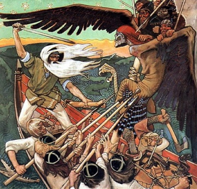

  
[Intangible Textual Heritage](../../index.md)  [Legends and
Sagas](../index.md) 

------------------------------------------------------------------------

<table width="75%">
<colgroup>
<col style="width: 50%" />
<col style="width: 50%" />
</colgroup>
<tbody>
<tr class="odd">
<td width="50%" data-valign="TOP"></td>
<td width="50%" data-valign="CENTER"><h1 id="magic-songs-of-the-west-finns-vol.-2" data-align="CENTER">Magic Songs of the West Finns, Vol. 2</h1>
<h2 id="by-john-abercromby" data-align="CENTER">by John Abercromby</h2>
<h4 id="section" data-align="CENTER">[1898]</h4></td>
</tr>
</tbody>
</table>

------------------------------------------------------------------------

[Contents](#contents)    [Start Reading](ms200.md)    [Page
Index](pageidx)    [Text \[Zipped\]](ms2.txt.gz.md)

------------------------------------------------------------------------

This is the second volume of Abercromby's Magic Songs of the West Finns,
which contains the core text here, a translation of Lönnrot's Suomen
Kansan muinaisia Loitsurunoja, 'Bygone Magic Songs of the Finns.'
Lönnrot was the scholar who pieced together the Kalevala, the national
epic of Finland.

Reminiscent of the Carmina Gadelica, the collection includes a wide
variety of spells, formulae, prayers, and origin myths, all used on a
regular basis by shamans, healers and peasants from ancient times in
Finland. The songs include dozens of names of gods, goddesses, heroes,
nature spirits, and weave them together using surreal and symbolic
language. Although scholars could wish for better attribution of the
source of each song, this collection is an incredible look into an
archaic way of thought.--J.B. Hare, March 9th, 2010.

------------------------------------------------------------------------

 [Title Page](ms200.md)  
[Contents](ms201.md)  
[Chapter VII. Charms of the East Finns, Russians, Letts, etc.](ms202.md)  
[Magic Songs of the Finns](ms203.md)  
[Words of Healing Power](ms204.md)  
[Formulæ](ms205.md)  
[Prayers](ms206.md)  
[Origins](ms207.md)  
[Index](ms208.md)  
