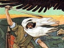

  
[Intangible Textual Heritage](../../index)  [Legends and
Sagas](../index)  [Index](index)  [Previous](ms200)  [Next](ms202) 

------------------------------------------------------------------------

  
*Magic Songs of the West Finns, Vol. 2*, by John Abercromby, \[1898\],
at Intangible Textual Heritage

------------------------------------------------------------------------

### CONTENTS

# PRE- AND PROTO-HISTORIC FINNS

|                                  |                                                                  |                                 |
|----------------------------------|------------------------------------------------------------------|---------------------------------|
|                                  | CHAPTER VII                                                      |                                 |
|                                  | CHARMS OF THE EAST FINNS, RUSSIANS, LETTS, ETC.                  |                                 |
|                                  |                                                                  | PAGE |
|                                  | Mordvin Charms                                                   | [8](ms202.htm#page_8)           |
|                                  | Čeremisian Charms                                                | [11](ms202.htm#page_11)         |
|                                  | Votiak Charms                                                    | [14](ms202.htm#page_14)         |
|                                  | Lettish Charms                                                   | [19](ms202.htm#page_19)         |
|                                  | Great Russian Exorcisms                                          | [30](ms202.htm#page_30)         |
|                                  | Post-Classical Charms                                            | [37](ms202.htm#page_37)         |
|                                  | Swedish Charms                                                   | [38](ms202.htm#page_38)         |
|                                  | The Structure of the Magic Songs                                 | [40](ms202.htm#page_40)         |
|                                  | Their Age                                                        | [44](ms202.htm#page_44)         |
|                                  | The Poetic Element—Similes                                       | [46](ms202.htm#page_46)         |
|                                  | Figurative Expressions, Metaphors, Epithets                      | [54](ms202.htm#page_54)         |
|                                  |                                                                  |                                 |
|                                  | THE MAGIC SONGS OF THE FINNS                                     |                                 |
| SECT. |                                                                  |                                 |
| 1\.                              | Preliminary Formula, *a—d*                                       | [65](ms203.htm#page_65)         |
| 2\.                              | Defensive Measures, *a—f*                                        | [67](ms203.htm#page_67)         |
| 3\.                              | Against Envy, *a—d*                                              | [70](ms203.htm#page_70)         |
| 4\.                              | Vengeance Formula, *a*, *b*                                      | [72](ms203.htm#page_72)         |
|                                  | p. vi                                  |                                 |
| SECT. |                                                                  | PAGE |
| 5\.                              | To Discover the Cause, *a—c*                                     | [73](ms203.htm#page_73)         |
| 6\.                              | Reparation for Harm, *a*, *b*                                    | [75](ms203.htm#page_75)         |
| 7\.                              | Against Inflammation and Angry Symptoms, *a—c*                   | [76](ms203.htm#page_76)         |
| 8\.                              | Expulsion Formula, *a—d*                                         | [77](ms203.htm#page_77)         |
| 9\.                              | Posting Formula, *a*, *b*                                        | [79](ms203.htm#page_79)         |
| 10\.                             | Pain or Sickness Formula, *a—d*                                  | [81](ms203.htm#page_81)         |
| 11\.                             | Reproaching Formula                                              | [82](ms203.htm#page_82)         |
| 12\.                             | Falling into Ecstasy, *a—c*                                      | [83](ms203.htm#page_83)         |
| 13\.                             | In Distress                                                      | [84](ms203.htm#page_84)         |
| 14\.                             | Boasting Formula, *a—i*                                          | [85](ms203.htm#page_85)         |
| 15\.                             | To Still Violence, *a*, *b*                                      | [90](ms203.htm#page_90)         |
| 16\.                             | Menacing Formula, *a*, *b*                                       | [92](ms203.htm#page_92)         |
| 17\.                             | Exorcisms, *a—z*                                                 | [94](ms203.htm#page_94)         |
| 18\.                             | To Make Fast, *a*, *b*                                           | [106](ms203.htm#page_106)       |
|                                  |                                                                  |                                 |
|                                  | WORDS OF HEALING POWER                                           |                                 |
| 19\.                             | For Stings of Wasps, Gadflies, and other Insects, *a*, *b*       | [107](ms203.htm#page_107)       |
| 20\.                             | For Sickness caused by Elf-shots, sudden Strokes, etc., *a*, *b* | [108](ms204.htm#page_108)       |
| 21\.                             | For the Toothache, *a—c*                                         | [109](ms204.htm#page_109)       |
| 22\.                             | For Wounds caused by Hiisi                                       | [111](ms204.htm#page_111)       |
| 23\.                             | For Whooping Cough                                               | [112](ms204.htm#page_112)       |
| 24\.                             | For Injuries caused by Kalma                                     | [112](ms204.htm#page_112)       |
| 25\.                             | When torn by a Bear or a Wolf                                    | [112](ms204.htm#page_112)       |
| 26\.                             | For Contusions from a Stone, *a*, *b*                            | [113](ms204.htm#page_113)       |
| 27\.                             | For Syphilis, *a*, *b*                                           | [114](ms204.htm#page_114)       |
| 28\.                             | To remove Tumours, Abscesses, Boils, *a*, *b*                    | [116](ms204.htm#page_116)       |
| 29\.                             | For Snake Bites, *a—e*                                           | [117](ms204.htm#page_117)       |
| 30\.                             | For Gout or Heartburn                                            | [120](ms204.htm#page_120)       |
| 31\.                             | For cutting off Excrescences                                     | [120](ms204.htm#page_120)       |
| 32\.                             | For Contusions or Lesions, *a*, *b*                              | [121](ms204.htm#page_121)       |
| 33\.                             | For the Hiccough                                                 | [122](ms204.htm#page_122)       |
| 34\.                             | For Sprains, *a—d*                                               | [122](ms204.htm#page_122)       |
|                                  | p. vii                                |                                 |
| SECT. |                                                                  | PAGE |
| 35\.                             | Against Nightmare                                                | [124](ms204.htm#page_124)       |
| 36\.                             | For Frostbite, *a*, *b*                                          | [124](ms204.htm#page_124)       |
| 37\.                             | For Stitch or Pleurisy, *a—c*                                    | [125](ms204.htm#page_125)       |
| 38\.                             | For Contusions from Trees, *a*, *b*                              | [127](ms204.htm#page_127)       |
| 39\.                             | For Cancer or Whitlow, *a*, *b*                                  | [128](ms204.htm#page_128)       |
| 40\.                             | For Injuries from Iron, *a—d*                                    | [129](ms204.htm#page_129)       |
| 41\.                             | For Rickets, Atrophy                                             | [132](ms204.htm#page_132)       |
| 42\.                             | For Injuries caused by Spells, *a*, *b*                          | [133](ms204.htm#page_133)       |
| 43\.                             | Against the Plague                                               | [134](ms204.htm#page_134)       |
| 44\.                             | For Thrush                                                       | [134](ms204.htm#page_134)       |
| 45\.                             | For Pain in the Eye from Particles of Chaff, *a*, *b*            | [134](ms204.htm#page_134)       |
| 46\.                             | For Disease in the Eye, *a*, *b*                                 | [136](ms204.htm#page_136)       |
| 47\.                             | For a Lizard's Bite                                              | [137](ms204.htm#page_137)       |
| 48\.                             | For Laceration by a Wolf                                         | [137](ms204.htm#page_137)       |
| 49\.                             | For the Pains of Child-birth, *a*, *b*                           | [138](ms204.htm#page_138)       |
| 50\.                             | For the Itch                                                     | [139](ms204.htm#page_139)       |
| 51\.                             | For Skin Eruption                                                | [139](ms204.htm#page_139)       |
| 52\.                             | For Burns, *a—k*                                                 | [140](ms204.htm#page_140)       |
| 53\.                             | For Scalds                                                       | [144](ms204.htm#page_144)       |
| 54\.                             | For Injuries from Copper                                         | [144](ms204.htm#page_144)       |
| 55\.                             | For Hæmorrhage, *a—f*                                            | [144](ms204.htm#page_144)       |
| 56\.                             | For Dropsy                                                       | [147](ms204.htm#page_147)       |
| 57\.                             | For Cough                                                        | [148](ms204.htm#page_148)       |
| 58\.                             | For Colic                                                        | [148](ms204.htm#page_148)       |
|                                  |                                                                  |                                 |
|                                  | FORMULÆ                                                          |                                 |
| 59\.                             | Divination Formula, *a—c*                                        | [150](ms205.htm#page_150)       |
| 60\.                             | For a Bite from a Horse                                          | [151](ms205.htm#page_151)       |
| 61\.                             | To make a Horse stand still                                      | [151](ms205.htm#page_151)       |
| 62\.                             | Against Mice                                                     | [151](ms205.htm#page_151)       |
| 63\.                             | Against Spiders                                                  | [152](ms205.htm#page_152)       |
| 64\.                             | For a Cross-bow Man                                              | [152](ms205.htm#page_152)       |
|                                  | p. viii                              |                                 |
| SECT. |                                                                  | PAGE |
| 65\.                             | For a Best Man                                                   | [152](ms205.htm#page_152)       |
| 66\.                             | Against Grubs, Slugs, etc., *a*, *b*                             | [153](ms205.htm#page_153)       |
| 67\.                             | For catching Hares, *a*, *b*                                     | [155](ms205.htm#page_155)       |
| 68\.                             | For Fishing                                                      | [156](ms205.htm#page_156)       |
| 69\.                             | Against Bears, *a—f*                                             | [157](ms205.htm#page_157)       |
| 70\.                             | To protect Cattle, *a*, *b*                                      | [160](ms205.htm#page_160)       |
| 71\.                             | A Spear Charm                                                    | [162](ms205.htm#page_162)       |
| 72\.                             | For Dogs, *a*, *b*                                               | [163](ms205.htm#page_163)       |
| 73\.                             | For taking Ermines                                               | [164](ms205.htm#page_164)       |
| 74\.                             | To make Yeast rise                                               | [164](ms205.htm#page_164)       |
| 75\.                             | To charm Snakes                                                  | [164](ms205.htm#page_164)       |
| 76\.                             | Court of Justice Charm                                           | [165](ms205.htm#page_165)       |
| 77\.                             | For Sheep                                                        | [166](ms205.htm#page_166)       |
| 78\.                             | For Bathing Children                                             | [166](ms205.htm#page_166)       |
| 79\.                             | To quiet a Child                                                 | [166](ms205.htm#page_166)       |
| 80\.                             | To excite Love, *a—c*                                            | [167](ms205.htm#page_167)       |
| 81\.                             | To Alienate Love                                                 | [170](ms205.htm#page_170)       |
| 82\.                             | To take Redstarts                                                | [170](ms205.htm#page_170)       |
| 83\.                             | For Fowling, *a*, *b*                                            | [170](ms205.htm#page_170)       |
| 84\.                             | For making an Artificial Decoy Bird                              | [171](ms205.htm#page_171)       |
| 85\.                             | Against Bugs                                                     | [171](ms205.htm#page_171)       |
| 86\.                             | Against the Cowhouse Snake, *a*, *b*                             | [171](ms205.htm#page_171)       |
| 87\.                             | For making Vapour, *a—c*                                         | [172](ms205.htm#page_172)       |
| 88\.                             | A Mil*k—c*harm, *a—c*                                            | [173](ms205.htm#page_173)       |
| 89\.                             | Hunting Charm, *a—f*                                             | [175](ms205.htm#page_175)       |
| 90\.                             | Against Forest Fires                                             | [180](ms205.htm#page_180)       |
| 91\.                             | An Ale Charm                                                     | [181](ms205.htm#page_181)       |
| 92\.                             | For catching Squirrels, *a*, *b*                                 | [181](ms205.htm#page_181)       |
| 93\.                             | Against Sharp Frost (*Pakkanen*), *a—d*                          | [182](ms205.htm#page_182)       |
| 94\.                             | A Snake Charm                                                    | [185](ms205.htm#page_185)       |
| 95\.                             | Against Rust in Corn, *a*, *b*                                   | [186](ms205.htm#page_186)       |
| 96\.                             | Gelding Charm                                                    | [186](ms205.htm#page_186)       |
| 97\.                             | Frog Charm                                                       | [187](ms205.htm#page_187)       |
|                                  | p. ix                                  |                                 |
| SECT. |                                                                  | PAGE |
| 98\.                             | To drive away Rain                                               | [180](ms205.htm#page_180)       |
| 99\.                             | On going to the Wars, *a*, *b*                                   | [188](ms205.htm#page_188)       |
| 100\.                            | To exorcise Wolves                                               | [189](ms205.htm#page_189)       |
| 101\.                            | Charm to recite over Salt                                        | [190](ms205.htm#page_190)       |
| 102\.                            | For Health, *a*, *b*                                             | [190](ms205.htm#page_190)       |
| 103\.                            | Against Cockroaches                                              | [191](ms205.htm#page_191)       |
| 104\.                            | To lay the Wind                                                  | [191](ms205.htm#page_191)       |
| 105\.                            | To lay a Whirlwind                                               | [192](ms205.htm#page_192)       |
| 106\.                            | To be recited over Water                                         | [192](ms205.htm#page_192)       |
| 107\.                            | For a Journey by Water, *a—d*                                    | [192](ms205.htm#page_192)       |
| 108\.                            | Trap Charm                                                       | [194](ms205.htm#page_194)       |
| 109\.                            | Ointments, *a—l*                                                 | [195](ms205.htm#page_195)       |
|                                  |                                                                  |                                 |
|                                  | PRAYERS                                                          |                                 |
| 110\.                            | In the Morning                                                   | [198](ms205.htm#page_198)       |
| 111\.                            | Treasure Seeking                                                 | [199](ms206.htm#page_199)       |
| 112\.                            | Against Elf-shots                                                | [199](ms206.htm#page_199)       |
| 113\.                            | Against Wasps                                                    | [199](ms206.htm#page_199)       |
| 114\.                            | Against Toothache, *a—c*                                         | [199](ms206.htm#page_199)       |
| 115\.                            | For Horses, *a—c*                                                | [201](ms206.htm#page_201)       |
| 116\.                            | When Gored by an Ox                                              | [202](ms206.htm#page_202)       |
| 117\.                            | At a Bridal Procession, *a*, *b*                                 | [202](ms206.htm#page_202)       |
| 118\.                            | For catching Hares, *a—c*                                        | [204](ms206.htm#page_204)       |
| 119\.                            | Against Cabbage Grubs                                            | [205](ms206.htm#page_205)       |
| 120\.                            | For Fishing, *a*—*f*                                             | [206](ms206.htm#page_206)       |
| 121\.                            | Bear Hunting                                                     | [207](ms206.htm#page_207)       |
| 122\.                            | Against a Bear, *a—c*                                            | [208](ms206.htm#page_208)       |
| 123\.                            | To Benefit Cattle, *a—l*                                         | [210](ms206.htm#page_210)       |
| 124\.                            | At the Assizes                                                   | [215](ms206.htm#page_215)       |
| 125\.                            | To incite a Dog                                                  | [215](ms206.htm#page_215)       |
| 126\.                            | To silence a Dog, *a—c*                                          | [216](ms206.htm#page_216)       |
| 127\.                            | When Shooting Rapids, *a—c*                                      | [217](ms206.htm#page_217)       |
|                                  | p. x                                    |                                 |
| SECT. |                                                                  | PAGE |
| 128\.                            | When in Great Pain, *a—i*                                        | [218](ms206.htm#page_218)       |
| 129\.                            | To Charm away Strumous Swellings on the Neck, *a*, *b*           | [221](ms206.htm#page_221)       |
| 130\.                            | While Sowing, *a—c*                                              | [222](ms206.htm#page_222)       |
| 131\.                            | To Stupefy a Snake                                               | [223](ms206.htm#page_223)       |
| 132\.                            | To Increase the Yield of Milk from Cows, *a—d*                   | [223](ms206.htm#page_223)       |
| 133\.                            | To Excite Love, *a—g*                                            | [225](ms206.htm#page_225)       |
| 134\.                            | To Wean a Heart from Another's Love                              | [230](ms206.htm#page_230)       |
| 135\.                            | When Excising Superfluous Flesh                                  | [230](ms206.htm#page_230)       |
| 136\.                            | For Catching Birds, *a—c*                                        | [230](ms206.htm#page_230)       |
| 137\.                            | On Gering to Bed                                                 | [232](ms206.htm#page_232)       |
| 138\.                            | Starting on a Journey                                            | [233](ms206.htm#page_233)       |
| 139\.                            | Hunting in the Forest, *a—u*                                     | [233](ms206.htm#page_233)       |
| 140\.                            | For Sprains, Injuries of the Bone or Sinews, *a—d*               | [244](ms206.htm#page_244)       |
| 141\.                            | When Butted by a Ram or a He-goat                                | [246](ms206.htm#page_246)       |
| 142\.                            | Brewing Ale, *a*, *b*                                            | [246](ms206.htm#page_246)       |
| 143\.                            | For Good Luck                                                    | [247](ms206.htm#page_247)       |
| 144\.                            | Squirrel-Hunting, *a—d*                                          | [248](ms206.htm#page_248)       |
| 145\.                            | Against Nightmare                                                | [249](ms206.htm#page_249)       |
| 146\.                            | Against Swellings and Scab, *a—d*                                | [249](ms206.htm#page_249)       |
| 147\.                            | Against very Sharp Frost, *a—b*                                  | [250](ms206.htm#page_250)       |
| 148\.                            | For Catching Reindeer                                            | [251](ms206.htm#page_251)       |
| 149\.                            | For Pleurisy or Stitch, *a—g*                                    | [252](ms206.htm#page_252)       |
| 150\.                            | To Throw a Spell over a Gun                                      | [255](ms206.htm#page_255)       |
| 151\.                            | Setting Traps, *a—c*                                             | [255](ms206.htm#page_255)       |
| 152\.                            | For a Good Sleighing Road                                        | [257](ms206.htm#page_257)       |
| 153\.                            | For Catching Foxes, *a—c*                                        | [257](ms206.htm#page_257)       |
| 154\.                            | Against Injuries from Spells, *a—e*                              | [259](ms206.htm#page_259)       |
| 155\.                            | For Trapping Se*a—o*tters                                        | [260](ms206.htm#page_260)       |
| 156\.                            | To Drive away Rain                                               | [261](ms206.htm#page_261)       |
| 157\.                            | When Charming the Sick, *a—e*                                    | [261](ms206.htm#page_261)       |
| 158\.                            | Castration, *a*, *b*                                             | [263](ms206.htm#page_263)       |
| 159\.                            | Preparing a Bandage, *a*, *b*                                    | [264](ms206.htm#page_264)       |
| 160\.                            | Against Bits of Chaff, etc., in the Eye, *a*, *b*                | [264](ms206.htm#page_264)       |
|                                  | p. xi                                  |                                 |
| SECT. |                                                                  | PAGE |
| 161\.                            | For the Pigs                                                     | [265](ms206.htm#page_265)       |
| 162\.                            | In War Time, *a—f*                                               | [265](ms206.htm#page_265)       |
| 163\.                            | Preparing for War, *a*, *b*                                      | [267](ms206.htm#page_267)       |
| 164\.                            | To Make Snow-skates                                              | [268](ms206.htm#page_268)       |
| 165\.                            | Against Incantations, *a*, *b*                                   | [268](ms206.htm#page_268)       |
| 166\.                            | For the Pains of Child-birth, *a—h*                              | [269](ms206.htm#page_269)       |
| 167\.                            | Setting Up House                                                 | [273](ms206.htm#page_273)       |
| 168\.                            | For Skin Eruptions                                               | [273](ms206.htm#page_273)       |
| 169\.                            | For a Healing Bath, *a—c*                                        | [274](ms206.htm#page_274)       |
| 170\.                            | For Making Edged Tools                                           | [276](ms206.htm#page_276)       |
| 171\.                            | Against Damage from Fire, *a—m*                                  | [277](ms206.htm#page_277)       |
| 172\.                            | To Bewitch Fire, *a—d*                                           | [281](ms206.htm#page_281)       |
| 173\.                            | In Making an Offering, *a—d*                                     | [282](ms206.htm#page_282)       |
| 174\.                            | To Recover Stolen Property                                       | [284](ms206.htm#page_284)       |
| 175\.                            | To Guard against Thieves                                         | [284](ms206.htm#page_284)       |
| 176\.                            | When on the Look-out, *a—v*                                      | [284](ms206.htm#page_284)       |
| 177\.                            | To Staunch Blood, *a—k*                                          | [293](ms206.htm#page_293)       |
| 178\.                            | When Travelling by Water, *a—d*                                  | [297](ms206.htm#page_297)       |
| 179\.                            | To Fortify Water                                                 | [298](ms206.htm#page_298)       |
| 180\.                            | Against an Enemy at Sea, *a—b*                                   | [299](ms206.htm#page_299)       |
| 181\.                            | When Using Salves, *a—k*                                         | [299](ms206.htm#page_299)       |
| 182\.                            | For a Good Crop                                                  | [304](ms206.htm#page_304)       |
|                                  |                                                                  |                                 |
|                                  | ORIGINS OR BIRTHS                                                |                                 |
| 183\.                            | The Origin of Wasps                                              | [304](ms206.htm#page_304)       |
| 184\.                            | Of Snails                                                        | [304](ms206.htm#page_304)       |
| 185\.                            | Of the Tooth-worm, *a—g*                                         | [304](ms206.htm#page_304)       |
| 186\.                            | Of the Pike                                                      | [307](ms207.htm#page_307)       |
| 187\.                            | Of the Horse                                                     | [307](ms207.htm#page_307)       |
| 188\.                            | Of the Elk                                                       | [307](ms207.htm#page_307)       |
| 189\.                            | Of Ague                                                          | [308](ms207.htm#page_308)       |
| 190\.                            | Of the Seal                                                      | [308](ms207.htm#page_308)       |
|                                  | p. xii                                |                                 |
| SECT. |                                                                  | PAGE |
| 191\.                            | Of Men                                                           | [308](ms207.htm#page_308)       |
| 192\.                            | Of the Cabbage-worm                                              | [309](ms207.htm#page_309)       |
| 193\.                            | Of the Bear, *a—c*                                               | [309](ms207.htm#page_309)       |
| 194\.                            | Of Courts of Law                                                 | [311](ms207.htm#page_311)       |
| 195\.                            | Of the Cat                                                       | [312](ms207.htm#page_312)       |
| 196\.                            | Of Stone, *a*, *b*                                               | [312](ms207.htm#page_312)       |
| 197\.                            | Of Cancer or Whitlow                                             | [312](ms207.htm#page_312)       |
| 198\.                            | Of the Dog, *a*, *b*                                             | [313](ms207.htm#page_313)       |
| 199\.                            | Of the Birch                                                     | [314](ms207.htm#page_314)       |
| 200\.                            | Of the Raven, *a*, *b*                                           | [314](ms207.htm#page_314)       |
| 201\.                            | Of Swelling on the Neck                                          | [315](ms207.htm#page_315)       |
| 202\.                            | Of the Viper, *a*, *b*                                           | [316](ms207.htm#page_316)       |
| 203\.                            | Of the Snake, *a—g*                                              | [317](ms207.htm#page_317)       |
| 204\.                            | Of Flax, *a—c*                                                   | [322](ms207.htm#page_322)       |
| 205\.                            | Of the Cowhouse Snake, *a—f*                                     | [323](ms207.htm#page_323)       |
| 206\.                            | Of the Earth-elf or Skin Eruption, *a*, *b*                      | [327](ms207.htm#page_327)       |
| 207\.                            | Of the Sorcerer (*noita*)                                        | [327](ms207.htm#page_327)       |
| 208\.                            | Of Arrows, *a*, *b*                                              | [328](ms207.htm#page_328)       |
| 209\.                            | Of Ale, *a*, *b*                                                 | [328](ms207.htm#page_328)       |
| 210\.                            | Of Sharp Frost, *a—c*                                            | [332](ms207.htm#page_332)       |
| 211\.                            | Of Stitch or Pleurisy, *a—d*                                     | [335](ms207.htm#page_335)       |
| 212\.                            | Of Trees, *a—i*                                                  | [342](ms207.htm#page_342)       |
| 213\.                            | Of Cancer                                                        | [346](ms207.htm#page_346)       |
| 214\.                            | Of Iron, *a—f*                                                   | [347](ms207.htm#page_347)       |
| 215\.                            | Of Rickets, Atrophy                                              | [356](ms207.htm#page_356)       |
| 216\.                            | Of Injuries caused by Spells, *a—e*                              | [357](ms207.htm#page_357)       |
| 217\.                            | Of Rust in Corn                                                  | [365](ms207.htm#page_365)       |
| 218\.                            | Of Scab                                                          | [365](ms207.htm#page_365)       |
| 219\.                            | Of the Pig                                                       | [365](ms207.htm#page_365)       |
| 220\.                            | Of Particles of Chaff in the Eye                                 | [365](ms207.htm#page_365)       |
| 221\.                            | Of the Lizard, *a—d*                                             | [366](ms207.htm#page_366)       |
| 222\.                            | Of the Wolf, *a—c*                                               | [369](ms207.htm#page_369)       |
| 223\.                            | Of Salt                                                          | [370](ms207.htm#page_370)       |
|                                  | p. xiii                              |                                 |
| SECT. |                                                                  | PAGE |
| 224\.                            | Of the Oak, *a—e*                                                | [371](ms207.htm#page_371)       |
| 225\.                            | Of the Titmouse                                                  | [375](ms207.htm#page_375)       |
| 226\.                            | Of Fire, *a—f*                                                   | [375](ms207.htm#page_375)       |
| 227\.                            | Of Copper, *a*, *b*                                              | [381](ms207.htm#page_381)       |
| 228\.                            | Of Water, *a—d*                                                  | [381](ms207.htm#page_381)       |
| 229\.                            | Of a Boat                                                        | [383](ms207.htm#page_383)       |
| 230\.                            | Of a Net, *a—c*                                                  | [383](ms207.htm#page_383)       |
| 231\.                            | Of Brandy                                                        | [384](ms207.htm#page_384)       |
| 232\.                            | Of Salves, *a—g*                                                 | [385](ms207.htm#page_385)       |
| 233\.                            | Of Gripes, Colic, Constipation, *a—c*                            | [389](ms207.htm#page_389)       |
|                                  | Index                             | [391](ms208.htm#page_391)       |

------------------------------------------------------------------------

[Next: Chapter VII. Charms of the East Finns, Russians, Letts,
etc.](ms202)

