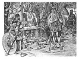

  
[Intangible Textual Heritage](../../index.md)  [Legends and
Sagas](../index)  [Iceland](../ice/index)  [Index](index.md) 
[Previous](nda11)  [Next](nda13.md) 

------------------------------------------------------------------------

[Buy this Book on
Kindle](https://www.amazon.com/exec/obidos/ASIN/B002HK2G4O/internetsacredte.md)

------------------------------------------------------------------------

  
*The Norse Discovery of America*, by A.M Reeves, N.L. Beamish and R.B.
Anderson, \[1906\], at Intangible Textual Heritage

------------------------------------------------------------------------

p. 128

# NOTES.

(1) It has been claimed that the Icelandic
discovery attained a practical result through the imparting of
information to those to whom the discovery of America has been generally
ascribed, and notably to Columbus and the Cabots. The tendency to
qualify Columbus' fame as the original discoverer dates from the time of
Ortelius, while the effort to show that his first voyage was influenced
by information which he received from Icelandic sources was, perhaps,
first formulated in extenso within the present century. The theory that
Columbus obtained definite information from Icelandic channels, rests,
after all, upon the following vague letter, which is cited by Columbus'
son in the biography of his father, as follows:

"In the month of February, of the year 1477, I sailed one hundred
leagues beyond the island of Tile, the southern portion of which is
seventy-three degrees removed from the equinoctial, and not sixty-three,
as some will have it; nor is it situated within the line which includes
Ptolemy's west, but is much further to the westward; and to this island,
which is as large as England, the English come with their wares,
especially those from Bristol. And at the time when I went thither the
sea was not frozen, although the tides there are so great that in some
places they rose twenty-six fathoms, and fell as much. It is, indeed,
the fact that that Tile, of which Ptolemy makes mention, is situated
where he describes it, and by the moderns this is called Frislanda."

John and Sebastian Cabot are supposed, by similar theorists, to have
derived knowledge of the Icelandic discovery through the English, and
especially the Bristol trade with Iceland. These theories do not require
further consideration here, since they have no bearing on the primitive
history of the Wineland discovery.

(2) Lit. law-saying men, publishers of the
laws. The office was introduced into Iceland contemporaneously with the
adoption

p. 129

of the law code of Ulfliot, and the establishment of the Althing
\[Popular Assembly\] in the year 930, and was, probably, modelled after
a similar Norwegian office. It was the duty of the "law-sayer" to give
judgment in all causes which were submitted to him, according to the
common law established by the Althing. The "law-sayer" appears to have
presided at the Althing, where it was his custom to regularly announce
the laws. From this last, his most important, function called
"law-saying" \[logsaga\], the office received its name. From the time of
its adoption, throughout the continuance of the Commonwealth, the office
was elective, the incumbent holding office for a limited period \[three
years\] although he was eligible for reelection.

(3) Rafn was distantly related to Ari Marsson
and Leif Ericsson. His ancestor, Steinolf the Short, was the brother of
Thorbiorg, Ari Marsson's grandmother, and through the same ancestor,
Steinolf, Rafn was remotely connected with Thiodhild, Leif Ericsson's
mother.

(4) By this Thorfinn, the second earl of that
name, is probably meant, i. e., Thorfinn Sigurd's son. "He was the most
powerful of all the Orkney earls. \* \* \* Thorfinn was five years old
when the Scotch king, Malcolm, his maternal grandfather, gave him the
title of earl, and he continued earl for seventy years. He died in the
latter days of Harold Sigurdsson," \[ca. A. D. 10641.

(5) It is recorded in Icelandic Annals that
King Olaf Tryggvason effected the [Christianization](errata.htm#3.md) of
Halogaland in the year 999.

(6) Lit. "house-neat-wood." May be rendered
either brown, weather vane, or gable decoration of a house. That the
names should have been used interchangeably for the similar object, in
both house and ship, is the less remarkable, since we read of a portion
of a ship's prow having been removed from a vessel and placed above the
principal entrance of a house, that is, in some part of the gable-end of
the dwelling.

(7) If the meaning is, as suggested in this
passage, that the "house-neat" was hewed to the northward of Hóp, the
only intelligible interpretation of the following clause would seem to
be that although Karlsefni attained the region which corresponded

p. 130

with Leif's accounts of Wineland, he did not succeed, on account of the
hostility of the natives which compelled him to beat a retreat, in
accomplishing a thorough exploration of the country, nor was he able to
carry back with him any of the products of the land.

(8) Lit. the Uplanders, i. e., the people of
the Norwegian Oplandene; a name given to a district in Norway comprising
a part of the eastern inland counties.

(9) Olaf the White is called in the Eyrbyggja
Saga "the greatest warrior-king in the western sea." This expedition, in
which he effected the capture of Dublin, appears to have been made about
the year 852. As the forays of these "warrior-kings" were mainly
directed against the people living in and about the British Isles, and
hence to the westward of Norway, the expression, "at herja í
vestrviking," "to engage in a westerly foray," came to be a general term
for a viking descent upon some part of the coast of Great Britain,
Ireland, or the adjacent islands. These free-booting expeditions began
on the Irish coasts, perhaps as early as 795. In 798 the Norsemen
plundered the Hebrides, and in 807 obtained a lodgment upon the mainland
of Ireland.

(10) Aud, or as she is also called Unnr, the
Enormously-wealthy or Deep-minded, was one of the most famous of the
Icelandic colonists. She was one of the few colonists who had accepted
the Christian religion before their arrival in Iceland. Her relatives,
however, seemed to have lapsed into the old faith soon after her death,
for on the same hill on which Aud had erected her cross, they built a
heathen altar, and offered sacrifices, believing that, after death, they
would pass into the hill.

(11) \[Sodor\], lit. the southern islands; a
name applied specifically, as here, to the Hebrides.

(12) Knorr, a kind of trading-ship. It was in
model, doubtless, somewhat similar to the modern typical sailing craft
of northern Norway. It was, probably, a clinker-built ship, pointed at
both ends, half-decked \[fore?\] and aft, and these half-decks were in
the larger vessels connected by a gangway along the gunwale. The open
space between the decks was reserved for

p. 131

the storage of the cargo, which, when the ship was laden, was protected
by skins or some similar substitute for tarpaulins. The vessel was
provided with a single mast, and was propelled by a rude square sail,
and was also supplied with oars. The rudder was attached to the side of
the ship, upon the starboard quarter, and the anchor, originally of
stone, was afterward supplanted by one of iron, somewhat similar in form
to those now in use. When the vessel was in harbour a tent was spread
over the ship at both ends. The vessel was supplied with a large boat,
called the "after-boat," sometimes large enough to hold twenty persons
\[Egils Saga Skallagrímssonar, ch. 27\], which was frequently towed
behind the ship; in addition to this, a smaller boat often appears to
have been carried upon the ship. Upon Queen Aud's vessel there were
twenty freemen, and besides these there were probably as many more women
and children, perhaps forty or fifty persons in all. As Aud was going to
a new country to make it her permanent home, she took with her, no
doubt, a considerable cargo of household utensils, timber, grain,
live-stock, etc.

(13) Frjáls, a freedman, from frí-háls, i. e.,
having the neck free; a ring worn about the neck having been a badge of
servitude. Slaves were called thralls. The thrall was entirely under the
control of his master, and could only obtain his freedom by purchase,
with the master's approval. He was occasionally freed by his lord, as a
reward for some especial act of devotion, for a long period of faithful
service, or, in Christian times, as an act of atonement or propitiation
on the part of the master. The early settlers of Iceland brought with
them many of their thralls from Norway; others were captured in the
westerly forays, or purchased in the British Isles,--indeed the ranks of
the slaves would appear, both from actual record and from their names,
to have been mainly recruited from the British Isles. The majority of
these were probably not serfs by birth, but by conquest, as witness the
case of Vifil in this saga. The freeing of thralls was very common in
Iceland, and there are frequent references in the saga to men who were
themselves, or whose fathers had been freedmen. The master could kill
his own thrall without punishment; if he killed the slave of another he
was required to pay to the master the value of the slave,

p. 132

within three days, or he laid himself liable to condemnation to the
lesser outlawry. The thralls were severely punished for their misdeeds,
but if one man took into his own hands the punishment of the thralls of
another, it was held to be an affront which could be, and usually was,
promptly revenged by their master. It was this right of revenge for such
an affront which led Eric the Red to kill Eyiolf Saur, who had punished
Eric's thralls for a crime committed against Eyiolf's kinsman, Valthiof.
The master, however, was made liable for the misdeeds of his thrall, and
could be prosecuted for these; the offense in [Eyiolf's](errata.htm#4.md)
case was, that he took the execution of the law into his own hands.

(14) Dalalend, lit. the Dale-lands. The region
of which Aud took possession is in the western part of Iceland,
contiguous to that arm of the Breidafirth \[Broad-firth\] which is known
as Hvamms-firth. Hvammr is on the northern side of this firth at its
head, and Krosshólar \[Cross-hill\] is hard by. Both Hvammr and
Krosshólar still retain their ancient names.

(15) \[Vifilsdale\] unites with Laugardalr to
form the Hördadair, through which the Hörda-dale river flows from the
south into Hvamms-firth, at the south-eastern bight of that firth.

(16) Jæderen was a district in south-western
Norway, in which the modern Stavanger is situated.

(17) Drangar on Horn-strands, where Eric and
his father first established themselves, is on the northern shore of the
north-west peninsula of Iceland. Erics-stead, to which Eric removed
after his father's death and his own marriage to Thorhild, was in
Haukadalr, in western Iceland, in Queen Aud's "claim."

(18) Brokey \[Brok-island, which receives its
name from a kind of grass called "brok"\] is the largest of the numerous
islands at the mouth of Hvamms-firth, where it opens into Breida-firth.
It is claimed that Eric's home was upon the northern side of the island,
at the head of a small bay or creek, called Eiriksvágr, and it is stated
that low mounds can still be seen on both Öxney and Sudrey, which are
supposed to indicate the sites of Eric's dwellings.

p. 133

(19) In the skáli, which was, perhaps, at the
time of which this saga treats, used as a sleeping-room, there was a
raised dais or platform, called the "set," on either side of what may be
called a nave of the apartment, extending about two-thirds the length of
the room. This "set" was used, as a sleeping-place by night.

(20) Drangar \[Monoliths\] and Broad-homestead
were both situated on the mainland, a short distance to the southward of
the islands on which Eric had established himself.

(21) One of the famous "settlers" of Iceland,
named Thorolf Moster-beard, like many another "settler," because he
would not acknowledge the supremacy of king Harold Fairhair, left his
home in the island of Moster, in south-western Norway, and sailed to
Iceland, where he arrived about the year 884. He was a believer in the
"old" or heathen faith, and when he reached the land, he cast the
pillars of the "place of honour" of his Norwegian home into the sea;
upon these the figure of the god Thor was carved, and where these
penates were cast up by the sea, according to the custom of men of his
belief, he established himself.

(22) Dimunarvágr \[Dimun-inlet\] was,
probably, in that group of small islets called Dimun, situated
north-east of Brokey at the mouth of Hvamms-firth.

(23) Very little information has been
preserved concerning Gunnbiorn, or his discovery. His brother, Grimkell,
was one of the early Icelandic colonists, and settled on the western
coast of Snowfells-ness, his home being at Saxahóll. It is not known
whether Gunnbiorn ever lived in Iceland, but it would seem to be
probable that it was upon a voyage to western Iceland, that he was
driven westward across the sea between Iceland and Greenland, and
discovered the islands which received his name, and likewise saw the
Greenland coast.

(24) Blacksark and Whitesark may have been
either on the eastern or the south-eastern coast of Greenland. It is not
possible to determine from the description here given whether Blacksark
was directly west of Snæfellsjökull, nor is it clear whether Blacksark
and Whitesark are the same mountain, or

p. 134

whether there has been a clerical error in one or the other of the
manuscripts.

(25) The principal Norse remains \[i. e.,
remains from the Icelandic colony in Greenland\] have been found in two
considerable groups; one of these is in the vicinity of the modern
Godthaab, and the other in the region about the modern Julianehaab \[the
famous Kakortok church ruin being in the latter group\]. It may be, that
the first or Godthaab ruins, are upon the site of the Western
Settlement, and the second, or Julianehaab group, upon that of the
Eastern Settlement.

(26) This Ingolf was called Ingolf the Strong.
He was probably a son of the Icelandic colonists, named Thorolf Sparrow.
His home was on the southern side of Hvamms-firth.

(27) Thorbiorn's and Thorgeir's father was the
same Vifil who came out to Iceland with Queen Aud, and who received from
her the land which is settled, Vifilsdale, as has been narrated in this
saga.

(28) Thorgeirsfell was upon the southern side
of Snowfellsness, to the eastward of Arnarstapi.

(29) The simple fact that Thorgeir was a
freedman would seem to have offered no valid reason for Thorbiorn's
refusal to consider his son's offer for Gudrid's hand, since Thorbiorn
was himself the son of a man who had been a thrall; the ground for his
objection was, perhaps, not so much the former thraldom of Einar's
father, as the fact that he was a man of humble birth, which Thorbiorn's
father, although a slave, evidently was not.

(30) Hraunhöfn \[Lava-haven\] was on the
southern side of Snowfells-ness, nearly midway between Laugarbrekka and
Thorgeirsfell. It was this harbour from which Biorn
Broadwickers'-champion set sail, as narrated in Eyrbyggja.

(31) The word velva signifies a prophetess,
pythoness, sibyl, a woman gifted with the power of divination. The
characterization of the prophetess, the minute description of her dress,
the various articles of which would seem to have had a symbolic meaning,
and the account of the manner of working the spell, whereby she was
enabled to forecast future events, form

p. 135

one of the most complete pictures of a heathen ceremony which has been
preserved in the sagas.

(32) The expression "Leif had sailed," would
seem to refer to an antecedent condition, possibly to the statement
concerning the arrival of Thorbiorn and his daughter at Brattahlid; i.
e., "Leif had sailed" when they arrived. If this be indeed the fact, it
follows that Thorbiorn and his daughter must have arrived at Brattahlid
during Leif's absence in Norway, and obviously before his return to
Greenland, in the autumn of the year 1000. Upon this hypothesis, it is
clear, that Thorbiorn and Gudrid must have been converted to
Christianity before its legal acceptance in Iceland; that is to say,
before the year 1000; and further, that Thorstein Ericsson may have been
married to Gudrid in the autumn after his return from his unsuccessful
voyage, namely, in the autumn of the year 1001; accordingly Karlsefni
may have arrived in the following year, have been wedded to Gudrid at
the next Yule-tide, 1002-3, and have undertaken his voyage to Wineland
in the year 1003. This chronology is suggested with the sole aim of
fixing the earliest possible date for Karlsefni's voyage or exploration.

(33) The expression "margkunnig," conveys the
impression that Thorgunna was gifted with preternatural wisdom.

(34) It has been suggested, that this
Thorgunna is the same woman of whom we read in the Eyrbyggja Saga: "That
summer, when Christianity was accepted by law in Iceland, a ship arrived
out of Snowfells-ness; this was a Dublin ship. . . . Thorgunna was a
large woman, tall, and very stout; with dark brown eyes set close
together, and thick brown hair; she was for the most part pleasant in
her bearing, attended church every morning before she went to her work,
but was not, as a rule, easy of approach nor inclined to be talkative.
It was the common opinion that Thorgunna must be in the sixties." In the
autumn after her arrival Thorgunna died, and strange events accompanied
her last illness. As she approached her end, she called the master of
the house to her, and said: "It is my last wish, if I die from this
illness, that my body be conveyed to Skálholt, for I foresee that it is
destined to be one of the most famous spots in this land, and I know
that there must be

p. 136

priests there now to chant my funeral service. I have a gold ring, which
is to go with my body to the church, but my bed and hangings I wish to
have burned, for these will not be of profit to any one; and this I say,
not because I would deprive any one of the use of these things, if I
believed that they would be useful; but I dwell so particularly upon
this," says she, "because I should regret, that so great affliction
should be visited upon any one, as I know must be, if my wishes should
not be fulfilled."

(35) The Fródá-wonder is the name given to the
extraordinary occurrences which befell at the farmstead of Fródá soon
after Thorgunna's death. The "wonder" began with the appearance of a
"weird-moon," which was supposed to betoken the death of some member of
the family. This baleful prophecy was followed by the death of eighteen
members of the household, and subsequently by the nightly apparitions of
the dead. The cause of this marvel was attributed to the fact that the
Mistress of Fródá had prevailed upon her husband to disregard
Thorgunna's injunction to burn the drapery of her bed; and not until
these hangings were burned was the evil influence exorcised, and the
ghostly apparitions laid, the complete restoration of the normal
condition of affairs being further facilitated by the timely
recommendations of a priest, whose services had been secured to that
end.

(36) It is not certain what variety of wood is
meant; the generally accepted view has been that it was some species of
maple. That the tree called mosurr was also indigenous in Norway is in a
manner confirmed by a passage in the Short Story of Helgi Thorisson,
contained in Flatey Book (vol. i, p. 359): "One summer these brothers
engaged in a trading voyage to Finmark in the north, having butter and
pork to sell to the Finns. They had a successful trading expedition, and
returned when the summer was far-spent, and came by day to a cape called
Vimund. There were very excellent woods here. They went ashore, and
obtained some 'mosurr' wood." It is reasonably clear, however, that the
wood was rare and, whether it grew in Finmark or not, it was evidently
highly prized.

(37) Thiodhild is also called Thorhild, and
similarly Gudrid

p. 137

is called Thurid. It has been conjectured that Thorhild and Thurid were
the earlier names, which were changed by their owners after their
conversion to Christianity, because of the suggestion of the heathen god
in the first syllable of their original names.

(38) Such a fall as this of Eric's does not
seem to have been generally regarded as an evil omen, if we may be
guided by the proverb: "A fall bodes a lucky journey from the house but
not toward it."

(39) The display of an axe seems to have been
peculiarly efficacious in laying such fetiches. From among numerous
similar instances the following incident may be cited: "Thorgils heard a
knocking outside upon the roof; and one night he arose, and taking an
axe in his hand went outside, where he saw a huge malignant spectre
standing before the door. Thorgils raised his axe, but the spectre
turned away, and directed itself toward the burial-mound, and when they
reached it the spectre turned against him, and they began to wrestle
with each other, for Thorgils had dropped his axe."

(40) Thorfinn Karlsefni's ancestral line was
of rare excellence; it is given in Landnáma at rather greater length,
but otherwise as here: "Thord was the name of a famous man in Norway, he
was a son of Biorn Byrdusmior," etc. His grandmother's father, Thord the
Yeller, was one of the most famous men in the first century of Iceland's
history; he it was who established the Quarter-courts.

(41) Swan-firth is on the southern side of
Hvamms-firth, near its junction with Breida-firth, in western Iceland.
It is not improbable that the two ships sailed from Breida-firth, the
starting-point for so many of the Greenland colonists.

(42) It has been claimed that this Thorhall,
Gamli's son, was no other than the Thorhall Gamli's son, of Grettis
Saga. It would appear, however, to be pretty clearly established, that
the Thorhall, Gamli's son of Grettis Saga, was called after his father
Vindlendingr \[Wendlander\], and that he was an altogether different man
from the Thorhall, Gamli's son, of the Saga of Eric the Red.

p. 138

(43) The celebration of Yule was one of the
most important festivals of the year, in the North, both in heathen and
in Christian times. Before the introduction of Christianity it was the
central feast of three, which were annually held. Of the significance of
these three heathen ceremonials, we read: "Odin established in his realm
those laws which had obtained with the Ases. . . At the beginning of
winter a sacrificial banquet was to be held for a good year, in
mid-winter they should offer sacrifice for increase, and the third
\[ceremonial\], the sacrifice for victory, was to be held at the
beginning of summer."

(44) Freydis also accompanied the expedition,
as appears further on in the saga.

(45) This passage is one of the most obscure
in the saga. If the conjecture as to the probable site of the Western
Settlement in the vicinity of Godthaab is correct, it is not apparent
why Karlsefni should have first directed his course to the north-west,
when his destination lay to the south-west. It is only possible to
explain the passage by somewhat hazardous conjecture. Leif may have
first reached the Western Settlement on his return from the voyage of
discovery, and Karlsefni, reversing Leif's itinerary, may have been led
to make the Western Settlement his point of departure; or there may have
been some reason, not mentioned in the saga, which led the voyagers to
touch first the Western Settlement.

(46) Dœgr is thus defined in the ancient
Icelandic work on chronometry called Rímbegla: "In the day there are two
'dœgr;' in the 'dœgr" twelve hours." This reckoning, as applied to a
sea-voyage, is in at least one instance clearly confirmed, namely in the
Saga of Olaf the Saint, wherein it is stated that King Olaf sent
Thorarin Nefiolfsson to Iceland: "Thorarin sailed out with his ship from
Dorntheim, when the King sailed, and accompanied him southward to Mœri.
Thorarin then sailed out to sea, and he had a wind which was so powerful
and so favorable, that he sailed in eight 'dœgr' to Eyrar in Iceland,
and went at once to the Althing." The meaning of the word is not so
important to enable us to intelligently interpret the saga, as is the
determination of the distance, which was reckoned to an average "dœgr's"
sail; that is to say, the

p. 139

distance which we may safely conclude, was traversed, under average
conditions, in a single "dœgr" by Icelandic sailing craft. Having regard
to the probable course sailed from Norway to Iceland, it would appear
that a "dœgr's" sail was approximately one hundred and eight miles. This
result precludes the possibility that any point in Labrador could have
been within a sailing distance of two "dœgr" from the Western
Settlement. The winds appear to have been favorable to the explorers;
the sail of seven "dœgr" "to the southward," from Greenland with the
needful westering, would have brought Karlsefni and his companions off
the Labrador coast. Apart from this conjecture, it may be said that the
distance sailed in a certain number of "dœgr" (especially where such
distances were probably not familiar to the scribes of the sagas), seem
in many cases to be much greater than is reconcilable with our knowledge
of the actual distances traversed, whether we regard the "dœgra" sail as
representing a distance of one hundred and eight miles or a period of
twenty-four hours.

(47) This may well have been the keel of one
of the lost ships belonging to the colonists who had sailed for
Greenland with Eric the Red a few years before; the wreckage would
naturally drift hither with the Polar current.

(48) Lit. Scotch. This word seems to have been
applied to both the people of Scotland and Ireland. The names of the man
and woman, as well as their dress, appear to have been Gaelic, they are,
at least, not known as Icelandic; the minute description of the dress,
indeed, points to the fact that it was strange to Icelanders.

(49) i. e. Thor. It has been suggested, that
Thorhall's persistent adherence to the heathen faith may have led to his
being regarded with ill-concealed disfavor.

(50) There can be little doubt that this
"self-sown wheat" was wild rice. The habit of this plant, its growth in
low ground as here described, and the head, which has a certain
resemblance to that of cultivated small grain, especially oats, seem
clearly to confirm this view. The explorers probably had very slight
acquaintance with cultivated grain, and might on this account more
readily confuse this wild rice with wheat.

p. 140

\[paragraph continues\] There is not,
however, the slightest foundation for the theory that this "wild wheat"
was Indian corn, a view which has been advanced by certain writers.
Indian corn was a grain entirely unknown to the explorers, and they
could not by any possibility have confused it with wheat, even if they
had found this corn growing wild, a conjecture for which there is
absolutely no support whatever. The same observation as that made by the
Wineland discoverers was recorded by Jacques Cartier five hundred years
later, concerning parts of the Canadian territory which he explored. It
is no less true that this same explorer found grapes growing wild, in a
latitude as far north as that of Nova Scotia, and, as would appear from
the record, in considerable abundance. Again, in the following century,
we have an account of an exploration of the coast of Nova Scotia, in
which the following passage occurs: "All the ground between the two
Riuers was without Wood, and was good fat earth hauing seueral sorts of
Berries growing thereon, as Gooseberry, Straw-berry, Hyndberry,
Rasberry, and a kinde of Red-wine-berry: As also some sorts of Graine,
as Pease, some eares of Wheat, Barley, and Rye, growing there wild,"
etc. \[Purchas his Pilgrimes, London, 1625.\]

(51) Lit. "holy fish." The origin of the name
is not known. Prof. Maurer suggests that it may have been derived from
some folk-tale concerning St, Peter, but adds that such a story, if it
ever existed, has not been preserved.

(52) It is not clear what the exact nature of
these staves may have been. These "staves" may have had a certain
likeness to the long oars of the inhabitants of Newfoundland, described
in a notice of date July 29th, 1612: "They haue two kinde of Oares, one
is about foure foot long of one peece of Firre; the other is about ten
foot long made of two peeces, one being as long, big and round as a
halfe Pike made of Beech wood, which by likelihood they made of a Biskin
Oare, the other is the blade of the Oare, which is let into the end of
the long one slit, and whipped very strongly. The short one they use as
a Paddle, and the other as in Oare." \[Purchas his Pilgrimes, London,
1625.\]

(53) The white shield, called the
"peace-shield," was displayed by those who wished to indicate to others
with whom

p. 141

they desired to meet that their intentions were not hostile, as in
Magnus Barefoot's Saga, "the barons raised aloft a white peace-shield."
The red shield, on the other hand, was the war-shield, a signal of
enmity, as Sinfiotli declares in the Helgi song, "Quoth Sinfiotli,
hoisting a red shield to the yard, . . . 'tell it this evening. . . .
that the Wolfings are coming from the East, lusting for war.'" The use
of a white flag-of-truce for a purpose similar to that for which Snorri
recommended the white shield, is described in the passage quoted in note
 [52](nda12.htm#xref_52.md), "Nouember the sixt two Canoas appeared, and
one man alone coming towards vs with a Flag in his hand of a Wolfes
skin, shaking it and making a loud noise, which we took to be for a
parley, whereupon a white Flag was put out, and the Barke and Shallop
rowed towards them." \[Purchas his Pilgrimes.\]

(54) The natives of the country here described
were called by the discoverers, as we read, Skrælingjar; since this was
the name applied by the Greenland colonists to the Eskimo, it has
generally been concluded that the Skrælingjar of Wineland were Eskimo.
Prof. Storm has recently pointed out that there may be sufficient reason
for caution in hastily accepting this conclusion, and he would identify
the inhabitants of Wineland with the Indians, adducing arguments
philological and ethnographical to support his theory. The description
of the savages of Newfoundland, given in the passage in Purchas'
"Pilgrims," already cited, offers certain details which coincide with
the description of the Skrellings, contained in the saga. These savages
are said by the English explorers to be "full-eyed, of black colour; the
colour of their hair was diners, some blacke, some browne, and some
yellow, and their faces something flat and broad." Other details, which
are given on the same authority, have not been noted by the Icelandic
explorers, and one statement, at least, "they haue no beards," is
directly at variance with the saga statement concerning the Skrellings
seen by the Icelanders on their homeward journey. The similarity of
description may be a mere accidental coincidence, and it by no means
follows that the English writer and Karlsefni's people saw the same
people, or even a kindred tribe.

(55) John Guy, in a letter to Master Slany,
the Treasurer and

p. 142

\[paragraph continues\] "Counsell" of the
New-found-land Plantation writes: "The doubt that haue bin made of the
extremity of the winter season in these parts of New-found-land are
found by our experience causelesse; and that not onely men may safely
inhabit here without any neede of stoue, but Nauigation may be made to
and fro from England to these parts at any time of the yeare. . . . Our
Goates haue liued here all this winter; and there is one lustie kidde,
which was yeaned in the dead of winter." \[Purchas his Pilgrimes, vol.
iv, p. 1878.\]

(56) i. e., a One-footer, a man with one leg
or foot. In the Flatey Book Thorvald's death is less romantically
described. The mediæval belief in a country in which there lived a race
of one-legged men, was not unknown in Iceland, for mention is made in
Rimbegla, of "a people of Africa called One-footers, the soles of whose
feet are so large that they shade themselves with these against the heat
of the sun when they sleep." It is apparent from the passages from
certain Icelandic works already cited, that, at the time these works
were written, Wineland was supposed to be in some way connected with
Africa. Whether this notice of the finding of a Uniped in the Wineland
region may have contributed to the adoption of such a theory, it is, of
course, impossible to determine. The reports which the explorers brought
back of their having seen a strange man, who, for some reason not now
apparent, they believed to have but one leg, may, because Wineland was
held to be contiguous to Africa, have given rise to the conclusion that
this strange man was indeed a Uniped, and that the explorers had hit
upon the African "land of the Unipeds." It has also been suggested that
the incident of the appearance of the "One-footer" may have found its
way into the saga to lend an additional adornment to the manner of
Thorvald's taking-off. It is a singular fact that Jacques Cartier
brought back from his Canadian explorations reports not only of a land
peopled by a race of one-legged folk, but also of a region in those
parts where the people were "as white as those of France."

(57) These words, it has been supposed, might
afford a clue to the language of the Skrellings, which would aid in
determining their race. In view not only of the fact, that they probably

p. 143

passed through many strange mouths before they were committed to
writing, but also that the names are not the same in the different
manuscripts, they appear to afford very equivocal testimony. Especially
is the soft melody of these Skrelling-words altogether different from
the harsh gutteral sounds of the Eskimo language. We must therefore
refer for the derivation of these words to the Indians, whom we know in
this region in later times. The inhabitants, whom the discoverers of the
sixteenth century found in Newfoundland, and who called themselves
"Beothuk" \[i. e., men\], received from the Europeans the name of Red
Indians, because they smeared themselves with ochre; they have now been
exterminated, partly by the Europeans, partly by the Micmac Indians, who
in the last century wandered into Newfoundland from New Brunswick. Of
their language only a few remnants have been preserved, but still enough
to enable us to form a tolerably good idea of it.

"Even as there are on the north-western coast of North America races
which seem to me to occupy a place between the Indian and Eskimo, so it
appears to me not sufficiently proven, that the now extinct race on
America's east coast, the Beothuk, were Indians. Their mode of life and
belief have many points of resemblance, by no means unimportant, with
the Eskimo and especially with the Angmagsalik. It is not necessary to
particularize these here, but I wish to direct attention to the
possibility, that in the Beothuk we may perhaps have one of the
transition links between the Indian and the Eskimo."

(58) The sum of information which we possess
concerning White-men's-land or Ireland the Great, is comprised in this
passage and in the quotation from Landnáma. It does not seem possible
from these very vague notices to arrive at any sound conclusion
concerning the location of this country. Rafn concludes that it must
have been the southern portion of the eastern coast of North America.
Vigfusson and Powell suggest that the inhabitants of this
White-men's-land were "Red Indians;" with these, they say, "the Norsemen
never came into actual contact, or we should have a far more vivid
description than this, and their land would bear a more appropriate
title." Storm, in his "Studier over Vinlandsreiserne," would regard

p. 144

\[paragraph continues\] "Greater Ireland"
as a semi-fabulous land, tracing its quasi-historical origin to the
Irish visitation of Iceland prior to the Norse settlement. No one of
these theories is entirely satisfactory, and the single fact which seems
to be reasonably well established is that "Greater Ireland" was to the
Icelandic scribes terra incognita.

(59) The modern Reynistadr is situated in
Northern Iceland, a short distance to the southward of Skaga-firth.
Glaumbœr, as it is still called, is somewhat farther south, but hard by.

(60) Thorlak Runolfsson was the third bishop
of Skálholt. He was consecrated bishop in the year 1118, and died 1133.
Biorn Gilsson was the third bishop of Hólar, the episcopal seat of
northern Iceland; he became bishop in 1147, and died in the year 1162.
Bishop Biorn's successor was Brand Sæmundsson, "Bishop Brand the Elder,"
who died in the year 1201.

(61) We read concerning the introduction of
Christianity into Iceland: "Thorvald \[Kodransson\] travelled widely
through the southern countries; in the Saxon-land \[Germany\] in the
south, he met with a bishop named Frederick, and was by him converted to
the true faith and baptised, and remained with him for a season.
Thorvald bade the bishop accompany him to Iceland, to baptise his father
and mother, and others of his kinsmen, who would abide by his advice;
and the bishop consented." According to Icelandic annals, Bishop
Frederick arrived in Iceland, on this missionary enterprise, in the year
981; from the same authority we learn that he departed from Iceland in
985.

(62) Heriulf or Heriolf, who accompanied Eric
the Red to Greenland, was not, of course, the same man to whom Ingolf
allotted land between Vág and Reykianess, for Ingolf set about the
colonization of Iceland in 874, more than a century before Eric the
Red's voyage to Greenland. The statement of Flatey Book is, therefore,
somewhat misleading, and seems to indicate either carelessness or a
possible confusion on the part of the scribe. Heriulf, Eric the Red's
companion, was a grandson of the "settler" Heriulf, as is clearly set
forth in two passages in Landnáma.

(63) In the "King's Mirror," an interesting
Norwegian work of the thirteenth century, wherein, in the form of a
dialogue, a

p. 145

father is supposed to be imparting information to his son concerning the
physical geography of Greenland, he says: "Now there is another marvel
in the Greenland Sea, concerning the nature of which I am not so
thoroughly informed; this is that which people call 'Sea-rollers.' This
is likest all the sea-storm and all the billows, which are in the sea,
gathered together in three places, from which three billows form; these
three hedge in the whole sea, so that no break is to be seen, and they
are higher than tall fells, are like steep peaks, and few instances are
known of persons who, being upon the sea when this phenomenon befell,
have escaped therefrom." There can be little question that Heriulf
experienced a perilous voyage, since out of the large number of ships,
which set sail for Greenland at the same time, so few succeeded in
reaching their destination.

(64) This has been assumed by many writers to
have been Labrador, but the description does not accord with the
appearance which the country now presents.

(65) Certainly a marvellous coincidence, but
it is quite in character with the no less surprising accuracy with which
the explorers, of this history, succeed in finding "Leif's-booths" in a
country which was as strange to them as Greenland to Biarni.

(66) This statement has attracted more
attention, perhaps, than any other passage in the account of the
Icelandic discovery of America, since it seems to afford data which, if
they can be satisfactorily interpreted, enable us to determine
approximately the site of the discovery. The observation must have been
made within the limits of a region wherein, early in the eleventh
century, the sun was visible upon the shortest day of the year between
dagmálastadr and eyktarstadr; 'it is, therefore, apparent that if we can
arrive at the exact meaning of either dagmálastadr or
[eyktarstadr](errata.htm#5.md), or the length of time intervening between
these, it should not be difficult to obtain positive information
concerning the location of the region in which the observation was made.

The result of the application of Professor Storm's simple and logical
treatment to this passage in Flatey Book, "the sun had there
Eyktarstad," etc., is summed up in Capt. Pythian's statement,

p. 146

"the explorers could not have been, when the record was made, farther
north than Lat. \[say\] 49°;" that is to say, Wineland may have been
somewhat further to the south than northern Newfoundland or the
corresponding Canadian coast, but, if we may rely upon the accuracy of
this astronomical observation, it is clear that thus far south it must
have been.

(67) A wooden granary. The word "hjálmr"
appears to have a double significance. In the passage in the Saga of
King Olaf the Saint: "Wilt thou sell us grain, farmer? I see that there
are large 'hjálmar' here,' the word 'hjálmar' may have the meaning of
stacks of grain. The use of the word as indicating a house for the
storage of grain is, however, clearly indicated in the Jydske Lov of
1241, wherein we read: "But if one build upon the land of another either
a 'hialm' or any other house," etc. As there is no suggestion in the
saga of the finding of cultivated fields, it is not apparent for what
uses a house for the storage of grain could have been intended.

(68) Lit. war-hurdle. This was a protection
against the missiles of the enemy raised above the sides of the vessel.
In this instance, as perhaps generally on ship-board, this protecting
screen would appear to have been formed of shields attached to the
bulwarks, between these the arrow, which caused Thorvald's death,
doubtless, found its way.

(69) The Landnámabók makes no mention of this
Thori; its language would seem to preclude the probability of a marriage
between such a man and Gudrid; the passage with reference to Gudrid
being as follows: "His son was Thorbiorn, father of Gudrid who married
Thorstein, son of Eric the Red, and afterwards Thorfinn Karlsefni; from
them are descended bishops Biorn, Thorlak and Brand.

(70) Námkrytill \[namkirtle\] is thus
explained by Dr. Valtýr Gudmundsson, in his unpublished treatise on
ancient Icelandic dress: "Different writers are not agreed upon the
meaning of 'námkrytill;'" Sveinbjörn Egilsson interprets it as
signifying a kirtle made from some kind of material called "nám." In
this definition he is followed by Keyser. The Icelandic painter, Sigurdr
Gudmundsson has, on the other hand, regarded the word as allied to the
expression: "Fitting close to the leg, narrow,"

p. 147

and concludes that "námkyrtill" should be translated, "narrow kirtle."

(71) A "Mark" was equal to eight "aurar;" an
"eyrir" \[plur. "aurar"\] of silver was equal to 144 skillings. An
"eyrir" would, therefore, have been equal to three crowns \[kroner\],
modern Danish coinage, since sixteen skillings are equal to one-third of
a crown \[33 ⅓ ore\], and a half "mark" of silver would accordingly have
been equal to twelve crowns, Danish coinage. As the relative value of
gold and silver at the time described is not clearly established, it is
not possible to determine accurately the value of the half "mark" of
gold. It was, doubtless, greater at that time, proportionately, than the
value here assigned, while the purchasing power of both precious metals
was very much greater then than now.

(72) At the time of the "settlement" of
Iceland the homestead of the more prominent "settler" became the nucleus
of a little community. The head of this little community, who was the
acknowledged leader in matters spiritual and temporal, was called the
"godi." With the introduction of Christianity the "godi" lost his
religious character though he still retained his place of importance in
the Commonwealth.

------------------------------------------------------------------------

[Next: Arguments and Evidences Respecting the Wineland Discovery](nda13.md)
