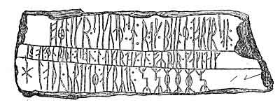

  
[Intangible Textual Heritage](../../index.md)  [Legends and
Sagas](../index)  [Iceland](../ice/index)  [Index](index.md) 
[Previous](nda22)  [Next](nda24.md) 

------------------------------------------------------------------------

[Buy this Book on
Kindle](https://www.amazon.com/exec/obidos/ASIN/B002HK2G4O/internetsacredte.md)

------------------------------------------------------------------------

  
*The Norse Discovery of America*, by A.M Reeves, N.L. Beamish and R.B.
Anderson, \[1906\], at Intangible Textual Heritage

------------------------------------------------------------------------

### MONUMENTS AND INSCRIPTIONS.

THE DIGHTON WRITING ROCK.

Some remarkable monuments and inscriptions have been found on the
eastern shores of North America, which bear testimony to the voyages and
settlements recorded in the preceding narratives, and complete the, mass
of evidence that has been so ably brought forward by Professor Rafn,
upon this interesting subject. The Rhode Island Historical Society have
applied themselves to the examination of these remains, with a degree of
zeal and ability worthy of the occasion, and details of high interest
and value have been made known to the corresponding Danish members,
through the medium of the distinguished American secretary, Dr. Webb.
From these communications it appears that in the western part

p. 240

of the county of Bristol in the State of Massachusetts may still be seen
numerous and extensive mounds, similar to the tumuli that are so often
met with in Scandinavia, Tartary, and Russia; "also the remains of
fortifications that must have required for their construction a degree
of industry, labour, and skill, as well as an advancement in the arts,
that never characterized any of the Indian tribes. Various articles of
pottery are found in them, with the method of manufacturing which they
were entirely unacquainted. But above all, many rocks, inscribed with
unknown characters, apparently of very ancient origin, have been
discovered scattered through different parts of the country: rocks, the
constituent parts of which are such as to render it almost impossible to
engrave on them such writings without the aid of iron, or other hard
metallic instrument. The Indians were ignorant of the existence of these
rocks; and the manner of working with iron they learned from the
Europeans, after the settlement of the country by the English."

Of such remains, the most important that has yet been discovered is the
Assonet rock, or "Dighton writing rock," which is thus described in the
Report of a Committee that was appointed by the Rhode Island Historical
Society, to examine and report upon this remarkable stone, and who
visited it in the month of February, 1830--

"It is situated six and a half miles south of Taunton, on the east side
of Taunton river, a few feet from the shore, and on the west side of
Assonet neck, in the town of Berkely, county of Bristol, and
Commonwealth of

p. 241

\[paragraph continues\] Massachusetts;
although, probably from the fact of its being generally visited from the
other side of the river, which is in Dighton, it has always been known
by the name of the 'Dighton Writing Rock.' It faces northwest, towards
the bed of the river, and is covered by the water two or three feet at
the highest, and is left ten or twelve feet from it at the lowest tides:
it is also completely immersed twice in twenty-four hours. The rock does
not occur *in situ*, but shews indubitable evidence of having occupied
the spot where it now rests, since the period of that great and
extensive disruption, which was followed by the transportation of
immense boulders to, and a deposit of them in places at a vast distance
from their original beds. It is a mass of well characterized fine
grained *greywacke*. Its true colour, as exhibited by a fresh fracture,
is a bluish grey. There is no rock in the immediate neighbourhood that
would at all answer as a substitute for the purpose for which the one
bearing the inscription was selected, as they are aggregates of the
large conglomerate variety. Its face, measured at the base, is eleven
feet and a half; and in height, it is a little rising five feet. The
upper surface forms, with the horizon, an inclined plane of about sixty
degrees. The whole of the face is covered, to, within a few inches of
the ground, with unknown hieroglyphics. There appears little or no
method in the arrangement of them. The lines are from half an inch to an
inch in width; and in depth sometimes one-third of an inch, though
generally very superficial. They were, inferring from the rounded
elevations, and intervening depressions, picked

p. 242

in upon the rock, and not chiselled or smoothly cut out. The marks of
human power, and manual labour are indelibly stamped upon it. No one who
examines attentively the workmanship, will believe it to have been done
by the Indians. Moreover, it is a well attested fact, that nowhere,
throughout our wide-spread domain, is there a single instance of their
recording, or having recorded, their deeds or history on stone."

This remarkable monument had long been an object of interest to American
antiquaries, and several drawings and examinations were made of the rock
and inscription, at various periods, beginning in the year 1680, but
without any satisfactory result; and it remained for Professors Finn
Magnusen and Rafn to shew that the whole was a *Runic inscription*,
containing various cryptographs, and rude combinations of figures
illustrative of the settlements of the Northmen, among which devices may
be yet traced the name of THORFINN, and the figures CXXXI. being the
number of Karlsefni's associates (151), [1](#fn_36.md) which after the departure of Thorhall,
accompanied him to Hope. [2](#fn_37.md)

p. 243

A perspective representation of this remarkable rock, together with
fac-similes of the several drawings that have been made of the
inscription, ending with the most recent and accurate, made by the
Committee of the Rhode Island Historical Society in 1830, are appended
to the Antiquitates Americanæ; and the analogy between these and
inscriptions which have been found both in Sweden and Iceland is shewn
by contiguous representations of the Scandinavian remains. The same
plate contains also the delineation of a curious fragment of metallic
*tessera*, found near Dublin, upon which is inscribed a monogram similar
to that seen upon the Assonet Rock, as well as the Runic letter
[Þ](errata.htm#13) (th.md), shewing the Scandinavian origin of the
fragment, which may be ascribed to the 9th or 10th century.

The Rhode Island Historical Society have also forwarded to Professor
Rafn descriptions and delineations of several other remains which bear a
striking analogy to that at Dighton; among these the Portsmouth and
Tiverton Rocks form interesting subjects for examination and
comparison. [1](#fn_38.md)

p. 244

### RUNIC STONE AT KINGIKTORSOAK.

BUT traces of the adventurous spirit, and early voyages of the Northmen
are to be found in much higher, and far less inviting latitudes, shewing
the progress of their course through regions, which even in the present
age of high scientific advancement, and maritime enterprise, have
tested, and not unfrequently baffled the skill and hardihood of our most
distinguished navigators.

In the year 1824, a remarkable Runic stone was found upon the island of
Kingiktorsoak, lying in 72° 55' north latitude and 56° 5' west
longitude.

The following is a representation of this remarkable monument which was
transported to Copenhagen, and found on examination, to present a
complete inscription in Runic characters:--

 

which in modern Icelandic orthography would run thus --

ELLIGR · SIGVATHS: SON : R · OK : BJANNE : TORTARSON : OK : ENRITHI ·
ODSSON : LAUKARDAK : IN : FYRIRGAKNDAG HLOTHU ·VARDATE ·OKRYDU :MCXXXV.

p. 245

or

Erling Sighvatsson and Biarni Thordarsson, and Eindrid Oddsson, on the
seventh day, [1](#fn_39.md) before the day of
Victory, [2](#fn_40.md) erected these stones, and
explored. MCXXXV.

Some doubts have been expressed by Runic scholars as to the
signification of the characters representing the date, but the peculiar
formation of the Runes, and other unerring indications shew that the
inscription cannot be later than the 12th century.

It appears from various Icelandic documents given in Professor Rafn's
work, that the Northmen had two principal stations in the Arctic
regions, the one called Greipar, lying immediately south of the island
of Disco, in Davis' Straits, and the other called Kroksfjardarheidi,
situated on the north-side of Lancaster's sound. Their general name for
these regions was Nordrsetur, to which vessels were dispatched from
Greenland for the purpose of carrying on the operations of hunting and
fishing. But voyages of discovery were also made in this direction; and
a clear account of such an expedition, undertaken in the year 1266,
follows the narratives which have been given in the preceding pages. It
is contained in a letter addressed by a clergyman named Halldor, to a
brother ecclesiastic named Arnold, who, after having lived in Greenland,
had become chaplain to king Magnus Lagabæter in Norway; and the voyage
appears to have been made under the auspices of some clergymen of the

p. 246

\[paragraph continues\] Bishopric of
Gardar in Greenland. The object of the expedition is stated to have
been, to explore regions lying more to the northward than those which
they had been hitherto accustomed to frequent, consequently further
north than Lancaster's sound. They sailed from Kroksfjardarheidi, but
meeting with southerly winds, and thick weather, were obliged to let the
vessel run before the wind; on the fogs clearing off they described
several islands, and saw many seals, whales, and bears. They penetrated
into the innermost part of the gulf, and saw icebergs lying to the
southward, as far as the eye could reach; they observed traces of the
Skrælings having inhabited these regions in former times, but were
unable to land, in consequence of the bears. They, therefore, went
about, and sailed back for three days, when they again found traces of
the Esquimaux, upon some islands lying to the southward of a mountain,
which they call Snæfell. After this, on St. James's Day (25th July),
they proceeded southwards, a long day's rowing (einn mikin dagrodr). It
froze during the night, but the sun was above the horizon both night and
day; and "it was not higher when on the meridian than that when a man
lay across a six oared boat, towards the gunwale, the shade of that side
of the boat which was nearest the sun fell on his face; but at midnight
was it as high as at home in the settlement, when it is in the
northwest." The expedition afterwards returned to Gardar.

These observations are of course very loose and uncertain; the relative
depth of the man's position with regard to the gunwale of the boat,
would be necessary in

  [  
Click to enlarge](img/24700.jpg.md)  
General Chart Exhibiting Discoveries of the Northmen in the Arctic
Regions And America  

p. 247

order to be able to make anything of the first observation, and the
result of the other can only be deduced by presuming the day of the
summer solstice to bc implied. This, however, is not an unreasonable
supposition, more particularly when we find so many other circumstances
corroborative of the locality which is thence determined, and Professor
Rafn, proceeding upon this assumption, draws out the following result:--

"In the 13th century, on the 25th July, the Sun's declination was 17°
54' North Inclination of the Ecliptic, 23° 32'."

If we now assume that the colony, and particularly the episcopal seat of
Gardar, was situated on the north side of Igaliko frith, where the ruins
of a large church, and of many other buildings, indicate the site of a
principal settlement of the ancient colony, consequently in 60° 55' N.
lat. then at the summer solstice, the height of the sun there, when in
the N. W. was 3° 40', which is equivalent to the midnight altitude of
the sun on St. James's day (25th July) in the parallel of 75° 46'." Now
the parallel of 75° 46' north latitude, would fall to the northward of
Wellington Channel, the highest latitude reached by Parry in his most
favourable expedition in search of a North-west passage; and the
description of the land seen, and objects met with on the voyage,
corresponds well with the characteristics of these regions, as given by
the distinguished English navigator. The Northmen sail from
Kroksfjardarheidi, a name implying a frith bounded by barren highlands
(heidi), and known to be

p. 248

on the north side of Lancaster's sound; this frith must have been of
considerable extent, as three days sailing are specifically mentioned in
that part of the narrative describing their return;--they descry several
islands, and meet with many seals, whales, and bears;--they see icebergs
lying to the southward, as far as the eye can reach;--they observe
traces of the Esquimaux (Skrælings) in various directions; the sun was
above the horizon both night and day, and although in the month of July,
it froze during the night. There is little doubt, therefore, that these
early explorers of the arctic regions, starting from Lancaster's sound,
were driven through Barrow's straits, and Wellington Channel, into the
Polar sea, from whence they saw the North Georgian Islands, and where
they naturally fell in with a multitude of seals, whales, and bears.

It is a startling conclusion, and somewhat mortifying to national pride,
to find that these simple navigators of the 13th century, in their
humble barks, rivalled the most distinguished arctic explorers of the
present day; but however unwilling we may be to admit the evidence of a
progress in maritime discovery, which tends to dim the lustre of our own
enterprising age, the simple documents in support of these early voyages
carry a degree of conviction to the mind which disarms scepticism, and
compels us to admit their credibility.

It is a great mistake, however, to suppose that the Northmen of this
period were altogether ignorant of astronomical science, and still
greater, as some writers have done, to confound them with the Vikings or
Pirates

p. 249

of a more barbarous age. The discoverers of America were Merchants,
their ships were called trading ships \[Kaupskip\]; sea-roving had been
almost altogether discontinued by the Northmen before the voyages of
Bjarne Herjulfson and the descendants of Erik; and all the expeditions
which are related in these Sagas were undertaken either for the purposes
of discovering new countries, or making settlements in, or trading with,
countries that had been already discovered. In the ancient Icelandic
work called Rimbegla, which has been before quoted, many rules are given
for the measurement of time, the study of astronomy, geometry, etc., and
although these are probably translations or compilations from foreign
works, they correspond with what the Icelandic clergy taught their
people, after the introduction of Christianity. Among these are found
scientific rules for finding the course of the sun, moon, and stars,
also the division of time thereon depending; information respecting the
astronomical quadrant, and its proper use; different methods for
ascertaining the spherical figure of the earth; the longitude and
latitude of places, and of calculating their distances from each other;
the sun's declination; the earth's magnitude and circumference, the
times when the ocean could best be navigated, etc.

Early in the eleventh century (1018-1026) the rich chieftain Raudulf, of
Oesterdal, in Norway, taught his son Sigurd the science of computing the
course of the sun and moon, and other visible celestial bodies, and
particularly to know the stars which mark the lapse of time, that he
might be able to ascertain the time both by

p. 250

day and by night, when neither the sun nor moon was visible. Even in
heathen times we have similar accounts of Icelandic chieftains and their
sons, nay even of simple peasants, who paid sedulous attention to the
motions of the heavenly bodies, in order from thence to ascertain the
true lapse of time; also of their belief in astrology, which was
intimately connected with old Scandinavian mythology. Olaus Magnus said
that in his time (about 1520) it was generally acknowledged in Sweden
that the common people in ancient times had more knowledge of the stars
than they possessed in his days.

Some idea may be formed of the character and acquirements of the
Scandinavian merchants in the 11th and 12th centuries from the Speculum
Regale, a work written in the latter period. Here the merchant is
exhorted to make himself acquainted with the laws of all countries,
especially those regarding commerce and navigation, as well as with
foreign languages, particularly the Italian and Latin, which were then
in more general use. He was also enjoined to obtain a complete knowledge
of the places and motions of the heavenly bodies, the times of the day,
the division of the horizon according to the cardinal and minor points,
the movement of the sea, the climates, the seasons best adapted for
navigation, the equipping and rigging of vessels, arithmetical
calculation, etc. Moreover, to distinguish himself by a becoming and
decorous way of living, both as to moral conduct, manners, and attire,
etc.: and thus it may be safely inferred that the better educated of the
northern merchants in the tenth and eleventh centuries were not so
inferior

p. 251

to their southern neighbours, as may be generally supposed.

The extended voyages and commercial intercourse of the Northmen must
have also contributed to the amelioration of their habits and character.
From the 8th to the 11th centuries they carried on a more active
commerce, and a more extensive maritime communication with foreign
countries than any other nation in Europe. Such intercourse appears
quite incompatible with that extreme degree of ignorance and barbarity
in which so many writers would clothe all their actions and enterprises.
England, Ireland, Italy, Sicily, France, Spain--were visited by these
daring adventurers; true, in the character, and with the spirit, for the
most part, of reckless invaders, but that they should have continued to
return from such enterprises without exhibiting some modification of
that ferocity, which might be expected to yield to the salutary
influence of association with more civilized countries, seems scarcely
credible. Their long continued intercourse of more than 200 years, with
Ireland alone, a country which in the 8th century enjoyed a European
reputation for intellectual eminence, [1](#fn_41.md) cannot but have had a beneficial influence
upon their character and habits, and we should receive with caution all
statements

p. 252

upon a subject to which national or religious feeling is likely to have
given an exaggerated colouring. Our knowledge of the excesses of the
northern invaders is chiefly derived from the evidence of monkish
chroniclers, whose Christian faith and feelings were no less outraged by
the deeds than the infidelity of the Pagan ravagers, and who, writing in
many cases long after the events, would naturally aid defective evidence
with a fervid zeal and fertile imagination. The particular periods,
also, and tribes to which this brutal ferocity of the Northmen is
referred, should he more clearly distinguished. The peaceful Norwegian
settlers in Iceland, for instance, in the 9th century were very
different from those fierce invaders, who, in the same age, shook the
kingdoms of Edmund and of Alfred to their centre, and committed
barbarities which have called forth the just animadversions of the
distinguished historian of the Anglo-Saxons. Flying from the despotic
rule of Harald Haarfager, the Norwegian emigrants sought peace and
freedom in a remote and sterile island, where the labours of the field,
and the trading intercourse necessary to their isolated position were
relieved by the relaxation of innocent domestic reunions, and
intellectual pursuits; and although some ardent spirit, greedy of fame
or plunder, or stimulated by the more honourable ambition of acquiring
knowledge and experience by intercourse with foreign lands, might
occasionally join the fierce band of the reckless viking, the voyages of
the Icelandic Northmen were almost exclusively confined to trade, or
discovery, or the formation of peaceful settlements on those

p. 253

shores, which their own enterprise, perseverance, and skill had opened
to their connection.

It may, perhaps, be urged in disparagement of the early voyagers in the
Polar Seas, that the seasons were then more favourable to arctic
discoveries than they have been in later ages, and that therefore the
difficulties encountered by modern navigators were unknown to their
predecessors; but the popular belief of a milder and more genial climate
having formerly prevailed in Europe, is not supported by any
satisfactory evidence: indeed the opinions of scientific enquirers would
lead to a directly opposite conclusion, and there is, at least, every
reason to believe that the periodical changes, which so often call forth
complaints, and retrospective comparisons from the aged and infirm,
respecting the altered condition of the seasons in the present day, were
not less frequent or severe in those favoured periods on which their
praises are bestowed.

The supposed settlement on the eastern coast of Greenland (Eystribygd),
now nearly inaccessible, has tended to give currency to the popular
notion of a less rigorous climate prevailing in those regions, at the
period of the Icelandic emigration to that coast, but the able and
arduous investigation of Captain Graah has dispelled that illusion, and
there is now little doubt that the so called *eastern settlement*
extended little further than the southeastern point of the Greenland
coast, the chief and almost only habitations being seated upon the
western shore. Of their remains Captain Graah has given highly
interesting and minute descriptions, enabling us from these

p. 254

and more recent examinations of several localities on the west coast of
Greenland, to trace the vestiges of the old colonies from the most
southern fjord at Cape Farewell, up to the neighbourhood of
Holsteinborg.

------------------------------------------------------------------------

### Footnotes

[242:1](nda23.htm#fr_36.md) Twelve decades being
reckoned to the hundred, hence, called by the Icelanders and
Scandinavians *stort hundrad* (great hundred). Antiq. Amer. p. 385,
ante, p. 88, note \*.

[242:2](nda23.htm#fr_37.md) See ante, [p.
93](nda08.htm#page_93.md). Professor Rafn has gone into an elaborate
dissertation upon this inscription, proving by unanswerable arguments
its Scandinavian origin. (Antiq. Amer. p. 378, seq.) In this he is fully
borne out by the eminent Runologist Finn Magnusen, who shews that the
whole of the apparently unmeaning hieroglyphics are illustrative of the
Icelandic settlement in Hope:--The well known Runic letter
[Þ](errata.htm#12) (Th.md) on the left hand, at once stamps its
Scandinavian or Icelandic origin; the combined letters which follow the
numerals may be decyphered N. M. the initials of norronir menn
(Northmen); the devices above this, represent the shields ([p.
95](nda08.htm#page_95).md), under which lies a helmet reversed, indicative
of peace. The figure below the name may be intended for a bullock, or
some domestic animal, illustrative of their daily pursuits,--the outline
of a ship is blended with these;--the figures of Gudrid and her child
Snorri appear on the right; Karlsefni, protected by a shield from the
attacks of the Skrellings, upon the left, while the bows, and missiles
of their assailants, more particularly the large ball p. 243 mentioned on page [98](nda08.htm#page_98.md),
are clearly discernible. Altogether the analogy which this inscription
presents to those upon well known Runic monuments--the facility with
which the various devices may be made to apply to the incidents and
circumstances connected with the Icelandic settlement, and the distinct
Roman or Latin letters which form the numerals--leave no reasonable
doubt as to its being the work of the Northmen.

[243:1](nda23.htm#fr_38.md) Since the publication
of the Antiquitates Americanæ, a still further addition to American
monuments has been discovered in the neighborhood of Bahia, as appears
from a communication made to the Royal Society of Northern Antiquaries
by Dr. Lund, one of its members, residing at Lagoa Santa in Brazil:--It
appears, on the authority of a Journal published by a Society lately
established at Rio Janeiro, under the name of *Instituto Historico
Braziliero*, that the remains of an ancient city, built of hewn stone,
have been recently discovered in the neighborhood of Bahia, and that
Professor Schuck, one of the members of the Institution, guided by
Professor Rafn's work, has deduced from the inscriptions, the
Scandinavian origin of these remains. Among the ruins is stated to be a
huge column, bearing a remarkable figure, which stretches out the right
hand, and points with the fore-finger towards the north pole.

[245:1](nda23.htm#fr_39.md) Saturday, Dies Saturni.

[245:2](nda23.htm#fr_40.md) A festival kept by the
Northmen previous to the 12th century; it fell on the 25th of April.

[251:1](nda23.htm#fr_41.md) "In the 8th century,
indeed, the high reputation of the Irish for scholarship had become
established throughout Europe." Moore, Vol. I, p. 289. "As Druidism fell
into disrepute, Christian seminaries multiplied . . . Soon after the
first foundation, we read of a most noble city and Seminary founded at
Clonard near the Boyne. In the days of St. Finanus, A. D. 500, we it
*sic* to contain no less than 3000 scholars, among whom were some of the
first eminence for piety and learning. Colgan calls it a repository of
all knowledge. . . . About the same time, the academy of Ross, called
Ross-Ailithri, in the county of Cork, was formed by St. Fachanus, as
Ware notes, and Hanmer, in his Chronicle, tells us that here St. Brandan
taught the liberal arts. . . . The schools of Clonfert, Bangor, Rathene,
Cashel, etc., were not less remarkable . . . ."

------------------------------------------------------------------------

[Next: Minor Narratives](nda24.md)
