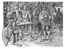

  
[Intangible Textual Heritage](../../index.md)  [Legends and
Sagas](../index)  [Iceland](../ice/index)  [Index](index.md) 
[Previous](nda23)  [Next](nda25.md) 

------------------------------------------------------------------------

[Buy this Book on
Kindle](https://www.amazon.com/exec/obidos/ASIN/B002HK2G4O/internetsacredte.md)

------------------------------------------------------------------------

  
*The Norse Discovery of America*, by A.M Reeves, N.L. Beamish and R.B.
Anderson, \[1906\], at Intangible Textual Heritage

------------------------------------------------------------------------

### MINOR NARRATIVES.

A. FROM THE HISTORY OF KING OLAF TRYGGVASON.

ACCORDING TO THE SECOND VELLUM CODEX, No. 61, Fol.

Supposed to have been copied at the end of the 14*th or beginning of
the* 15*th Century*.

THUS says the holy priest Bede, in the chronicles which he wrote
concerning the regions of the earth: that the island which is called
Thule in the books, lies so far in the north part of the world, that
there came no day in the winter, when the night is longest, and no night
in summer, when the day is longest. Therefore think learned men that it
is Iceland which is called Thule, for there are many places; in that
land, where the sun sets not at night, when the day is longest, and in
the same manner, where the sun cannot he seen by day, when the night is
longest. But the holy priest Bede died DCCXXXV years after the birth of
our Lord Jesus Christ, more than a hundred and twenty years before
Iceland was inhabited by the Northmen. But before Iceland was colonized
from Norway, men had been there whom the Northmen called Papas. They
were Christians; for after them were found Irish books, bells, and
croziers, and many other things from whence it could be

p. 255

seen that they were Christian men, and had come from the west over the
sea: [1](#fn_42.md) English books also shew that,
in that time, there was intercourse between the two countries.

### B. FROM THE SCHEDÆ OF ARI FRODE.

No. 54, Fol.

AT that time was Iceland covered with woods, between the mountains and
the shore. Then were here Christian people, whom the Northmen called
Papas, but they went afterwards away, because they would not be here
amongst heathens; and left after them Irish books, and bells, and
croziers, from which could be seen that they were Irishmen. But then
began people to travel much here out from Norway, until King Harold
forbade it, because it appeared to him that the land had begun to be
thinned of inhabitants.

### C. FROM THE PROLOGUE TO THE LANDNAMABOK.

No. 53, Fol.

BUT before Iceland was colonized by the Northmen, the men were there
whom the Northmen called Papas; they were Christians, and people think
that they came from the west over the sea, for there was found after

p. 256

them Irish books, and bells, and croziers, and many more things from
which it could be seen that they were Westmen; such were found eastwards
in Papey, and Papyli; it is also mentioned in English books that in that
time, was intercourse between the countries.

The particulars given of Thule by the Irish monk Dicuil, who wrote in
the year 825, offer a remarkable confirmation of the Icelandic
manuscripts respecting the residence of the Irish ecclesiastics in that
region, which, in his work, is evidently identified with Iceland. He
speaks of Thule as an uninhabited island, which, however, in his
lifetime, about the year 795, had been visited by some monks, *with whom
he himself had spoken*, and who had once dwelt upon the island from the
first of February to the first of August. They denied the exaggerated
statements that had been made by ancient writers respecting the
perpetual ice, continued day from the vernal to the autumnal equinox,
and corresponding interval of night, but stated that a day's journey
further northward, the sea was really frozen, and that with respect to
the length of the days and nights, at, and a few days before and after
the summer solstice, the sun sank so little below the horizon during the
night that one could pursue their ordinary occupations as well as by
day-light. The author further describes several islands lying in the
north part of the British ocean, and which, with a fair wind, might be
reached from the north of Britain in two days and a night; and states
that here *nearly a hundred years before*, namely A. D. 725, hermits
from Ireland had taken up their abode, but, disturbed by the roving
Northmen, had since departed, leaving the place uninhabited. These
islands are further described as having upon them a great number of
sheep, which circumstance

p. 257

leads to the conclusion that they were the Farœ islands, the name of
which is known to be derived from the original Icelandic term *Fareyjar*
or sheep islands.

### ARI MARSON'S SOJOURN IN GREAT IRELAND,

A. D. 982.

From the Landnamabok, collated with accounts of the same transactions in
Hauksbok.

ULF the squinter, son of Hogna the white, took all Reykjanes, between
Thorkafjord and Hafrafell; he married Bjorg, daughter to Eyvind the
Eastman, sister to Helge the lean; their son was Atli the red, who
married Thorbjorg, sister to Steinolf the humble; their son was Mar of
Holum, who married Thorkatla, daughter of Hergil Neprass; their son was
Ari; he was driven by a tempest to White Man's Land, which some call
Great Ireland; it lies to the west in the sea, near to Vinland the Good,
and VI days' sailing west from Ireland. From thence could Ari not get
away, and was there baptized. This story first told Rafn the Limerick
merchant, who had long lived at Limerick in Ireland. Thus said \[also\]
Thorkell Gellerson, that Icelanders had stated, who had heard Thorfinn
Jarl of the Orkneys relate, that Ari was recognised in White Man's Land,
and could not get away from thence, but was there much respected. Ari
married Thorgerd daughter to Alf of Dolum, whose sons were Thorgils,
Gudleif and Illugi: this is the family of Reykjaness. Jorund hight a son
of Ulf the squinter; he married Thorbjorg Knarrarbringa; their daughter
was Thjodhild, who married Erik the Red; their son

p. 258

\[paragraph continues\] \[was\] Leif the
Lucky of Greenland. Jorund hight the son of Atli the Red, he married
Thordis, daughter of Thorgeir Suda; their daughter was Otkatla, who
married Thorgill Kollson. Jorund was also father to Snorri.

### VOYAGE OF BJORN ASBRANDSON

TO THE WESTERN HEMISPHERE AND SETTLEMENT IN GREAT IRELAND. A.D. 999.

BORK the fat and Thordis Surs daughter had a daughter that Thurid hight,
and she was married to, Thorbjorn the fat, who lived at Froda; he was
son of Orm the lean, who had taken and cultivated the farm of Froda.
Thurid, daughter of Asbrand of Kamb in Breidavik had he formerly
married; she was sister to Bjorn Breidvikingahappa, who is hereafter
mentioned in the Saga, and to Arnbjorn the strong: her sons by Thorbjorn
were Ketill the Champion, Gunnlaug and Hallstein. . . .

Now shall something be told about Snorri Godi, that he took up the
process about the murder of Thorbjorn his brother-in-law. He also took
his sister home to Helgafell, because there was a report, that Bjorn,
son of Asbrand from Kamb, began to come there to inveigle her. . . .

Thorodd, hight a man from Medallfellstrand: an honourable man; he was a
great merchant, and owned a trading ship. Thorodd had made a trading
voyage westwards to Ireland, to Dublin. At that time had Jarl

p. 259

\[paragraph continues\] Sigurd Lodversson,
of the Orkneys, sway to the Hebrides, and all the way westward to Man:
he imposed a tribute on the inhabitants of Man, and when they had made
peace the Jarl left men behind him to collect the tribute; it was mostly
paid in smelted silver; but the Jarl sailed away northwards to the
Orkneys. But when they who had waited for the tribute were ready for
sailing, they put to sea with a south-west wind; but when they had
sailed for a time the wind changed to the south-east and east, and there
arose a great storm, and drove them northwards under Ireland, and the
ship broke there asunder upon an uninhabited island. And when they had
gotten on shore there came, by chance, the Icelander Thorodd, on a
voyage from Dublin. The Jarl's men called out to the merchantmen to help
them. Thorodd put out a boat, and went into it himself, and when it came
up, the Jarl's men begged Thorodd to help them, and offered him money to
take them home to Sigurd Jarl in the Orkneys; but Thorodd thought he
could not do that, because he was bound for Iceland; but they pressed
him hard, for they thought it concerned their goods and freedom, that
they should not be left in Ireland or the Hebrides, where they before
had waged war, and it ended so that he sold them the ship's boat, and
took therefore a great part of the tribute; they steered then with the
boat to the Orkneys; but Thorodd sailed without the boat to Iceland, and
came to the south of the land; then steered he westwards, and sailed
into Breidafjord, and landed, with all on board, at Dogurdarness, and
went in autumn to winter with Snorri Godi at Helgafell; he was since
then

p. 260

called Thorodd the tribute-buyer. This happened a little after the
murder of Thorbjorn the fat. The same winter was at Helgafell Turid the
sister to Snorri Godi, whom Thorbjorn the fat had married. Thorodd asked
Snorri Godi to give him Thurid his sister in marriage; and because he
was rich, and Snorri knew him from a good side, and saw that she
required some one to manage her affairs,--with all this together
resolved Snorri Godi to give him the woman, and their marriage was held
there in the winter at Helgafell. But in the following spring Thorodd
betook himself to Froda, and became a good and upright yeoman. But so
soon as Thurid came to Froda, began Bjorn Asbrandson to visit there, and
there was spread a general report that he and Thurid had unlawful
intercourse; then began Thorodd to complain about his visits, but did
not object to them seriously. At that time dwelled Thorer Vidlegg at
Arnarhvol, and his sons Orn and Val were grown up, and very promising
man; they reproached Thorodd for submitting to such disgrace as Bjorn
put upon him, and offered Thorodd their assistance, if he would forbid
the visits of Bjorn. It happened one time that Bjorn came to Froda, and
he sat talking with Thurid. Thorodd used always to sit within when Bjorn
was there, but now was he nowhere to be seen. Then said Thurid: "Take
care of thy walks, Bjorn, for I suspect that Thorodd thinks to put an
end to thy visits here, and it looks to me as if they had gone out to!
fall upon thee by the way, and he thinks they will not be met by equal
force." "That can well be," said Bjorn, and chaunted this stave:--

p. 261

O! Goddess of the arm-ring gold [1](#fn_43.md)  
Let this bright day the longest hold  
On earth, for now I linger here  
In my love's arms, but soon must fear  
These joys will vanish, and her breath  
Be raised to mourn my early death.

Thereafter took Bjorn his arms, and went away, intending to go home; but
when he had gotten up the Digramula, sprang five men upon him; this was
Thorodd and two, of his servants, and the sons of Thorer Vidlegg. They
seized Bjorn, but he defended himself well and manfully; Thorer's sons
pressed in hardest upon him, and wounded him, but he was the death of
both of them. After that Thorodd went away with his men, and was a
little wounded, but they not. Bjorn went his way until he came home, and
went into the room; the woman of the house told a maid servant to attend
him; and when she came into the room with a light, then saw she that
Bjorn was very bloody; she went then in, and told his father Asbrand
that Bjorn was come home bloody; Asbrand went into the room and asked
why Bjorn was bloody; "or have you, perhaps, fallen in with Thorodd?"
Bjorn answered that so it was. Asbrand then asked how the business had
ended. Bjorn chaunted:--

Easier far it is to fondle,  
In the arms of female fair,  
(Vidlegg's sons I both have slain)  
Than with valiant men to wrestle,  
Or tamely purchased tribute bear.

 

p. 262

Then bound Asbrand his wounds, and he became quite restored. Thorodd
begged Snorri Godi to manage the matter about Thorer's sons' murder, and
Snorri had it brought before the court of Thorsness; but the sons of
Thorlak of Eyra assisted Breidvikinga in this affair, and the upshot
was, that Asbrand went security for his son Bjorn, and undertook to pay
a fine for the murder. But Bjorn was banished for three years, and went
away the same summer. During the same summer Thurid of Froda was
delivered of a male child, which received the name of Kjartan; he grew
up at Froda, and was soon large and promising.

Now when Bjorn had crossed the sea \[to Norway\], he bent his way
southwards to Denmark, and therefrom south to Jomsborg. Then was
Palnatoki chief of the Jornsvikings. Bjorn joined their band, and was
named Champion. He was in Jomsborg when Styrbjorn the strong took the
castle. Bjorn was also with, them in Sweden, when the Jomsvikings aided
Styrbjorn; he was also in the battle of Fyrisvall, where Styrbjorn fell,
and escaped in the wood with other Jornsvikings. And so long as
Palnatoki lived, was Bjorn with him, and was looked upon as a
distinguished man, and very brave in all times of trial.

. . . The same summer came the brothers Bjorn and Arnbjorn out to,
Iceland, to Raunhafnarsos. Bjorn was afterwards called the Champion of
Breidavik. Arnbjorn had brought much money out with him, and
immediately, the same summer that he came, bought land at Bakke in
Raunhofn. Arnbjorn made no display, and

p. 263

spoke little on most occasions, but was, however, in all respects, a
very able man. Bjorn, his brother, was, on the other hand, very pompous,
when he came to the country, and lived in great style, for he had
accustomed himself to the court usages of foreign chiefs; he was much
handsomer than Arnbjorn, and in no particular less able, but was much
more skilled in martial exercises, of which he had given proofs in
foreign lands. In the summer, just after they had arrived, a great
meeting of the people was held north of the heath, under Haugabret, near
the mouth of the Froda; and thither rode all the merchants, in coloured
garments; and when they had come to the meeting, was there many people
assembled. There was Thurid, the lady of Froda, and Bjorn went up, and
spoke to her, and no one objected to this, for it was thought likely
that their discourse would last long, since they, for such a length of
time, had not seen each other. There arose that day a fight, and one of
the men from the northern mountains received a deadly wound, and was
carried down under a bush on the bank of the river; much blood flowed
from the wound, so that there was a pool of blood in the bush. There was
the boy Kjartan, son of Thurid of Froda; he had a small axe in his hand;
he ran to the bush, and dipped the axe in the blood. When the men from
the southern mountains rode southwards from, the meeting, Thord Blig
asked Bjorn how the discourse had turned out betwixt him and Thurid of
Froda. Bjorn said that he was well contented therewith. Then asked
Thord, whether he had that day seen the lad Kjartan, her and Thorodd's
united son. "Him saw

p. 264

\[paragraph continues\] I," said Bjorn.
"What do you think of him?" quoth Thord, again. Then chaunted Bjorn this
stave:

"A stripling lo!  
With fearful eyes  
A woman's image,  
Downwards ran  
To the wolf's lair;--  
The people say  
The youth knows not  
His Viking father."

Thord said: "What will Thorodd say when he hears of your boy?" Then sung
Bjorn:

"Then will the noble lady,  
When pressing to her breast  
The image of his father  
In her fair arms to rest,  
Admit Thorodd's conjecture,  
For me she ever loved,  
And ever shall I bear her  
Affection deep and proved."

Thord said: "It will be better for ye, not to, have much to do, with
each other, and that thou turn thy thoughts from Thurid." "That is
surely a good counsel," replied Bjorn, "but far is that from my
intention, although it makes some difference when I have to do with such
a man as Snorri her brother." "Thou wilt be sorry for thy doings," said
Thord, and therewith ended the talk between them. Bjorn went home now to
Kamb, and took upon himself the management of the place, for his father
was then dead. In the winter he began his trips over the heath, to visit
Thurid; and although

p. 265

\[paragraph continues\] Thorodd did not
like it, he yet saw that it was not easy to find a remedy, and he
thought over with himself, how dearly it had cost him, when he sought to
stop their intercourse; but he saw that Bjorn was now much stronger than
before. Thorodd bribed, in the winter, Thorgrim Galdrakin to raise a
tempest against Bjorn, when he was crossing the heath. Now it came to
pass one day that Bjorn came to Froda, and in the evening, when he was
going home, was there thick weather, and some rain; and he set off very
late; but when he had gotten up on the heath, the weather became cold,
and it snowed; and so dark that he saw not the way before him. After
that arose a drift of snow, with so much sleet that he could scarcely
keep his legs; his clothes were now frozen, for he was before wet
through, and he strayed about so that he knew not where to turn; at
night he arrived at the edge of a cave, went in, and was there for the
night, and had a cold lodging; then sung Bjorn:--

"Fair one! who dost bring  
Vestments to the weary, [1](#fn_44.md)  
Little know'st thou where  
Hid in cavern dreary,  
I now shelter seek;  
He that once on ocean  
Boldly steered a bark,  
Now lies without motion  
In a cavern dark."

And again he chaunted:

p. 266

"The swan's cold region I have crossed  
All eastwards with a goodly freight,  
For woman's love, by tempest tost  
And seeking danger in the fight:  
But now no woman's couch I tread,  
A rocky cavern is my bed."

Bjorn remained three days in the cave, before the weather moderated; but
on the fourth day came he home from the heath to Kamb. He was much
exhausted. The servants asked him where he had been during the
tempest--Bjorn sang:

"Well my deeds are known  
Under Styrbjörn's banner,  
Steel-clad Erik slew  
Gallant men in battle;  
Now on mountain wild,  
Met by magic shower,  
Outlet could not find  
From the Witches power." [1](#fn_45.md)

Bjorn was now at home for the winter. In spring his brother Arnbjorn
fixed his residence at Bakka in Raunhofn, but Bjorn lived at Kamb, and
kept a splendid house. . . .

The same summer bade Thorodd the tribute-buyer his brother-in-law Snorri
Godi to a feast at home at Froda, and Snorri betook himself thither with
twenty men. And while Snorri was at the feast, disclosed Thorodd to him,
how he felt himself both disgraced and injured by the visits which Bjorn
Asbrandson made to Thurid his

p. 267

wife, but sister to Snorri Godi: Thorodd said that Snorri should remedy
this bad business. Snorri was there a few days, and Thorodd gave him
costly presents when he went away. Snorri Godi rode from thence over the
heath, and gave out that he was going to the ship in the bay of
Raunhafn. This was in summer, at the time of haymaking. But when they
came south on Kamb's heath, then said Snorri: "Now will we ride from the
heath down to Kamb, and I will tell you," said he, "that I will visit
Bjorn, and take his life, if opportunity offers, but not attack him in
the house, for the buildings are strong here, and Bjorn is strong and
hardy, and we have but little force; and it is well known that men who
have come even so, with great force, have with little success attacked
such valiant men inside in the house, as was the case with Geir Godi,
and Gissur the white, when they attacked Gunnar of Lidarend, in his
house, with eighty men, but he was there alone, and nevertheless were
some wounded, and others killed; and they had staid the attack had not
Geir Godi, with his heedfulness, observed that he was short of arms. But
forasmuch as," continued he, "Bjorn is now out, which may be expected,
as it is good drying weather, so appoint I thee, my kinsman Mar, to
fetch Bjorn the first wound; but consider well, that he is no man to
trifle with, and that wherever he is you may expect a hard blow from a
savage wolf, if he, at the onset, receives not such a wound as will
cause his death." And now when they rode down from the moor to the farm,
saw they that Bjorn was out in the homestead, working at a sledge, and
there was nobody

p. 268

with him, and no weapons had he except a little axe, and a large knife,
of a span's length from the haft, which he used for boring the holes in
the sledge. Bjorn saw that Snorri Godi with his followers rode down from
the moor, into the field, and knew them immediately. Snorri Godi was in
a blue cloak, and rode in front. Bjorn made an immediate resolve, and
took the knife, and went straight towards them; when they came together,
he seized with the one hand the arm of Snorri's cloak, and with the
other held he the knife in such a manner as was most easy for him to
stab Snorri through the breast, if he should think fit to do so. Bjorn
greeted them, as they met, and Snorri greeted him again; but Mar dropped
his hands, for it struck him that Bjorn could soon hurt Snorri, if any
injury was done to him. Upon this Bjorn went with them on their way, and
asked what news they had, but held himself in the same position which he
had taken at the first. Then took up Bjorn the discourse in this manner:
"It stands truly so, friend Snorri, that I conceal not I have acted
towards you in such wise that you may well accuse me, and I have been
told that you have a hostile intention towards me. Now it seems to me
best," continued he, "that if you have any business with me, other than
passing by here to the high road, you should let me know it; but be that
not the case, then would I that you grant me peace, and I will then turn
back, for I go not in leading strings." Snorri answered: "Such a lucky
grip took thou of me at our meeting that thou must have peace this time,
however it may have been determined before; but this I beg of thee, that
from

p. 269

henceforth, thou cease to inveigle Thurid, for it will not end well
between us, if thou, in this respect, continue as thou hast begun."
Bjorn replied: "That only will I promise thee, which I can perform, but
I see not how I can hold to this so long as Thurid and I are in the same
district." "Thou art not so much bound to this place," answered Snorri,
"but that thou [couldst](errata.htm#14.md) easily give up thy residence
here." Bjorn replied: "True is that which thou sayest, and thus shall it
be, since you have yourself come to me, and as our meeting has thus
turned out will I promise thee, that Thorodd and thou shalt have no more
trouble about my visits to Thuridd for the next year." After this, they
separated; Snorri Godi rode to the ship, and then home to Helgafell. The
day following rode Bjorn southwards to Raunhofn to go to sea, and he got
immediately, in the summer, a place in a ship, and they were very soon
ready. They put to sea with a north-east wind, which wind lasted long
during the summer; but of this ship was nothing heard since this long
time.

 

The following narrative will shew that Bjorn was driven to that part of
the eastern coast of North America, where White Man's Land, or Great
Ireland was supposed by the Northmen to be situated, and where, thirty
years afterwards (1029), Gudleif Gudlaugson, driven in the same
direction by easterly winds, recognised his countryman in a Chief, to
whose position and influence both he and his companions were indebted
for a safe return to their native land. This narrative is contained in
the same Saga from whence the preceding has been derived; but before
introducing the second

p. 270

period in the history of Bjorn Asbrandson to the notice of the reader, a
short sketch from the able pen of Bishop Muller, of the general
characteristics of the *Eyrbyggja Saga*, its high position among
Icelandic MSS. its well authenticated details, and its consequent claims
to credibility as regards all the leading incidents which it records,
will serve to place the two narratives in their proper light, and render
the whole more worthy of consideration in a historical point of view:

"This Saga contains a number of occurrences and names of persons that
are also mentioned in other places. Thorolf Mostrarskeg's death is fixed
by the annals in 918; of him and his son Thorstein much is to be found
in the Landnamabok; Thorgrim Thorsteinson's death is related at length
in Gisle Surson's Saga; the Landnama mentions the most of Snorri's
actions; the Annals record his birth in 964, and his death in 1031. . .
. Besides, many of the persons named here are also mentioned in the
Kristnisaga, and many are to be found in the Niala and Laxdæla Sagas."

"The author cites the testimony of Ari Frode; he remarks himself that
Snorri appears in many other Sagas, and expressly mentions Laxdæla Saga,
and Heidarviga, Saga. Certain circumstances are stated to have thus
happened "according to what most people said;" and, we read, "one sees
still the mark of the new barrow, which Arnkel raised over his father,
and where he made a fence across, so that no animal should come there."
It is also stated: "at that time it was the merchants' custom that they
had no cook on board ship, but that all the ship's company should take
it in turn to cook the victuals: there should also stand a covered can
with drink by the sail." These expressions prove that the writer of this
Saga lived some time after the events which he here relates; that
already a part of the

p. 271

\[paragraph continues\] Saga was current,
and that from these statements, and other individual oral relations, he
put his work together."

"Again: verses are often introduced, as well by the acting persons as
other Skalds who sung of the events. These must, therefore, on the
whole, be considered credible, and contain many not unimportant
characteristics of the times. Traces of later decoration appear in the
description of the hardihood of those who were wounded at the battle of
Alptefjord, and of Thorgunna's witchcraft, but it is only natural that
somewhat more of superstition should appear in this than in many other
Sagas, and the circumstance proves nothing against its antiquity The
greater number of these embellishments are no more than what we commonly
find, where such superstitious faith is entertained, and the additions
are accordant with the credulity of the times. The Eyrbyggja Saga is
expressly quoted in the Landnamabok. Besides, we can determine the date
of this with greater accuracy than that of most other Sagas: it must
have been written before 1264, when Iceland became subject to Norway,
because as it is stated: "All should pay tribute to the temple, and be
liable for the journeys of the Chief, just as in the present time the
Thingmen for their Chief:" hence it follows, that the aristocratic form
of society, which ceased when the island became subject to Norway, must
have existed at the period in question. The Saga must also have been
written whilst Thord Sturleson and his mother yet lived, for it says:
"when the church which Snorri Godi had built was removed, his bones were
taken up, and brought down to the place where the church now stands;
there were present Gudny Bodvar's daughter, Thord and Sighvat
Sturleson's mother; and Thord Struleson says, that they were the bones
of a middle sized man, and not large. There were also taken up the bones
of Bork

p. 272

the fat, Snorri Godi's uncle: they were very large; also was taken up
the wife of Thordis, Thorbjorn Surs' daughter, Snorri Godi's mother.
Gudny says that they were small women's bones, and as black as if they
were singed." This proves that the writer of the Saga was present with
Thord Sturleson, and his mother. Gudny died in the year 1220 odd, and
the Saga must therefore have been written in the beginning of the 13th
century."

------------------------------------------------------------------------

### Footnotes

[255:1](nda24.htm#fr_42.md) Til vestan um hat.
Ireland lying to the west of Norway, from whence the Icelanders had
emigrated, was generally spoken of by them with reference to their
fatherland, and for the same reason they called the Irish "westmen."
According to a learned enquirer into the origin of the Irish, the
literal meaning of the word Ireland is *Westland*, the celtic syllable
*iar* or *er* meaning the west. This, however, is disputed by O'Brien,
who maintains that the original interpretation of *iar* is "after," or
"behind," and considers Eirin to be compounded of *i* and *erin*, the
genitive of *ere*, iron, signifying the island of iron or mines, for
which Ireland had formerly been famed, and hence ranked by ancient
writers among the Cassiterides. See Wood's Inquiry. concerning the
primitive inhabitants of Ireland, p. 1.; O'Brien's Irish Diet. in voce
Eirin.

[261:1](nda24.htm#fr_43.md) *Jord*, the earth, one
of the many wives of Odin and mother of Thor.

[265:1](nda24.htm#fr_44.md) To the women of the
Northern family was more particularly entrusted the duties of
hospitality, among which was included that of bringing dry garments to
the traveller who had suffered from the tempestuousness of the weather.

[266:1](nda24.htm#fr_45.md) These poetical
effusions of Bjorn may, perhaps, appear somewhat improbable to modern
readers, but, the Northmen of this period exhibited great readiness in a
species of rude versification, the melody of which was chiefly formed on
alliteration. "As late of the time of Chaucer," says Sir Walter Scott,
"it was considered as the mark of a Northern man to 'affect the
letter.'"

------------------------------------------------------------------------

[Next: Voyage of Gudleif Gudlaugson to Great Ireland](nda25.md)
