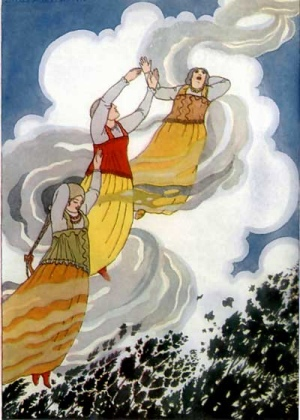

  
[Intangible Textual Heritage](../../index)  [Legends/Sagas](../index) 

------------------------------------------------------------------------

[Buy this Book at
Amazon.com](https://www.amazon.com/exec/obidos/ASIN/1603123210/internetsacredte)

------------------------------------------------------------------------

[Buy this Book on
Kindle](https://www.amazon.com/exec/obidos/ASIN/B002IKKL9K/internetsacredte)

------------------------------------------------------------------------

<table width="75%">
<colgroup>
<col style="width: 50%" />
<col style="width: 50%" />
</colgroup>
<tbody>
<tr class="odd">
<td width="50%" data-valign="TOP"> 
It caught up the three lovely princesses and carried them up into the air (p. 272)</td>
<td width="50%" data-valign="CENTER"><h1 id="old-peters-russian-tales" data-align="CENTER">Old Peter's Russian Tales</h1>
<h2 id="by-arthur-ransome" data-align="CENTER">by Arthur Ransome</h2>
<h4 id="section" data-align="CENTER">[1916]</h4></td>
</tr>
</tbody>
</table>

------------------------------------------------------------------------

[Contents](#contents)    [Start Reading](oprt00)    [Page
Index](pageidx)    [Text \[Zipped\]](oprt.txt.gz)

------------------------------------------------------------------------

|                                                                                                                           |
|---------------------------------------------------------------------------------------------------------------------------|
|  |

This is a book of Russian folklore retold for young people and the young
at heart. The tales are a good sampling of Slavic märchen, and the
luminous prose counterposes the sometimes dark narratives. Ransome was
the author of the popular 'Swallows and Amazons' childrens' books. He
spent time in Russia during World War I as a journalist for a radical
British newspaper, the Daily News, meeting among others, Lenin and
Trotsky. However, that was after he wrote this book. He was a member of
the London bohemian artistic scene, and knew Pamela Coleman Smith, the
artist behind the [Rider-Waite](../../tarot/pkt/index) Tarot deck.

------------------------------------------------------------------------

 [Title Page](oprt00)  
[Note](oprt01)  
[Contents](oprt02)  
[The Hut in the Forest](oprt03)  
[The Tale of the Silver Saucer and the Transparent Apple](oprt04)  
[Sadko](oprt05)  
[Frost](oprt06)  
[The Fool of the World and the Flying Ship](oprt07)  
[Baba Yaga](oprt08)  
[The Cat Who Became Head-Forester](oprt09)  
[Spring in the Forest](oprt10)  
[The Little Daughter of the Snow](oprt11)  
[Prince Ivan, the Witch Baby, and the Little Sister of the
Sun](oprt12)  
[The Stolen Turnips, the Magic Tablecloth, the Sneezing Goat, and the
Wooden Whistle](oprt13)  
[Little Master Misery](oprt14)  
[A Chapter of Fish](oprt15)  
[The Golden Fish](oprt16)  
[Who Lived in the Skull?](oprt17)  
[Alenoushka and her Brother](oprt18)  
[The Fire-Bird, the Horse of Power, and the Princess
Vasilissa](oprt19)  
[The Hunter and His Wife](oprt20)  
[The Three Men of Power--Evening, Midnight, and Sunrise](oprt21)  
