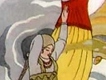
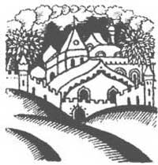
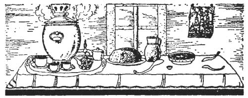

  
[Intangible Textual Heritage](../../index)  [Legends/Sagas](../index) 
[Index](index)  [Next](oprt01) 

------------------------------------------------------------------------

[Buy this Book at
Amazon.com](https://www.amazon.com/exec/obidos/ASIN/1603123210/internetsacredte)

------------------------------------------------------------------------

[Buy this Book on
Kindle](https://www.amazon.com/exec/obidos/ASIN/B002IKKL9K/internetsacredte)

------------------------------------------------------------------------

  
*Old Peter's Russian Tales*, by Arthur Ransome, \[1916\], at Intangible
Textual Heritage

------------------------------------------------------------------------

  [  
Click to enlarge](img/front.jpg)  
They sailed away once more over the blue sea.  

# OLD PETER'S RUSSIAN TALES

 

 

### BY

## ARTHUR RANSOME

 

 

 

### WITH ILLUSTRATIONS, COVER DESIGN, AND DECORATIONS BY DMITRI MITROKHIN

 

 

### NEW YORK

## FREDERICK A. STOKES COMPANY

### PUBLISHERS

#### \[1916\]

Formattted at Intangible Textual Heritage, July 2008. This text is in
the public domain in the US because it was published prior to 1923.

 

 

 

 

### TO

## MISS BARBARA COLLINGWOOD

 

 

 

 

 

------------------------------------------------------------------------

[Next: Note](oprt01)
