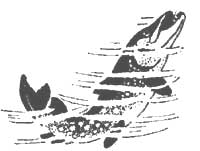
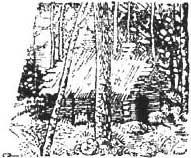
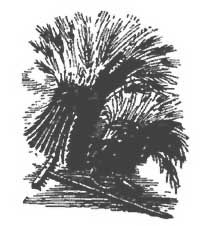

  
[Intangible Textual Heritage](../../index)  [Legends/Sagas](../index) 
[Index](index)  [Previous](oprt02)  [Next](oprt04) 

------------------------------------------------------------------------

[Buy this Book at
Amazon.com](https://www.amazon.com/exec/obidos/ASIN/1603123210/internetsacredte)

------------------------------------------------------------------------

[Buy this Book on
Kindle](https://www.amazon.com/exec/obidos/ASIN/B002IKKL9K/internetsacredte)

------------------------------------------------------------------------

  
*Old Peter's Russian Tales*, by Arthur Ransome, \[1916\], at Intangible
Textual Heritage

------------------------------------------------------------------------

 

# OLD PETER'S RUSSIAN TALES.

p. 11

### THE HUT IN THE FOREST.

 

Outside in the forest there was deep snow. The white snow had crusted
the branches of the pine trees, and piled itself up them till they bent
under its weight. Now and then a snow-laden branch would bend too far,
and huge lumps of snow fell crashing to the ground under the trees. Then
the branch would swing up, and the snow covered it again with a cold
white burden. Sitting in the hut you could hear the crashing again and
again out in the forest, as the tired branches flung down their loads of
snow. Yes, and now and then there was the howling of wolves far away.

p. 12

Little Maroosia heard them, and thought of them out there in the dark as
they galloped over the snow. She sat closer to Vanya, her brother, and
they were both as near as they could get to the door of the stove, where
they could see the red fire burning busily, keeping the whole hut warm.
The stove filled a quarter of the hut, but that was because it was a bed
as well. There were blankets on it, and in those blankets Vanya and
Maroosia rolled up and went to sleep at night, as warm as little baking
cakes.

The hut was made of pine logs cut from the forest. You could see the
marks of the axe. Old Peter was the grandfather of Maroosia and Vanya.
He lived alone with them in the hut in the forest, because their father
and mother were both dead. Maroosia and Vanya could hardly remember
them, and they were very happy with old Peter, who was very kind to them
and did all he could to keep them warm and well fed. He let them help
him in everything, even in stuffing the windows with moss to keep the
cold out when winter began. The moss kept the light out too, but that
did not matter. It would be all the jollier in the spring when the sun
came pouring in.

Besides old Peter and Maroosia and Vanya there were Vladimir and Bayan.
Vladimir was a cat, a big black cat, as stately as an emperor, and just
now he was lying in Vanya's arms fast asleep. Bayan was a

p. 13

dog, a tall gray wolf-dog. He could jump over the table with a single
bound. When he was in the hut he usually lay underneath the table,
because that was the only place where he could lie without being in the
way. And, of course at meal times he was in the way even there. Just now
he was out with old Peter.

"I wonder what story it will be to-night?" said Maroosia.

"So do I," said Vanya. "I wish they'd be quick and come back."

Vladimir stirred suddenly in Vanya's lap, and a minute later they heard
the scrunch of boots in the snow, and the stamping of old Peter's feet
trying to get the snow off his boots. Then the door opened, and Bayan
pushed his way in and shook himself, and licked Maroosia and Vanya and
startled Vladimir, and lay down under the table and came out again,
because he was so pleased to be home. And old Peter came in after him,
with his gun on his back and a hare in his hand. He shook himself just
like Bayan, and the snow flew off like spray. He hung up his gun, flung
the hare into a corner of the hut, and laughed.

"You are snug in here, little pigeons," he said.

p. 14

Vanya and Maroosia had jumped up to welcome him, and when he opened his
big sheepskin coat, they tumbled into it together and clung to his belt.
Then he closed the big woolly coat over the top of them and they
squealed; and he opened it a little way and looked down at them over his
beard, and then closed it again for a moment before letting them out. He
did this every night, and Bayan always barked when they were shut up
inside.

Then old Peter took his big coat off and lifted down the samovar from
the shelf. The samovar is like a big tea-urn, with a red-hot fire in the
middle of it keeping the water boiling. It hums like a bee on the
tea-table, and the steam rises in a little jet from a tiny hole in the
top. The boiling water comes out of a tap at the bottom. Old Peter threw
in the lighted sticks and charcoal, and made a draught to draw the heat,
and then set the samovar on the table with the little fire crackling in
its inside. Then he cut some big lumps of black bread. Then he took a
great saucepan full of soup, that was simmering on the stove, and
emptied it into a big wooden bowl. Then he went to the wall where, on
three nails, hung three wooden spoons, deep like ladles. There were one
big spoon, for old Peter; and two little spoons, one for Vanya and one
for Maroosia.

p. 15

And all the time that old Peter was getting supper ready he was
answering questions and making jokes--old ones, of course, that he made
every day--about how plump the children were, and how fat was better to
eat than butter, and what the Man in the Moon said when he fell out, and
what the wolf said who caught his own tail and ate himself up before he
found out his mistake.

And Vanya and Maroosia danced about the hut and chuckled.

Then they had supper, all three dipping their wooden spoons in the big
bowl together, and eating a tremendous lot of black bread. And, of
course, there were scraps for Vladimir and a bone for Bayan.

After that they had tea with sugar but no milk, because they were
Russians and liked it that way.

Then came the stories. Old Peter made another glass of tea for himself,
not for the children. His throat was old, he said, and took a lot of
keeping wet; and they were young, and would not sleep if they drank tea
too near bedtime. Then he threw a log of wood into the stove. Then he
lit a short little pipe, full of very strong tobacco,

p. 16

called Mahorka, which has a smell like hot tin. And he puffed, and the
smoke got in his eyes, and he wiped them with the back of his big hand.

All the time he was doing this Vanya and Maroosia were snuggling
together close by the stove, thinking what story they would ask for, and
listening to the crashing of the snow as it fell from the trees outside.
Now that old Peter was at home, the noise made them feel comfortable and
warm. Before, perhaps, it made them feel a little frightened.

"Well, little pigeons, little hawks, little bear cubs, what is it to
be?" said old Peter.

"We don't know," said Maroosia.

"Long hair, short sense, little she-pigeon," said old Peter. "All this
time and not thought of a story? Would you like the tale of the little
Snow Girl who was not loved so much as a hen?"

"Not to-night, grandfather," said Vanya.

"We'd like that tale when the snow melts," said Maroosia.

"To-night we'd like a story we've never heard before," said Vanya.

"Well, well," said old Peter, combing his great gray beard with his
fingers, and looking out at them with twinkling eyes from under his big
bushy eyebrows. "Have I ever told you the story of 'The Silver

p. 17

\[paragraph continues\] Saucer and the
Transparent Apple'?"

"No, no, never," cried Vanya and Maroosia at once.

Old Peter took a last pull at his pipe, and Vanya and Maroosia wriggled
with excitement. Then he drank a sip of tea. Then he began.

 

------------------------------------------------------------------------

[Next: The Tale of the Silver Saucer and the Transparent Apple](oprt04)
