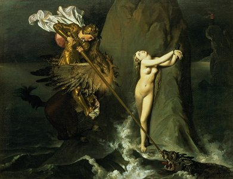

  
[Intangible Textual Heritage](../../index)  [Legends/Sagas](../index) 

------------------------------------------------------------------------

<table width="75%">
<colgroup>
<col style="width: 50%" />
<col style="width: 50%" />
</colgroup>
<tbody>
<tr class="odd">
<td width="50%" data-valign="CENTER"> 
</td>
<td width="50%" data-valign="CENTER"><h1 id="orlando-furioso" data-align="center">Orlando Furioso</h1>
<h4 id="revised-1521-and-1532" data-align="center">[1516, revised 1521 and 1532]</h4>
<h3 id="by-ludovico-ariosto-1474-1533" data-align="center">by Ludovico Ariosto [1474-1533]</h3>
<h4 id="translated-by-william-stewart-rose-1775---1843" data-align="center">translated by William Stewart Rose [1775 - 1843]</h4>
<h4 id="translation-published-1823-1831" data-align="center">[translation published 1823-1831]</h4></td>
</tr>
</tbody>
</table>

------------------------------------------------------------------------

|                                                                                                                           |
|---------------------------------------------------------------------------------------------------------------------------|
|  |

Orlando Furioso, Ludovico Ariosto's 16th century epic Italian poem, is a
sequel to Orlando Innamorato, an earlier work by Matteo Maria Boiardo.
The titular Orlando is very loosely based on [Roland](../roland/index),
a heroic knight in Charlemagne's court, with admixtures from
[Arthurian](../eng/index.htm#arthurian) and other sources. Orlando is
driven insane with love for the beautful Angelica, and must be restored
to sanity in time to save Paris from the Moslem armies. There are
numerous subplots, minor characters, and twists, along with many fantasy
elements. Orlando Furioso was one of several European epic poems written
during this era, including the [Lusiad](../lus/index), and Tasso's
Jerusalem Delivered, typically in the *Ottava Rima* rhyming scheme.
Vivaldi and Handel wrote operas about Orlando, and
[Milton](../../chr/milton/index) and Cervantes also referenced Ariosto's
epic.

This electronic text was originally created for the Online Medieval and
Classical Library by Douglas B. Killings. It was prepared for
sacred-texts, with additional proofing and formatting, by the volunteer
known as 'Simon Magus'.

------------------------------------------------------------------------

[Canto 1](orl01)  
[Canto 2](orl02)  
[Canto 3](orl03)  
[Canto 4](orl04)  
[Canto 5](orl05)  
[Canto 6](orl06)  
[Canto 7](orl07)  
[Canto 8](orl08)  
[Canto 9](orl09)  
[Canto 10](orl10)  
[Canto 11](orl11)  
[Canto 12](orl12)  
[Canto 13](orl13)  
[Canto 14](orl14)  
[Canto 15](orl15)  
[Canto 16](orl16)  
[Canto 17](orl17)  
[Canto 18](orl18)  
[Canto 19](orl19)  
[Canto 20](orl20)  
[Canto 21](orl21)  
[Canto 22](orl22)  
[Canto 23](orl23)  
[Canto 24](orl24)  
[Canto 25](orl25)  
[Canto 26](orl26)  
[Canto 27](orl27)  
[Canto 28](orl28)  
[Canto 29](orl29)  
[Canto 30](orl30)  
[Canto 31](orl31)  
[Canto 32](orl32)  
[Canto 33](orl33)  
[Canto 34](orl34)  
[Canto 35](orl35)  
[Canto 36](orl36)  
[Canto 37](orl37)  
[Canto 38](orl38)  
[Canto 39](orl39)  
[Canto 40](orl40)  
[Canto 41](orl41)  
[Canto 42](orl42)  
[Canto 43](orl43)  
[Canto 44](orl44)  
[Canto 45](orl45)  
[Canto 46](orl46)  
