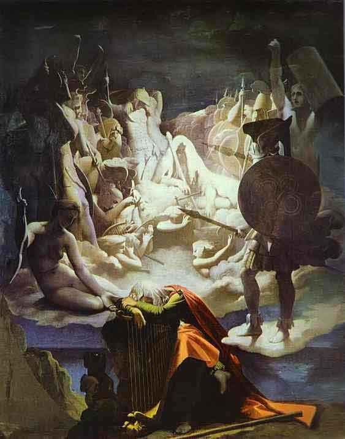

  
[Intangible Textual Heritage](../../index)  [Legends and
Sagas](../index)  [Celtic Folklore](../celt/index) 

------------------------------------------------------------------------

<table width="75%">
<colgroup>
<col style="width: 50%" />
<col style="width: 50%" />
</colgroup>
<tbody>
<tr class="odd">
<td width="50%" data-valign="TOP"> 
The Dream of Ossian, by Jean Dominique Ingres (1815) 
Click to enlarge</td>
<td width="50%" data-valign="TOP"><h1 id="the-poems-of-ossian" data-align="CENTER">The Poems of Ossian</h1>
<h2 id="by-james-macpherson" data-align="CENTER">by James Macpherson</h2>
<h4 id="section" data-align="CENTER">[1773]</h4></td>
</tr>
</tbody>
</table>

------------------------------------------------------------------------

[Contents](#contents)    [Start Reading](oss00)

------------------------------------------------------------------------

*Ossian* purports to be a translation of an epic cycle of Scottish poems
from the early dark ages. Ossian, a blind bard, sings of the life and
battles of Fingal, a Scotch warrior. Ossian caused a sensation when it
was published on the cusp of the era of revolutions, and had a massive
cultural impact during the 18th and 19th centuries. Napolean carried a
copy into battle; Goethe translated parts of it; the city of Selma,
Alabama was named after the home of Fingal, and one of Ingres' most
romantic and moody paintings, the *Dream of Ossian* (above) was based on
it.

James Macpherson claimed that Ossian was based on an ancient Gaelic
manuscript. There was just one problem. The existence of this manuscript
was never established. In fact, unlike Ireland and Wales, there are no
dark-age manuscripts of epic poems, tales, and chronicles and so on from
Scotland. It isn't that such ancient Scottish poetry and lore didn't
exist, it was just purely oral in nature. Not much of it was committed
to writing until it was on the verge of extinction. There are Scottish
manuscripts and books in existence today which date as far back as the
12th century (some with scraps of poetry in them), but they are
principally on subjects such as religion, genealogy, and land grants.

For this and several other reasons which are dealt with in the
[Preliminary Discourse](oss02) *et seq*., authenticity of the work was
widely contested, particularly by Samuel Johnson. A huge (and probably
excessive) backlash ensued, and conventional wisdom today brands Ossian
as one of the great forgeries of history.

In fairness, themes, characters and passages of Ossian are based on
established Celtic and Scottish folklore. Much of the [fourth
volume](../celt/pt4/index) of J.F. Campbell's massive [Popular Tales of
the West Highlands](../celt/ptwh) is devoted to tracking down Ossianic
fragments in circulation prior to Macpherson, or elicited from
illiterate Highland peasants who had never heard of Ossian.

Macpherson is today considered the author of this work. The language of
composition was probably English: As Campbell determined, Macpherson
wasn't even particularly fluent in Gaelic.

The work has literary merits, and historical importance. The project
resembles other Romantic era attempts at national epic-building such as
the Finnish [Kalevala](../kveng/index); however the Kalevala is
acknowledged to be based on years of ethnographic fieldwork by Elias
Lönnrot. Lönnrot is now believed to have composed a few bridge portions
of the Kalevala; but he didn't pull a great deal of the work out of thin
air, as did Macpherson.

Production notes: This version is based on material produced by Donal
O'Danachair. Be sure to visit his website
([exclassics.com](https://exclassics.com))--highly recommended! I've
scanned and proofed about 200 pages of prefatory material, added the
original illustrations and page numbers; corrected some typos and added
a few missing footnotes to the exclassics etext.

--J.B. Hare

------------------------------------------------------------------------

[Title Page](oss00)  
[Contents](oss01)  
[A Preliminary Discourse](oss02)  
[Preface](oss03)  
[A Dissertation Concerning the Æra of Ossian](oss04)  
[Dissertation Concerning the Poems of Ossian](oss05)  
[A Critical Dissertation...](oss06)  
[Funeral Song by Regner Lodbrog, translated by Olaus Wormius](oss07)  

### The Poems of Ossian

### Cath-loda

[Duan I](oss08)  
[Duan II](oss09)  
[Duan III](oss10)  

 

[Comala, A Dramatic Poem](oss11)  
[Carric-thura](oss12)  
[Carthon](oss13)  
[Oina-morul](oss14)  
[Colna-dona](oss15)  
[Oithona](oss16)  
[Croma](oss17)  
[Calthon And Colmal](oss18)  
[The War of Caros](oss19)  
[Cathlin of Clutha](oss20)  
[Sul-malla of Lumon](oss21)  
[The War of Inis-thona](oss22)  
[The Songs of Selma](oss23)  

### Fingal: An Ancient Epic Poem

[Book I](oss24)  
[Book II](oss25)  
[Book III](oss26)  
[Book IV](oss27)  
[Book V](oss28)  
[Book VI](oss29)  

 

[Lathmon](oss30)  
[Dar-thula](oss31)  
[The Death of Cuthullin](oss32)  
[The Battle of Lora](oss33)  

### Temora

[Book I](oss34)  
[Book II](oss35)  
[Book III](oss36)  
[Book IV](oss37)  
[Book V](oss38)  
[Book VI](oss39)  
[Book VII](oss40)  
[Book VIII](oss41)  

 

[Conlath and Cuthona](oss42)  
[Berrathon](oss43)  
