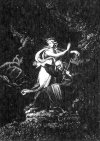
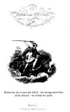

[Intangible Textual Heritage](../../index.md)  [Legends and
Sagas](../index)  [Celtic Folklore](../celt/index)  [Index](index.md) 
[Next](oss01.md) 

------------------------------------------------------------------------

THE

POEMS OF OSSIAN;

TRANSLATED BY

JAMES MACPHERSON, ESQ.

TO WHICH ARE PREFIXED

A PRELIMINARY DISCOURSE AND DISSERTATION

ON THE

ÆRA AND POEMS OF OSSIAN.

BOSTON:

PHILLIPS, SAMPSON & COMPANY,

110 Washington Street.

\[1851\]

(Reprint of 1773 edition)

###### Prefatory material (to page 188) scanned at Intangible Textual Heritage, April 2003. Other material based on material developed by exclassics.org, with additional proofing and formatting at Intangible Textual Heritage. Jean Lelievre, Redactor. This text is in the public domain. These files may be used for any non-commercial purpose, provided this notice of attribution is left intact.

 [  
Click to enlarge](img/front.jpg.md)

 [  
Click to enlarge](img/title.jpg.md)

------------------------------------------------------------------------

[Next: Contents](oss01.md)
