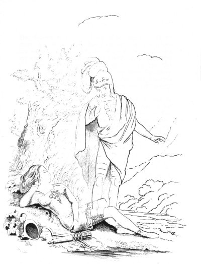

[Intangible Textual Heritage](../../index)  [Legends and
Sagas](../index)  [Celtic Folklore](../celt/index)  [Index](index) 
[Previous](oss36)  [Next](oss38) 

------------------------------------------------------------------------

p. 434

# TEMORA

### BOOK IV

### ARGUMENT

The second night continues. Fingal relates, at the feast, his own first
expedition into Ireland, and his marriage with Ros-cranna, the daughter
of Cormac, king of that island. The Irish chiefs convene in the presence
of Cathmor. The situation of the king described. The story of Sul-malla,
the daughter of Conmor, king of Inis-huna, who, in the disguise of a
young warrior, hath followed Cathmor to the war. The sullen behavior of
Foldath, who had commanded in the battle of the preceding day, renews
the difference between him and Malthos: but Cathmor, interposing, ends
it. The chiefs feast, and hear the song of Fonar the bard. Cathmor
returns to rest, at a distance from the army. The ghost of his brother
Cairbar appears to him in a dream; and obscurely foretells the issue of
the war. The soliloquy of the king. He discovers Sul-malla. Morning
comes. Her soliloquy closes the book.

"BENEATH an oak," said the king, "I sat on Selma's streamy rock, when
Connal rose, from the sea, with the broken spear of Duth-caron. Far
distant stood the youth. He turned away his eyes. He remembered the
steps of his father, on his own green hill. I darkened in my place.
Dusky thoughts flew over my soul. The kings of Erin rose before me. I
half unsheathed the sword. Slowly approached the chiefs. They lifted up
their silent eyes. Like a ridge of clouds, they wait for the bursting
forth of my voice. My voice was, to them, a wind from heaven, to roll
the mist away.

"I bade my white sails to rise, before the roar of Cona's wind. Three
hundred youths looked, from their waves, on Fingal's bossy shield. High
on the mast it hung, and marked the dark-blue sea. But when night came
down, I struck, at times, the warning boss: I struck, and looked on
high, for fiery-haired Ul-erin.  [1](#fn_103)

p. 435

\[paragraph continues\] Nor absent was the star of heaven. It travelled
red between the clouds. I pursued the lovely beam, on the faint-gleaming
deep. With morning, Erin rose in mist. We came into the bay of Moi-lena,
where its blue waters tumbled, in the bosom of echoing woods. Here
Cormac, in his secret halls, avoids the strength of Colc-ulla. Nor he
alone, avoids the foe. The blue eye of Ros-cranna is there: Ros-cranna,
white-handed maid, the daughter of the king!

"Gray, on his pointless spear, came forth the aged steps of Cormac. He
smiled from his waving locks; but grief was in his soul. He saw us few
before him, and his sigh arose. 'I see the arms of Trenmor,' he said;
'and these are the steps of the king! Fingal! thou art a beam of light
to Cormac's darkened soul! Early is thy fame, my son: but strong are the
foes of Erin. They are like the roar of streams in the land, son of
car-borne Comhal!' 'Yet they may be rolled away,' I said, in my rising
soul. 'We are not of the race of the feeble, king of blue-shielded
hosts! Why should fear come amongst us, like a ghost of night? The soul
of the valiant grows when foes increase in the field. Roll no darkness,
king of Erin, on the young in war!'

"The bursting tears of the king came down. He seized my hand in silence.
'Race of the daring Trenmor!' at length he said, 'I roll no cloud before
thee. Thou burnest in the fire of thy fathers. I behold thy fame. It
marks thy course in battle, like a stream of light. But wait the coming
of Cairbar; my so must join thy sword. He calls the sons of Erin from
all their distant streams.'

"We came to the hall of the king, where it rose in the midst of rocks,
on whose dark sides were the marks of streams of old. Broad oaks bend
around with their moss. The thick birch is waving near. Half hid, in

p. 436

her shadowy grove, Ros-cranna raises the song. Her white hands move on
the harp. I beheld her blues rolling eyes. She was like a spirit of
heaven half folded in the skirt of a cloud!

Three days we feasted at Moi-lena. She rises bright in my troubled soul.
Cormac beheld me dark. He gave the white-bosomed maid. She comes with
bending eye, amid the wandering of her heavy locks. She came! Straight
the battle roared. Colc-ulla appeared: I took my spear. My sword rose,
with my people against the ridgy foe. Alnecma fled. Colc-ulla fell.
Fingal returned with fame.

"Renowned is he, O Fillan, who fights in the strength of his host. The
bard pursues his steps through the land of the foe. But he who fights
alone, few are his deeds to other times! He shines to-day, a mighty
light. To-morrow he is low. One song contains his fame. His name is one
dark field. He is forgot; but where his tomb sends forth the tufted
grass."

Such are the words of Fingal, on Mora of the roes. Three bards, from the
rock of Cormul, pour down the pleasing song. Sleep descends in the
sound, on the broad-skirted host. Carril returned with the bards, from
the tomb of Dunlora's chief. The voice of morning shall not come to the
dusky bed of Duth-caron. No more shalt thou hear the tread of roes
around thy narrow house!

As roll the troubled clouds, around a meteor of night, when they
brighten their sides with its light along the heaving sea; so gathers
Erin around the gleaming form of Cathmor. He, tall in the midst,
careless lifts, at times, his spear: as swells, or falls the sound of
Fonar's distant harp. Near him leaned, against a rock, Sul-malla of blue
eyes, the white-bosomed daughter of Conmor, king of Inis-huna. To his
aid came blue-shielded

p. 437

Cathmor, and rolled his foes away. Sul-malla beheld him stately in the
hail of feasts. Nor careless rolled the eyes of Cathmor on the
long-haired maid!

''The third day arose, when Fithil came, from Erin of the streams. He
told of the lifting up of the shield in Selma: he told of the danger of
Cairbar. Cathmor raised the sail at Cluba; but the winds were in other
lands. Three days he remained on the coast, and turned his eyes on
Conmor's halls. He remembered the daughter of strangers, and his sigh
arose. Now when the winds awaked the wave: from the hill came a youth in
arms; to lift the sword with Cathmor, in his echoing fields. It was the
white-armed Sul-malla. Secret she dwelt beneath her helmet. Her steps
were in the path of the king: on him her blue eyes rolled with joy, when
he lay by his rolling streams: But Cathmor thought that on Lumon she
still pursued the roes. He thought, that fair on a rock, she stretched
her white hand to the wind; to feel its course from Erin, the green
dwelling of her love. He had promised to return, with his white-bosomed
sails. The maid is near thee, O Cathmor: leaning on her rock.

The tall forms of the chiefs stand around; all but dark-browed Foldath.
He leaned against a distant tree, rolled into his haughty soul. His
bushy hair whistles in the wind. At times, bursts the hum of a song. He
struck the tree at length, in wrath; and rushed before the king! Calm
and stately, to the beam of the oak, arose the form of young Hidalla.
His hair falls round his blushing cheek, in the wreaths of waving light.
Soft was his voice in Clonra, in the valley of his fathers. Soft was his
voice when he touched the harp, in the hall near his roaring stream!

"King of Erin," said Hidalla, "now is the time to feast. Bid the voice
of bards arise. Bid them roll the night away. The soul returns, from
song, more terrible

p. 438

to war. Darkness settles on Erin. From hill to hill bend the skirted
clouds. Far and gray, on the heath, the dreadful strides of ghosts are
seen: the ghosts of those who fell bend forward to their song. Bid, O
Cathmor! the harps to rise, to brighten the dead, on their wandering
blasts."

"Be all the dead forgot," said Foldath's bursting wrath. "Did not I fail
in the field? Shall I then hear the song? Yet was not my course harmless
in war. Blood was a stream around my steps. But the feeble were behind
me. 'The foe has escaped from my sword. In Conra's vale touch thou the
harp. Let Dura answer to the voice of Hidalla. Let some maid look, from
the wood, on thy long yellow locks. Fly from Lubar's echoing plain. This
is the field of heroes!"

"King of Erin," Malthos said, "it is thine to lead in war. Thou art a
fire to our eyes, on the dark-brown field. Like a blast thou hast passed
over hosts. Thou hast laid them low in blood. But who has heard thy
words returning from the field? The wrathful delight in death; their
remembrance rests on the wounds of their spear. Strife is folded in
their thoughts: their words are ever heard. Thy course, chief of Moma,
was like a troubled stream. The dead were rolled on thy path: but others
also lift the spear. We were not feeble behind thee: but the foe was
strong."

Cathmor beheld the rising rage and bending forward of either chief: for,
half unsheathed, they held their swords, and rolled their silent eyes.
Now would they have mixed in horrid fray, had not the wrath of Cathmor
burned. He drew his sword: it gleamed through night, to the high-flaming
oak! "Sons of pride," said the king," allay your swelling souls. Retire
in night. Why should my rage arise? Should I contend with both in arms!
It is no time for strife! Retire, ye clouds, at my feast. Awake my soul
no more."

p. 439

They sunk from the king on either side; like two columns of morning
mist, when the sun rises, between them, on his glittering rocks. Dark is
their rolling on either side: each towards its reedy pool!

Silent sat the chiefs at the feast. They look, at times, on Atha's king,
where he strode, on his rock, amid his settling soul. The host lie along
the field. Sleep descends on Moi-lena. The voice of Fonar ascends alone,
beneath his distant tree. It ascends in the praise of Cathmor, son of
Larthon of Lumon. But Cathmor did not hear his praise. He lay at the
roar of a stream. The rustling breeze of night flew over his whistling
locks.

His brother came to his dreams, half seen from his low-hung cloud. Joy
rose darkly in his face. He had heard the song of Carril.  [1](#fn_104) A blast sustained his dark-skirted
cloud: which he seized in the bosom of night, as he rose, with his fame,
towards his airy hail. Half mixed with the noise of the stream, he
poured his feeble words.

"Joy meet the soul of Cathmor. His voice was heard on Moi-lena. The bard
gave his song to Cairbar. He travels on the wind. My form is in my
father's hall, like the gliding of a terrible light, which darts across
the desert, in a stormy night. No bard shall be wanting at thy tomb when
thou art lowly laid. The sons of song love the valiant. Cathmor, thy
name is a pleasant gale. The mournful sounds arise! On Lubar's field
there is a voice! Louder still, ye shadowy ghosts! The dead were full of
fame! Shrilly swells the feeble sound. The rougher blast alone is heard!
Aid soon is Cathmor low!" Rolled into himself he flew, wide on the bosom
of winds. The old oak felt his departure, and shook its whistling head.
Cathmor

p. 440

starts from rest. He takes his deathful spear. He lifts his eyes around.
He sees but dark-skirted night.

"It was the voice of the king," he said. "But now his form is gone.
Unmarked is your path in the air, ye children of the night. Often, like
a reflected beam, are ye seen in the desert wild: but ye retire in your
blasts, before our steps approach. Go, then, ye feeble race! Knowledge
with you there is none! Your joys are weak, and like the dreams of our
rest, or the light winged thought, that flies across the soul. Shall
Cathmor soon be low? Darkly laid in his narrow house! Where no morning
comes, with her half-opened eyes? Away, thou shade! to fight is mine!
All further thought away! I rush forth on eagles' wings, to seize my
beam of flame. In the lonely vale of streams, abides the narrow soul.
Years roll on, seasons return, but he is still unknown. In a blast comes
cloudy death, and lays his gray head low. His ghost is folded in the
vapor of the fenny field. Its course is never on hills, nor mossy vales
of wind. So shall not Cathmor depart. No boy in the field was he, who
only marks the bed of roes, upon the echoing hills. My issuing forth was
with kings. My joy in dreadful plains: where broken hosts are rolled
away, like seas before the wind."

So spoke the king of Alnecma, brightening in his rising soul. Valor,
like a pleasant flame, is gleaming within his breast. Stately is his
stride on the heath! The beam of east is poured around. He saw his gray
host on the field, wide spreading their ridges in light. He rejoiced,
like a spirit of heaven, whose steps came forth on the seas, when he
beholds them peaceful round, and all the winds are laid. But soon he
awakes the waves, and rolls them large to some echoing shore.

On the rushy bank of a stream slept the daughter of Inis-huna. The
helmet had fallen from her head.

 

   
On the Rushy bank of a stream slept the daughter of Inis-huna.

 

p. 441

Her dreams were in the lands of her fathers. There morning is on the
field. Gray streams leap down from the rocks. The breezes, in shadowy
waves, fly over the rushy fields. There is the sound that prepares for
the chase. There the moving of warriors from the hall. But tall above
the rest is seen the hero of streamy Atha. He bends his eye of love on
Sul-malla, from his stately steps. She turns, with pride, her face away,
and careless bends the bow.

Such were the dreams of the maid when Cathmor of Atha came. He saw her
fair face before him, in the midst of her wandering locks. He knew the
maid of Lumon. What should Cathmor do? His sighs arise. His tears come
down. But straight he turns away. "This is no time, king of Atha, to
awake thy secret soul. The battle is rolled before thee like a troubled
stream."

He struck that warning boss,  [1](#fn_105)
wherein dwelt the voice of war. Erin rose around him, like the sound of
eagle wing. Sul-malla started from sleep, in her disordered locks. She
seized the helmet from earth. She trembled in her place. "Why should
they know in Erin of the daughter of Inis-huna?" She remembered the race
of kings. The pride of her soul arose! Her steps are behind a rock, by
the blue-winding stream of a vale; where dwelt the dark-brown hind ere
yet the war arose, thither came the voice of Cathmor, at times, to
Sul-malla's ear. Her soul is darkly sad. She pours her words on wind.

"The dreams of Inis-huna departed. They are dispersed

p. 412

from my soul. I hear not the chase in my land. I am concealed in the
skirt of war. I look forth from my cloud. No beam appears to light my
path. I behold my warriors low; for the broad-shielded king is near. He
that overcomes in danger, Fingal, from Selma of spears! Spirit of
departed Conmor! are thy steps on the bosom of winds? Comest thou, at
times, to other lands, father of sad Sul-malla? Thou dost come! I have
heard thy voice at night; while yet I rose on the wave to Erin of the
streams. The ghosts of fathers, they say, call away the souls of their
race, while they behold them lonely in the midst of wo. Call me, my
father, away! When Cathmor is low on earth, then shall Sul-malla be
lonely in the midst of wo!

------------------------------------------------------------------------

### Footnotes

[434:1](oss37.htm#fr_103) Ul-erin, "the guide
to Ireland," was a star known by that name in the days of Fingal.

[439:1](oss37.htm#fr_104) The song of Carril:
the funeral elegy at the tomb of Cairbar.

[441:1](oss37.htm#fr_105) In order to
understand this passage, it is necessary to look to the description of
Cathmor's shield in the seventh book. This shield had seven principal
bosses, the sound of each of which, when struck with a spear, conveyed a
particular order from the king to his tribes. The sound of one of them,
as here, was the signal for the army to assemble.

------------------------------------------------------------------------

[Next: Book V](oss38)
