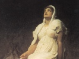

  
[Intangible Textual Heritage](../../index)  [Legends and
Sagas](../index)  [Iceland](../ice/index)  [Index](index) 
[Previous](poe21)  [Next](poe23) 

------------------------------------------------------------------------

[Buy this Book at
Amazon.com](https://www.amazon.com/exec/obidos/ASIN/B0024NLGNQ/internetsacredte)

------------------------------------------------------------------------

  
*The Poetic Edda*, by Henry Adams Bellows, \[1936\], at Intangible
Textual Heritage

------------------------------------------------------------------------

p. 337

# GRIPISSPO

### Gripir's Prophecy

##### INTRODUCTORY NOTE

The *Gripisspo* immediately follows the prose *Fra Dautha Sinfjotla* in
the *Codex Regius*, and is contained in no other early manuscript. It is
unquestionably one of the latest of the poems in the Eddic collection;
most critics agree in calling it the latest of all, dating it not much
before the year 1200. Its author (for in this instance the word may be
correctly used) was not only familiar with the other poems of the
Sigurth cycle, but seems to have had actual written copies of them
before him; it has, indeed, been suggested, and not without
plausibility, that the *Gripisspo* may have been written by the very man
who compiled and annotated the collection of poems preserved in the
*Codex Regius*.

In form the poem is a dialogue between the youthful Sigurth and his
uncle, Gripir, but in substance it is a condensed outline of Sigurth's
whole career as told piecemeal in the older poems. The writer was
sufficiently skillful in the handling of verse, but he was utterly
without inspiration; his characters are devoid of vitality, and their
speeches are full of conventional phrases, with little force or
incisiveness. At the same time, the poem is of considerable interest as
giving, in brief form, a summary of the story of Sigurth as it existed
in Iceland (for the *Gripisspo* is almost certainly Icelandic) in the
latter half of the twelfth century.

It is not desirable here to go in detail into the immensely complex
question of the origin, growth, and spread of the story of Sigurth
(Siegfried). The volume of critical literature on the subject is
enormous, and although some of the more patently absurd theories have
been eliminated, there are still wide divergencies of opinion regarding
many important points. At the same time, a brief review of the chief
facts is necessary in order to promote a clearer understanding of the
poems which follow, and which make up more than a third of the Eddic
collection.

That the story of Sigurth reached the North from Germany, having
previously developed among the Franks of the Rhine country, is now
universally recognized. How and when it spread from northwestern Germany
into Scandinavia are less certainly known. It spread, indeed, in every
direction, so that traces of it

p. 338

are found wherever Frankish influence was extensively felt; but it was
clearly better known and more popular in Norway, and in the settlements
established by Norwegians, than anywhere else. We have historical proof
that there was considerable contact, commercial and otherwise, between
the Franks of northwestern Germany and the Norwegians (but not the
Swedes or the Danes) throughout the period from 600 to 800; coins of
Charlemagne have been found in Norway, and there is other evidence
showing a fairly extensive interchange of ideas as well as of goods.
Presumably, then, the story of the Frankish hero found its way into
Norway in the seventh century. While, at this stage of its development,
it may conceivably have included a certain amount of verse, it is
altogether probable that the story as it came into Norway in the seventh
century was told largely in prose, and that, even after the poets had
got hold of it, the legend continued to live among the people in the
form of oral prose saga.

The complete lack of contemporary material makes it impossible for us to
speak with certainty regarding the character and content of the Sigurth
legend as it existed in the Rhine country in the seventh century. It is,
however, important to remember the often overlooked fact that any
popular traditional hero became a magnet for originally unrelated
stories of every kind. It must also be remembered that in the early
Middle Ages there existed no such distinction between fiction and
history as we now make; a saga, for instance, might be anything from the
most meticulously accurate history to the wildest of fairy tales, and a
single saga might (and sometimes did) combine both elements. This was
equally true of the Frankish traditions, and the two principles just
stated account for most of the puzzling phenomena in the growth of the
Sigurth story.

Of the origin of Sigurth himself we know absolutely nothing. No
historical analogy can be made to fit in the slightest degree. If one
believes in the possibility of resolving hero stories into nature myths,
he may be explained in that fashion, but such a solution is not
necessary. The fact remains that from very early days Sigurth (Sifrit)
was a great traditional hero among the Franks. The tales of his strength
and valor, of his winning of a great treasure, of his wooing a more or
less supernatural bride, and of his death at the hands of his kinsmen,
probably were early features of this legend.

The next step was the blending of this story with one which

p. 339

had a clear basis in history. In the year 437 the Burgundians, under
their king, Gundicarius (so the Latin histories call him), were
practically annihilated by the Huns. The story of this great battle soon
became one of the foremost of Rhineland traditions; and though Attila
was presumably not present in person, he was quite naturally introduced
as the famous ruler of the invading hordes. The dramatic story of
Attila's death in the year 453 was likewise added to the tradition, and
during the sixth century the chain was completed by linking together the
stories of Sigurth and those of the Burgundian slaughter. Gundicarius
becomes the Gunther of the *Nibelungenlied* and the Gunnar of the Eddic
poems; Attila becomes Etzel and Atli. A still further development came
through the addition of another, and totally unrelated, set of
historical traditions based on the career of Ermanarich, king of the
Goths, who died about the year 376. Ermanarich figures largely in many
stories unconnected with the Sigurth cycle, but, with the zeal of the
medieval story-tellers for connecting their heroes, he was introduced as
the husband of Sigurth's daughter, Svanhild, herself originally part of
a separate narrative group, and as Jormunrek he plays a considerable
part in a few of the Eddic poems.

Such, briefly, appears to have been the development of the legend before
it came into Norway. Here it underwent many changes, though the clear
marks of its southern origin were never obliterated. The names were
given Scandinavian forms, and in some cases were completely changed
(*e.g.*, Kriemhild becomes Guthrun). New figures, mostly of secondary
importance, were introduced, and a large amount of purely Northern local
color was added. Above all, the earlier part of the story was linked
with Northern mythology in a way which seems to have had no counterpart
among the southern Germanic peoples. The Volsungs become direct
descendants of Othin; the gods are closely concerned with Fafnir's
treasure, and so on. Above all, the Norse story-tellers and poets
changed the figure of Brynhild. In making her a Valkyrie, sleeping on
the flame-girt rock, they were never completely successful, as she
persisted in remaining, to a considerable extent, the entirely human
daughter of Buthli whom Sigurth woos for Gunnar. This confusion,
intensified by a mixing of names (cf. *Sigrdrifumol*, introductory
note), and much resembling that which existed in the parallel cases of
Svava and Sigrun in the Helgi tradition, created difficulties

p. 340

which the Norse poets and story-tellers were never able to smooth out,
and which have perplexed commentators ever since.

Those who read the Sigurth poems in the *Edda*, or the story told in the
*Volsungasaga*, expecting to find a critically accurate biography of the
hero, will, of course, be disappointed. If, how. ever, they will
constantly keep in mind the general manner in which the legend grew, its
accretions ranging all the way from the Danube to Iceland, they will
find that most of the difficulties are simply the natural results of
conflicting traditions. just as the Danish Helgi had to be "reborn"
twice in order to enable three different men to kill him, so the story
of Sigurth, as told in the Eddic poems, involves here and there
inconsistencies explicable only when the historical development of the
story is taken into consideration.

\_\_\_\_\_\_\_\_\_\_\_\_\_\_\_\_\_\_

Gripir was the name of Eylimi's son, the brother of Hjordis; he ruled
over lands and was of all men the wisest and most forward-seeing.
Sigurth once was riding alone and came to Gripir's hall. Sigurth was
easy to recognize; he found out in front of the hall a man whose name
was Geitir. Then Sigurth questioned him and asked:

1\. "Who is it has \| this dwelling here,  
Or what do men call \| the people's king?"

\[*Prose*. The manuscript gives the poem no title. *Gripir*: this uncle
of Sigurth's was probably a pure invention of the poet's. The
*Volsungasaga* mentions him, but presumably only because of his
appearance here. On *Eylimi* and *Hjordis* see *Fra Dautha Sinfjotla*
and note. *Geitir*, the serving-man, is likewise apparently an invention
of the poet's.

1\. The manuscript does not indicate the speakers anywhere in the poem.
Some editors have made separate stanzas out of the two-line speeches in
stanzas 1, 3 and 6.\]

p. 341

Geitir spake:  
"Gripir the name \| of the chieftain good  
Who holds the folk \| and the firm-ruled land."

Sigurth spake:  
2. "Is the king all-knowing \| now within,  
Will the monarch come \| with me to speak?  
A man unknown \| his counsel needs,  
And Gripir fain \| I soon would find."

Geitir spake:  
3. "The ruler glad \| of Geitir will ask  
Who seeks with Gripir \| speech to have."

Sigurth spake:  
"Sigurth am I, \| and Sigmund's son,  
And Hjordis the name \| of the hero's mother."

4\. Then Geitir went \| and to Gripir spake:  
"A stranger comes \| and stands without;  
Lofty he is \| to look upon,  
And, prince, thyself \| he fain would see."

5\. From the hall the ruler \| of heroes went,

\[3. *Sigurth*: a few editions use in the verse the older form of this
name, "Sigvorth," though the manuscript here keeps to the form used in
this translation. The Old High German "Sigifrid" ("Peace-Bringer through
Victory") became the Norse "Sigvorth" ("Victory-Guarder"), this, in
turn, becoming "Sigurth."

4\. Bugge thinks a stanza has been lost after stanza 4, in which Geitir
tells Gripir who Sigurth is.\]

p. 342

And greeted well \| the warrior come:  
"Sigurth, welcome \| long since had been thine;  
Now, Geitir, shalt thou \| Grani take."

6\. Then of many \| things they talked,  
When thus the men \| so wise had met.

Sigurth spake:  
"To me, if thou knowest, \| my mother's brother,  
Say what life \| will Sigurth's be."

Gripir spake:  
7. "Of men thou shalt be \| on earth the mightiest,  
And higher famed \| than all the heroes;  
Free of gold-giving, \| slow to flee,  
Noble to see, \| and sage in speech."

Sigurth spake:  
8. "Monarch wise, \| now more I ask;  
To Sigurth say, \| if thou thinkest to see,  
What first will chance \| of my fortune fair,  
When hence I go \| from out thy home?"

Gripir spake:  
9. "First shalt thou, prince, \| thy father avenge,  
And Eylimi, \| their ills requiting;

\[5. *Grani*. Sigurth's horse. According to the *Volsungasaga* his
father was Sleipnir, Othin's eight-legged horse, and Othin him self gave
him to Sigurth. The introductory note to the *Reginsmol* tells a
different story.

9\. *Thy father*: on The death of Sigmund and *Eylimi* at the hands of
*Hunding's sons* see *Fra Dautha Sinfjotla* and note.\]

p. 343

The hardy sons \| of Hunding thou  
Soon shalt fell, \| and victory find."

Sigurth spake:  
10. "Noble king, \| my kinsman, say  
Thy meaning true, \| for our minds we speak:  
For Sigurth mighty \| deeds dost see,  
The highest beneath \| the heavens all?"

Gripir spake:  
IT. "The fiery dragon \| alone thou shalt fight  
That greedy lies \| at Gnitaheith;  
Thou shalt be of Regin \| and Fafnir both  
The slayer; truth \| doth Gripir tell thee."

Sigurth spake:  
12. "Rich shall I be \| if battles I win  
With such as these, \| as now thou sayest;  
Forward look, \| and further tell:  
What the life \| that I shall lead?"

Gripir spake:  
13. "Fafnir's den \| thou then shalt find,  
And all his treasure \| fair shalt take;

\[11. *The dragon*: Fafnir, brother of the dwarf Regin, who turns
himself into a dragon to guard Andvari's hoard; cf. *Reginsmol* and
*Fafnismol*. *Gnitaheith*: a relic of the German tradition; it has been
identified as lying south of Paderborn.

13\. *Gjuki*: the Norse form of the name Gibeche ("The Giver"). Gjuki is
the father of Gunnar, Hogni, and Guthrun, the family which reflects most
directly the Burgundian part of \[fp. 343\] the tradition (cf.
Introductory Note). The statement that Sigurth is to go direct from the
slaying of Fafnir to Gjuki's hall involves one of the confusions
resulting from the dual personality of Brynhild. In the older (and the
original South Germanic) story, Sigurth becomes a guest of the Gjukungs
before he has ever heard of Brynhild, and first sees her when, having
changed forms with Gunnar, he goes to woo her for the latter. In an
other version he finds Brynhild before he visits the Gjukungs, only to
forget her as the result of the magic-draught administered by Guthrun's
mother. Both these versions are represented in the poems of which the
author of the *Gripisspo* made use, and he tried, rather clumsily, to
combine them, by having Sigurth go to Gjuki's house, then find the
unnamed Valkyrie, and then return to Gjuki, the false wooing following
this second visit.\]

p. 344

Gold shalt heap \| on Grani's back,  
And, proved in fight, \| to Gjuki fare."

Sigurth spake:  
14. "To the warrior now \| in words. so wise,  
Monarch noble, \| more shalt tell;  
I am Gjuki's guest, \| and thence I go:  
What the life \| that I shall lead?"

Gripir spake:  
15. "On the rocks there sleeps \| the ruler's daughter,  
Fair in armor, \| since Helgi fell;  
Thou shalt cut \| with keen-edged sword,  
And cleave the byrnie \| with Fafnir's killer."

\[15. Basing his story on the *Sigrdrifumol*, the poet here tells of
Sigurth's finding of the Valkyrie, whom he does not identify with
Brynhild, daughter of Buthli (stanza 27), at all. His error in this
respect is not surprising, in view of Brynhild's dual identity (cf.
Introductory Note, and *Fafnismol*, 44 and note). \[fp. 345\] *Helgi*:
according to *Helreith Brynhildar* (stanza 8), with which the author of
the *Gripisspo* was almost certainly familiar, the hero for whose death
Brynhild was punished was named Hjalmgunnar. Is Helgi here identical
with Hjalmgunnar, or did the author make a mistake? Finnur Jonsson
thinks the author regarded Sigurth's Valkyrie as a fourth incarnation of
Svava Sigrun-Kara, and wrote Helgi's name in deliberately. Many editors,
following Bugge, have tried to reconstruct line 2 so as to get rid of
Helgi's name.\]

p. 345

Sigurth spake:  
16. "The mail-coat is broken, \| the maiden speaks,  
The woman who \| from sleep has wakened;  
What says the maid \| to Sigurth then  
That happy fate \| to the hero brings?"

Gripir spake:  
17. "Runes to the warrior \| will she tell,  
All that men \| may ever seek,  
And teach thee to speak \| in all men's tongues,  
And life with health; \| thou'rt happy, king!"

Sigurth spake:  
18. "Now is it ended, \| the knowledge is won,  
And ready I am \| forth thence to ride;  
Forward look \| and further tell:  
What the life \| that I shall lead?"

Gripir spake:  
19. "Then to Heimir's \| home thou comest,  
And glad shalt be \| the guest of the king;

\[19. *Heimir*: the *Volsungasaga* says that Heimir was the husband of
Brynhild's sister, Bekkhild. Brynhild's family connections \[fp. 346\]
involve a queer mixture of northern and southern legend. Heimir and
Bekkhild are purely of northern invention; neither of them is mentioned
in any of the earlier poems, though Brynhild speaks of her
"foster-father" in *Helreith Brynhildar*. In the older Norse poems
Brynhild is a sister of Atli (Attila), a relationship wholly foreign to
the southern stories, and the father of this strangely assorted pair is
Buthli, who in the *Nibelungenlied* is apparently Etzel's grandfather.
Add to this her role of Valkyrie, and it is small wonder that the
annotator himself was puzzled.\]

p. 346

Ended, Sigurth, \| is all I see,  
No further aught \| of Gripir ask."

Sigurth spake:  
20. "Sorrow brings me \| the word thou sayest,  
For, monarch, forward \| further thou seest;  
Sad the grief \| for Sigurth thou knowest,  
Yet nought to me, Gripir, \| known wilt make."

Gripir spake:  
21. "Before me lay \| in clearest light  
All of thy youth \| for mine eyes to see;  
Not rightly can I \| wise be called,  
Nor forward-seeing; \| my wisdom is fled."

Sigurth spake:  
22. "No man, Gripir, \| on earth I know  
Who sees the future \| as far as thou;  
Hide thou nought, \| though hard it be,  
And base the deeds \| that I shall do."

Gripir spake:  
2Z. "With baseness never \| thy life is burdened,

p. 347

Hero noble, \| hold that sure;  
Lofty as long \| as the world shall live,  
Battle-bringer, \| thy name shall be."

Sigurth spake:  
24. "Nought could seem worse, \| but now must part  
The prince and Sigurth, \| since so it is,  
My road I ask,-- \| the future lies open,--  
Mighty one, speak, \| my mother's brother."

Gripir spake:  
25. "Now to Sigurth \| all shall I say,  
For to this the warrior \| bends my will;  
Thou knowest well \| that I will not lie,--  
A day there is \| when thy death is doomed."

Sigurth spake:  
26. "No scorn I know \| for the noble king,  
But counsel good \| from Gripir I seek;  
Well will I know, \| though evil awaits,  
What Sigurth may \| before him see."

Gripir spake:  
27. "A maid in Heimir's \| home there dwells,  
Brynhild her name \| to men is known,  
Daughter of Buthli, \| the doughty king,  
And Heimir fosters \| the fearless maid."

\[27. *Brynhild* ("Armed Warrior"): on her and her family see
introductory Note and note to stanza 19.\]

p. 348

Sigurth spake:  
28. "What is it to me, \| though the maiden be  
So fair, and of Heimir \| the fosterling is?  
Gripir, truth \| to me shalt tell,  
For all of fate \| before me thou seest."

Gripir spake:  
29. "Of many a joy \| the maiden robs thee,  
Fair to see, \| whom Heimir fosters;  
Sleep thou shalt find not, \| feuds thou shalt end not,  
Nor seek out men, \| if the maid thou seest not."

Sigurth spake:  
30. "What may be had \| for Sigurth's healing?  
Say now, Gripir, \| if see thou canst;  
May I buy the maid \| with the marriage-price,  
The daughter fair \| of the chieftain famed?"

Gripir spake:  
31. "Ye twain shall all \| the oaths then swear  
That bind full fast; \| few shall ye keep;  
One night when Gjuki's \| guest thou hast been,  
Will Heimir's fosterling \| fade from thy mind."

Sigurth spake:  
32. "What sayst thou, Gripir? \| give me the truth,  
Does fickleness hide \| in the hero's heart?  
Can it be that troth \| I break with the maid,  
With her I believed \| I loved so dear?"

p. 349

Gripir spake:  
33. "Tricked by another, \| prince, thou art,  
And the price of Grimhild's \| wiles thou must pay;  
Fain of thee \| for the fair-haired maid,  
Her daughter, she is, \| and she drags thee down."

Sigurth spake:  
34. "Might I with Gunnar \| kinship make,  
And Guthrun win \| to be my wife,  
Well the hero \| wedded would be,  
If my treacherous deed \| would trouble me not."

Gripir spake:  
35. "Wholly Grimhild \| thy heart deceives,  
She will bid thee go \| and Brynhild woo  
For Gunnar's wife, \| the lord of the Goths;  
And the prince's mother \| thy promise shall win."

\[33. Most editions have no comma after line 3, and change the meaning
to "Fain of thee \| the fair-haired one / For her daughter is."
*Grimhild*: in the northern form of the story Kriemhild, Gunther's
sister and Siegfried's wife, becomes Grimhild, mother of Gunnar and
Guthrun, the latter taking Kriemhild's place. The *Volsungasaga* tells
how Grimhild gave Sigurth a magic draught which made him utterly forget
Brynhild. Edzardi thinks two stanzas have been lost after stanza 33,
their remains appearing in stanza 37.

35\. In the *Volsungasaga* Grimhild merely advises Gunnar to seek
Brynhild for his wife, and to have Sigurth ride with him. *Goths*: the
historical Gunnar (Gundicarius, cf. Introductory Note) was not a Goth,
but a Burgundian, but the word "Goth" was applied in the North without
much discrimination to the southern Germanic peoples.\]

p. 350

Sigurth spake:  
36. "Evil waits me, \| well I see it,  
And gone is Sigurth's \| wisdom good,  
If I shall woo \| for another to win  
The maiden fair \| that so fondly I loved."

Gripir spake:  
37. "Ye three shall \| all the oaths then take,  
Gunnar and Hogni, \| and, hero, thou;  
Your forms ye shall change, \| as forth ye tare,  
Gunnar and thou; \| for Gripir lies not."

Sigurth spake:  
38. "How meanest thou? \| Why make we the change  
Of shape and form \| as forth we fare?  
There must follow \| another falsehood  
Grim in all ways; \| speak on, Gripir!"

\[17. In the *Nibelungenlied* Siegfried merely makes himself invisible
in order to lend Gunther his strength for the feats which must be
performed in order to win the redoubtable bride. In the northern version
Sigurth and Gunnar change forms, "as Grimhild had taught them how to
do." The *Volsungasaga* tells how Sigurth and Gunnar came to Heimir, who
told them that to win Brynhild one must ride through the ring of fire
which surrounded her hall (cf. the hall of Mengloth in *Svipdagsmol*).
Gunnar tries it, but his horse balks; then he mounts Grani, but Grani
will not stir for him. So they change forms, and Sigurth rides Grani
through the flames. *Oaths*: the blood-brotherhood sworn by Sigurth,
Gunnar, and Hogni makes it impossible for the brothers to kill him
themselves, but they finally get around the difficulty by inducing their
half-brother, Gotthorm (cf. *Hyndluljoth*, 27 and note) to do it.\]

p. 351

Gripir spake:  
39. "The form of Gunnar \| and shape thou gettest,  
But mind and voice \| thine own remain;  
The hand of the fosterling \| noble of Heimir  
Now dost thou win, \| and none can prevent."

Sigurth spake:  
40. "Most evil it seems, \| and men will say  
Base is Sigurth \| that so he did;  
Not of my will shall \| I cheat with wiles  
The heroes' maiden \| whom noblest I hold."

Gripir spake:  
41. "Thou dwellest, leader \| lofty of men,  
With the maid as if \| thy mother she were;  
Lofty as long \| as the world shall live,  
Ruler of men, \| thy name shall remain."

\[39. The last half of line 4 is obscure, and the reading is
conjectural.

41\. Something is clearly wrong with stanzas 41-43. in the manuscript
the order is 41, 43, 42, which brings two of Gripir's answers together,
followed by two of Sigurth's questions. Some editors have arranged the
stanzas as in this translation, while others have interchanged 41 and
43. In any case, Sigurth in stanza 42 asks about the "three nights"
which Gripir has never mentioned. I suspect that lines 3-4 of stanza 41,
which are practically identical with lines 3-4 of stanza 23, got in here
by mistake, replacing two lines which may have run thus: "With thy sword
between, \| three nights thou sleepest / With her thou winnest \| for
Gunnar's wife." The subsequent poems tell how Sigurth laid his sword
Gram between himself and Brynhild.\]

p. 352

Sigurth spake:  
42. "Shall Gunnar have \| a goodly wife,  
Famed among men,-- \| speak forth now, Gripir!  
Although at my side \| three nights she slept,  
The warrior's bride? \| Such ne'er has been."

Gripir spake:  
43. "The marriage draught \| will be drunk for both,  
For Sigurth and Gunnar, \| in Gjuki's hall;  
Your forms ye change, \| when home ye fare,  
But the mind of each \| to himself remains."

Sigurth spake:  
44. "Shall the kinship new \| thereafter come  
To good among us? \| Tell me, Gripir!  
To Gunnar joy \| shall it later give,  
Or happiness send \| for me myself?"

Gripir spake:  
45. "Thine oaths remembering, \| silent thou art,  
And dwellest with Guthrun \| in wedlock good;  
But Brynhild shall deem \| she is badly mated,  
And wiles she seeks, \| herself to avenge."

\[45. The simultaneous weddings of Sigurth and Gunnar form a memorable
feature of the German tradition as it appears in the *Nibelungenlied*,
but in the *Volsungasaga* Sigurth marries Guthrun before he sets off
with Gunnar to win Brynhild.

45\. According to the *Volsungasaga*, Sigurth remembers his oaths to
Brynhild almost immediately after his return to Gunnar's house.
Brynhild, on the other hand, knows nothing until the \[fp. 353\] famous
quarrel between herself and Guthrun at the bath (an other reminiscence
of the German story), when she taunts Guthrun with Sigurth's inferiority
to Gunnar, and Guthrun retorts with the statement that it was Sigurth,
and not Gunnar, who rode through the flames.\]

p. 353

Sigurth spake:  
46. "What may for the bride \| requital be,  
The wife we won \| with subtle wiles?  
From me she has \| the oaths I made,  
And kept not long; \| they gladdened her little."

Gripir spake:  
47. "To Gunnar soon \| his bride will say  
That ill didst thou \| thine oath fulfill,  
When the goodly king, \| the son of Gjuki,  
With all his heart \| the hero trusted."

Sigurth spake:  
48. "What sayst thou, Gripir? \| give me the truth!  
Am I guilty so \| as now is said,

\[47. Brynhild tells Gunnar that Sigurth really possessed her during the
three nights when he slept by her in Gunnar's form, thus violating his
oath. Here again there is a confusion of two traditions. If Sigurth did
not meet Brynhild until after his oath to Gunnar (cf. note on stanza
13), Brynhild's charge is entirely false, as she herself admits in
*Helreith Brynhildar*. On the other hand, according to the version in
which Sigurth finds Brynhild before he meets Gjuki's sons, their union
was not only completed, but she had by him a daughter, Aslaug, whom she
leaves in Heimir's charge before going to become Gunnar's wife. This is
the *Volsungasaga* version, and thus the statement Brynhild makes to
Gunnar, as a result of which Sigurth is slain, is quite true.\]

p. 354

Or lies does the far-famed \| queen put forth  
Of me and herself? \| Yet further speak."

Gripir spake:  
49. "In wrath and grief \| full little good  
The noble bride \| shall work thee now;  
No shame thou gavest \| the goodly one,  
Though the monarch's wife \| with wiles didst cheat."

Sigurth spake:  
50. "Shall Gunnar the wise \| to the woman's words,  
And Gotthorm and Hogni, \| then give heed?  
Shall Gjuki's sons, \| now tell me, Gripir,  
Redden their blades \| with their kinsman's blood?"

Gripir spake:  
51. "Heavy it lies \| on Guthrun's heart,  
When her brothers all \| shall bring thee death;  
Never again \| shall she happiness know,  
The woman so fair; \| 'tis Grimhild's work."

Sigurth spake:  
52. "Now fare thee well! \| our fates we shun not;  
And well has Gripir \| answered my wish;  
More of joy \| to me wouldst tell  
Of my life to come \| if so thou couldst."

\[50. *Gotthorm*: Gunnar's half-brother, and slayer of Sigurth.

52\. The manuscript has stanzas 52 and 53 in inverse order.\]

p. 355

Gripir spake:  
53 "Ever remember, ruler of men,  
That fortune lies in the hero's life;  
A nobler man shall never live  
Beneath the sun than Sigurth shall seem."

------------------------------------------------------------------------

[Next: Reginsmol](poe23)
