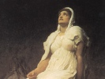

  
[Intangible Textual Heritage](../../index.md)  [Legends and
Sagas](../index)  [Iceland](../ice/index)  [Index](index.md) 
[Previous](poe31)  [Next](poe33.md) 

------------------------------------------------------------------------

[Buy this Book at
Amazon.com](https://www.amazon.com/exec/obidos/ASIN/B0024NLGNQ/internetsacredte.md)

------------------------------------------------------------------------

  
*The Poetic Edda*, by Henry Adams Bellows, \[1936\], at Intangible
Textual Heritage

------------------------------------------------------------------------

p. 465

# GUTHRUNARKVITHA III

### The Third Lay of Guthrun

##### INTRODUCTORY NOTE

The short *Guthrunarkvitha III*, entitled in the manuscript simply
Guthrunarkvitha, but so numbered in most editions to distinguish it from
the first and second Guthrun lays, appears only in the *Codex Regius*.
It is neither quoted nor paraphrased in the *Volsungasaga*, the
compilers of which appear not to have known the story with which it
deals. The poem as we have it is evidently complete and free from
serious interpolations. It can safely be dated from the first half of
the eleventh century, for the ordeal by boiling water, with which it is
chiefly concerned, was first introduced into Norway by St. Olaf, who
died in 1030, and the poem speaks of it in stanza 7 as still of foreign
origin.

The material for the poem evidently came from North Germany, but there
is little indication that the poet was working on the basis of a
narrative legend already fully formed. The story of the wife accused of
faithlessness who proves her innocence by the test of boiling water had
long been current in Germany, as elsewhere, and had attached itself to
various women of legendary fame, but not except in this poem, so far as
we can judge, to Guthrun (Kriemhild). The introduction of Thjothrek
(Theoderich, Dietrich, Thithrek) is another indication of relative
lateness, for the legends of Theoderich do not appear to have reached
the North materially before the year 1000. On the anachronism of
bringing Thjothrek to Atli's court cf. *Guthrunarkvitha II*,
introductory prose, note, in which the development of the Theoderich
tradition in its relation to that of Atli is briefly outlined.

Guthrunarkvitha III is, then, little more than a dramatic German story
made into a narrative lay by a Norse poet, with the names of Guthrun,
Atli, Thjothrek, and Herkja incorporated for the sake of greater
effectiveness. Its story probably nowhere formed a part of the living
tradition c)f Sigurth and Atli, but the poem has so little distinctively
Norse coloring that it may Possibly have been based on a story or even a
poem which its composer heard in Germany or from the lips of a German
narrator.

p. 466

\_\_\_\_\_\_\_\_\_\_\_\_\_\_\_\_\_\_

Herkja was the name of a serving-woman of Atli's; she had been his
concubine. She told Atli that she had seen Thjothrek and Guthrun both
together. Atli was greatly angered thereby. Then Guthrun said:

1\. "What thy sorrow, Atli, \| Buthli's son?  
Is thy heart heavy-laden? \| Why laughest thou never?  
It would better befit \| the warrior far  
To speak with men, \| and me to look on."

Atli spake:  
2. "It troubles me, Guthrun, \| Gjuki's daughter,  
What Herkja here \| in the hall hath told me,  
That thou in the bed \| with Thjothrek liest,  
Beneath the linen \| in lovers' guise."

Guthrun spake:  
3. "This shall I \| with oaths now swear,  
Swear by the sacred \| stone so white,  
That nought was there \| with Thjothmar's son  
That man or woman \| may not know.

\[*Prose*. The annotator derived all the material for this note from the
poem itself, except for the reference to Herkja as Atli's former
concubine. *Herkja*: the historical Kreka and the Helche of the
*Nibelungenlied*, who there appears as Etzel's (Attila's) first wife.
*Thjothrek*: cf. Introductory Note.

2\. The manuscript omits the names of the speakers through out.

3\. *Holy stone*: just what this refers to is uncertain; it may be
identical with the "ice-cold stone of Uth" mentioned in an oath in
*Helgakvitha Hundingsbana II*, 29. *Thjothmar's son*: the manuscript has
simply "Thjothmar." Some editions change it as \[fp. 467\] here, some
assume that Thjothmar is another name or an error for Thjothrek, and
Finnur Jonsson not only retains Thjothmar here but changes Thjothrek to
Thjothmar in stanza 5 to conform to it.\]

p. 467

4\. "Nor ever once \| did my arms embrace  
The hero brave, \| the leader of hosts;  
In another manner \| our meeting was,  
When our sorrows we \| in secret told.

5\. "With thirty warriors \| Thjothrek came,  
Nor of all his men \| doth one remain;  
Thou hast murdered my brothers \| and mail-clad men,  
Thou hast murdered all \| the men of my race.

6\. "Gunnar comes not, \| Hogni I greet not,  
No longer I see \| my brothers loved;  
My sorrow would Hogni \| avenge with the sword,  
Now myself for my woes \| I shall payment win.

7\. "Summon Saxi, \| the southrons' king,  
For be the boiling \| kettle can hallow."

\[5. Regarding the death of Thjothrek's men cf. *Guthrunarkvitha II*,
introductory prose, note. It was on these stanzas of *Guthrunarkvitha
III* that the annotator based his introduction to *Guthrunarkvitha II*.
The manuscript repeats the "thirty" in line 2, in defiance of metrical
requirements.

6\. In the manuscript this stanza follows stanza 7; many editions have
made the transposition.

7\. Who Saxi may be is not clear, but the stanza clearly points to the
time when the ordeal by boiling water was still regarded as a foreign
institution, and when a southern king (i. e., a Christian from some
earlier-converted region) was necessary \[fp. 467\] to consecrate the
kettle used in the test. The ordeal by boiling water followed closely
the introduction of Christianity, which took place around the year 1000.
Some editions make two stanzas out of stanza 7, and Müllenhoff contends
that lines 1-2 do not constitute part of Guthrun's speech.\]

p. 468

Seven hundred \| there were in the hall,  
Ere the queen her hand \| in the kettle thrust.

8\. To the bottom she reached \| with hand so bright,  
And forth she brought \| the flashing stones:  
"Behold, ye warriors, \| well am I cleared  
Of sin by the kettle's \| sacred boiling."

9\. Then Atli's heart \| in happiness laughed,  
When Guthrun's hand \| unhurt he saw;  
"Now Herkja shall come \| the kettle to try,  
She who grief \| for Guthrun planned."

10\. Ne'er saw man sight \| more sad than this,  
How burned were the hands \| of Herkja then;  
In a bog so foul \| the maid they flung,  
And so was Guthrun's \| grief requited.

\[10. The word "requited" in line 4 is omitted in the manuscript, but it
is clear that some such word was intended. The punishment of casting a
culprit into a bog to be drowned was particularly reserved for women,
and is not infrequently mentioned in the sagas.\]

------------------------------------------------------------------------

[Next: Oddrunargratr](poe33.md)
