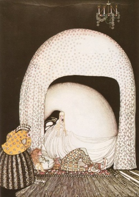

  
[Intangible Textual Heritage](../../index.md)  [Legends and
Sagas](../index.md) 

------------------------------------------------------------------------

[Buy this Book at
Amazon.com](https://www.amazon.com/exec/obidos/ASIN/048641812X/internetsacredte.md)

------------------------------------------------------------------------

[Buy this Book on
Kindle](https://www.amazon.com/exec/obidos/ASIN/B002H9XT7I/internetsacredte.md)

------------------------------------------------------------------------

<table width="75%">
<colgroup>
<col style="width: 50%" />
<col style="width: 50%" />
</colgroup>
<tbody>
<tr class="odd">
<td width="50%" data-valign="TOP"></td>
<td width="50%" data-valign="CENTER"><h1 id="popular-tales" data-align="CENTER">Popular Tales</h1>
<h2 id="from-the-norse" data-align="CENTER">From the Norse</h2>
<h3 id="by-george-webbe-dasent" data-align="CENTER">by George Webbe Dasent</h3>
<h4 id="section" data-align="CENTER">[1904]</h4></td>
</tr>
</tbody>
</table>

------------------------------------------------------------------------

[Contents](#contents)    [Start Reading](ptn00.md)    [Page
Index](pageidx)    [Text \[Zipped\]](ptn.txt.gz.md)

------------------------------------------------------------------------

|                                                                                                                           |
|---------------------------------------------------------------------------------------------------------------------------|
|  |

This is George Dasent's classic collection of Scandinavian folklore.
This is not about Norse mythology *per se*; so if you are looking for
tales of Odin, Loki, and Freya etc., you will have to look elsewhere.
Rather, this is an anthology of folk tales, similar to the Grimm
Brothers, or Campbell's *Popular Tales of the West Highlands*. All of
the usual suspects are in place, including giants, trolls, witches, evil
step-siblings, magical boons and tasks, and anthropomorphic animals.

The introduction is exceptionally well written, and places various
magical and other themes from the tales into the context of ancient
Norse Pagan beliefs. It *is* a victorian scholarly treatise however
(with the requisite multipage foonotes and rhetorical flourishes), and
will mostly be appreciated by academic readers. Once you get past the
introduction however, the prose descends to the young adult level, and
the delightful stories can be appreciated by readers of all ages. There
is also an appendix which has a few 'Anansi' stories from the West
Indies.

------------------------------------------------------------------------

 [Title Page](ptn00.md)  
[Notice to the Second Edition](ptn01.md)  
[Notice to the First Edition](ptn02.md)  
[Contents](ptn03.md)  
[Memoir of George Dasent](ptn04.md)  

### Introduction

[Origin](ptn05.md)  
[Diffusion](ptn06.md)  
[Norse Mythology](ptn07.md)  
[Norse Popular Tales](ptn08.md)  
[Conclusion](ptn09.md)  
[Extracts From Press Notices](ptn10.md)  

### Popular Tales from the Norse

[True and Untrue](ptn11.md)  
[Why the Sea Is Salt](ptn12.md)  
[The Old Dame and Her Hen](ptn13.md)  
[East o' the Sun and West o' the Moon](ptn14.md)  
[Boots Who Ate a Match with the Troll](ptn15.md)  
[Hacon Grizzlebeard](ptn16.md)  
[Boots Who Made the Princess Say, ''That's A Story.''](ptn17.md)  
[The Twelve Ducks](ptn18.md)  
[The Giant Who Had No Heart in His Body](ptn19.md)  
[The Fox as Herdsman](ptn20.md)  
[The Mastermaid](ptn21.md)  
[The Cat on the Dovrefell](ptn22.md)  
[Princess on the Glass Hill](ptn23.md)  
[How One Went Out to Woo](ptn24.md)  
[The Cock and Hen](ptn25.md)  
[The Master-Smith](ptn26.md)  
[The Two Step-Sisters](ptn27.md)  
[Buttercup](ptn28.md)  
[Taming the Shrew](ptn29.md)  
[Shortshanks](ptn30.md)  
[Gudbrand on the Hill-side](ptn31.md)  
[The Blue Belt](ptn32.md)  
[Why the Bear Is Stumpy-Tailed](ptn33.md)  
[Not a Pin to Choose Between Them](ptn34.md)  
[One's Own Children Are Always Prettiest](ptn35.md)  
[The Three Princesses of Whiteland](ptn36.md)  
[The Lassie and Her Godmother](ptn37.md)  
[The Three Aunts](ptn38.md)  
[The Cock, the Cuckoo, and the Blackcock](ptn39.md)  
[Rich Peter the Pedlar](ptn40.md)  
[Gertrude's Bird](ptn41.md)  
[Boots and the Troll](ptn42.md)  
[Goosey Grizzel](ptn43.md)  
[The Lad Who Went to the North Wind](ptn44.md)  
[The Master Theif](ptn45.md)  
[The Best Wish](ptn46.md)  
[The Three Billy-Goats Gruff](ptn47.md)  
[Well Done and Ill Paid](ptn48.md)  
[The Husband Who Was to Mind the House](ptn49.md)  
[Dapplegrim](ptn50.md)  
[Farmer Weathersky](ptn51.md)  
[Lord Peter](ptn52.md)  
[The Seven Foals](ptn53.md)  
[The Widow's Son](ptn54.md)  
[Bushy Bride](ptn55.md)  
[Boots and His Brothers](ptn56.md)  
[Big Peter and Little Peter](ptn57.md)  
[Tatterhood](ptn58.md)  
[The Cock and Hen That Went to the Dovrefell](ptn59.md)  
[Katie Woodencloak](ptn60.md)  
[Thumbikin](ptn61.md)  
[Doll i' the Grass](ptn62.md)  
[The Lad and the Deil](ptn63.md)  
[The Cock and Hen a-Nutting](ptn64.md)  
[The Big Bird Dan](ptn65.md)  
[Soria Moria Castle](ptn66.md)  
[Bruin and Reynard](ptn67.md)  
[Tom Totherhouse](ptn68.md)  
[Little Annie the Goose-Girl](ptn69.md)  

### Appendix

[Introduction to Appendix: Ananzi Stories](ptn70.md)  
[Note](ptn71.md)  
[Why The Jack-Spaniard's Waist is Small](ptn72.md)  
[Ananzi and the Lion](ptn73.md)  
[Ananzi and Quanqua](ptn74.md)  
[The Ear of Corn and the Twelve Men](ptn75.md)  
[The King and the Ant's Tree](ptn76.md)  
[The Little Child and the Pumpkin Tree](ptn77.md)  
[The Brother and his Sisters](ptn78.md)  
[The Girl and the Fish](ptn79.md)  
[The Lion, the Goat, and the Baboon](ptn80.md)  
[Ananzi and Baboon](ptn81.md)  
[The Man and the Doukana Tree](ptn82.md)  
[Nancy Fairy](ptn83.md)  
[The Dancing Gang](ptn84.md)  
