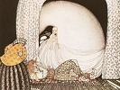

  
[Intangible Textual Heritage](../../index)  [Legends and
Sagas](../index)  [Index](index)  [Previous](ptn46)  [Next](ptn48) 

------------------------------------------------------------------------

[Buy this Book at
Amazon.com](https://www.amazon.com/exec/obidos/ASIN/048641812X/internetsacredte)

------------------------------------------------------------------------

[Buy this Book on
Kindle](https://www.amazon.com/exec/obidos/ASIN/B002H9XT7I/internetsacredte)

------------------------------------------------------------------------

  
*Popular Tales from the Norse*, by George Webbe Dasent, \[1904\], at
Intangible Textual Heritage

------------------------------------------------------------------------

p. 264

# The Three Billy-Goats Gruff

Once on a time there were three Billy-goats, who were to go up to the
hill-side to make themselves fat, and the name of all three was "Gruff."

On the way up was a bridge over a burn they had to cross; and under the
bridge lived a great ugly Troll, with eyes as big as saucers, and a nose
as long as a poker.

So first of all came the youngest billy-goat Gruff to cross the bridge.

"Trip, trap! trip, trap!" went the bridge.

"WHO'S THAT tripping over my bridge?" roared the Troll.

"Oh, it is only I, the tiniest billy-goat Gruff; and I'm going up to the
hill-side to make myself fat," said the billy-goat, with such a small
voice.

"Now, I'm coming, to gobble you up," said the Troll.

"Oh, no! pray don't take me. I'm too little, that I am," said the
billy-goat; "wait a bit till the second billy-goat Gruff comes, he's
much bigger."

"Well, be off with you;" said the Troll.

A little while after came the second billy-goat Gruff to cross the
bridge.

"TRIP, TRAP! TRIP, TRAP! TRIP, TRAP!" went the bridge.

"WHO'S THAT tripping over my bridge?" roared the Troll.

"Oh, it's the second billy-goat Gruff, and I'm going up to the hill-side
to make myself fat," said the billy-goat, who hadn't such a small voice.

"Now I'm coming to gobble you up," said the Troll.

"Oh, no! don't take me, wait a little till the big billy-goat Gruff
comes, he's much bigger."

"Very well! be off with you," said the Troll.

But just then up came the big billy-goat Gruff.

"TRIP, TRAP! TRIP, TRAP! TRIP, TRAP!" went the bridge, for the
billy-goat was so heavy that the bridge creaked and groaned under him.

"WHO'S THAT tramping over my bridge?" roared the Troll.

"IT'S I! THE BIG BILLY-GOAT GRUFF," said the billy-goat, who had an ugly
hoarse voice of his own.

"Now I'm coming to gobble you up," roared the Troll,

"Well, come along! I've got two spears,

And I'll poke your eyeballs out at your ears;

I've got besides two curling-stones,

And I'll crush you to bits, body and bones."

That was what the big billy-goat said; and so he flew at the Troll, and
poked his eyes out with his horns, and crushed him to bits, body and
bones, and tossed him out into the burn, and after that he went up to
the hill-side. There the billy-goats got so fat they were scarce able to
walk home again; and if the fat hasn't fallen off them, why, they're
still fat; and so—

"Snip, snap, snout

This tale's told out."

------------------------------------------------------------------------

[Next: Well Done and Ill Paid](ptn48)
