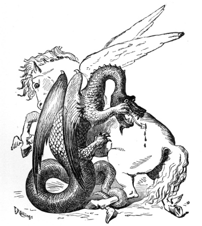

  
[Intangible Textual Heritage](../../index.md)  [Legends and
Sagas](../index.md) 

------------------------------------------------------------------------

[Buy this Book on
Kindle](https://www.amazon.com/exec/obidos/ASIN/B002IKKI4I/internetsacredte.md)

------------------------------------------------------------------------

<table width="75%">
<colgroup>
<col style="width: 50%" />
<col style="width: 50%" />
</colgroup>
<tbody>
<tr class="odd">
<td width="50%" data-valign="TOP"></td>
<td width="50%" data-valign="CENTER"><h1 id="roumanian-fairy-tales-and-legends" data-align="CENTER">Roumanian Fairy Tales and Legends</h1>
<h2 id="by-mrs.-e.-b.-mawr" data-align="CENTER">by Mrs. E. B. Mawr</h2>
<h4 id="section" data-align="CENTER">[1881]</h4></td>
</tr>
</tbody>
</table>

------------------------------------------------------------------------

[Contents](#contents)    [Start Reading](rft00.md)    [Page
Index](pageidx)    [Text \[Zipped\]](rft.txt.gz.md)

------------------------------------------------------------------------

|                                                                                                                           |
|---------------------------------------------------------------------------------------------------------------------------|
|  |

This is a collection of fairy tales, legends, and historical tales from
Romania, written during the 19th century.

------------------------------------------------------------------------

 [Title Page](rft00.md)  
[Preface](rft01.md)  
[Contents](rft02.md)  

### Fairy Tales

[The Slippers of the Twelve Princesses](rft03.md)  
[The Ungrateful Wood-Cutter](rft04.md)  
[The Hermit's Foundling with the Golden Hair](rft05.md)  
[The Daughter of the Rose](rft06.md)  
[The Twelve-Headed Griffin](rft07.md)  
[Vasilica The Brave](rft08.md)  
[Handsome is as Handsome Does](rft09.md)  
[The Fisherman and the Boyard's Daughter](rft10.md)  

### Legends

[Manioli, A Legend of the 13th Century](rft11.md)  
[The Fortress of Poinarii](rft12.md)  
[The Gentle Shepherd](rft13.md)  

### Historic Tales

[Death of Constantin II. Brancovan](rft14.md)  
[The Mother of Stephen the Great](rft15.md)  
